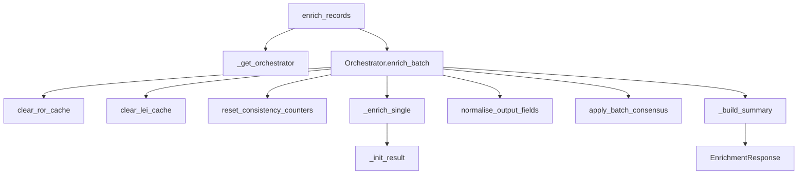
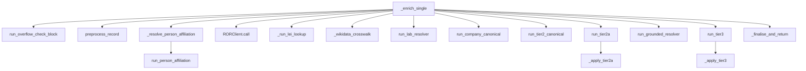
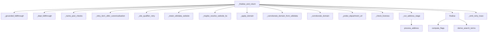
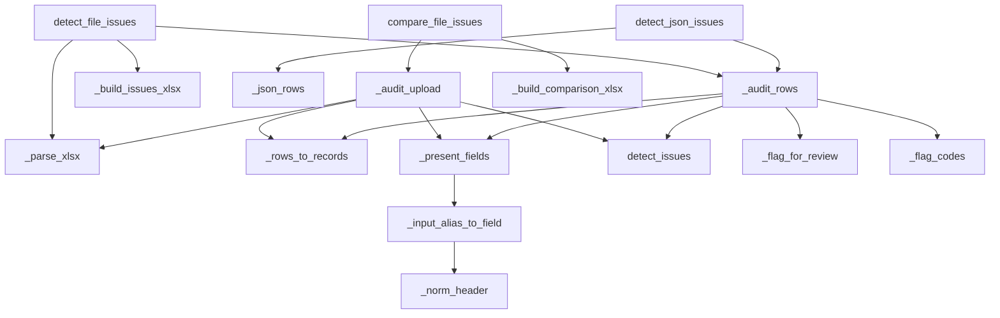
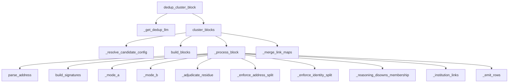
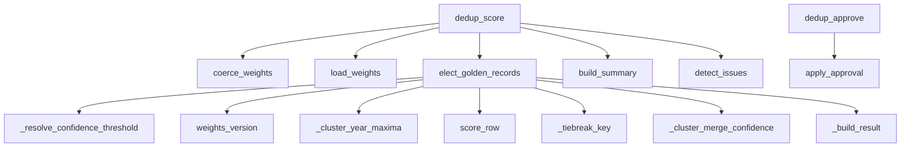
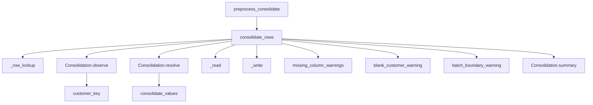

Generated: 2026-09-07 · Commit: 86d173b8a4d715a619b0a2656986c145da7fa81e · Branch: feature/llm-fixes · Pass: 00

# Pass 00 — Inventory and call graph

Tree state at generation: `git status --porcelain` produces no output (clean tree; no
modified, staged or untracked non-ignored path). `git rev-parse HEAD` is
`86d173b8a4d715a619b0a2656986c145da7fa81e`, branch `feature/llm-fixes`, date `2026-09-07`.
Tracked file count: 1160 (`git ls-files | wc -l`). Every citation below is read at that
commit.

## 0.1 Scope of the file table

The table in §0.2 covers every tracked file whose extension is `.py`, `.json`, `.sql`,
`.ini`, `.txt`, `.yml`, `.yaml` or `.md`, plus the three tracked extensionless dotfiles
(`.env.example`, `.funcignore`, `.gitignore`), minus the directories listed in §0.3. Test
modules (`tests/test_*.py`) are excluded here and carried in the test inventory (§0.7)
instead, where their LOC appears alongside their result. LOC is a physical line count of the
file at this commit, computed as `len(open(path,"rb").read().splitlines())` — a file whose
last line carries no terminator is still counted. "Purpose" is the first line of the module
docstring, verbatim; `—` means the file has no module docstring (data files, config files,
prose documents). "Last touched" is `git log -1 --format=%ad --date=short -- <path>`.

138 files are tabulated. 1025 are excluded, itemised in §0.3; 138 + 1025 = 1160.

## 0.2 File table

| path | LOC | purpose (first docstring line, verbatim) | last touched |
|---|---|---|---|
| `.env.example` | 258 | — | 2026-08-26 |
| `.funcignore` | 60 | — | 2026-09-03 |
| `.gitignore` | 43 | — | 2026-09-04 |
| `.vscode/extensions.json` | 6 | — | 2026-05-31 |
| `.vscode/launch.json` | 15 | — | 2026-05-31 |
| `.vscode/settings.json` | 9 | — | 2026-05-31 |
| `.vscode/tasks.json` | 27 | — | 2026-05-31 |
| `README.md` | 3862 | — | 2026-09-07 |
| `__init__.py` | 0 | — | 2026-04-09 |
| `adf/deduplication_pipeline.json` | 118 | — | 2026-09-07 |
| `adf/enrichment_pipeline.json` | 168 | — | 2026-09-07 |
| `adf/issues_pipeline.json` | 117 | — | 2026-09-07 |
| `adf/scoring_pipeline.json` | 118 | — | 2026-09-07 |
| `api/__init__.py` | 0 | — | 2026-04-09 |
| `api/app.py` | 29 | FastAPI application object — shared by both local and Azure Function entry points. | 2026-08-12 |
| `api/middleware.py` | 135 | FastAPI middleware for structured JSON logging, request timing, and error handling. | 2026-08-12 |
| `api/models.py` | 937 | Pydantic v2 request/response models for the enrichment API. | 2026-09-02 |
| `api/output_columns.py` | 122 | Single output schema for the /enrich and /enrich/file endpoints. | 2026-09-02 |
| `api/routes.py` | 1659 | Route definitions for the enrichment API. | 2026-09-07 |
| `calibration_findings.md` | 371 | — | 2026-08-25 |
| `combined_delta.md` | 165 | — | 2026-08-23 |
| `config.py` | 640 | Application configuration loaded from environment variables. | 2026-09-02 |
| `corroborator_report.md` | 240 | — | 2026-08-23 |
| `dedup/__init__.py` | 7 | Phase 2 "Pass 2" deduplication adjudicator. | 2026-06-17 |
| `dedup/address.py` | 338 | Delivery-point parsing and comparison (v2, ``DEDUP_V2_BLOCKING``). | 2026-09-04 |
| `dedup/adjudicator.py` | 1549 | Per-block dedup algorithm (STEP B/C) and the request-level entry point. | 2026-09-05 |
| `dedup/cache.py` | 189 | A record/replay cache for adjudicator calls (opt-in, off by default). | 2026-09-05 |
| `dedup/candidates.py` | 400 | Candidate nomination for the dedup residue pass (STEP B widening). | 2026-09-05 |
| `dedup/cluster_key.py` | 36 | The stable cluster key — shared by the adjudicator (which mints it) and the | 2026-09-05 |
| `dedup/consolidate.py` | 514 | Row-grain → customer-grain consolidation of company codes and sales orgs. | 2026-09-05 |
| `dedup/consolidate_xlsx.py` | 132 | XLSX transport for the company-code / sales-org consolidation stage. | 2026-09-05 |
| `dedup/flags.py` | 63 | The Phase 2 v2 feature flags. | 2026-09-05 |
| `dedup/llm.py` | 292 | LLM call wrapper for the dedup adjudicator. | 2026-08-25 |
| `dedup/models.py` | 137 | Pydantic v2 request/response models for the dedup adjudicator endpoint. | 2026-09-05 |
| `dedup/name_slots.py` | 475 | What the text below Name 1 actually is (v2, ``DEDUP_V2_NAME2``). | 2026-09-05 |
| `dedup/prompts.py` | 234 | LLM prompt strings and builders for the Phase 2 dedup adjudicator. | 2026-09-05 |
| `dedup/scoring.py` | 1372 | Deterministic scoring + golden-record election (Phase 2 "Pass 3"). | 2026-09-05 |
| `dedup/scoring_xlsx.py` | 339 | XLSX in/out for the scoring + golden-record election endpoint. | 2026-09-05 |
| `dedup/signatures.py` | 380 | STEP A — conservative normalization and signature collapsing (no LLM). | 2026-09-05 |
| `dedup/weights.json` | 57 | — | 2026-09-05 |
| `determinism_findings.md` | 642 | — | 2026-08-25 |
| `enrichment/__init__.py` | 0 | — | 2026-04-09 |
| `enrichment/address_processing.py` | 1403 | Address Stage 1 — clean, extract, route, cross-check, classify, normalise. | 2026-09-02 |
| `enrichment/batch_consensus.py` | 694 | Batch consensus pass — one identity per organisation per address (Fix 6). | 2026-09-02 |
| `enrichment/classifier.py` | 187 | Record classification — the single authority for ``record_type``. | 2026-08-20 |
| `enrichment/company_canonical.py` | 148 | LLM-only canonicalisation of company name1 — UC 2/3 for companies. | 2026-09-01 |
| `enrichment/confidence.py` | 329 | Provenance Scheme B — ``source:confidence[+witness]``, and the one | 2026-09-01 |
| `enrichment/consistency.py` | 464 | Fix D(1) — no record ships two contradictory identities. | 2026-08-25 |
| `enrichment/dept_block.py` | 360 | The department block — Name 2..5 — as one value with one authority. | 2026-09-01 |
| `enrichment/elf_codes.py` | 183 | ISO 20275 Entity Legal Form (ELF) codes, split by commercial character. | 2026-08-20 |
| `enrichment/flags.py` | 1438 | Review flags — computed once, from the record's final state (Fix 8). | 2026-09-07 |
| `enrichment/grounded_resolver.py` | 809 | The universal grounded lane — SERP + one LLM read + registry re-verification. | 2026-09-02 |
| `enrichment/issue_detection.py` | 1710 | Deterministic data-quality issue detection (Issue Catalogue v2). | 2026-09-07 |
| `enrichment/lab_resolver.py` | 167 | UC 13 — Lab / research group / centre → parent department resolution. | 2026-08-25 |
| `enrichment/liveness.py` | 391 | Is the organisation this record names still a going concern? | 2026-08-26 |
| `enrichment/locality.py` | 447 | One locality comparator, shared by the page read and the registries. | 2026-09-01 |
| `enrichment/name_gate.py` | 313 | One write gate for every Name 1 / Name 2 candidate (§2). | 2026-09-01 |
| `enrichment/name_repack.py` | 166 | UC 0 — repair a name split across SAP fields, then rewrite it back. | 2026-09-01 |
| `enrichment/orchestrator.py` | 9338 | Orchestrator: tier escalation, record_type derivation, and result assembly. | 2026-09-07 |
| `enrichment/overflow_check.py` | 189 | UC 0 — Detect a name field overflowing into the one below it. | 2026-08-26 |
| `enrichment/page_corroborator.py` | 607 | Fix 3 — read the candidate website and see whether it names this record. | 2026-08-27 |
| `enrichment/person_affiliation.py` | 193 | Person-affiliation lookup (Stage 2b). | 2026-09-01 |
| `enrichment/preprocess.py` | 3356 | Deterministic preprocessing — UC 6, 7, 8, 9, 10, 11, 12, 14, 15. | 2026-09-07 |
| `enrichment/provenance.py` | 1325 | Fix 10 — per-field provenance and admissibility. | 2026-09-02 |
| `enrichment/registry_match.py` | 487 | Fix C — the rules that decide WHICH registry candidate wins, and whether any does. | 2026-09-02 |
| `enrichment/search_terms.py` | 1146 | Compact search-handle derivation for the enrichment response. | 2026-09-02 |
| `enrichment/tier1_lei.py` | 977 | Tier 1 (company): GLEIF / LEI registry lookup. | 2026-08-26 |
| `enrichment/tier1_ror.py` | 1803 | Tier 1: ROR v2 hybrid lookup — affiliation-first, query-fallback. | 2026-09-03 |
| `enrichment/tier2_canonical.py` | 265 | Tier 2 — LLM-only canonicalization of a user-supplied department name. | 2026-09-01 |
| `enrichment/tier2a_contact.py` | 535 | Tier 2A: Contact person lookup on institution website. | 2026-08-25 |
| `enrichment/tier2b_dept.py` | 264 | Tier 2B: Department/division search via SERP + LLM extraction. | 2026-08-25 |
| `enrichment/tier3_llm.py` | 184 | Tier 3: LLM inference — last resort, always flagged for review. | 2026-09-01 |
| `enrichment/unchanged_state.py` | 366 | Fix 2 — the three states an unchanged Name 1 can be in. | 2026-09-02 |
| `enrichment/website_resolver.py` | 1109 | Resolve the official website URL for a Name 1 organisation. | 2026-09-02 |
| `enrichment/wikidata.py` | 1009 | Wikidata crosswalk lane — a pointer and a witness, never an authority. | 2026-08-25 |
| `eval/__init__.py` | 1 | Offline evaluation harness for the Phase 2 dedup + election pipeline. | 2026-07-22 |
| `eval/dedup_eval.py` | 308 | Offline evaluation harness for Phase 2 dedup + golden-record election. | 2026-07-22 |
| `eval/name_eval.py` | 354 | Name-block evaluation against the solved reference (§5). | 2026-09-01 |
| `function_app.py` | 19 | Azure Function v2 ASGI entry point. | 2026-05-31 |
| `host.json` | 20 | — | 2026-05-31 |
| `issues_request.json` | 239 | — | 2026-09-03 |
| `llm/__init__.py` | 0 | — | 2026-04-09 |
| `llm/openai_client.py` | 497 | Async Azure OpenAI client for LLM calls. | 2026-08-25 |
| `llm/prompts.py` | 691 | All LLM prompt strings as module-level constants. | 2026-09-01 |
| `llm/test_connection.py` | 31 | Standalone LLM connection test — run before any other testing. | 2026-04-09 |
| `main.py` | 8 | Local development entry point — runs FastAPI via uvicorn. | 2026-04-09 |
| `provenance_migration_report.md` | 361 | — | 2026-08-25 |
| `pytest.ini` | 3 | — | 2026-04-09 |
| `requirements-dev.txt` | 5 | — | 2026-04-09 |
| `requirements.txt` | 14 | — | 2026-06-04 |
| `retry_trace_findings.md` | 217 | — | 2026-08-23 |
| `scripts/cache_state.py` | 28 | The cache state a gate was taken against. | 2026-09-01 |
| `scripts/ch02_measure.py` | 708 | Chapter 2 (Problem Description) frequency measurements. | 2026-09-07 |
| `scripts/debug_ucsf.py` | 269 | Debug harness: run ONE record (UCSF / Sarah Chen) through the | 2026-04-11 |
| `scripts/fix_reports.py` | 264 | Build the per-row tables and the before/after delta for Fixes 2 and 3. | 2026-09-03 |
| `scripts/issue_catalogue_census.py` | 280 | Derive every Issue-Catalogue figure the thesis quotes, from the source. | 2026-09-07 |
| `scripts/retry_trace_report.py` | 132 | Classify a RETRY_TRACE run into the four Stage 5 buckets. | 2026-08-23 |
| `scripts/ror_repro.py` | 523 | ROR Tier-1 lookup reproduction / diagnosis harness. | 2026-08-20 |
| `scripts/run_batch.py` | 200 | Run an XLSX batch through the enrichment pipeline, offline. | 2026-08-25 |
| `scripts/test_local.py` | 202 | Local integration test script — runs the API and exercises all fixtures. | 2026-04-09 |
| `scripts/trace_website.py` | 202 | Standalone diagnostic for Path B / Path C website resolution. | 2026-08-12 |
| `scripts/verify_fixes.py` | 232 | Post-fix verification script — tests all bug fixes independently. | 2026-06-05 |
| `scripts/wikidata_lane_report.py` | 225 | Build the numbers behind `wikidata_lane_report.md` from two `run_batch.py` runs. | 2026-08-25 |
| `scripts/wikidata_warm_fixtures.py` | 94 | Record the Wikidata lane's fixtures for a workbook, serially and politely. | 2026-08-25 |
| `search/__init__.py` | 0 | — | 2026-04-09 |
| `search/base.py` | 56 | Abstract search interface for SERP providers. | 2026-08-26 |
| `search/duckduckgo_client.py` | 62 | DuckDuckGo search client — free fallback when no SerpAPI key. | 2026-08-26 |
| `search/page_fetcher.py` | 523 | Fetch web pages and extract structured/authoritative elements. | 2026-08-27 |
| `search/serpapi_client.py` | 84 | SerpAPI search client implementation. | 2026-08-26 |
| `sql/usp_merge_legacy_enriched.sql` | 89 | — | 2026-09-07 |
| `sql/usp_merge_legacy_issues.sql` | 69 | — | 2026-09-07 |
| `sql/usp_merge_validation_clusters.sql` | 66 | — | 2026-09-07 |
| `sql/usp_merge_validation_scores.sql` | 81 | — | 2026-09-07 |
| `tests/KNOWN_FAILURES.md` | 41 | — | 2026-09-03 |
| `tests/__init__.py` | 0 | — | 2026-04-09 |
| `tests/conftest.py` | 256 | Pytest fixtures: mock client injection, JSON fixture loaders, settings overrides. | 2026-08-25 |
| `tests/dedup_v2_support.py` | 965 | Shared scaffolding for the dedup v2 fixture tests (not a test module). | 2026-09-05 |
| `tests/mocks/__init__.py` | 0 | — | 2026-04-09 |
| `tests/mocks/dedup_mock.py` | 69 | Mock dedup adjudicator LLM for offline runs (MOCK_EXTERNAL_CALLS=true). | 2026-06-17 |
| `tests/mocks/lei_mock.py` | 211 | Mock GLEIF/LEI client for testing and local development without API access. | 2026-08-25 |
| `tests/mocks/openai_mock.py` | 389 | Mock Azure OpenAI client for testing — returns deterministic JSON responses. | 2026-07-03 |
| `tests/mocks/page_mock.py` | 148 | Mock page fetcher for testing — returns curated page text. | 2026-08-28 |
| `tests/mocks/ror_mock.py` | 394 | Mock ROR client for testing and local development without API access. | 2026-09-03 |
| `tests/mocks/serp_mock.py` | 210 | Mock SERP client for testing — returns curated search results. | 2026-08-28 |
| `tests/mocks/wikidata_mock.py` | 135 | Mock Wikidata client for the crosswalk lane. | 2026-08-25 |
| `tools/build_dedup_v2_fixture.py` | 182 | Freeze the 200-row dedup stress workbook into a JSON test fixture. | 2026-09-04 |
| `tools/dedup_v2_real_model_run.py` | 317 | Run the 200-row dedup v2 fixture against the deployed model, and score it. | 2026-09-05 |
| `tools/provenance_invariance.py` | 248 | The provenance migration's core gate: values invariant, provenance changed. | 2026-08-25 |
| `tools/run_diff.py` | 401 | Diff two enrichment runs of the same batch. The reproducibility gate. | 2026-08-25 |
| `tools/shuffle_evidence.py` | 115 | Reverse the order of every candidate list inside a recorded evidence cache. | 2026-08-25 |
| `unchanged_split_report.md` | 202 | — | 2026-08-23 |
| `utils/__init__.py` | 0 | — | 2026-04-09 |
| `utils/cache.py` | 886 | The evidence cache: one directory, several namespaces, keyed on the request. | 2026-08-26 |
| `utils/domain_resolver.py` | 818 | Single write path for the ``domain`` / ``website_url`` fields. | 2026-09-01 |
| `utils/name_identity.py` | 549 | Three-verdict identity comparison for a proposed canonical name. | 2026-09-01 |
| `utils/name_slots.py` | 94 | The canonical name-slot vocabulary. | 2026-08-20 |
| `utils/text_utils.py` | 1893 | Text cleaning, domain extraction, and string normalisation helpers. | 2026-09-03 |
| `wikidata_lane_report.md` | 273 | — | 2026-08-25 |

Each of the four files in `sql/` holds one complete `CREATE PROCEDURE` body over multiple
physical lines, so a statement inside them is citable by line: `sql/usp_merge_legacy_enriched.sql`
89 lines, `sql/usp_merge_legacy_issues.sql` 69, `sql/usp_merge_validation_clusters.sql` 66,
`sql/usp_merge_validation_scores.sql` 81.

## 0.3 Excluded directories

| group | tracked files | why excluded from §0.2 |
|---|---|---|
| `tests/fixtures/**` | 838 | Recorded evidence payloads — Wikidata items (611), page reads (166), dedup adjudication responses (37), ROR reproduction payloads (12) and 12 top-level fixture files. Data, not code. The committed namespaces are committed deliberately per `.gitignore:28–36`. |
| `tests/test_*.py` | 99 | Carried in §0.7 with LOC, covered module and result. |
| `docs/**` | 41 | 34 files under `docs/thesis/` (the output location of this documentation set, its figures, its input workbooks and the DATAshaper tutorials) and 7 under `docs/` itself (three dossiers, the two pass specifications, a change template, `docs/FLAG_CODES.pdf`). Describing them here would be self-referential; Pass 07 inventories the workbooks. |
| `eval/out/**` | 17 | Committed evaluation run outputs (`.xlsx` / `.json`) keyed by generating commit. Pass 07 inventories them; Pass 18 computes over them. |
| `data/eval/**` | 16 | Evaluation workbooks. Pass 07 inventories them; Pass 18 computes over them. |
| root binaries (`*.xlsx`, `*.pdf`) | 14 | Not source: `Domain_DeptDomain_SearchTerm_Logic.pdf`, `Website_Trace_Findings.pdf`, and 12 workbooks. Inventoried in Pass 07. |
| `logs/`, `handoff/`, `.claude/`, `.pytest_cache/`, `.env` | 0 | Untracked and git-ignored (`git status --porcelain --ignored`). Not part of the commit. |

`.gitignore:37–40` also ignores four evidence-cache namespaces that are **not** committed by
default — `tests/fixtures/serp/`, `tests/fixtures/registry/`, `tests/fixtures/fetch/`,
`tests/fixtures/llm/`. ⚠ UNVERIFIED — the frozen evaluation set behind
`determinism_findings.md` was measured against those four namespaces populated
(`.gitignore:33–36`), and they are absent from this commit; a re-run of that measurement at
this commit re-gathers rather than replays them. See §0.9 (⚠-8).

## 0.4 Entry points

### 0.4.1 Process entry points

| kind | file:line | detail |
|---|---|---|
| ASGI app object | `api/app.py:17` | `FastAPI(title="SAP Customer Master Data Enrichment API", version="1.0.0")`; middleware `RequestLoggingMiddleware` added at `api/app.py:28`; router mounted at `api/app.py:29`. |
| Local dev (uvicorn) | `main.py:3`, `main.py:5–8` | `uvicorn.run("api.app:app", host="0.0.0.0", port=8000, reload=True)` (`main.py:8`). |
| Azure Function binding | `function_app.py:12–19` | `func.FunctionApp(http_auth_level=func.AuthLevel.ANONYMOUS)` (`function_app.py:12`); one catch-all HTTP trigger `@azure_app.route(route="{*route}")` (`function_app.py:15`) delegating to the same FastAPI app through `AsgiMiddleware(fastapi_app).handle_async` (`function_app.py:19`). There is exactly one Function binding; every HTTP route below is served through it. |

`host.json:12` sets `"routePrefix": ""`, so the Function App serves the FastAPI paths
without the default `/api` prefix; the four paths that begin `/api/` do so because the route
decorator declares it, not because the host adds it.

The Function App's declared auth level is `ANONYMOUS` (`function_app.py:12`), which
contradicts the auth claim in the `/api/dedup/cluster-block` docstring — see §0.9 (⚠-1).

### 0.4.2 HTTP routes

All routes are declared on one `APIRouter` (`api/routes.py:67`). "Handler" is the
`async def` immediately below the decorator.

| method | path | request model | response model | decorator | handler |
|---|---|---|---|---|---|
| GET | `/health` | — | `HealthResponse` (`api/models.py:874`) | `api/routes.py:93` | `health_check` `api/routes.py:94` |
| POST | `/enrich` | `EnrichmentRequest` (`api/models.py:311`) | `EnrichmentResponse` (`api/models.py:868`) | `api/routes.py:106` | `enrich_records` `api/routes.py:107` |
| POST | `/enrich/file` | multipart: `file: UploadFile`, query `max_concurrency` (default 5, ge=1, le=20), `serp_provider` (`"serpapi"`\|`"duckduckgo"`, default `"serpapi"`), `skip_tier` (default `None`) — `api/routes.py:702–705` | `StreamingResponse` (XLSX) | `api/routes.py:700` | `enrich_file` `api/routes.py:701` |
| POST | `/issues` | multipart: `file: UploadFile` (`api/routes.py:839`) | `StreamingResponse` (XLSX) | `api/routes.py:837` | `detect_file_issues` `api/routes.py:838` |
| POST | `/issues/json` | `IssueDetectionRequest` (`api/models.py:899`) | `IssueDetectionResponse` (`api/models.py:932`) | `api/routes.py:883` | `detect_json_issues` `api/routes.py:884` |
| POST | `/issues/compare` | multipart: `original: UploadFile`, `enriched: UploadFile` (`api/routes.py:918–919`) | `StreamingResponse` (XLSX) | `api/routes.py:916` | `compare_file_issues` `api/routes.py:917` |
| POST | `/api/preprocess/consolidate` | `ConsolidateRequest` (`dedup/consolidate.py:467`) | `ConsolidateResponse` (`dedup/consolidate.py:496`) | `api/routes.py:960–973` | `preprocess_consolidate` `api/routes.py:974` |
| POST | `/api/preprocess/consolidate/file` | multipart: `file: UploadFile`, query `sheet` (default `None`) — `api/routes.py:1028–1032` | `StreamingResponse` (XLSX) | `api/routes.py:1026` | `preprocess_consolidate_file` `api/routes.py:1027` |
| POST | `/api/dedup/cluster-block` | `DedupRequest` (`dedup/models.py:74`) | `DedupResponse` (`dedup/models.py:133`) | `api/routes.py:1330` | `dedup_cluster_block` `api/routes.py:1331` |
| POST | `/api/dedup/file` | multipart: `file: UploadFile` (`api/routes.py:1362`) | `StreamingResponse` (XLSX) | `api/routes.py:1360` | `dedup_file` `api/routes.py:1361` |
| POST | `/api/dedup/score` | `ScoringRequest` (`dedup/scoring.py:262`) | `ScoringResponse` (`dedup/scoring.py:467`) | `api/routes.py:1437` | `dedup_score` `api/routes.py:1438` |
| POST | `/api/dedup/approve` | `ApprovalRequest` (`dedup/scoring.py:581`) | `ApprovalResponse` (`dedup/scoring.py:595`) | `api/routes.py:1487` | `dedup_approve` `api/routes.py:1488` |
| POST | `/api/dedup/score/file` | multipart: `file: UploadFile` (`api/routes.py:1520`) | `StreamingResponse` (XLSX) | `api/routes.py:1518` | `dedup_score_file` `api/routes.py:1519` |
| GET | `/diag/llm` | — | `dict` | `api/routes.py:1575` | `diag_llm` `api/routes.py:1576` |
| GET | `/diag/dedup-llm` | — | `dict` | `api/routes.py:1607` | `diag_dedup_llm` `api/routes.py:1608` |
| GET | `/tiers` | — | `TierConfigResponse` (`api/models.py:883`) | `api/routes.py:1646` | `get_tier_config` `api/routes.py:1647` |

Sixteen routes: 13 POST, 3 GET. Presence of the six routes the pass specification names as
expected minima:

| expected route | present | evidence |
|---|---|---|
| `/enrich` | yes | `api/routes.py:106` |
| `/issues` | yes | `api/routes.py:837` |
| `/api/dedup/cluster-block` | yes | `api/routes.py:1330` |
| `/api/dedup/score` | yes | `api/routes.py:1437` |
| `/api/dedup/approve` | yes | `api/routes.py:1487` |
| `/api/preprocess/consolidate` | yes | `api/routes.py:960` (decorator opens at 960, path argument at 961, handler at 974) |

### 0.4.3 CLI entry points

Every module below carries an `if __name__ == "__main__":` block. "argparse" records whether
the module imports `argparse`; the rest read positional `sys.argv` or take no arguments.

| file | argparse | purpose (first docstring line, verbatim) |
|---|---|---|
| `eval/dedup_eval.py` | no | Offline evaluation harness for Phase 2 dedup + golden-record election. |
| `eval/name_eval.py` | yes | Name-block evaluation against the solved reference (§5). |
| `llm/test_connection.py` | no | Standalone LLM connection test — run before any other testing. |
| `main.py` | no | Local development entry point — runs FastAPI via uvicorn. |
| `scripts/ch02_measure.py` | no | Chapter 2 (Problem Description) frequency measurements. |
| `scripts/debug_ucsf.py` | no | Debug harness: run ONE record (UCSF / Sarah Chen) through the |
| `scripts/fix_reports.py` | yes | Build the per-row tables and the before/after delta for Fixes 2 and 3. |
| `scripts/issue_catalogue_census.py` | no | Derive every Issue-Catalogue figure the thesis quotes, from the source. |
| `scripts/retry_trace_report.py` | yes | Classify a RETRY_TRACE run into the four Stage 5 buckets. |
| `scripts/ror_repro.py` | yes | ROR Tier-1 lookup reproduction / diagnosis harness. |
| `scripts/run_batch.py` | yes | Run an XLSX batch through the enrichment pipeline, offline. |
| `scripts/test_local.py` | yes | Local integration test script — runs the API and exercises all fixtures. |
| `scripts/trace_website.py` | yes | Standalone diagnostic for Path B / Path C website resolution. |
| `scripts/verify_fixes.py` | no | Post-fix verification script — tests all bug fixes independently. |
| `scripts/wikidata_lane_report.py` | yes | Build the numbers behind `wikidata_lane_report.md` from two `run_batch.py` runs. |
| `scripts/wikidata_warm_fixtures.py` | yes | Record the Wikidata lane's fixtures for a workbook, serially and politely. |
| `tools/build_dedup_v2_fixture.py` | yes | Freeze the 200-row dedup stress workbook into a JSON test fixture. |
| `tools/dedup_v2_real_model_run.py` | yes | Run the 200-row dedup v2 fixture against the deployed model, and score it. |
| `tools/provenance_invariance.py` | yes | The provenance migration's core gate: values invariant, provenance changed. |
| `tools/run_diff.py` | yes | Diff two enrichment runs of the same batch. The reproducibility gate. |
| `tools/shuffle_evidence.py` | no | Reverse the order of every candidate list inside a recorded evidence cache. |

21 CLI entry points. `scripts/cache_state.py` (`scripts/cache_state.py:1`, 28 LOC) carries a
module docstring but no `__main__` block and is imported by no module in the repository —
see §0.6.


### 0.4.4 Which routes have an exported caller

`adf/` holds four exported Azure Data Factory pipeline definitions at this commit. Each is a
Lookup → Web activity → stored-procedure chain against exactly one route. Every value below
is read from the JSON.

| pipeline (`"name"`) | file:line | parameters | route | merge-back procedure |
|---|---|---|---|---|
| `Deduplication Pipeline` | `adf/deduplication_pipeline.json:2` | `chrEntity`, `chrGroupCode` (`:106`) | `POST …/api/dedup/cluster-block` (`:58`) | `Mapping.usp_MergeValidationClusters` (`:89`) |
| `Enrichment Pipeline` | `adf/enrichment_pipeline.json:2` | `chrEntity`, `chrGroupCode` (`:156`) | `POST …/enrich` (`:105`) | `Mapping.usp_merge_legacy_enriched` (`:136`) |
| `Issues Pipeline` | `adf/issues_pipeline.json:2` | `chrEntity`, `chrGroupCode` (`:106`) | `POST …/issues/json` (`:58`) | `Mapping.usp_MergeLegacyIssues` (`:89`) |
| `Scoring Pipeline` | `adf/scoring_pipeline.json:2` | `chrEntity`, `chrGroupCode` (`:106`) | `POST …/api/dedup/score` (`:58`) | `Mapping.usp_MergeValidationScores` (`:89`) |

Both parameters are declared `{"type": "string"}` in all four. The host is
`https://mdm-pipeline-api.azurewebsites.net` in all four. Every Web activity is `POST`, with
`"httpRequestTimeout": "00:10:00"` (`adf/deduplication_pipeline.json:57`,
`adf/enrichment_pipeline.json:104`, `adf/issues_pipeline.json:57`,
`adf/scoring_pipeline.json:57`) inside an activity `policy.timeout` of `"0.12:00:00"`. Every
Lookup sets `"firstRowOnly": false`. Every stored-procedure activity passes exactly one
parameter, named `payload`, of type `String`, valued `@string(activity('Web1').output)`.

No pipeline carries a hard-coded entity or group code: `grep -rn 'test_77\|test77' adf/ sql/`
returns nothing, and every Lookup interpolates
`@{pipeline().parameters.chrEntity}` and `@{pipeline().parameters.chrGroupCode}`. All four
Lookup queries carry the group-code predicate.

**Lookup queries, verbatim.**

`adf/deduplication_pipeline.json:20` (`Lookup1`):

```
SELECT
    Customer               AS row_id,
    [Block ID]             AS block_id,
    [Name 1]               AS name1,
    [Name 2]               AS name2,
    [Street 1]             AS street,
    [House Number]         AS house_no,
    [Postal Code]          AS postal_code,
    City                   AS city,
    [Country/Region Key]   AS country,
    [ROR ID]               AS ror_id,
    [LEI ID]               AS lei_id
FROM [@{pipeline().parameters.chrEntity}].Validation
WHERE [code] LIKE '@{pipeline().parameters.chrGroupCode}\_%' ESCAPE '\'
```

`adf/enrichment_pipeline.json:20` (`Lookup2` — the batch-offset driver):

```
SELECT (n.rn - 1) AS offset
FROM (
    SELECT ROW_NUMBER() OVER (ORDER BY (SELECT NULL)) AS rn
    FROM dp_legacy.[@{pipeline().parameters.chrEntity}].Legacy
    WHERE [code] LIKE '@{pipeline().parameters.chrGroupCode}\_%' ESCAPE '\'
) n
WHERE (n.rn - 1) % 30 = 0
```

`adf/enrichment_pipeline.json:67` (`Lookup1`, inside `ForEach1`):

```
SELECT * FROM dp_legacy.[@{pipeline().parameters.chrEntity}].Legacy WHERE [code] LIKE '@{pipeline().parameters.chrGroupCode}\_%' ESCAPE '\' ORDER BY [code] OFFSET @{item().offset} ROWS FETCH NEXT 30 ROWS ONLY
```

`adf/issues_pipeline.json:20` (`Lookup1`):

```
SELECT * FROM dp_legacy.[@{pipeline().parameters.chrEntity}].Legacy WHERE [code] LIKE '@{pipeline().parameters.chrGroupCode}\_%' ESCAPE '\' ORDER BY [code]
```

`adf/scoring_pipeline.json:20` (`Lookup1`):

```
SELECT
    Customer                          AS row_id,
    [Cluster ID]                      AS [Cluster ID],
    [Confidence]                      AS Confidence,
    [Routing]                         AS Routing,
    [Reasoning]                       AS Reasoning,
    Sales_Order_Last_Used,
    Sales_Order_Total_Count,
    Sales_Order_Partner_Last_Used,
    Sales_Order_Partner_Total_Count,
    Equipment_Total_Count,
    SleepingCustomer,
    CustomerStatus,
    [Account group],
    Company_Code_Consolidated,
    Sales_Org_Consolidated,
    SF_ID_Biosystems AS sf1,
    SF_ID_AXS        AS sf2,
    SF_ID_3          AS sf3,
    SF_ID_4          AS sf4,
    SF_ID_5          AS sf5,
    SF_ID_6          AS sf6,
    SF_ID_7          AS sf7,
    SF_ID_8          AS sf8
FROM [@{pipeline().parameters.chrEntity}].Validation
WHERE [code] LIKE '@{pipeline().parameters.chrGroupCode}\_%' ESCAPE '\'
```

**Request bodies.** Each Web activity wraps the Lookup output in a single JSON key:
`records` for `/enrich` (`adf/enrichment_pipeline.json:110`) and `/issues/json`
(`adf/issues_pipeline.json:63`); `rows` for `/api/dedup/cluster-block`
(`adf/deduplication_pipeline.json:63`) and `/api/dedup/score`
(`adf/scoring_pipeline.json:63`). The expression is
`@json(concat('{"<key>":', string(activity('Lookup1').output.value), '}'))`.

**Batching.** Only `Enrichment Pipeline` batches: `ForEach1`
(`adf/enrichment_pipeline.json:34–35`) iterates the offsets from `Lookup2` with
`"isSequential": true` (`:50`) and no `batchCount`, and the inner Lookup pages 30 rows at a
time (`OFFSET @{item().offset} ROWS FETCH NEXT 30 ROWS ONLY`, `:67`). The other three post
their whole result set in one call.

**Database qualification.** The two `dp_legacy` pipelines qualify the source database in the
query (`dp_legacy.[…].Legacy`). The two Validation pipelines do not: they read
`[@{pipeline().parameters.chrEntity}].Validation` with no database prefix
(`adf/deduplication_pipeline.json:20`, `adf/scoring_pipeline.json:20`), while the procedures
they call write to `QUOTENAME(@db) + N'.' + QUOTENAME(@chrEntity) + N'.Validation'` with
`@db = N'dp_validation'` (`sql/usp_merge_validation_clusters.sql:33`,
`sql/usp_merge_validation_scores.sql:33`). Read side and write side are resolved by different
rules. See §0.9 (⚠-12).

The remaining twelve routes have no exported caller in this repository. Pass 02 reads these
files in full; this pass records what each one addresses.

The `Issues Pipeline` calls `/issues/json`, not `/issues` — the JSON twin, not the file
endpoint. Both run the same detection path (§0.5.4).

### 0.4.5 Merge-back procedures

Four `CREATE PROCEDURE` bodies, one per pipeline. All four take `@payload` — lower-case,
matching the `payload` parameter every ADF stored-procedure activity passes (§0.4.4).

| procedure | file:line | parameters | ADF `storedProcedureName` | name matches |
|---|---|---|---|---|
| `[Mapping].[usp_MergeLegacyEnriched]` | `sql/usp_merge_legacy_enriched.sql:1` | `@chrEntity SYSNAME` (`:2`), `@chrGroupCode NVARCHAR(50)` (`:3`), `@payload NVARCHAR(MAX)` (`:4`) | `Mapping.usp_merge_legacy_enriched` | **no** — schema agrees, identifier does not |
| `[Mapping].[usp_MergeLegacyIssues]` | `sql/usp_merge_legacy_issues.sql:1` | `@chrEntity SYSNAME` (`:2`), `@chrGroupCode NVARCHAR(50)` (`:3`), `@payload NVARCHAR(MAX)` (`:4`), `@target_column SYSNAME = N'Issues'` (`:5`) | `Mapping.usp_MergeLegacyIssues` | yes |
| `[Mapping].[usp_MergeValidationClusters]` | `sql/usp_merge_validation_clusters.sql:1` | `@chrEntity SYSNAME` (`:2`), `@chrGroupCode NVARCHAR(50)` (`:3`), `@payload NVARCHAR(MAX)` (`:4`) | `Mapping.usp_MergeValidationClusters` | yes |
| `[Mapping].[usp_MergeValidationScores]` | `sql/usp_merge_validation_scores.sql:1` | `@chrEntity SYSNAME` (`:2`), `@chrGroupCode NVARCHAR(50)` (`:3`), `@payload NVARCHAR(MAX)` (`:4`) | `Mapping.usp_MergeValidationScores` | yes |

The `payload` parameter name matches `@payload` in all four procedures. `@target_column` is
declared with a default (`N'Issues'`) and is not passed by
`adf/issues_pipeline.json:90–99`, so the issues merge always writes the `Issues` column and
never `Issues Before` — the other value its Guard 0 admits
(`sql/usp_merge_legacy_issues.sql:14`).

**Unresolved `@db` markers.** Two procedures carry an author's marker on the declaration that
names the validation database. Both are reported here and left in place.

| file:line | line verbatim | `@db` resolves to |
|---|---|---|
| `sql/usp_merge_validation_clusters.sql:8` | `    DECLARE @db SYSNAME = N'dp_validation';  -- <<< confirm` | `dp_validation` |
| `sql/usp_merge_validation_scores.sql:8` | `    DECLARE @db SYSNAME = N'dp_validation';  -- <<< confirm` | `dp_validation` |

`@db` is read at three sites in each file: the schema-existence probe
(`sql/usp_merge_validation_clusters.sql:15`, `sql/usp_merge_validation_scores.sql:15`), the
error message (`:19`), and the merge target
(`sql/usp_merge_validation_clusters.sql:33`, `sql/usp_merge_validation_scores.sql:33`). The
other two procedures hard-code `dp_legacy` in the target instead and declare no `@db`
(`sql/usp_merge_legacy_enriched.sql:29`, `sql/usp_merge_legacy_issues.sql:38`). See §0.9
(⚠-13).
## 0.5 Call graphs per entry point

Node labels carry function names only. Each diagram is followed by a numbered legend giving
the definition site of every node. The `/enrich` path is split across three diagrams
(0.5.1–0.5.3) because a single figure of the whole path exceeds the legibility budget the
figures pass applies.

### 0.5.1 POST /enrich — batch spine



Legend:

1. `enrich_records` — `api/routes.py:107`
2. `_get_orchestrator` — `api/routes.py:70`, called `api/routes.py:116`
3. `Orchestrator.enrich_batch` — `enrichment/orchestrator.py:4290`, called `api/routes.py:124`
4. `clear_ror_cache` — called `enrichment/orchestrator.py:4300`, defined in `enrichment/tier1_ror.py` (imported `enrichment/orchestrator.py:153`)
5. `clear_lei_cache` — called `enrichment/orchestrator.py:4301`, imported `enrichment/orchestrator.py:147`
6. `reset_consistency_counters` — called `enrichment/orchestrator.py:4302`, imported `enrichment/orchestrator.py:115`
7. `Orchestrator._enrich_single` — `enrichment/orchestrator.py:7719`, called under a semaphore at `enrichment/orchestrator.py:4316`
8. `_init_result` — `enrichment/orchestrator.py:705`, called `enrichment/orchestrator.py:7726` and, on the unhandled-exception path, `enrichment/orchestrator.py:4333`
9. `normalise_output_fields` — `enrichment/orchestrator.py:2003`, called on the failure path `enrichment/orchestrator.py:4339`
10. `apply_batch_consensus` — `enrichment/batch_consensus.py:611`, called `enrichment/orchestrator.py:4351`
11. `Orchestrator._build_summary` — `enrichment/orchestrator.py:9276`, called `enrichment/orchestrator.py:4354`
12. `EnrichmentResponse` — `api/models.py:868`, returned `enrichment/orchestrator.py:4428`

Concurrency is bounded by `asyncio.Semaphore(options.max_concurrency)`
(`enrichment/orchestrator.py:4312`); records are gathered with `return_exceptions=True`
(`enrichment/orchestrator.py:4321`), so one record's exception does not abort the batch —
the record is rebuilt as a `failed` result at `enrichment/orchestrator.py:4335–4342`.

### 0.5.2 POST /enrich — tier ladder inside `_enrich_single`



Legend:

1. `Orchestrator._enrich_single` — `enrichment/orchestrator.py:7719`
2. `run_overflow_check_block` — `enrichment/overflow_check.py:154`, called `enrichment/orchestrator.py:7770`
3. `preprocess_record` — `enrichment/preprocess.py:1810`, called `enrichment/orchestrator.py:7835`
4. `Orchestrator._resolve_person_affiliation` — `enrichment/orchestrator.py:5163`, called `enrichment/orchestrator.py:8058`
5. `run_person_affiliation` — `enrichment/person_affiliation.py:104`
6. `RORClient.call` — `enrichment/tier1_ror.py:1769`, called `enrichment/orchestrator.py:8103`, `:5752`, `:5942`, `:5199`
7. `Orchestrator._run_lei_lookup` — `enrichment/orchestrator.py:7621`, called `enrichment/orchestrator.py:8270`, `:8408`, `:8480`, `:5792`
8. `Orchestrator._wikidata_crosswalk` — `enrichment/orchestrator.py:6107`, called `enrichment/orchestrator.py:8352`, `:8423`, `:5794`
9. `run_lab_resolver` — `enrichment/lab_resolver.py:48`, called `enrichment/orchestrator.py:8667`
10. `run_company_canonical` — `enrichment/company_canonical.py:56`, called `enrichment/orchestrator.py:8436`
11. `run_tier2_canonical` — `enrichment/tier2_canonical.py:179`, called `enrichment/orchestrator.py:8864`, `:9083`
12. `run_tier2a` — `enrichment/tier2a_contact.py:70`, called `enrichment/orchestrator.py:9041`, `:5278`
13. `_apply_tier2a` — `enrichment/orchestrator.py:3849`, called `enrichment/orchestrator.py:9104`
14. `run_grounded_resolver` — `enrichment/grounded_resolver.py:526`, called `enrichment/orchestrator.py:9141`
15. `run_tier3` — `enrichment/tier3_llm.py:74`, called `enrichment/orchestrator.py:9174`, `:7048`
16. `_apply_tier3` — `enrichment/orchestrator.py:3914`, called `enrichment/orchestrator.py:9189`, `:7063`
17. `Orchestrator._finalise_and_return` — `enrichment/orchestrator.py:7067`

The ladder is an escalation with early exits, not a fan-out: `_finalise_and_return` is
called from 11 distinct return sites inside `_enrich_single`
(`enrichment/orchestrator.py:8288`, `:8396`, `:8432`, `:8495`, `:8544`, `:8578`, `:8640`,
`:8761`, `:9110`, `:9261`, `:9271`), and from two sites outside it —
`_resolve_person_affiliation` (`enrichment/orchestrator.py:5334`) and
`_return_canonical_short_circuit` (`enrichment/orchestrator.py:5697`).

`enrichment/tier2b_dept.py` declares a fourth Tier 2 lane, `run_tier2b`
(`enrichment/tier2b_dept.py:48`). It appears in no diagram because it has no call site in
production code — see §0.6 and §0.9 (⚠-6).

### 0.5.3 POST /enrich — finalisation



Legend:

1. `Orchestrator._finalise_and_return` — `enrichment/orchestrator.py:7067`
2. `Orchestrator._grounded_fallthrough` — `enrichment/orchestrator.py:6984`, called `:7081`
3. `Orchestrator._dept_fallthrough` — `enrichment/orchestrator.py:6827`, called `:7082`
4. `Orchestrator._name_post_checks` — `enrichment/orchestrator.py:6725`, called `:7083`
5. `Orchestrator._retry_tier1_after_canonicalisation` — `enrichment/orchestrator.py:5833`, called `:7088`
6. `Orchestrator._site_qualifier_retry` — `enrichment/orchestrator.py:5699`, called `:7092`
7. `Orchestrator._retain_wikidata_website` — `enrichment/orchestrator.py:6436`, called `:7096`
8. `Orchestrator._maybe_resolve_website_bc` — `enrichment/orchestrator.py:4443`, called `:7097`
9. `_apply_domain` — `enrichment/orchestrator.py:3550`, called `:7103`
10. `Orchestrator._corroborate_domain_from_wikidata` — `enrichment/orchestrator.py:6514`, called `:7109`
11. `Orchestrator._corroborate_domain` — `enrichment/orchestrator.py:7126`, called `:7114`
12. `Orchestrator._probe_department_url` — `enrichment/orchestrator.py:4656`, called `:7115`
13. `Orchestrator._check_liveness` — `enrichment/orchestrator.py:6559`, called `:7120`
14. `Orchestrator._run_address_stage` — `enrichment/orchestrator.py:7570`, called `:7121`
15. `process_address` — `enrichment/address_processing.py:989`
16. `finalise` — `enrichment/orchestrator.py:2430`, called `:7122`
17. `compute_flags` — `enrichment/flags.py:1059`, called `enrichment/orchestrator.py:3173`
18. `derive_search_terms` — `enrichment/search_terms.py:1110`, called `enrichment/orchestrator.py:3215`
19. `Orchestrator._emit_retry_trace` — `enrichment/orchestrator.py:7523`, called `:7123`

### 0.5.4 POST /issues, /issues/json, /issues/compare



Legend:

1. `detect_file_issues` — `api/routes.py:838`
2. `_parse_xlsx` — `api/routes.py:227`, called `api/routes.py:860` (`/issues`), `:474` (`_audit_upload`), `:726` (`/enrich/file`), `:1384` (`/api/dedup/file`)
3. `_audit_rows` — `api/routes.py:762`, called `api/routes.py:861` and `:900`. `_audit_upload` does **not** route through it; it repeats the same four calls inline (`api/routes.py:475`, `:476`, `:487`, `:489–490`).
4. `_build_issues_xlsx` — `api/routes.py:430`, called `api/routes.py:870`
5. `detect_json_issues` — `api/routes.py:884`
6. `_json_rows` — `api/routes.py:791`, called `api/routes.py:899`
7. `compare_file_issues` — `api/routes.py:917`
8. `_audit_upload` — `api/routes.py:456`, called `api/routes.py:932–933`
9. `_build_comparison_xlsx` — `api/routes.py:503`, called `api/routes.py:943`
10. `_rows_to_records` — `api/routes.py:293`, called `api/routes.py:778` (and `:475`, `:727`)
11. `_present_fields` — `api/routes.py:162`, called `api/routes.py:779` (and `:476`)
12. `_flag_for_review` — `api/routes.py:179`, called `api/routes.py:783` (and `:489`)
13. `_flag_codes` — `api/routes.py:196`, called `api/routes.py:784` (and `:490`)
14. `detect_issues` — `enrichment/issue_detection.py:1654`, called `api/routes.py:781` (and `:487`)
15. `_input_alias_to_field` — `api/routes.py:144`, called `api/routes.py:170`
16. `_norm_header` — `api/routes.py:133`

`detect_issues` dispatches six detectors in fixed order and returns catalogue order:
`_detect_wrong_field` (`:1041`), `_detect_missing` (`:1175`), `_detect_duplicate` (`:1282`),
`_detect_format` (`:1386`), `_detect_naming` (`:1411`), `_detect_enrichment_flags` (`:1623`)
— `enrichment/issue_detection.py:1700–1705`, result ordered at `:1711`.

`_audit_rows` is documented as the single detection path behind `/issues` and
`/issues/json` (`api/routes.py:767`). ⚠ `/issues/compare` does not use it: its
`_audit_upload` helper repeats the four detection calls inline (`api/routes.py:475–490`) —
see §0.9 (⚠-2). Neither `/issues` nor `/issues/json` makes an LLM or external call
(`api/routes.py:847`, `:897`).

### 0.5.5 POST /api/dedup/cluster-block



Legend:

1. `dedup_cluster_block` — `api/routes.py:1331`
2. `_get_dedup_llm` — `api/routes.py:1083`, called `api/routes.py:1342` (and `:1388` for `/api/dedup/file`)
3. `cluster_blocks` — `dedup/adjudicator.py:1450`, called `api/routes.py:1347` (and `:1395`)
4. `_resolve_candidate_config` — `dedup/adjudicator.py:1420`, called `dedup/adjudicator.py:1470`
5. `build_blocks` — `dedup/signatures.py:260`, called `dedup/adjudicator.py:1472`
6. `_process_block` — `dedup/adjudicator.py:1318`, called `dedup/adjudicator.py:1476`
7. `parse_address` — `dedup/address.py:160`, called `dedup/adjudicator.py:1334` (v2 blocking flag only)
8. `build_signatures` — `dedup/signatures.py:302`, called `dedup/adjudicator.py:1339`
9. `_mode_a` — `dedup/adjudicator.py:444`, called `dedup/adjudicator.py:1349`
10. `_mode_b` — `dedup/adjudicator.py:586`, called `dedup/adjudicator.py:1352`
11. `_adjudicate_residue` — `dedup/adjudicator.py:814`, called `dedup/adjudicator.py:1357`
12. `_enforce_address_split` — `dedup/adjudicator.py:367`, called `dedup/adjudicator.py:1368`
13. `_enforce_identity_split` — `dedup/adjudicator.py:188`, called `dedup/adjudicator.py:1375`
14. `_reasoning_disowns_membership` — `dedup/adjudicator.py:426`, called `dedup/adjudicator.py:1379`
15. `_institution_links` — `dedup/adjudicator.py:1026`, called `dedup/adjudicator.py:1392` (block-local) and `:1518`, `:1521` (request-level)
16. `_emit_rows` — `dedup/adjudicator.py:1187`, called `dedup/adjudicator.py:1395`
17. `_merge_link_maps` — `dedup/adjudicator.py:1120`, called `dedup/adjudicator.py:1523`

Mode selection is by distinct-signature count against a threshold: `n <= 1` takes neither
mode, `n <= threshold` takes Mode A, otherwise Mode B
(`dedup/adjudicator.py:1343–1352`). The threshold comes from `SIG_PARTITION_THRESHOLD`
(`dedup/adjudicator.py:1465–1466`) and concurrency from `DEDUP_MAX_CONCURRENCY`
(`dedup/adjudicator.py:1467–1468`).

### 0.5.6 POST /api/dedup/score and POST /api/dedup/approve



Legend:

1. `dedup_score` — `api/routes.py:1438`
2. `coerce_weights` — `dedup/scoring.py:657`, called `api/routes.py:1459`
3. `load_weights` — `dedup/scoring.py:649`, called `api/routes.py:1460` and `dedup/scoring.py:1173`
4. `elect_golden_records` — `dedup/scoring.py:1151`, called `api/routes.py:1467`
5. `_resolve_confidence_threshold` — `dedup/scoring.py:1122`, called `dedup/scoring.py:1174`
6. `weights_version` — `dedup/scoring.py:641`, called `dedup/scoring.py:1175`
7. `_cluster_year_maxima` — `dedup/scoring.py:1097`, called `dedup/scoring.py:1198`
8. `score_row` — `dedup/scoring.py:903`, called from `_Scored.__init__` `dedup/scoring.py:1083`
9. `_tiebreak_key` — `dedup/scoring.py:1048`, called `dedup/scoring.py:1231`
10. `_cluster_merge_confidence` — `dedup/scoring.py:1138`, called `dedup/scoring.py:1243`
11. `_build_result` — `dedup/scoring.py:1280`, called `dedup/scoring.py:1265` and `:1270`
12. `build_summary` — `dedup/scoring.py:1336`, called `api/routes.py:1474`
13. `detect_issues` (dedup) — `dedup/scoring.py:485`, called `api/routes.py:1475` as `detect_dedup_issues` (import alias, `api/routes.py:52`)
14. `dedup_approve` — `api/routes.py:1488`
15. `apply_approval` — `dedup/scoring.py:605`, called `api/routes.py:1503`

Scoring makes no LLM call (`api/routes.py:1444`). A duplicated `row_id` raises
`DuplicateRowIdError` (`dedup/scoring.py:1187`), surfaced as HTTP 400
(`api/routes.py:1468–1473`). The election reference year is resolved once per call at
`dedup/scoring.py:1181`.

### 0.5.7 POST /api/preprocess/consolidate



Legend:

1. `preprocess_consolidate` — `api/routes.py:974`
2. `consolidate_rows` — `dedup/consolidate.py:355`, called `api/routes.py:1012`
3. `_row_lookup` — `dedup/consolidate.py:329`, called `dedup/consolidate.py:371`
4. `Consolidation.observe` — `dedup/consolidate.py:219`, called `dedup/consolidate.py:382`
5. `Consolidation.resolve` — `dedup/consolidate.py:238`, called `dedup/consolidate.py:390`
6. `_read` — `dedup/consolidate.py:343`
7. `_write` — `dedup/consolidate.py:348`, called `dedup/consolidate.py:392–393`
8. `missing_column_warnings` — `dedup/consolidate.py:289`, called `dedup/consolidate.py:396`
9. `blank_customer_warning` — `dedup/consolidate.py:280`, called `dedup/consolidate.py:399`
10. `batch_boundary_warning` — `dedup/consolidate.py:308`, called `dedup/consolidate.py:401`
11. `Consolidation.summary` — `dedup/consolidate.py:258`, called `dedup/consolidate.py:403`
12. `customer_key` — `dedup/consolidate.py:86`, called `dedup/consolidate.py:222`
13. `consolidate_values` — `dedup/consolidate.py:106`, called `dedup/consolidate.py:253–254`

Rows in equals rows out and inputs are shallow-copied, not mutated
(`dedup/consolidate.py:358`, `:360–361`). The batch-boundary warning is a heuristic over the
first and last row positions only, not a guarantee (`dedup/consolidate.py:365–369`).

### 0.5.8 File-upload routes

The six XLSX routes are transports over the JSON paths above; they are not separately
diagrammed.

| route | shared path | transport-only helpers |
|---|---|---|
| `/enrich/file` | `Orchestrator.enrich_batch` (§0.5.1) | `api/routes.py:701` |
| `/issues` | `_audit_rows` (§0.5.4) | `_parse_xlsx` `api/routes.py:227`, `_build_issues_xlsx` `api/routes.py:430` |
| `/issues/compare` | `detect_issues` via `_audit_upload` (§0.5.4) | `_audit_upload` `api/routes.py:456`, `_build_comparison_xlsx` `api/routes.py:503` |
| `/api/preprocess/consolidate/file` | `consolidate_rows` (§0.5.7) | `consolidate_workbook` `dedup/consolidate_xlsx.py` (imported `api/routes.py:37`) |
| `/api/dedup/file` | `cluster_blocks` (§0.5.5) | `api/routes.py:1361` |
| `/api/dedup/score/file` | `elect_golden_records` (§0.5.6) | `score_workbook` `dedup/scoring_xlsx.py` (imported `api/routes.py:56`) |

Seven call graphs, 109 cited nodes.

## 0.6 Dead and unreferenced code

Nothing is deleted. Two scans were run over the 206 tracked `.py` files.

**Scan 1 — modules never imported by production code.** Every module outside
`tests/test_*.py`, `scripts/`, `tools/`, `eval/name_eval.py`, `llm/test_connection.py`,
`main.py` and `function_app.py` is imported by at least one other module. The excepted files
are entry points (§0.4.1, §0.4.3) or pytest-collected test modules, which the runner loads
rather than importing. Two files are neither:

| file | LOC | status |
|---|---|---|
| `enrichment/tier2b_dept.py` | 264 | Imported by `tests/test_tier2b.py:13` and by nothing else. No production module imports it and `run_tier2b` (`enrichment/tier2b_dept.py:48`) has no call site outside that test. Its prompt constants are still registered (`llm/prompts.py:654–657`) and a telemetry counter still exists for it (`api/models.py:850`, incremented `enrichment/orchestrator.py:9305` only when `r.tier2_mode == "2B"`), but `tier2_mode` is written at exactly one site, `enrichment/orchestrator.py:3854`, from `Tier2AResult.mode`, which is `"2A_population"` or `"2A_verification"` (`enrichment/tier2a_contact.py:90`) and never `"2B"`. See §0.9 (⚠-6). |
| `scripts/cache_state.py` | 28 | Has a module docstring (`scripts/cache_state.py:1`) but no `if __name__ == "__main__":` block and no importer anywhere in the repository. Unreferenced. |

**Scan 2 — public module-level symbols referenced nowhere else.** A symbol counts as
unreferenced when its name appears in no tracked `.py` file other than the one that defines
it. 137 of the repository's public module-level `def`/`class` names meet that test. They
split four ways:

| class | count | note |
|---|---|---|
| Registered by decorator | 16 | 15 FastAPI route handlers (§0.4.2) plus `http_app_func` (`function_app.py:16`). Reachable without a name reference. |
| Used only inside their own defining module | 106 | Module-private in practice, public by name. Live code; not listed. |
| Referenced only by tests | 6 | `assert_admissible` `enrichment/provenance.py:1262`; `confidence_band` `enrichment/provenance.py:214`; `fixture_handler` `scripts/ror_repro.py:103`; `reset_seed_support` `llm/openai_client.py:122`; `run_tier2b` `enrichment/tier2b_dept.py:48`; `unit_domain_or_path` `enrichment/search_terms.py:301`. |
| Referenced nowhere at all | 9 | Listed below. |

| symbol | file:line | note |
|---|---|---|
| `derived_scalars` | `enrichment/provenance.py:1003` | Public function, no caller and no test. |
| `registry_owned_fields` | `enrichment/provenance.py:1052` | Public function, no caller and no test. |
| `verdict_detail` | `utils/name_identity.py:529` | Public function, no caller and no test. |
| `any_verdict` | `utils/name_identity.py:538` | Public function, no caller and no test. |
| `name_values` | `utils/name_slots.py:75` | Public function, no caller and no test. |
| `clean_whitespace` | `utils/text_utils.py:16` | Public function, no caller and no test. |
| `normalise_name` | `utils/text_utils.py:56` | Public function, no caller and no test. |
| `truncate_text` | `utils/text_utils.py:63` | Public function, no caller and no test. |
| `safe_enriched_value` | `utils/text_utils.py:124` | Public function, no caller and no test. |

**Signature discrepancy.** `_process_block` is annotated
`-> tuple[List[DedupResultRow], BlockStats]` (`dedup/adjudicator.py:1326`) and returns a
three-element tuple, `out, stats, entities` (`dedup/adjudicator.py:1417`); the caller unpacks
three (`dedup/adjudicator.py:1496`). The annotation is wrong, not the code. See §0.9 (⚠-5).


## 0.7 Test inventory

### 0.7.1 `pytest -q` — invocation and verbatim tail

Invocation (the repository has no `python` on PATH at this commit; `python3` is
Python 3.9.6):

```
python3 -m pytest -q
```

Verbatim tail:

```
=========================== short test summary info ============================
FAILED tests/test_dedup.py::test_conflicting_ror_not_merged_verdict_guard - a...
FAILED tests/test_dedup.py::test_conflicting_lei_not_merged_verdict_guard - a...
FAILED tests/test_dedup.py::test_no_signal_pair_not_nominated_reason_empty_ok
FAILED tests/test_dedup.py::test_mode_b_canonical_assignment_produces_correct_clusters
FAILED tests/test_dedup.py::test_route_cluster_block_identical_rows - assert ...
FAILED tests/test_name_slot_parity.py::TestIssueDetectionAppliesToEverySlot::test_department_in_a_lower_slot_is_not_reported_missing
FAILED tests/test_orchestrator.py::TestOrchestrator::test_tier1_full_resolution
FAILED tests/test_orchestrator.py::TestOrchestrator::test_tier1_to_tier2a_verification
FAILED tests/test_orchestrator.py::TestOrchestrator::test_web_search_fallback_for_name1
FAILED tests/test_orchestrator.py::TestOrchestrator::test_web_search_determines_record_type
FAILED tests/test_orchestrator.py::TestTier2AVerificationMergeLayer::test_low_score_medium_confidence_keeps_record_value
FAILED tests/test_orchestrator.py::TestTier2AVerificationMergeLayer::test_low_score_high_confidence_overwrites_record_value
12 failed, 3857 passed, 12 skipped, 1 xfailed, 1 warning in 19.57s
```

The one warning is `NotOpenSSLWarning` from `urllib3` (LibreSSL 2.8.3 under the system
Python), not a test warning. No test reads `adf/` or executes SQL, so the reformatting and
the pipeline edits at this commit move no test result.
### 0.7.2 Failing test names

Assertion sites are read from the tracebacks of the same run.

| # | test | file | assertion |
|---|---|---|---|
| 1 | `test_conflicting_ror_not_merged_verdict_guard` | `tests/test_dedup.py` | `tests/test_dedup.py:204` |
| 2 | `test_conflicting_lei_not_merged_verdict_guard` | `tests/test_dedup.py` | `tests/test_dedup.py:240` |
| 3 | `test_no_signal_pair_not_nominated_reason_empty_ok` | `tests/test_dedup.py` | `tests/test_dedup.py:528` |
| 4 | `test_mode_b_canonical_assignment_produces_correct_clusters` | `tests/test_dedup.py` | `tests/test_dedup.py:682` |
| 5 | `test_route_cluster_block_identical_rows` | `tests/test_dedup.py` | `tests/test_dedup.py:999` |
| 6 | `TestIssueDetectionAppliesToEverySlot::test_department_in_a_lower_slot_is_not_reported_missing` | `tests/test_name_slot_parity.py` (def `:172`) | `tests/test_name_slot_parity.py:180` |
| 7 | `TestOrchestrator::test_tier1_full_resolution` | `tests/test_orchestrator.py` (def `:45`) | `tests/test_orchestrator.py:59` |
| 8 | `TestOrchestrator::test_tier1_to_tier2a_verification` | `tests/test_orchestrator.py` (def `:81`) | `tests/test_orchestrator.py:104` |
| 9 | `TestOrchestrator::test_web_search_fallback_for_name1` | `tests/test_orchestrator.py` (def `:355`) | `tests/test_orchestrator.py:369` |
| 10 | `TestOrchestrator::test_web_search_determines_record_type` | `tests/test_orchestrator.py` (def `:400`) | `tests/test_orchestrator.py:411` |
| 11 | `TestTier2AVerificationMergeLayer::test_low_score_medium_confidence_keeps_record_value` | `tests/test_orchestrator.py` (def `:521`) | `tests/test_orchestrator.py:529` |
| 12 | `TestTier2AVerificationMergeLayer::test_low_score_high_confidence_overwrites_record_value` | `tests/test_orchestrator.py` (def `:536`) | `tests/test_orchestrator.py:544` |

### 0.7.3 Failing set against `tests/KNOWN_FAILURES.md`

`tests/KNOWN_FAILURES.md:7` records `8 failed, 3311 passed, 7 skipped` and states at
`tests/KNOWN_FAILURES.md:3–5` that "**A gate asserts the failing set is exactly this
manifest** — not a count, the set". The observed set at this commit differs from that
manifest in both directions.

| manifest entry (`tests/KNOWN_FAILURES.md:19–26`) | failing at this commit |
|---|---|
| `test_orchestrator.py::TestOrchestrator::test_tier1_to_tier2a_verification` | yes |
| `test_orchestrator.py::TestTier2AVerificationMergeLayer::test_low_score_medium_confidence_keeps_record_value` | yes |
| `test_orchestrator.py::TestTier2AVerificationMergeLayer::test_low_score_high_confidence_overwrites_record_value` | yes |
| `test_orchestrator.py::TestOrchestrator::test_web_search_fallback_for_name1` | yes |
| `test_orchestrator.py::TestOrchestrator::test_web_search_determines_record_type` | yes |
| `test_orchestrator.py::TestOrchestrator::test_tier1_full_resolution` | yes |
| `test_name_slot_parity.py::TestIssueDetectionAppliesToEverySlot::test_department_in_a_lower_slot_is_not_reported_missing` | yes |
| `test_routes.py::TestRoutes::test_issues_compare_segments_g6_and_g7_out_of_the_metric` | **no — passes** (`tests/test_routes.py`, 48/48 pass) |

Failing at this commit and **not** in the manifest — five, all in `tests/test_dedup.py`:
`test_conflicting_ror_not_merged_verdict_guard`,
`test_conflicting_lei_not_merged_verdict_guard`,
`test_no_signal_pair_not_nominated_reason_empty_ok`,
`test_mode_b_canonical_assignment_produces_correct_clusters`,
`test_route_cluster_block_identical_rows`.

No module in the repository references `tests/KNOWN_FAILURES.md`; the only reference is
prose at `eval/out/RUNS.md:370`. ⚠ The asserting gate the manifest describes is not present
in the code at this commit — see §0.9 (⚠-3).


### 0.7.4 Per-file test inventory

Counts are from a `--junit-xml` run of the same suite
(`python3 -m pytest -q --junit-xml=junit.xml`; 3882 test cases: 3857 passed, 12 failed,
12 skipped, 1 xfailed), aggregated per module from each `testcase` element's `classname`.
"Covers (module)" lists the project modules the test file imports directly; `—` means the
file imports no project module at import time (it reaches the code through shared
scaffolding in `tests/dedup_v2_support.py`). "Purpose" is the first line of the module
docstring, verbatim — some are the first line of a sentence that continues onto the next
line.

| file | LOC | purpose (first docstring line, verbatim) | covers (module) | result |
|---|---|---|---|---|
| `tests/test_acronym_dedupe.py` | 118 | When Name 1 carries both an acronym and its full form for the same entity, | enrichment.preprocess, utils.text_utils | 27/27 pass |
| `tests/test_address_cleanup.py` | 297 | Tests for street-field cleanup in address_processing. | enrichment.address_processing, enrichment.preprocess | 41/41 pass |
| `tests/test_address_in_name_slot.py` | 286 | Address content in a name slot reaches an address field instead of being lost. | enrichment, enrichment.address_processing, enrichment.flags, enrichment.locality, enrichment.preprocess, utils.name_identity | 33/33 pass |
| `tests/test_ap_desk_split.py` | 113 | UC 6 — an organisation and its accounts-payable desk in ONE name field. | enrichment.preprocess, utils.text_utils | 26/26 pass |
| `tests/test_batch_consensus.py` | 1122 | Batch consensus pass (Fix 6) — one identity per organisation per address. | api.models, config, dedup.models, dedup.signatures, enrichment, enrichment.batch_consensus, enrichment.flags, enrichment.orchestrator, enrichment.provenance | 69/69 pass |
| `tests/test_cache.py` | 142 | Tests for BatchCache and the shared in-memory SERP cache. | search.base, search.serpapi_client, utils.cache | 11/11 pass |
| `tests/test_cache_normalisation.py` | 579 | Normalised cache keys (Step 1) and the Tier 1 re-lookup (Step 2). | api.models, config, enrichment, enrichment.orchestrator, enrichment.tier1_lei, enrichment.tier1_ror, utils.cache | 31/31 pass |
| `tests/test_calibration.py` | 1028 | The three calibration fixes: witnesses, trigger parity, normalised names. | api.models, config, enrichment.confidence, enrichment.consistency, enrichment.flags, enrichment.locality, enrichment.orchestrator, enrichment.page_corroborator, enrichment.provenance, enrichment.registry_match, enrichment.tier1_lei, enrichment.tier1_ror, enrichment.wikidata, utils.domain_resolver | 67/67 pass |
| `tests/test_campus_in_name.py` | 118 | A campus / site label in a name slot is routed to a street slot. | enrichment.address_processing, enrichment.preprocess | 23/23 pass |
| `tests/test_candidates.py` | 158 | Unit tests for the pure candidate-nomination logic (dedup/candidates.py). | dedup.candidates | 17/17 pass |
| `tests/test_canonical_dedup.py` | 75 | UC 12 dedup recognises surface variants of the same department. | enrichment.preprocess | 13/13 pass |
| `tests/test_canonical_identity.py` | 164 | Identity guard: canonicalisation must not swap in a different company. | enrichment.company_canonical, utils.text_utils | 43/43 pass |
| `tests/test_canonicalise_unit_name.py` | 42 | canonicalise_unit_name: reorder real units, but never fabricate a | utils.text_utils | 11/11 pass |
| `tests/test_classifier.py` | 64 | Tests for record classification — now derived from ROR org types (Bug 1 fix). | enrichment.tier1_ror | 12/12 pass |
| `tests/test_dedup.py` | 1005 | Tests for the Phase 2 dedup adjudicator (POST /api/dedup/cluster-block). | api.app, dedup.adjudicator, dedup.llm, dedup.models, dedup.signatures | 31/36 pass, 5 fail |
| `tests/test_dedup_eval.py` | 105 | Tests for the offline dedup evaluation harness (eval/dedup_eval.py). | eval.dedup_eval | 5/5 pass |
| `tests/test_dedup_v2.py` | 369 | The dedup v2 expectations, asserted with all three flags on. | — | 125/131 pass, 5 skipped, 1 xfail |
| `tests/test_dedup_v2_blocking.py` | 488 | Delivery-point blocking — ``DEDUP_V2_BLOCKING`` (change B). | api.routes, config, dedup.address, dedup.adjudicator, dedup.models, dedup.signatures | 57/57 pass |
| `tests/test_dedup_v2_flags_off.py` | 144 | Flags off, nothing moves: the v2 code path must reproduce v1 exactly. | — | 3/3 pass |
| `tests/test_dedup_v2_id_conflict.py` | 188 | ROR/LEI conflict routing — ``DEDUP_V2_ID_CONFLICT`` (change D). | dedup.adjudicator, dedup.signatures | 9/9 pass |
| `tests/test_dedup_v2_name2.py` | 759 | Name-2 slot classification — ``DEDUP_V2_NAME2`` (change C). | api.routes, config, dedup.adjudicator, dedup.candidates, dedup.models, dedup.name_slots, dedup.prompts, dedup.signatures | 51/51 pass |
| `tests/test_dept_block.py` | 892 | `enrichment.dept_block` — the single authority for Name 2..5. | api.models, enrichment.dept_block, enrichment.orchestrator, enrichment.preprocess, enrichment.provenance, enrichment.tier2_canonical, utils.name_identity, utils.text_utils | 130/132 pass, 2 skipped |
| `tests/test_dept_domain_probe.py` | 584 | Department-domain candidate matching, incl. abbreviated subdomains | config, enrichment.orchestrator, search.base, search.page_fetcher, utils.cache | 80/80 pass |
| `tests/test_determinism.py` | 1951 | Determinism and cross-source consistency — Fixes A, B, C and D. | api.models, config, enrichment, enrichment.company_canonical, enrichment.consistency, enrichment.flags, enrichment.locality, enrichment.orchestrator, enrichment.page_corroborator, enrichment.person_affiliation, enrichment.provenance, enrichment.registry_match, enrichment.tier1_lei, enrichment.tier1_ror, enrichment.tier3_llm, llm, llm.openai_client, llm.prompts, search.base, utils.cache | 90/90 pass |
| `tests/test_domain_from_website.py` | 134 | The institution ``domain`` is derived from a resolved ``website_url`` when | api.models, config, enrichment.orchestrator, utils.cache | 7/7 pass |
| `tests/test_domain_resolver.py` | 529 | Tests for the single domain write path (utils/domain_resolver.py). | enrichment.orchestrator, enrichment.provenance, utils.domain_resolver | 102/102 pass |
| `tests/test_flag_issue_alignment.py` | 402 | The join between the pipeline's flag vocabulary and the Issue Catalogue. | api.models, api.output_columns, api.routes, enrichment, enrichment.batch_consensus, enrichment.issue_detection, enrichment.orchestrator, enrichment.provenance | 13/13 pass |
| `tests/test_flags.py` | 1457 | Fix 8: the review flag is a triage signal, rebuilt from final state. | api.models, config, enrichment, enrichment.orchestrator, enrichment.provenance, enrichment.search_terms | 253/253 pass |
| `tests/test_grounded_resolver.py` | 989 | The universal grounded lane — `enrichment/grounded_resolver.py`. | api.models, enrichment.grounded_resolver, enrichment.orchestrator, enrichment.provenance, search.base, search.page_fetcher, utils.cache | 27/27 pass |
| `tests/test_issue_catalogue_coverage.py` | 182 | Fixture coverage for the deterministic issue detector. | api.models, enrichment.issue_detection | 91/91 pass |
| `tests/test_issue_detection.py` | 1601 | Unit tests for the deterministic issue detector (Issue Catalogue v2). | api.models, api.routes, enrichment.dept_block, enrichment.issue_detection, utils.text_utils | 296/296 pass |
| `tests/test_lab_resolver.py` | 215 | Tests for rule A-15: lab/group/centre/unit/program → parent department. | api.models, enrichment.orchestrator, utils.text_utils | 28/28 pass |
| `tests/test_leading_code_strip.py` | 63 | Leading account/opaque code stripped from a name field; c/o routed. | enrichment.preprocess | 12/12 pass |
| `tests/test_legal_suffix_normalisation.py` | 89 | UC 17 — Long-form legal-suffix normalisation. | enrichment.preprocess | 16/16 pass |
| `tests/test_liveness.py` | 558 | The liveness lane. | api.models, config, enrichment.flags, enrichment.liveness, enrichment.orchestrator, enrichment.tier1_lei | 38/38 pass |
| `tests/test_llm_name_authoritative.py` | 209 | The name write gate (§2) and the acceptance policy switch (§4). | config, enrichment, enrichment.locality, utils.name_identity | 18/18 pass |
| `tests/test_mail_stop_variants.py` | 68 | Mail-stop markers in a street field. | enrichment.address_processing | 13/13 pass |
| `tests/test_multiple_emails.py` | 189 | Every email a record states reaches the Email column. | enrichment.flags, enrichment.preprocess, utils.domain_resolver | 25/25 pass |
| `tests/test_name_from_street_canonical.py` | 286 | A name fetched out of a street field is normalised, not shipped verbatim. | api.models, enrichment.orchestrator, enrichment.preprocess | 27/27 pass |
| `tests/test_name_identity_verdicts.py` | 136 | The three-verdict identity comparison (§1b). | utils.name_identity | 32/32 pass |
| `tests/test_name_repack.py` | 432 | UC 0 — a name split across SAP columns is repaired, not reported. | api.models, config, enrichment.name_repack, enrichment.orchestrator, enrichment.registry_match | 25/25 pass |
| `tests/test_name_slot_parity.py` | 204 | Every name rule applies to every name slot, not just Name 1 / Name 2. | api.models, api.output_columns, enrichment.flags, enrichment.issue_detection, enrichment.preprocess, utils.name_slots | 18/19 pass, 1 fail |
| `tests/test_named_building.py` | 198 | Named building in a name field is routed to the Building output. | enrichment.preprocess | 33/33 pass |
| `tests/test_named_school_not_inverted.py` | 121 | A trailing "School" is the last word of a name, not a unit word. | api.models, enrichment.orchestrator, utils.text_utils | 18/18 pass |
| `tests/test_orchestrator.py` | 548 | Tests for the enrichment orchestrator — full pipeline end-to-end with mocks. | api.models, config, enrichment.orchestrator | 16/22 pass, 6 fail |
| `tests/test_org_in_street.py` | 134 | An organisation name sitting in a street field moves to the name block. | enrichment.preprocess | 26/26 pass |
| `tests/test_output_casing.py` | 547 | Fix 5: one finalisation normaliser on every exit path. | api.models, config, enrichment.orchestrator, utils.text_utils | 87/87 pass |
| `tests/test_page_corroborator.py` | 690 | Fix 3: the page-read corroborator. | api.models, config, enrichment.confidence, enrichment.flags, enrichment.orchestrator, enrichment.page_corroborator, enrichment.provenance, llm.prompts, search.page_fetcher, utils.cache | 48/48 pass |
| `tests/test_parent_org_expansion.py` | 232 | A parent organisation's acronym is expanded, never dropped. | enrichment.preprocess, utils.text_utils | 50/50 pass |
| `tests/test_passthrough_name_cleanup.py` | 101 | Cleanup of org names that pass through enrichment uncanonicalised. | utils.text_utils | 33/33 pass |
| `tests/test_person_affiliation.py` | 130 | Unit tests for the Stage 2b person-affiliation proposer. | config, enrichment.person_affiliation, search.base | 9/9 pass |
| `tests/test_person_affiliation_guard.py` | 211 | Orchestrator Stage 2b guard: a person-only Name 1 gets its institution from a | api.models, config, enrichment.orchestrator, search.base | 5/5 pass |
| `tests/test_person_in_name1.py` | 111 | A person name in Name 1 (instead of a company/university) is moved to the | enrichment.preprocess | 18/18 pass |
| `tests/test_person_in_name1_flag.py` | 68 | A person-only Name 1 is moved to Contact. When the affiliation lookup finds | api.models, config, enrichment.orchestrator | 1/1 pass |
| `tests/test_person_org_in_street.py` | 106 | When Name 1 is only a person, the organisation must come from the record's | enrichment.preprocess | 9/9 pass |
| `tests/test_pipe_splitter_inversion.py` | 68 | Item 4: the pipe-delimited street splitter must classify each segment | enrichment.preprocess | 4/4 pass |
| `tests/test_preprocess_co_attn.py` | 502 | UC 15 — c/o and ATTN extraction from Name 2 (5-case classifier). | enrichment.preprocess | 59/59 pass |
| `tests/test_preprocess_consolidate.py` | 673 | Tests for the row-grain -> customer-grain consolidation stage. | api.app, dedup.consolidate, dedup.consolidate_xlsx, dedup.scoring | 51/51 pass |
| `tests/test_preprocess_populated_slot.py` | 206 | A slot preprocessing filled from another input field is not a blank slot. | api.models, enrichment.orchestrator, enrichment.preprocess, enrichment.tier3_llm | 10/10 pass |
| `tests/test_provenance.py` | 806 | Fix 10: per-field provenance and admissibility. | api.models, api.output_columns, config, enrichment.batch_consensus, enrichment.orchestrator, enrichment.provenance, llm, llm.prompts | 57/57 pass |
| `tests/test_provenance_scheme_b.py` | 739 | Provenance Scheme B — ``source:confidence[+witness]``. | enrichment.confidence, enrichment.flags, enrichment.orchestrator, enrichment.page_corroborator, enrichment.provenance, enrichment.wikidata, llm.prompts | 65/70 pass, 5 skipped |
| `tests/test_record_type_authority.py` | 413 | ``record_type`` has one authority: :mod:`enrichment.classifier`. | api.models, config, enrichment.classifier, enrichment.elf_codes, enrichment.orchestrator, utils.cache | 41/41 pass |
| `tests/test_registry_alias_incumbent.py` | 213 | A record that already states one of the registry's OWN names keeps it. | api.models, config, enrichment.orchestrator, enrichment.tier1_ror | 14/14 pass |
| `tests/test_registry_name_authority.py` | 487 | Fix 4: a verified registry match owns the output name. | api.models, config, enrichment.orchestrator, enrichment.tier1_ror, utils.text_utils | 119/119 pass |
| `tests/test_retry_trace.py` | 266 | Fix 1: the Stage 5 (Tier 1 re-lookup) diagnostic trace. | api.models, config, enrichment.orchestrator, enrichment.provenance | 11/11 pass |
| `tests/test_ror_allcaps_guard.py` | 366 | Fix 7 — the identifier-token guard keys on case CONTRAST, not upper case. | enrichment, enrichment.tier1_ror | 23/23 pass |
| `tests/test_ror_name_verbatim.py` | 135 | Item 2: the ROR canonical name must be written verbatim into name1_enriched, | enrichment.tier1_ror, utils.text_utils | 11/11 pass |
| `tests/test_ror_short_distinctive_token.py` | 289 | The distinctive-token guard counts 4-letter tokens, not just 5+. | enrichment, enrichment.tier1_ror, utils.text_utils | 19/19 pass |
| `tests/test_ror_state_abbrev.py` | 38 | ROR-local US state-abbreviation expansion. | enrichment.tier1_ror | 9/9 pass |
| `tests/test_routes.py` | 1129 | Tests for API routes using httpx AsyncClient. | api.app, api.models, api.output_columns, api.routes, enrichment.orchestrator | 48/48 pass |
| `tests/test_scoring.py` | 1755 | Tests for the deterministic scoring + golden-record election. | api.app, dedup.cluster_key, dedup.scoring, dedup.scoring_xlsx | 210/210 pass |
| `tests/test_search_terms.py` | 361 | Tests for the search_term_1 / search_term_2 derivation helper. | enrichment.search_terms | 48/48 pass |
| `tests/test_search_terms_fixes.py` | 471 | Deterministic acceptance tests for the search-term rewrite (sections 1-4) | enrichment.search_terms, enrichment.tier1_ror, utils.text_utils | 159/159 pass |
| `tests/test_smart_title_case.py` | 54 | Item 9: smart_title_case must not destroy acronyms or the segment after a | utils.text_utils | 22/22 pass |
| `tests/test_street_fragment_dedup.py` | 60 | Item 5: an address fragment extracted from a name field must not be written | enrichment.preprocess | 6/6 pass |
| `tests/test_street_in_name.py` | 217 | A street address that a tier wrote into a name field is moved into an | enrichment.address_processing, enrichment.orchestrator, enrichment.search_terms | 16/16 pass |
| `tests/test_street_org_split.py` | 107 | Org / department content that lands in a Street field is routed to the Name | enrichment.preprocess | 8/8 pass |
| `tests/test_street_qualifier_split.py` | 93 | A trailing access/location qualifier on a street value is split into the | enrichment.address_processing | 13/13 pass |
| `tests/test_street_scope_routing.py` | 87 | Item 3/4: street values that mix an organisation/department with address | api.models, config, enrichment.orchestrator | 4/4 pass |
| `tests/test_street_scope_table.py` | 105 | Item 3/4: the late address stage reduces a mixed street value to one main | enrichment.address_processing | 8/8 pass |
| `tests/test_strip_address_fragments.py` | 62 | Tests for strip_address_fragments — removing address noise from name fields. | utils.text_utils | 6/6 pass |
| `tests/test_strip_parentheticals.py` | 304 | A bracketed span is never part of a name — it is dropped from every slot. | api.models, config, enrichment.orchestrator, enrichment.preprocess, enrichment.tier1_ror, utils.name_slots, utils.text_utils | 48/48 pass |
| `tests/test_tier1.py` | 382 | Tests for Tier 1 ROR API lookup — updated for query-based call() interface. | config, enrichment.tier1_ror | 38/38 pass |
| `tests/test_tier1_lei.py` | 442 | Tests for Tier 1 LEI / GLEIF company lookup. | api.models, config, enrichment, enrichment.orchestrator, enrichment.tier1_lei | 26/26 pass |
| `tests/test_tier1_ror_country.py` | 150 | Country guard for the ROR client (call_ror), HTTP-path tests. | enrichment, enrichment.tier1_ror | 4/4 pass |
| `tests/test_tier2_canonical_downgrade.py` | 63 | Item 7: Tier 2 Canonical must not downgrade a department name to its bare | enrichment.tier2_canonical | 9/9 pass |
| `tests/test_tier2_canonical_medium.py` | 186 | A MEDIUM-confidence Tier 2 canonical answer is kept only when it is a | enrichment.name_gate, enrichment.tier2_canonical, utils.name_identity | 21/21 pass |
| `tests/test_tier2a_population.py` | 112 | Tests for Tier 2A Mode A — contact lookup to populate missing name2. | config, enrichment.tier2a_contact, utils.cache | 4/4 pass |
| `tests/test_tier2a_verification.py` | 262 | Tests for Tier 2A Mode B — contact lookup to verify/correct existing name2. | config, enrichment.tier2a_contact, utils.cache | 7/7 pass |
| `tests/test_tier2b.py` | 115 | Tests for Tier 2B department search via SERP + LLM extraction. | config, enrichment.tier2b_dept, utils.cache | 4/4 pass |
| `tests/test_tier3.py` | 114 | Tests for Tier 3 LLM inference. | enrichment.tier3_llm | 4/4 pass |
| `tests/test_tier3_address_guard.py` | 144 | Item 6: Tier 3 must not emit address content into name fields, and a blank | enrichment.orchestrator, enrichment.tier3_llm | 13/13 pass |
| `tests/test_tier3_subject_guard.py` | 156 | Tier 3 must not answer a POPULATED department slot with a different unit. | api.models, enrichment.orchestrator, enrichment.tier2_canonical, enrichment.tier3_llm, utils.text_utils | 18/18 pass |
| `tests/test_uc15_co_attn.py` | 117 | UC 15 — c/o + ATTN extraction from Name 2 (5-case classifier). | enrichment.preprocess | 11/11 pass |
| `tests/test_unchanged_state.py` | 406 | Fix 2: the three states an unchanged Name 1 can be in. | enrichment.flags, enrichment.orchestrator, enrichment.provenance, enrichment.unchanged_state, llm.prompts | 22/22 pass |
| `tests/test_unit_construction.py` | 82 | A dept proposal may not drop the unit word the record itself stated. | utils.text_utils | 19/19 pass |
| `tests/test_unit_slot_order.py` | 168 | A division is written above the department in the name block. | api.models, enrichment.orchestrator, utils.text_utils | 21/21 pass |
| `tests/test_website_resolver.py` | 1477 | Tests for Path A/B/C website resolution. | api.models, config, enrichment.orchestrator, enrichment.provenance, enrichment.registry_match, enrichment.tier1_ror, enrichment.website_resolver, search.base, utils.cache, utils.domain_resolver, utils.name_identity | 93/93 pass |
| `tests/test_wikidata.py` | 1040 | The Wikidata crosswalk lane. | api.models, config, enrichment.flags, enrichment.orchestrator, enrichment.provenance, enrichment.unchanged_state, enrichment.wikidata, utils.cache | 55/55 pass |

## 0.8 Structural observations made while building this inventory

Recorded here as fact against the tree at this commit; the passes named take them up.

| observation | evidence | taken up by |
|---|---|---|
| The deployment layer is complete in shape: four exported ADF pipelines and four merge procedures, one pair per stage. | `adf/` (4 files, §0.4.4); `sql/` (4 files, §0.4.5) | Pass 02, Pass 19 |
| All four pipelines are parameterised. Each declares `chrEntity` and `chrGroupCode` as `{"type": "string"}` and interpolates both into its Lookup. No pipeline carries a hard-coded entity or group code. | `adf/deduplication_pipeline.json:106`, `adf/enrichment_pipeline.json:156`, `adf/issues_pipeline.json:106`, `adf/scoring_pipeline.json:106`; `grep -rn 'test_77\|test77' adf/ sql/` returns nothing | Pass 02 |
| All four Lookup queries carry the group-code predicate `WHERE [code] LIKE '@{pipeline().parameters.chrGroupCode}\_%' ESCAPE '\'`. | Quoted in full at §0.4.4 from `adf/deduplication_pipeline.json:20`, `adf/enrichment_pipeline.json:20` and `:67`, `adf/issues_pipeline.json:20`, `adf/scoring_pipeline.json:20` | Pass 02 |
| Three of the four ADF stored-procedure activities now name the procedure the corresponding `sql/` file creates. `adf/enrichment_pipeline.json:136` does not: it names `Mapping.usp_merge_legacy_enriched` where the file creates `[Mapping].[usp_MergeLegacyEnriched]`. The schema agrees in all four. | §0.4.5 table | Pass 02 (⚠-7) |
| Only the enrichment pipeline batches. `ForEach1` walks 30-row offsets sequentially; the other three post their whole Lookup result in one call. | `adf/enrichment_pipeline.json:34–35`, `:50`, `:67` | Pass 02 |
| The two Validation-side Lookups read `[<entity>].Validation` with no database prefix, while the procedures they call write to `dp_validation.[<entity>].Validation`. | `adf/deduplication_pipeline.json:20`, `adf/scoring_pipeline.json:20`; `sql/usp_merge_validation_clusters.sql:33`, `sql/usp_merge_validation_scores.sql:33` | Pass 02 (⚠-12) |
| Both Validation procedures carry an unresolved `-- <<< confirm` marker on the `@db` declaration that names the database. | `sql/usp_merge_validation_clusters.sql:8`, `sql/usp_merge_validation_scores.sql:8` | Pass 02, Pass 19 (⚠-13) |
| `usp_MergeLegacyIssues` accepts `@target_column SYSNAME = N'Issues'` and admits two values, `N'Issues Before'` and `N'Issues'`. The ADF activity passes only `payload`, so the parameter always takes its default and the `Issues Before` column is never written from this pipeline. | `sql/usp_merge_legacy_issues.sql:5`, `:14`; `adf/issues_pipeline.json:90–99` | Pass 02 (⚠-14) |
| No pipeline JSON exists for the consolidation stage, although `README.md:3441` places `POST /api/preprocess/consolidate/file` first in the production sequence, before `/enrich`. | `git ls-files adf/` returns four files, none calling a `/api/preprocess/` URL | Pass 02, Pass 19 |
| No `Entity_BasicFlow` pipeline JSON exists. The name appears in the repository only in the pass specifications (`docs/thesis-doc-prompt-v2.md:78`, `:270`), never in an exported definition or in code. Nothing in `adf/` invokes another pipeline: no activity has type `ExecutePipeline`. | `grep -rn 'Entity_BasicFlow' .`; `grep -rn 'ExecutePipeline' adf/` returns nothing | Pass 02, Pass 19 |
| `weights.json` is at `dedup/weights.json`, not at the repository root. | `dedup/weights.json` (57 LOC, last touched 2026-09-05) | Pass 04 |
| `data/eval/` holds sixteen workbooks: `S{1..5}_pre.xlsx` / `S{1..5}_post.xlsx`, `stress_200_pre.xlsx`, `stress_200_scored.xlsx`, `dedup_STRESS_200_v1-verified.xlsx`, `dedup_STRESS_200_v1_enriched_dedup.xlsx`, `test-all-100-original.xlsx`, `test-all-100-original_enriched (4).xlsx`. | `git ls-files data/eval/` | Pass 07, Pass 18 |
| Two Excel lock files remain tracked under `docs/thesis/`: `~$chemspeed_us_100.xlsx`, `~$dedup_STRESS_200_v1-verified.xlsx`. | `git ls-files docs/thesis/` | Pass 07 |
| The superseded `docs/thesis/11_DELTA.md` carries header `Commit: d4fc46938514c9a7d249979c4aa9b4ae4cf3e564 · Branch: main` — that is the Pass 11 baseline. | `docs/thesis/11_DELTA.md:1` | Pass 11 |
| No Python source file has changed since `eb924e6`, two commits back. `git diff --stat eb924e6..HEAD` lists `adf/*.json`, `sql/*.sql`, four moved workbooks and `docs/` files only. Every code citation in this documentation set addresses the same bytes at all three commits. | `git diff --stat eb924e6..HEAD` | Pass 11 |
| The four `sql/` files were reformatted from single-line to multi-line at this commit. The change is whitespace-only: `re.sub(r'\s+', ' ', text)` over each file is byte-identical before and after, so no token, literal or comment differs. | `git show ea6f9d9:sql/<file>` against the working file, normalised | Pass 02, Pass 11 |

## 0.9 Unknowns and discrepancies raised in this pass

| id | severity | statement | code side | other side |
|---|---|---|---|---|
| ⚠-1 | medium | The Function App is deployed with anonymous HTTP auth, while a route docstring claims key/function auth. | `function_app.py:12`: `func.FunctionApp(http_auth_level=func.AuthLevel.ANONYMOUS)` | `api/routes.py:1337–1339`: "Auth is inherited from the Azure Function App (same key/function-auth pattern as the other endpoints)". |
| ⚠-2 | low | `_audit_rows` is documented as the one detection path, but `/issues/compare` bypasses it. | `api/routes.py:475–490` repeats `_rows_to_records`, `_present_fields`, `detect_issues`, `_flag_for_review`, `_flag_codes` inline inside `_audit_upload` | `api/routes.py:767`: "The one detection path behind both ``/issues`` and ``/issues/json``" — the docstring names only those two routes, so the claim is narrow, but the duplication is a second detection path in fact. |
| ⚠-3 | high | The gate that `tests/KNOWN_FAILURES.md` says asserts the failing set does not exist in the code, and the recorded set no longer matches the observed set. | `pytest -q` at this commit: 12 failed, 3857 passed, 12 skipped, 1 xfailed (§0.7.1). No `.py` file references `KNOWN_FAILURES` | `tests/KNOWN_FAILURES.md:3–5`, `:7`: "A gate asserts the failing set is exactly this manifest … 8 failed, 3311 passed, 7 skipped"; `eval/out/RUNS.md:370`: "now pinned in `tests/KNOWN_FAILURES.md`, which every future gate asserts against as a SET". |
| ⚠-4 | medium | Five `tests/test_dedup.py` failures are outside the recorded manifest and have no recorded explanation anywhere in the repository. | §0.7.2 rows 1–5; assertions at `tests/test_dedup.py:204`, `:240`, `:528`, `:682`, `:999` | `tests/KNOWN_FAILURES.md:41`: "None is a flake — each is a stable assertion failure at every commit tested" — a statement made about a manifest that does not include these five. |
| ⚠-5 | low | `_process_block`'s return annotation is a 2-tuple and the function returns a 3-tuple. | `dedup/adjudicator.py:1326`: `-> tuple[List[DedupResultRow], BlockStats]`; `dedup/adjudicator.py:1417`: `return out, stats, entities`; unpacked as three at `dedup/adjudicator.py:1496` | — |
| ⚠-6 | medium | Tier 2B ships as a complete module with tests and a registered prompt, but has no production call site, and its telemetry counter is unreachable. | `run_tier2b` `enrichment/tier2b_dept.py:48` is imported only by `tests/test_tier2b.py:13`. `tier2_mode` is written once, `enrichment/orchestrator.py:3854`, from `Tier2AResult.mode` ∈ {`"2A_population"`, `"2A_verification"`} (`enrichment/tier2a_contact.py:90`). `summary.tier2b_count` (`api/models.py:850`) increments only when `r.tier2_mode == "2B"` (`enrichment/orchestrator.py:9304–9305`) | `enrichment/orchestrator.py:8764–8766` names Tier 2B as a downstream option: "the record falls through to tier 2 canonical / 2A / 2B / 3, any of which may settle Name 2". Tier 2B is not among them at this commit. |
| ⚠-7 | medium | One ADF activity names a procedure no `sql/` file creates. | `sql/usp_merge_legacy_enriched.sql:1` creates `[Mapping].[usp_MergeLegacyEnriched]` | `adf/enrichment_pipeline.json:136` sets `"storedProcedureName": "Mapping.usp_merge_legacy_enriched"`. The two identifiers differ by more than letter case, so a case-insensitive collation does not reconcile them. The other three pipelines agree with their procedure (§0.4.5). |
| ⚠-8 | low | Four evidence-cache namespaces the frozen evaluation set depends on are absent from this commit. | `.gitignore:37–40` ignores `tests/fixtures/serp/`, `tests/fixtures/registry/`, `tests/fixtures/fetch/`, `tests/fixtures/llm/`; none is tracked | `.gitignore:33–36`: "the runs behind determinism_findings.md were measured against exactly that". |
| ⚠-9 | low | Nine public functions are defined and referenced nowhere, including by tests. | §0.6 scan 2 | — |
| ⚠-10 | low | `scripts/cache_state.py` is neither imported nor executable as a script. | `scripts/cache_state.py:1` (docstring), no `__main__` block, no importer | — |
| ⚠-11 | medium | The repository is not pinned to a Python version and the only interpreter present is 3.9.6; no `python` executable exists on PATH. | `python3 -V` → `Python 3.9.6`; `which python` → not found | `requirements.txt` (14 LOC) declares no `python_requires`; there is no `pyproject.toml`, `setup.py`, `.python-version` or `runtime.txt` in `git ls-files`. |
| ⚠-12 | medium | On the Validation side, the ADF read and the procedure write resolve the database by different rules, so the pipeline can read one database and write another. | Read: `FROM [@{pipeline().parameters.chrEntity}].Validation` — no database prefix, resolved by the linked service's default (`adf/deduplication_pipeline.json:20`, `adf/scoring_pipeline.json:20`). Write: `QUOTENAME(@db) + N'.' + QUOTENAME(@chrEntity) + N'.Validation'` with `@db = N'dp_validation'` (`sql/usp_merge_validation_clusters.sql:33`, `sql/usp_merge_validation_scores.sql:33`) | The two `dp_legacy` pipelines have no such gap: both qualify the database in the query (`adf/enrichment_pipeline.json:20`, `:67`; `adf/issues_pipeline.json:20`) and in the procedure (`sql/usp_merge_legacy_enriched.sql:29`, `sql/usp_merge_legacy_issues.sql:38`). ⚠ UNVERIFIED — the linked service definition is not in this repository, so the default database cannot be read here. |
| ⚠-13 | medium | The database both Validation procedures write to is marked unconfirmed by the author and the marker is unresolved. | `sql/usp_merge_validation_clusters.sql:8` and `sql/usp_merge_validation_scores.sql:8`, verbatim: `    DECLARE @db SYSNAME = N'dp_validation';  -- <<< confirm` | The value in force is `dp_validation`; nothing else in the repository names the validation database, so the marker cannot be resolved from repository evidence. |
| ⚠-14 | low | `usp_MergeLegacyIssues` can write either of two columns and the pipeline can only ever select one. | `@target_column SYSNAME = N'Issues'` (`sql/usp_merge_legacy_issues.sql:5`); Guard 0 admits `N'Issues Before'` and `N'Issues'` (`:14`) | `adf/issues_pipeline.json:90–99` passes `payload` only, so `@target_column` always takes its default. No exported pipeline writes `Issues Before`, the column the before/after reduction metric would read. |

All fourteen are carried forward to `08_GAPS.md` in Pass 08.

---

**Pass 00 summary.** Inventoried 1160 tracked files (138 source/config/prose files
tabulated, 1025 excluded with reasons across seven groups), 16 HTTP routes on one
anonymous-auth Azure Function binding plus 21 CLI entry points, four parameterised ADF
pipelines whose Lookup queries all carry the group-code predicate and four merge procedures
all taking `@payload`, seven call graphs with 109 cited nodes, two unreferenced modules and
nine unreferenced public functions, and a 3882-case test suite running 12 failed / 3857
passed / 12 skipped / 1 xfailed — a failing set that matches `tests/KNOWN_FAILURES.md` on
seven of eight entries and adds five undocumented `tests/test_dedup.py` failures; fourteen ⚠
items raised for Pass 08.
