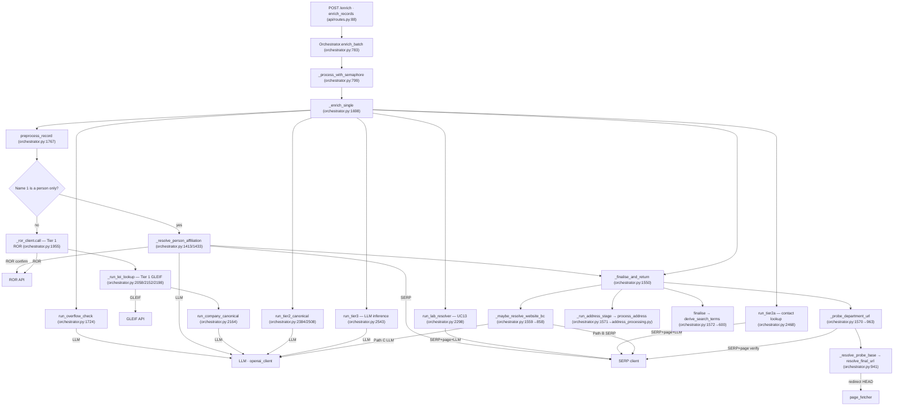
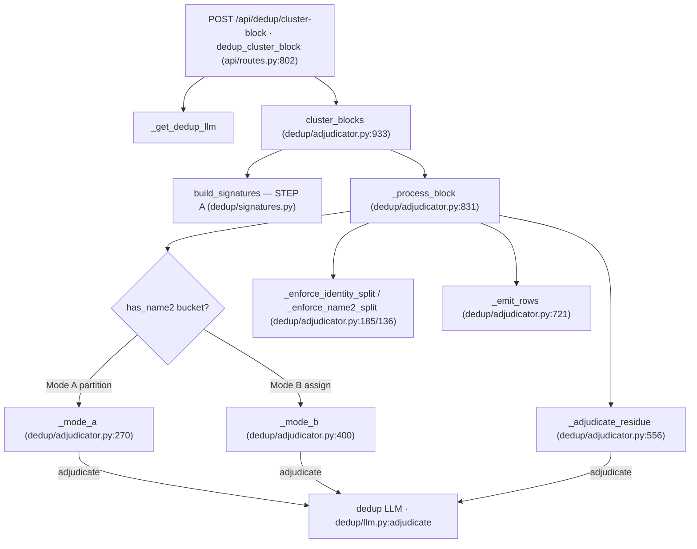
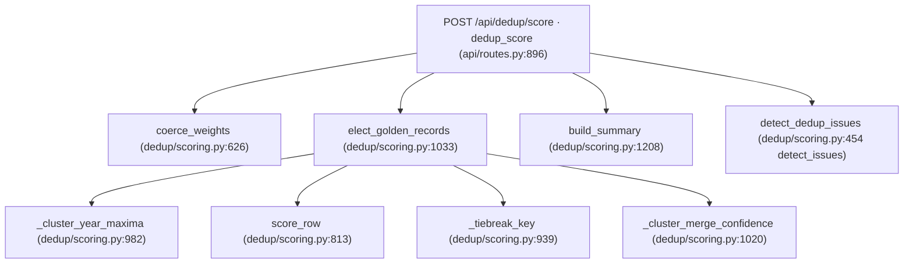

Generated: 2026-08-16 · Commit: 515cc7c1a84f55f817d63b4f3f094ce47d57f7fd · Branch: diag/website-trace

# Pass 0 — Inventory and Call Graph

This document inventories the repository, enumerates entry points, traces the call graph
of each entry point to its external-call boundary, lists unreferenced code, and records the
test inventory with the real suite summary. All line counts are raw file line counts
(`wc -l`); "last touched" is the committer date of the most recent commit touching the file
(`git log -1 --format=%cs -- <file>`). Files marked `(untracked)` are present in the working
tree but not committed.

## Scope and exclusions

The following directories are excluded from the file table as vendored, generated, or
runtime artefacts:

- `.git/` — version-control metadata.
- `.venv/` — vendored Python virtual environment (third-party packages).
- `__pycache__/` (all locations) — generated CPython bytecode.
- `.pytest_cache/`, `htmlcov/` — generated test/coverage caches.
- `logs/` — runtime log output (git-ignored: `.gitignore:20-21` add `*.log.*` and `logs/`).

Non-code artefacts committed at the repository root and included for completeness but not
inventoried per-line: `PresentationTestData.xlsx`, `PresentationTestData_enriched_checked_v1.xlsx`,
`PresentationTestData_subset.xlsx` (spreadsheet test data), `Domain_DeptDomain_SearchTerm_Logic.pdf`,
`Website_Trace_Findings.pdf` (generated documentation), `certs/` (a corporate CA bundle referenced
by TLS configuration in `config.py:52-64`).

---

## 1 · File table

### Application root

| Path | Lines | Purpose | Last touched |
|------|------:|---------|--------------|
| `main.py` | 8 | Local development entry point; runs the FastAPI app via `uvicorn` (`main.py:6-8`). | 2026-04-09 |
| `function_app.py` | 19 | Azure Functions v2 ASGI entry point; wraps the shared FastAPI app behind a catch-all route (`function_app.py:14-19`). | 2026-05-31 |
| `config.py` | 257 | `Settings` dataclass and env-var loading; TLS/CA sanitisation for corporate VPN (`config.py:27-67`); `validate_env`, `get_settings`. | 2026-08-12 |
| `__init__.py` | 0 | Package marker. | 2026-04-09 |
| `host.json` | 20 | Azure Functions host configuration. | 2026-05-31 |
| `local.settings.json` | 26 | Azure Functions local settings (untracked). | (untracked) |
| `pytest.ini` | 3 | pytest configuration. | 2026-04-09 |
| `requirements.txt` | 14 | Runtime dependency pins. | 2026-06-04 |
| `requirements-dev.txt` | 5 | Development/test dependency pins. | 2026-04-09 |

### `api/` — HTTP layer

| Path | Lines | Purpose | Last touched |
|------|------:|---------|--------------|
| `api/app.py` | 29 | FastAPI application object; wires logging, `validate_env`, middleware, router (`api/app.py:17-29`). | 2026-08-12 |
| `api/routes.py` | 1118 | All HTTP route handlers and their XLSX parse/build helpers (13 routes; see §2). | 2026-08-03 |
| `api/models.py` | 480 | Pydantic v2 request/response schemas (`EnrichmentRecord`, `EnrichmentResult`, dedup and scoring models). | 2026-07-14 |
| `api/middleware.py` | 135 | `RequestLoggingMiddleware`, `configure_logging` (console + rotating file). | 2026-08-12 |
| `api/output_columns.py` | 89 | Ordered mapping of internal result fields to output spreadsheet column names. | 2026-07-14 |
| `api/__init__.py` | 0 | Package marker. | 2026-04-09 |

### `enrichment/` — Phase-1 enrichment pipeline

| Path | Lines | Purpose | Last touched |
|------|------:|---------|--------------|
| `enrichment/orchestrator.py` | 2650 | Pipeline controller: `enrich_batch`, `_enrich_single`, tier dispatch, website/dept-domain/address/finalise stages (see §3). | 2026-08-12 |
| `enrichment/preprocess.py` | 2332 | Deterministic name/address cleanup (UC 6–17): person extraction, address/street routing, DBA, acronym dedupe. | 2026-08-12 |
| `enrichment/address_processing.py` | 1219 | Late address stage: `process_address` — street→one-line scope-table reduction, sub-location extraction. | 2026-08-12 |
| `enrichment/tier1_ror.py` | 872 | ROR API client and matching (`call`, `_extract_org_fields`, acronym-currency selection). | 2026-08-12 |
| `enrichment/website_resolver.py` | 633 | Website Paths B (SERP) and C (LLM); ranking, guards, `WEBSITE_TRACE` diagnostic. | 2026-08-12 |
| `enrichment/search_terms.py` | 586 | `derive_search_terms` (ST1/ST2 chains, normalisation) and shared helpers. | 2026-08-12 |
| `enrichment/issue_detection.py` | 510 | Deterministic `detect_issues` — G-series issue-catalogue rule codes. | 2026-06-16 |
| `enrichment/tier2a_contact.py` | 483 | Tier 2A contact-person lookup (`run_tier2a`, Mode A population / Mode B verification). | 2026-04-11 |
| `enrichment/tier1_lei.py` | 407 | GLEIF/LEI company registry client (`LEIClient`, `run_lei_lookup` counterpart to ROR). | 2026-07-11 |
| `enrichment/tier2b_dept.py` | 266 | Tier 2B department search (`run_tier2b`). | 2026-04-11 |
| `enrichment/person_affiliation.py` | 178 | Stage 2b: propose a person-only contact's institution/department from SERP snippets (`run_person_affiliation`). | 2026-08-12 |
| `enrichment/lab_resolver.py` | 170 | UC 13: resolve a granular lab's parent academic department (`run_lab_resolver`). | 2026-05-14 |
| `enrichment/tier3_llm.py` | 162 | Tier 3 last-resort LLM inference (`run_tier3`), with the address-in-name guard. | 2026-08-12 |
| `enrichment/tier2_canonical.py` | 122 | Tier 2 LLM department canonicalisation (`run_tier2_canonical`), unit-prefix downgrade guard. | 2026-08-12 |
| `enrichment/company_canonical.py` | 104 | Company-name canonicalisation with geographic context (`run_company_canonical`). | 2026-07-03 |
| `enrichment/confidence.py` | 86 | Flag-for-review logic and enrichment-status assignment. | 2026-04-09 |
| `enrichment/overflow_check.py` | 76 | UC 0: LLM check for Name1+Name2 being one split name (`run_overflow_check`). | 2026-04-11 |
| `enrichment/classifier.py` | 13 | Docstring-only stub; classification logic REMOVED and moved to ROR org types (see §4). | 2026-04-09 |
| `enrichment/__init__.py` | 0 | Package marker. | 2026-04-09 |

### `dedup/` — Phase-2 deduplication adjudicator

| Path | Lines | Purpose | Last touched |
|------|------:|---------|--------------|
| `dedup/scoring.py` | 1244 | Golden-record election (`elect_golden_records`), row scoring, `detect_issues` (dedup), `apply_approval`, weight coercion. | 2026-08-03 |
| `dedup/adjudicator.py` | 1013 | Per-block adjudication (`cluster_blocks`, `_process_block`, `_mode_a`/`_mode_b`/`_adjudicate_residue`). | 2026-07-23 |
| `dedup/scoring_xlsx.py` | 319 | Scoring workbook read/write for `/api/dedup/score/file`. | 2026-08-03 |
| `dedup/llm.py` | 220 | Dedup LLM client (`adjudicate`). | 2026-06-29 |
| `dedup/candidates.py` | 196 | Residue candidate nomination (name/token/id-convergence). | 2026-07-23 |
| `dedup/signatures.py` | 147 | STEP A signature collapsing (`build_signatures`, `derive_block_id`). | 2026-07-22 |
| `dedup/models.py` | 107 | Dedup Pydantic models (`DedupRow`, `DedupRequest`, `DedupResponse`, …). | 2026-07-23 |
| `dedup/prompts.py` | 79 | Dedup system prompt and Mode A/B prompt builders; `PROMPT_VERSION`. | 2026-07-11 |
| `dedup/cluster_key.py` | 23 | Stable cluster-id derivation. | 2026-07-22 |
| `dedup/weights.json` | 58 | Scoring weights configuration (consumed by `dedup/scoring.py`). | 2026-07-11 |
| `dedup/__init__.py` | 7 | Package marker/exports. | 2026-06-17 |

### `search/` — search and page-fetch clients

| Path | Lines | Purpose | Last touched |
|------|------:|---------|--------------|
| `search/page_fetcher.py` | 290 | `PageFetcher` — structured page extraction, `fetch_outgoing_links`, `resolve_final_url` (redirect follow). | 2026-08-12 |
| `search/serpapi_client.py` | 56 | SerpAPI Google-search client (`SerpAPIClient.search`). | 2026-04-09 |
| `search/duckduckgo_client.py` | 42 | DuckDuckGo fallback search client (used when `SERPAPI_KEY` is unset). | 2026-04-09 |
| `search/base.py` | 23 | `SearchClient` abstract base and `SearchResult` dataclass. | 2026-04-09 |
| `search/__init__.py` | 0 | Package marker. | 2026-04-09 |

### `llm/` — LLM client and prompts

| Path | Lines | Purpose | Last touched |
|------|------:|---------|--------------|
| `llm/prompts.py` | 419 | All Phase-1 prompt templates (tiers, website inference, person affiliation). | 2026-08-12 |
| `llm/openai_client.py` | 292 | Azure OpenAI client (`extract_json`, retry). | 2026-08-12 |
| `llm/test_connection.py` | 31 | Standalone connectivity check script (see §4). | 2026-04-09 |
| `llm/__init__.py` | 0 | Package marker. | 2026-04-09 |

### `utils/` — shared utilities

| Path | Lines | Purpose | Last touched |
|------|------:|---------|--------------|
| `utils/text_utils.py` | 1011 | Text normalisation, `extract_domain`, abbreviation expansion, acronym/admin helpers, `smart_title_case`. | 2026-08-12 |
| `utils/cache.py` | 111 | `BatchCache` (ROR/SERP/resolved-host) and process-level `SerpCache`. | 2026-08-12 |
| `utils/__init__.py` | 0 | Package marker. | 2026-04-09 |

### `eval/` — evaluation harness

| Path | Lines | Purpose | Last touched |
|------|------:|---------|--------------|
| `eval/dedup_eval.py` | 308 | Dedup evaluation harness (metrics computation). | 2026-07-22 |
| `eval/__init__.py` | 1 | Package marker. | 2026-07-22 |

### `scripts/` — standalone developer utilities (not imported by the application)

| Path | Lines | Purpose | Last touched |
|------|------:|---------|--------------|
| `scripts/debug_ucsf.py` | 269 | Ad-hoc debug script. | 2026-04-11 |
| `scripts/verify_fixes.py` | 232 | Ad-hoc verification script. | 2026-06-05 |
| `scripts/trace_website.py` | 202 | Diagnostic driver for website Path B/C (`WEBSITE_TRACE`); writes `logs/website_trace.json`. | 2026-08-12 |
| `scripts/test_local.py` | 202 | Local integration smoke script. | 2026-04-09 |

### `tests/` — see §5.

---

## 2 · Entry points

### HTTP routes (FastAPI router — `api/routes.py`)

All routes are registered on `router` (`api/app.py:29 app.include_router(router)`). The same
router is served in two deployments: local `uvicorn` (`main.py:8`) and Azure Functions via a
catch-all ASGI wrapper (`function_app.py:14-19`).

| Method | Path | Request model | Response model | Handler |
|--------|------|---------------|----------------|---------|
| GET | `/health` | — | `HealthResponse` | `health_check` (`api/routes.py:75-76`) |
| POST | `/enrich` | `EnrichmentRequest` | `EnrichmentResponse` | `enrich_records` (`api/routes.py:88-89`) |
| POST | `/enrich/file` | `UploadFile` (XLSX) | XLSX stream | `enrich_file` (`api/routes.py:518-519`) |
| POST | `/issues` | `UploadFile` (XLSX) | XLSX stream | `detect_file_issues` (`api/routes.py:580-581`) |
| POST | `/issues/compare` | 2× `UploadFile` (original, enriched) | XLSX stream | `compare_file_issues` (`api/routes.py:628-631`) |
| POST | `/api/dedup/cluster-block` | `DedupRequest` | `DedupResponse` | `dedup_cluster_block` (`api/routes.py:802-803`) |
| POST | `/api/dedup/file` | `UploadFile` (XLSX) | XLSX stream | `dedup_file` (`api/routes.py:832-833`) |
| POST | `/api/dedup/score` | `ScoringRequest` | `ScoringResponse` | `dedup_score` (`api/routes.py:896-897`) |
| POST | `/api/dedup/score/file` | `UploadFile` (XLSX) | XLSX stream | `dedup_score_file` (`api/routes.py:977-978`) |
| POST | `/api/dedup/approve` | `ApprovalRequest` | `ApprovalResponse` | `dedup_approve` (`api/routes.py:946-947`) |
| GET | `/diag/llm` | — | `dict` | `diag_llm` (`api/routes.py:1034-1035`) |
| GET | `/diag/dedup-llm` | — | `dict` | `diag_dedup_llm` (`api/routes.py:1066-1067`) |
| GET | `/tiers` | — | `TierConfigResponse` | `get_tier_config` (`api/routes.py:1105-1106`) |

### Azure Function binding

| Binding | Route | Auth | Handler |
|---------|-------|------|---------|
| HTTP trigger (catch-all) | `{*route}` | `ANONYMOUS` | `http_app_func` → `AsgiMiddleware(fastapi_app)` (`function_app.py:11-19`) |

### CLI / process entry points

| Command | Effect | Location |
|---------|--------|----------|
| `python main.py` | `uvicorn.run("api.app:app", host="0.0.0.0", port=8000, reload=True)` | `main.py:6-8` |
| `python scripts/trace_website.py [--record NAME]` | Runs website Path B/C in isolation with `WEBSITE_TRACE=true` | `scripts/trace_website.py` |

No scheduled triggers, timers, or queue bindings are defined (`function_app.py` declares only
the one HTTP catch-all route).

---

## 3 · Call graphs

External-call / boundary nodes: **ROR** (`enrichment/tier1_ror.py`), **GLEIF/LEI**
(`enrichment/tier1_lei.py`), **SERP** (`search/serpapi_client.py` / `duckduckgo_client.py`),
**page fetch** (`search/page_fetcher.py`), **LLM** (`llm/openai_client.py` / `dedup/llm.py`).

### 3.1 · `POST /enrich` and `POST /enrich/file`

`enrich_file` (`api/routes.py:518`) parses the uploaded XLSX to `EnrichmentRecord`s, then calls
the same `orchestrator.enrich_batch` used by `/enrich`, and serialises results back to XLSX.
The per-record chain is identical.

`enrich_records` → `_get_orchestrator` → `Orchestrator.enrich_batch` (`enrichment/orchestrator.py:783`)
→ `_process_with_semaphore` (`:799`) → `_enrich_single` (`:1698`).

`_enrich_single` invokes, in order (early-returns via `_finalise_and_return` at any tier that
resolves):

### 3.2 · `POST /api/dedup/cluster-block` and `POST /api/dedup/file`

`dedup_file` (`api/routes.py:832`) parses an XLSX to `DedupRow`s, then calls the same
`cluster_blocks` used by `/api/dedup/cluster-block`.

### 3.3 · `POST /api/dedup/score` and `POST /api/dedup/score/file`

`dedup_score_file` parses an XLSX to `ScoringRow`s then reuses the same election path.

This path performs **no external calls** — it is deterministic scoring over the request rows.

### 3.4 · `POST /api/dedup/approve`

`dedup_approve` (`api/routes.py:946`) → `apply_approval` (`dedup/scoring.py:574`). Deterministic;
no external calls.

### 3.5 · `POST /issues` and `POST /issues/compare`

`detect_file_issues` (`api/routes.py:580`) → `_parse_xlsx` → `_rows_to_records` →
`detect_issues` per row (`enrichment/issue_detection.py`) → `_build_issues_xlsx`. Deterministic;
no external calls.

`compare_file_issues` (`api/routes.py:628`) → `_audit_upload(original)` and
`_audit_upload(enriched)` → `_build_comparison_xlsx`. `_audit_upload` runs the enrichment/issue
audit over an uploaded file; whether it invokes the full pipeline (and thus external calls) is
⚠ UNVERIFIED — the body of `_audit_upload` was not read in this pass.

### 3.6 · Diagnostic and config routes

- `GET /health` → `health_check` (`api/routes.py:75`) — returns status; no external calls.
- `GET /tiers` → `get_tier_config` (`api/routes.py:1105`) — returns tier configuration; no external calls.
- `GET /diag/llm` → `diag_llm` (`api/routes.py:1034`) — issues one probe LLM call (external: LLM).
- `GET /diag/dedup-llm` → `diag_dedup_llm` (`api/routes.py:1066`) — issues one probe dedup-LLM call (external: LLM).

---

## 4 · Dead or unreferenced code

Listed, not removed.

- **`enrichment/classifier.py`** (13 lines) — a docstring-only stub stating classification was
  REMOVED (`enrichment/classifier.py:1-12`). No module imports it anywhere in the repository
  (`grep` for `enrichment.classifier` / `.classifier` returns no import). **Doc↔code discrepancy:**
  `README.md` cites `enrichment/classifier.py` as the classification module (Record Classification
  Logic section), but the logic lives in `enrichment/tier1_ror.py` / `enrichment/orchestrator.py`.
  → record in `08_GAPS.md`.
- **`search_terms.unit_domain_or_path`** (`enrichment/search_terms.py`) — exported and exercised by
  `tests/test_search_terms.py`, but has no caller in application code (`grep` for `unit_domain_or_path`
  outside its definition and tests returns nothing). Superseded by `_dept_domain_to_search_term`.
- **`scripts/debug_ucsf.py`, `scripts/verify_fixes.py`, `scripts/test_local.py`,
  `scripts/trace_website.py`, `llm/test_connection.py`** — standalone developer utilities. Not
  imported by the application; each is its own `__main__` entry point. `trace_website.py` is a
  supported diagnostic (see §2 CLI); the others are ad-hoc.
- ⚠ UNVERIFIED — a full function-level unreferenced-symbol sweep across all modules was not
  performed in this pass; only the candidates above were confirmed by targeted `grep`. A complete
  sweep (e.g. `vulture` or an AST call-graph) would be required to assert no other function is
  dead.

---

## 5 · Test inventory

Suite run (this commit): **`3 failed, 1019 passed, 12 warnings in 28.44s`**
(`python -m pytest -q`). The three failures are all in `tests/test_orchestrator.py` and are
pre-existing, unrelated to the current branch's changes (mock-LLM `record_type`/website
fallback expectations):

- `tests/test_orchestrator.py::TestOrchestrator::test_tier1_full_resolution` — FAIL
- `tests/test_orchestrator.py::TestOrchestrator::test_web_search_fallback_for_name1` — FAIL
- `tests/test_orchestrator.py::TestOrchestrator::test_web_search_determines_record_type` — FAIL

`tests/conftest.py` (103 lines) provides fixtures; `tests/mocks/` provides mock clients
(`ror_mock.py`, `lei_mock.py`, `openai_mock.py`, `page_mock.py`, `serp_mock.py`, `dedup_mock.py`);
`tests/fixtures/*.json` provide record fixtures. These support files are not standalone test
modules.

| Test file | Covers | Primary source module | Passing? |
|-----------|--------|-----------------------|----------|
| `test_acronym_dedupe.py` | Name-1 acronym/full-form dedupe | `enrichment/preprocess.py` | yes |
| `test_address_cleanup.py` | Street residue / sub-location cleanup | `enrichment/address_processing.py` | yes |
| `test_cache.py` | ROR/SERP batch cache | `utils/cache.py` | yes |
| `test_candidates.py` | Residue candidate nomination | `dedup/candidates.py` | yes |
| `test_canonical_dedup.py` | Canonical unit dedupe | `dedup/` / `utils/text_utils.py` | yes |
| `test_canonical_identity.py` | Canonical identity guard | `utils/text_utils.py` | yes |
| `test_canonicalise_unit_name.py` | Unit-name canonicalisation | `utils/text_utils.py` | yes |
| `test_classifier.py` | Record classification (keyword fallback) | `utils/text_utils.py` | yes |
| `test_dedup.py` | Block adjudication (Mode A/B, residue) | `dedup/adjudicator.py` | yes |
| `test_dedup_eval.py` | Dedup evaluation harness | `eval/dedup_eval.py` | yes |
| `test_dept_domain_probe.py` | Dept-probe scoring, base resolution, path helpers | `enrichment/orchestrator.py` | yes |
| `test_domain_from_website.py` | Domain derivation from website | `utils/text_utils.py` | yes |
| `test_issue_detection.py` | Issue-catalogue rules | `enrichment/issue_detection.py` | yes |
| `test_lab_resolver.py` | UC 13 lab→parent resolution | `enrichment/lab_resolver.py` | yes |
| `test_leading_code_strip.py` | Opaque-code stripping | `enrichment/preprocess.py` | yes |
| `test_legal_suffix_normalisation.py` | Legal-suffix normalisation | `utils/text_utils.py` | yes |
| `test_named_building.py` | Named-building extraction | `enrichment/preprocess.py` | yes |
| `test_orchestrator.py` | End-to-end orchestrator flows | `enrichment/orchestrator.py` | **3 fail / rest pass** |
| `test_org_in_street.py` | Org-in-street routing | `enrichment/preprocess.py` | yes |
| `test_passthrough_name_cleanup.py` | Passthrough name cleanup | `utils/text_utils.py` | yes |
| `test_person_affiliation.py` | Stage 2b proposer | `enrichment/person_affiliation.py` | yes |
| `test_person_affiliation_guard.py` | Stage 2b ROR-confirm guard | `enrichment/orchestrator.py` | yes |
| `test_person_in_name1.py` | Person-in-Name-1 extraction | `enrichment/preprocess.py` | yes |
| `test_person_in_name1_flag.py` | Person-in-Name-1 flag path | `enrichment/orchestrator.py` | yes |
| `test_person_org_in_street.py` | Person + org-in-street | `enrichment/preprocess.py` | yes |
| `test_pipe_splitter_inversion.py` | Pipe-delimited street splitter | `enrichment/preprocess.py` | yes |
| `test_preprocess_co_attn.py` | UC 15 c/o + ATTN | `enrichment/preprocess.py` | yes |
| `test_ror_name_verbatim.py` | ROR identity guard + kept-name standardisation | `enrichment/orchestrator.py` | yes |
| `test_ror_state_abbrev.py` | ROR US state-abbrev expansion | `enrichment/tier1_ror.py` | yes |
| `test_routes.py` | HTTP route contracts | `api/routes.py` | yes |
| `test_scoring.py` | Golden-record election + scoring | `dedup/scoring.py` | yes |
| `test_search_terms.py` | ST1/ST2 derivation (existing) | `enrichment/search_terms.py` | yes |
| `test_search_terms_fixes.py` | ST1/ST2 acceptance rows | `enrichment/search_terms.py` | yes |
| `test_smart_title_case.py` | ALL-CAPS title-casing / acronyms | `utils/text_utils.py` | yes |
| `test_street_fragment_dedup.py` | Street fragment dedupe | `enrichment/preprocess.py` | yes |
| `test_street_in_name.py` | Street-in-name extraction | `enrichment/preprocess.py` | yes |
| `test_street_org_split.py` | Org/dept-in-street split | `enrichment/preprocess.py` | yes |
| `test_street_qualifier_split.py` | Street qualifier split | `enrichment/address_processing.py` | yes |
| `test_street_scope_routing.py` | Scope-table street→name routing | `enrichment/orchestrator.py` | yes |
| `test_street_scope_table.py` | Scope-table address reduction | `enrichment/address_processing.py` | yes |
| `test_strip_address_fragments.py` | Address-fragment stripping | `utils/text_utils.py` | yes |
| `test_tier1.py` | Tier 1 ROR resolution | `enrichment/tier1_ror.py` | yes |
| `test_tier1_lei.py` | Tier 1 GLEIF/LEI | `enrichment/tier1_lei.py` | yes |
| `test_tier1_ror_country.py` | ROR country guard | `enrichment/tier1_ror.py` | yes |
| `test_tier2_canonical_downgrade.py` | Tier 2 canonical downgrade guard | `enrichment/tier2_canonical.py` | yes |
| `test_tier2a_population.py` | Tier 2A Mode A | `enrichment/tier2a_contact.py` | yes |
| `test_tier2a_verification.py` | Tier 2A Mode B | `enrichment/tier2a_contact.py` | yes |
| `test_tier2b.py` | Tier 2B department search | `enrichment/tier2b_dept.py` | yes |
| `test_tier3.py` | Tier 3 LLM inference | `enrichment/tier3_llm.py` | yes |
| `test_tier3_address_guard.py` | Tier 3 address-in-name guard + name2 drop | `enrichment/tier3_llm.py` / `orchestrator.py` | yes |
| `test_uc15_co_attn.py` | UC 15 c/o + ATTN cases | `enrichment/preprocess.py` | yes |
| `test_website_resolver.py` | Path B/C resolution + guards + trace | `enrichment/website_resolver.py` | yes |

Individual pass/fail per case is asserted only for `test_orchestrator.py` (three named failures);
every other listed file's cases are within the 1019 passing total. "Passing?" here reflects
file-level status from the single suite run above, not a per-file re-run.

### Untested modules

Source modules with no dedicated test file mapping to them in the table above:

- `api/app.py`, `api/middleware.py`, `api/models.py`, `api/output_columns.py`
- `config.py`, `main.py`, `function_app.py`
- `enrichment/company_canonical.py`, `enrichment/confidence.py`, `enrichment/overflow_check.py`, `enrichment/classifier.py` (stub)
- `dedup/adjudicator.py` (exercised via `test_dedup.py`, no 1:1 file), `dedup/llm.py`, `dedup/models.py`, `dedup/prompts.py`, `dedup/scoring_xlsx.py`, `dedup/signatures.py`, `dedup/cluster_key.py`
- `search/base.py`, `search/serpapi_client.py`, `search/duckduckgo_client.py`, `search/page_fetcher.py`
- `llm/openai_client.py`, `llm/prompts.py`, `llm/test_connection.py`
- `eval/dedup_eval.py` (exercised via `test_dedup_eval.py`)

⚠ Note: several of these are exercised indirectly (e.g. `search/page_fetcher.py` via mocked probe
tests, `dedup/signatures.py` via `test_dedup.py`) but have no direct unit test. "Untested" here
means "no test file whose subject is that module". A coverage run (`pytest --cov`) would quantify
line-level coverage; that measurement was not taken in this pass — ⚠ MEASUREMENT REQUIRED
(`pytest --cov=. --cov-report=term-missing`).

---

Pass 0 complete. 105 inventoried source/config files (excluding vendored dirs, `__init__.py`
markers counted), 13 HTTP routes + 1 Azure Function binding + 2 CLI entry points, ~24 untested
modules (§5). Stop.
