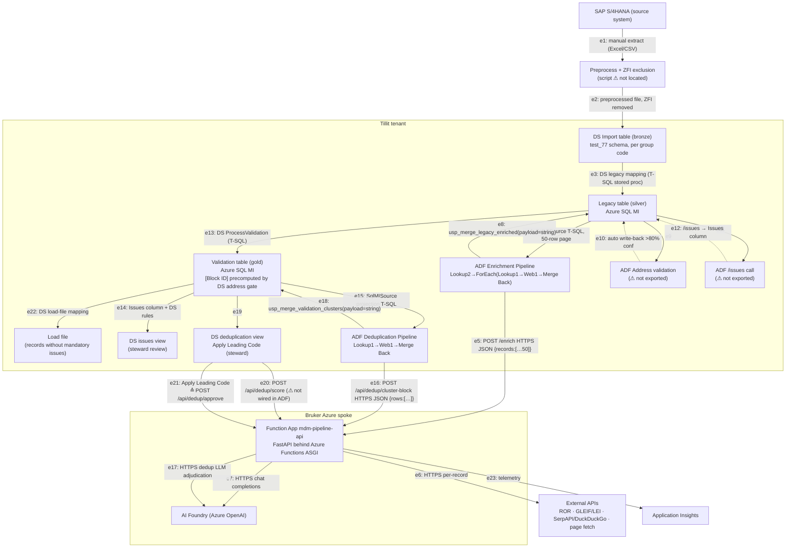
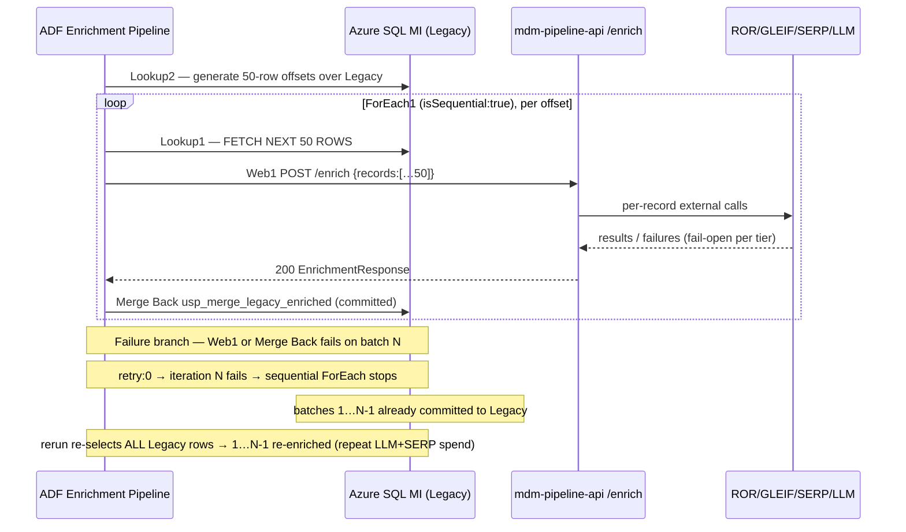
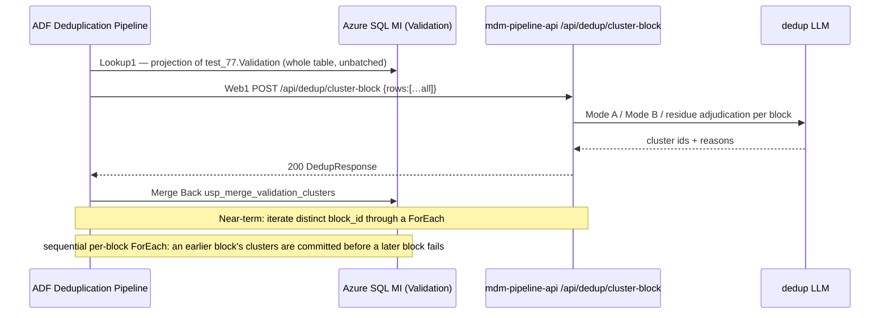

Generated: 2026-08-16 · Commit: 515cc7c1a84f55f817d63b4f3f094ce47d57f7fd · Branch: diag/website-trace

# Pass 2 — Architecture

This document describes the system as a whole, not the FastAPI service in isolation. The
service in this repository (`mdm-pipeline-api`) is one component among several: it is invoked
by Azure Data Factory (ADF) pipelines, reads from and writes to an Azure SQL Managed Instance
under the control of DATAshaper (DS) stored procedures, and sits between the DS import/legacy/
validation table progression and a human data steward who approves the final result. The ADF
pipelines, the SQL Managed Instance and its stored procedures, and the DATAshaper
configuration are documented here as first-class components.

Evidence conventions follow Passes 0–1: behavioural claims about the service cite
`path/file.py:LINE`. Claims about the systems outside this repository cite
`CONTEXT-EXTERNAL.md:LINE` and respect its provenance markers ([EXPORT] ground truth,
[OBSERVED] a 2026-08-16 interface observation, [AUTHOR] pending confirmation). DATAshaper
behaviour additionally cites the vendor onboarding transcripts as
`Datashaper-Tutorial-PartN.txt` for internal traceability only — these are an internal
recorded call, not a publishable source. Design-rationale documents at the repository root are
cited as `Domain_DeptDomain_SearchTerm_Logic.pdf` and `Website_Trace_Findings.pdf`.

Genuinely absent artefacts are enumerated once in `CONTEXT-EXTERNAL.md` §7 and referenced
from there rather than re-listed.

Four near-term changes are being implemented before the 2026-08-21 code freeze
(`CONTEXT-EXTERNAL.md:194-197,312-314`). They are documented here as part of the system, in
the diagrams and the workflow table. Each sentence asserting one carries a
`<!-- VERIFY-BY-FREEZE: … -->` comment immediately after it so the claims can be grepped and
confirmed against the code at freeze.

---

## 1 · Scope, entity, and group-code scoping

The processed data belongs to one **entity**, `test_77`, realised as the SQL schema name; a
**group code** identifies one import within that entity (`CONTEXT-EXTERNAL.md:20-29`). The
`Legacy` and `Validation` tables hold records from **all** group codes under the entity
(`CONTEXT-EXTERNAL.md:26-28`), so group code is the required scoping predicate for any
per-import processing. Record codes carry the group code as a prefix (`TEST7_41000009`,
`TEST10_42000001` — `CONTEXT-EXTERNAL.md:35-36`); the code is formed in the DS legacy mapping
as `<group code> + '_' + <source key>`, cast to NVARCHAR, and is the stable primary key across
the Import → Legacy → Validation → load-file progression
(`Datashaper-Tutorial-Part1.txt:1409-1469`).

Both exported ADF pipelines are to be parameterised by group code, binding `@groupCode` into
the Lookup predicates so each run processes exactly one import.
<!-- VERIFY-BY-FREEZE: group-code predicate added to all three Lookup activities (Enrichment Lookup1+Lookup2, Deduplication Lookup1) -->
As exported (`lastPublishTime` 2026-07-29T12:09:37Z), neither pipeline yet carries a group-code
predicate: the enrichment Lookups read `test_77.Legacy` unfiltered
(`CONTEXT-EXTERNAL.md:64,106`) and the deduplication Lookup reads `test_77.Validation`
unfiltered (`CONTEXT-EXTERNAL.md:226`). The enrichment pipeline's `Lookup2`/`Lookup1` pair and
the deduplication pipeline's single `Lookup1` are the three Lookup activities the predicate
must reach.

---

## 2 · Component diagram

Protocols/payloads on each edge are cited beneath the diagram. Dashed edges are components
whose ADF artefact is not exported (`CONTEXT-EXTERNAL.md:439-448`).



**Edge protocols and payloads**

- **e1–e2** — Manual extract and preprocessing; the script that reduces the SAP extract to the
  processable schema and excludes ZFI records is not located (`CONTEXT-EXTERNAL.md:418,444`).
  ZFI exclusion is on Bernd Schnurrer's instruction with rationale not recorded
  (`CONTEXT-EXTERNAL.md:434-435`).
- **e3** — DS Import→Legacy mapping runs as a SQL stored procedure invoked ad-hoc or from ADF
  (`CONTEXT-EXTERNAL.md:348-352`); every DS process corresponds to a stored procedure
  (`Datashaper-Tutorial-Part3.txt:752-757`).
- **e4** — ADF `Lookup1` reads `SELECT * FROM test_77.Legacy ORDER BY Customer OFFSET @offset
  ROWS FETCH NEXT 50 ROWS ONLY` via `SqlMISource` (`CONTEXT-EXTERNAL.md:104-110`).
- **e5** — ADF `Web1` POSTs JSON `{"records": <50 legacy rows>}` to
  `https://mdm-pipeline-api.azurewebsites.net/enrich`, `Content-Type: application/json`
  (`CONTEXT-EXTERNAL.md:133-143`); handled by `enrich_records` (`api/routes.py:88-89`) — the
  **JSON** endpoint, not `/enrich/file`.
- **e6** — Per record the service calls ROR (`enrichment/tier1_ror.py`), GLEIF/LEI
  (`enrichment/tier1_lei.py`), SerpAPI or DuckDuckGo (`search/serpapi_client.py`,
  `search/duckduckgo_client.py`), and page fetch (`search/page_fetcher.py`); see Pass 0 §3.1.
- **e7 / e17** — Azure OpenAI chat completions (`llm/openai_client.py`, `dedup/llm.py`); the
  deployment name defaults to `gpt-5.4` (`config.py:84,157`).
- **e8** — `Merge Back` calls `dbo.usp_merge_legacy_enriched` on linked service
  `ls_sqlmi_legacy`, passing the whole `/enrich` response as one String `payload`
  (`CONTEXT-EXTERNAL.md:160-176`).
- **e9–e12** — Address validation (step 6) and the `/issues` call (step 7) have no exported
  ADF pipeline (`CONTEXT-EXTERNAL.md:442-443`). ⚠ The only `/issues` endpoint in the service
  consumes a multipart XLSX upload (`detect_file_issues`, `api/routes.py:580-581`), not JSON,
  so how an ADF Web activity invokes it is unverified — reinforcing that this pipeline is not
  exported.
- **e13** — DS Legacy→Validation mapping + validation rules run as `ProcessValidation`
  (`CONTEXT-EXTERNAL.md:30-32,348-352`).
- **e14** — DS validation rules read the Issues column and DS also applies its own rules
  independent of that column (`CONTEXT-EXTERNAL.md:354-361`); see §5.
- **e15** — ADF `Lookup1` reads a fixed projection of `test_77.Validation` defining the dedup
  request contract (`CONTEXT-EXTERNAL.md:224-310`); `[Block ID]` is precomputed by the DS
  address gate and read, not derived, by the service (`CONTEXT-EXTERNAL.md:309-310`).
- **e16** — ADF `Web1` POSTs JSON `{"rows": <validation rows>}` to
  `/api/dedup/cluster-block` (`CONTEXT-EXTERNAL.md:253-264`); handled by
  `dedup_cluster_block` (`api/routes.py:802-803`).
- **e18** — `Merge Back` calls `dbo.usp_merge_validation_clusters` on `ls_sqlmi_validation`
  (`CONTEXT-EXTERNAL.md:280-295`).
- **e20** — Golden-record election `POST /api/dedup/score` (`api/routes.py:896-897`). ⚠ Not
  invoked by either exported ADF pipeline (see §7); where election is triggered in production
  is `CONTEXT-EXTERNAL.md:445` open item 5.
- **e21** — The DS "Apply Leading Code" action (`CONTEXT-EXTERNAL.md:395-399`) corresponds to
  `POST /api/dedup/approve` (`api/routes.py:946-947`); see §7.
- **e22** — DS load-file mapping publishes records without mandatory issues
  (`Datashaper-Tutorial-Part3.txt:574-584`).
- **e23** — Application Insights logging is bound in `host.json:3-10`.

---

## 3 · The twelve-step production workflow

This is the spine of the chapter. The steps are tabulated in `CONTEXT-EXTERNAL.md:416-429`
[AUTHOR]; the executing component, inputs, outputs, and human-in-loop status below are drawn
from that table cross-referenced with the ADF exports (§2/§3 of the context file) and the
service code. "Artefact" is where the executing logic lives.

| # | Step | Executing component | Artefact | Inputs | Outputs | Human in loop |
|---|------|---------------------|----------|--------|---------|---------------|
| 1 | Preprocess source file to processable schema; exclude ZFI records | preprocessing script | ⚠ not located (`CONTEXT-EXTERNAL.md:418,444`) | SAP extract | preprocessed file | yes |
| 2 | Create group code; import preprocessed file into DATAshaper | DS import | DS Import table (bronze), `test_77` schema | preprocessed file | Import rows under group code | yes |
| 3 | Process legacy (Import→Legacy mapping) | ADF → DS stored procedure | DS legacy mapping proc (`CONTEXT-EXTERNAL.md:348-352`) | Import table | Legacy rows (coded) | no |
| 4 | Call `/enrich` reading from Legacy | ADF Enrichment Pipeline | `Enrichment Pipeline` (`CONTEXT-EXTERNAL.md:41-186`); `enrich_records` (`api/routes.py:88`) | 50-row Legacy pages | enriched record JSON | no |
| 5 | Write enrichment results back to Legacy | `usp_merge_legacy_enriched` | stored proc (`CONTEXT-EXTERNAL.md:161,325`) | `/enrich` response string | updated Legacy rows | no |
| 6 | Address validation; auto write-back above 80% confidence | ADF | ⚠ pipeline not exported (`CONTEXT-EXTERNAL.md:423,442`) | Legacy rows | validated addresses | no |
| 7 | Call `/issues`; write issues column back to Legacy | ADF | ⚠ pipeline not exported (`CONTEXT-EXTERNAL.md:424,443`); detector `enrichment/issue_detection.py` | Legacy rows | Issues column | no |
| 8 | Process validation; DS rules read the issues column and apply their own | ADF → DS stored procedure | `ProcessValidation` (`CONTEXT-EXTERNAL.md:425,354-361`) | Legacy rows + Issues column | Validation rows + issue/warning flags | no |
| 9 | Review issues in the DS issues view; assign to a data steward | DS Studio | issues view (`CONTEXT-EXTERNAL.md:364-386`) | Validation issues | steward assignments / fixes | yes |
| 10 | Call `/api/dedup/cluster-block`; write clusters to Validation | ADF Deduplication Pipeline | `Deduplication Pipeline` (`CONTEXT-EXTERNAL.md:203-303`); `cluster_blocks` (`dedup/adjudicator.py:933`) | Validation projection | cluster ids + reasons | no |
| 11 | Review clusters in the DS deduplication view | DS Studio | dedup view (`CONTEXT-EXTERNAL.md:388-401`) | clustered rows | steward inspection | yes |
| 12 | Golden-record election proposes a leading code; a steward approves | scoring endpoint + DS Studio | `elect_golden_records` (`dedup/scoring.py:1033`) + Apply Leading Code (`CONTEXT-EXTERNAL.md:395-399`) | scored Validation rows | proposed then approved leading code | yes |

**Standalone `/issues` baseline.** `/issues` may also be run against the raw file (before
enrichment) to produce a before-enrichment issue baseline for evaluation; the detector is
pure and deterministic and the same rule set runs on a raw input file and on a post-pipeline
output file (`enrichment/issue_detection.py:9-16`). `/issues/compare` produces the before/after
reduction report from two uploads (`compare_file_issues`, `api/routes.py:628-631`). ⚠ Whether
this baseline path runs in ADF or is executed manually is unconfirmed
(`CONTEXT-EXTERNAL.md:431-432`).

---

## 4 · Runtime sequences (with failure branches)

### 4.1 Enrichment run



Failure behaviour is read from the export: every activity has `retry: 0` and a 12-hour timeout
(`CONTEXT-EXTERNAL.md:124-130,192`), and `ForEach1` is sequential
(`CONTEXT-EXTERNAL.md:88 "isSequential": true`). Consequently, when a later batch's `Web1` or
`Merge Back` fails, the earlier iterations' `usp_merge_legacy_enriched` writes are already
committed to `Legacy` and persist; the sequential ForEach stops at the failing iteration and
does not process subsequent offsets. Because `Lookup1` selects rows by offset with no
enrichment watermark (`CONTEXT-EXTERNAL.md:106`), a rerun re-selects and re-enriches the
already-merged rows, repeating their LLM and SERP spend.

An `enriched_at` watermark is to be added to Legacy so `Lookup1` selects only unenriched rows,
making reruns resumable and avoiding repeat LLM and SERP spend.
<!-- VERIFY-BY-FREEZE: enriched_at watermark on Legacy; enrichment Lookup1 filters to unenriched rows -->
A retry policy above 0 is to be set on the `Web1` and `Merge Back` activities.
<!-- VERIFY-BY-FREEZE: retry > 0 on enrichment Web1 and Merge Back activities -->

### 4.2 Deduplication run



As exported the deduplication pipeline issues **one** unbatched Lookup over the whole
`Validation` table and a single `Web1` call (`CONTEXT-EXTERNAL.md:224-264`). Deduplication is
to be batched by `block_id` through a ForEach, replacing the single unbatched Lookup over the
whole Validation table.
<!-- VERIFY-BY-FREEZE: deduplication batched by block_id via ForEach, replacing the whole-table Lookup -->
Once batched sequentially, the same already-committed-earlier-batch behaviour as §4.1 applies:
a block whose `Merge Back` has run is committed to `Validation` before a later block fails, and
with `retry: 0` (`CONTEXT-EXTERNAL.md:216,245,272`) a failure stops the ForEach.

### 4.3 Election and approval (step 12)

```mermaid
sequenceDiagram
    participant DS as DS deduplication view (steward)
    participant SCORE as /api/dedup/score
    participant APPROVE as /api/dedup/approve
    DS->>SCORE: POST scored Validation rows
    SCORE->>SCORE: elect_golden_records — one proposal per cluster
    SCORE-->>DS: rows with proposed_golden_id, election_status ∈ {proposed, manual_review, unique}
    Note over DS: steward inspects; is_golden_record left EMPTY for manual_review
    DS->>APPROVE: POST {cluster_id, decision, approver, rows} (Apply Leading Code)
    APPROVE->>APPROVE: apply_approval — on "approved" promote proposed winner into golden fields
    APPROVE-->>DS: echoed rows; approval_status set
    Note over APPROVE: stateless — persistence out of scope (durable approval store is future)
```

### 4.4 Timeout ceiling and per-batch duration

The Azure Functions HTTP timeout ceiling depends on the hosting plan, which is
`CONTEXT-EXTERNAL.md:446` open item 6; `host.json` sets no `functionTimeout`
(`host.json:1-20`), so the platform default for the (unknown) plan applies. ⚠ The ceiling must
not be stated until the plan is confirmed — do not guess. Note that the ADF `Web1` activity's
own 12-hour timeout (`CONTEXT-EXTERNAL.md:126`) far exceeds any Functions ceiling, so the
Functions plan ceiling, not the ADF timeout, bounds a single `/enrich` call.

The per-batch duration for a 50-row `/enrich` batch is unmeasured
(`CONTEXT-EXTERNAL.md:447`). ⚠ MEASUREMENT REQUIRED — time one batch end to end, e.g. against a
50-row fixture: `time curl -s -X POST "$API/enrich" -H 'Content-Type: application/json' -d
@batch50.json -o /dev/null`, or read the `total_latency_ms` the service already logs per
request (`api/routes.py` request logging; cf. the scoring handler's `total_latency_ms` at
`api/routes.py:940`).

---

## 5 · Issues column contract (consumed by DATAshaper)

The Issues column is an external integration contract: the DS validation step reads it
(`CONTEXT-EXTERNAL.md:354-361`).

**Exact format, read from the code that builds it.** `/issues` echoes the uploaded sheet with
one appended column named `Issues`; for each row the cell value is the detected codes joined by
`"; "` (semicolon + space), and it is the empty string when the row is clean
(`api/routes.py:366,368-370` — `ws.append([*values, "; ".join(codes)])`). The codes come from
`detect_issues`, which returns a list of catalogue codes in `ISSUE_CATALOGUE` key order
(`enrichment/issue_detection.py:504-510`); the catalogue is the 36-code G1–G5 dictionary at
`enrichment/issue_detection.py:75-118`.

**The column encodes the code only — not the field, not the description.** `detect_issues`
returns bare codes (`enrichment/issue_detection.py:488-510`); `_build_issues_xlsx` writes only
those codes (`api/routes.py:354,370`). There is no field token and no human description in the
cell. This is confirmed from the code, not inferred from the DS rendering.

**Reconciliation with the DS drill-down.** The DS issues view drills code → affected field →
description (`CONTEXT-EXTERNAL.md:364-386`). Because the column carries only codes, that
field-and-description structure is reconstructed **DS-side**, not carried in the column: in
DATAshaper every validation rule is bound to a specific field and carries its own description
(`Datashaper-Tutorial-Part2.txt:794-820`; validation alias `W`,
`Datashaper-Tutorial-Part2.txt:812-818`), so DS maps each incoming code to its own
field-scoped rule to render the drill-down. ⚠ Code↔context note: the service's catalogue name
for a code (e.g. `G2-VAL-007` → "Search Term 1 Missing",
`enrichment/issue_detection.py:95`) matches the DS view's rendered text
(`CONTEXT-EXTERNAL.md:369`), but the mapping from code to field lives in the DS rule
configuration, not in the transmitted column.

**Which DS rules consume the column vs which are independent.** DS rules that read the Issues
column consume the service's G-series codes (`CONTEXT-EXTERNAL.md:354-357`). DS additionally
applies rules independent of that column (`CONTEXT-EXTERNAL.md:357-361`): type-derived
automatic rules (e.g. a field typed as email, `Datashaper-Tutorial-Part2.txt:760-772`),
reference-table validations (US state codes, SAP language table T002, sales-organisation
lists — `Datashaper-Tutorial-Part2.txt:836-914,974-988`), and data-type/length checks applied
during Legacy→Validation processing (`Datashaper-Tutorial-Part2.txt:483-486`). ⚠ The precise
list of DS rules bound to the Issues column is configured in the DS SaaS interface and is not
a repository artefact (`CONTEXT-EXTERNAL.md:337-339`).

Two catalogue codes, `G1-ADDR-009` and `G4-ADDR-025`, are declared in the catalogue but never
emitted by the deterministic detector (`enrichment/issue_detection.py:88,112` — "LLM-only —
never emitted"); they therefore never appear in the column.

---

## 6 · Scoring integration (step 12 wiring)

**Who calls the election.** `POST /api/dedup/score` handler `dedup_score` calls
`elect_golden_records` (`api/routes.py:926`); the election scores every row and elects one
golden record per cluster (`dedup/scoring.py:1033-1052`). It is deterministic — no external
calls (Pass 0 §3.3).

**Where the proposed leading code is written.** Every election is a proposal, never
auto-committed (`dedup/scoring.py:1046-1047`). For a real cluster the winner's `row_id` is
written to each member's `proposed_golden_id` and `election_status` is set to `proposed`, or
`manual_review` when clustering already flagged uncertainty, every member is blocked, or merge
confidence is below threshold (`dedup/scoring.py:1100-1119`). A `manual_review` row leaves
`is_golden_record`/`golden_record_id` empty so nothing acting on `is_golden_record` alone can
touch an unreviewed row (`dedup/scoring.py:262-264`). The proposed winner is the "leading code"
the steward sees.

**How "Apply Leading Code" relates to `/api/dedup/approve`.** The DS "Apply Leading Code"
action (`CONTEXT-EXTERNAL.md:395-399`) corresponds to `POST /api/dedup/approve`, handled by
`dedup_approve` → `apply_approval` (`api/routes.py:946-964`; `dedup/scoring.py:574`). On an
"approved" decision the proposed winner is promoted into the golden fields
(`is_golden_record`, `golden_record_id` ← `proposed_golden_id`) so Phase 3 can act uniformly
(`dedup/scoring.py:597-600`); on "rejected" the golden fields are left as-is
(`dedup/scoring.py:584`). Phase 3 consumes only rows with `approval_status == "approved"` or
`election_status == "unique"` (`api/routes.py:954-955`; `dedup/scoring.py:266-268`).

**The approval gate is a deliberate control.** The design intent is that the system proposes
and a human approves: "the system proposes, a steward confirms"
(`CONTEXT-EXTERNAL.md:398-399`); in code every election is a proposal
(`dedup/scoring.py:1047`) and approve/reject are set only later by the human endpoint
(`api/models.py`-side lifecycle documented at `dedup/scoring.py:294-297`). This is the control,
not incomplete automation. ⚠ The approval endpoint is stateless — a durable approval store is
explicitly out of scope (`api/routes.py:952-954`; `dedup/scoring.py:555`).

**ADF does not currently invoke `/api/dedup/score`.** Stated plainly: neither exported ADF
pipeline calls `/api/dedup/score` — the deduplication pipeline's only Web activity targets
`/api/dedup/cluster-block` (`CONTEXT-EXTERNAL.md:253-255`), and the enrichment pipeline targets
`/enrich` (`CONTEXT-EXTERNAL.md:135`). Whether election runs elsewhere (a further pipeline, a
DS process, or a manual call) is `CONTEXT-EXTERNAL.md:445` open item 5.

---

## 7 · Deployment topology

| Component | Runs on | Binding evidence |
|-----------|---------|------------------|
| DATAshaper (SaaS) | Tillit tenant | `CONTEXT-EXTERNAL.md:405-406` [AUTHOR]; SaaS, no file export (`CONTEXT-EXTERNAL.md:337-339`) |
| Azure Data Factory | Tillit tenant | `CONTEXT-EXTERNAL.md:405-406` [AUTHOR] |
| Function App `mdm-pipeline-api` (this repo) | Bruker Azure spoke | `CONTEXT-EXTERNAL.md:405-408` [AUTHOR]; public endpoint `https://mdm-pipeline-api.azurewebsites.net` (`CONTEXT-EXTERNAL.md:135,255` [EXPORT]) |
| AI Foundry (Azure OpenAI) | Bruker Azure spoke | `CONTEXT-EXTERNAL.md:406-407` [AUTHOR]; endpoint/key/deployment from `AZURE_OPENAI_ENDPOINT`/`_API_KEY`/`_DEPLOYMENT` (`config.py:78-84,155-157`) |
| Azure SQL Managed Instance (Legacy, Validation; DS Import/admin/load-file databases) | (tenant ⚠ not stated) | linked services `ls_sqlmi_legacy`, `ls_sqlmi_validation`; datasets `AzureSqlMITable1`/`AzureSqlMITable3` (`CONTEXT-EXTERNAL.md:70,172,232,292`); DS stores each layer in a separate database (`Datashaper-Tutorial-Part1.txt:131-137`) |
| Application Insights | (Azure) | `host.json:3-10` |

**Configuration that binds them.** The service is deployed as an Azure Functions v2 ASGI app
wrapping the shared FastAPI app behind a catch-all route with `ANONYMOUS` auth
(`function_app.py:12-19`); `host.json` sets an empty route prefix and the App Insights sampling
(`host.json:11-15,3-10`). External-service endpoints and secrets are read from environment
variables with defaults (`config.py:78-119,150-252`): Azure OpenAI (`config.py:78-84`), ROR
(`config.py:85,171-173`), GLEIF (`config.py:88-89,186-188`), SerpAPI key (`config.py:160`).
For the TLS-inspecting corporate VPN, a corp CA bundle `AZURE_OPENAI_CA_BUNDLE` overrides bogus
`SSL_CERT_FILE`/`REQUESTS_CA_BUNDLE` at startup (`config.py:27-67`).

**Tenant boundary.** ADF (Tillit) reaches the Function App (Bruker spoke) over the **public**
endpoint `https://mdm-pipeline-api.azurewebsites.net` via `AutoResolveIntegrationRuntime`
(`CONTEXT-EXTERNAL.md:135-139,255-259`). This is a cross-tenant hop (Tillit → Bruker) and
carries the network and approval constraints: the two exported pipelines both traverse it, and
the SQL Managed Instance sits on the DS/ADF side reached through the `ls_sqlmi_*` linked
services. ⚠ The tenant hosting the Managed Instance is not stated in the context file; that it
is reached by ADF linked services (`CONTEXT-EXTERNAL.md:172,292`) places it on the Tillit-side
network, but this should be confirmed.

---

## 8 · State and idempotency

The DS `code` (group-code prefix + source key) is the stable identity carried unchanged across
Import → Legacy → Validation → load file (`Datashaper-Tutorial-Part1.txt:1379-1403`); it is the
idempotency key for every merge-back.

| Step | Persisted | On re-run | Idempotent? |
|------|-----------|-----------|-------------|
| 2 Import (bronze) | source rows as-is under group code | re-import can create a new table or overwrite the existing one (`Datashaper-Tutorial-Part1.txt:739-746`) | overwrite → yes by code; new-table → no |
| 3 Legacy mapping | Legacy rows keyed by code | recomputed from Import; deterministic SQL mapping | yes |
| 4–5 Enrichment merge-back | enriched columns overwritten in place per code via `usp_merge_legacy_enriched` (`CONTEXT-EXTERNAL.md:161`) | ⚠ **not idempotent as exported** — `Lookup1` re-selects all rows (`CONTEXT-EXTERNAL.md:106`) so every row is re-enriched, re-billing LLM/SERP; non-deterministic tiers (SERP/LLM) may yield different values. The `enriched_at` watermark (§4.1) is what makes it resumable/idempotent <!-- VERIFY-BY-FREEZE: enriched_at watermark makes enrichment merge-back idempotent/resumable --> |
| 6 Address validation | validated address written back above 80% confidence (`CONTEXT-EXTERNAL.md:423`) | ⚠ pipeline not exported — behaviour unverified | ⚠ unknown |
| 7 Issues column | `Issues` column overwritten per row | deterministic detector (`enrichment/issue_detection.py:9-16`) → same output for same input | yes |
| 8 Validation | Validation rows recomputed by Legacy→Validation mapping + rules | overwrites (gold rebuilt from silver) | yes |
| 10 Cluster merge-back | cluster ids/reasons written via `usp_merge_validation_clusters` | LLM adjudication is non-deterministic → clusters may differ across runs | no |
| 12 Election | `proposed_golden_id`/`election_status` (proposal); on approval `golden_record_id` | election deterministic over `weights.json`; approval is stateless (not persisted by the service) | election yes; approval ⚠ not persisted (`api/routes.py:952-954`) |

Overwrite vs append: the enrichment and issues steps **overwrite** columns in place on the
Legacy row (keyed by code); Import is **append/overwrite** depending on the re-import choice;
Validation is rebuilt (overwrite) from Legacy each processing run.

---

## 9 · Boundary rationale

For each boundary: why it exists, with evidence where the repository carries it.

**`/enrich` vs `/issues` (enrichment vs deterministic audit).** Separate cost profile and
failure domain: `/issues` is pure and deterministic — regex/string checks only, no enrichment,
LLM, or network I/O — so the same rule set runs on a raw input file and on a post-pipeline
output file, and the count delta is the intended story
(`enrichment/issue_detection.py:9-16`). `/enrich` by contrast fans out to ROR/GLEIF/SERP/page/
LLM (Pass 0 §3.1). Different cadence (issues can run standalone as a baseline), different cost
(zero external spend vs per-record spend), different failure domain (no network).

**`/enrich` vs `/api/dedup/cluster-block` (Phase 1 vs Phase 2).** Different input granularity
and cadence: enrichment operates per record within a 50-row page of `Legacy`
(`CONTEXT-EXTERNAL.md:106`); clustering operates per address-gated block of `Validation` with a
precomputed `[Block ID]` (`CONTEXT-EXTERNAL.md:224-310`). Different failure domain (enrichment
external APIs vs dedup LLM) and different table (Legacy vs Validation).

**`/api/dedup/cluster-block` vs `/api/dedup/score` (clustering vs election).** Directly
evidenced in code: "Separate from /api/dedup/cluster-block on purpose: clustering and election
have different inputs, cadences, and cost profiles — election is pure arithmetic over
dedup/weights.json and can be re-run on retuned weights without paying for LLM adjudication
again" (`api/routes.py:900-903`). So election is separated to make weight retuning cheap and
LLM-free.

**`/api/dedup/score` vs `/api/dedup/approve` (proposal vs human sign-off).** Separate ownership
and control: the machine proposes (`dedup/scoring.py:1047`) and a human owns the commit
(`api/routes.py:948-955`; `CONTEXT-EXTERNAL.md:398-399`). Keeping approval a distinct endpoint
is the approval gate documented in §6.

These four endpoints are therefore four rather than fewer because each pair above differs in at
least cost profile, cadence, or failure domain, and the two most consequential splits (issues
vs enrich; cluster vs score) carry explicit in-code rationale.

**External boundaries without repo-side rationale.** Why address validation (step 6) is a
separate ADF pipeline, and why the `/issues` call (step 7) is a separate pipeline rather than
folded into enrichment, is not evidenced in code, comments, commit messages, or the context
files — ⚠ RATIONALE NOT IN REPO — author to supply. Why ZFI records are excluded (step 1) is
stated as Bernd Schnurrer's instruction with the rationale not recorded
(`CONTEXT-EXTERNAL.md:434-435`) — ⚠ RATIONALE NOT IN REPO — author to supply.

---

## 10 · Data-volume limits

ADF Lookup activities are bounded to 5,000 rows and 4 MB of output per activity. Where each
pipeline sits relative to those ceilings, given enrichment batches at 50 rows through a
sequential ForEach:

| Lookup | What it returns | Row-count headroom | Payload headroom |
|--------|-----------------|--------------------|------------------|
| Enrichment `Lookup2` (`CONTEXT-EXTERNAL.md:60-74`) | one offset row per 50 Legacy rows: `ceil(COUNT(Legacy)/50)` rows | hits the 5,000-row cap at ~250,000 Legacy rows | tiny (one integer per row) — 4 MB not binding |
| Enrichment `Lookup1` (`CONTEXT-EXTERNAL.md:102-116`) | exactly 50 full Legacy rows (`FETCH NEXT 50`) | 50 ≪ 5,000 — safe | 50 wide rows; 4 MB binds only if a row averages > ~80 KB — unlikely |
| Dedup `Lookup1` (`CONTEXT-EXTERNAL.md:210-236`) | **the entire `test_77.Validation` table** in one Lookup (`firstRowOnly:false`, no batching) | ⚠ at risk — exceeds 5,000 rows once Validation grows past that; the row/payload ceiling truncates or fails the activity | ⚠ at risk on 4 MB for large Validation tables |

⚠ MEASUREMENT REQUIRED — the Legacy and Validation row counts are not in the repository; read
them with `SELECT COUNT(*) FROM test_77.Legacy` and `SELECT COUNT(*) FROM test_77.Validation`
to locate each pipeline against the caps.

The dedup Lookup is the one that sits against the ceiling; batching deduplication by `block_id`
through a ForEach removes the whole-table Lookup and keeps each Lookup to one block.
<!-- VERIFY-BY-FREEZE: block_id ForEach keeps the dedup Lookup under the 5,000-row / 4 MB ceiling -->

---

## 11 · Cross-references to design-rationale sources

Passes 9 (decisions) and later reuse the two root PDFs, which Pass 0 excluded as generated
output but which carry design rationale:

- `Domain_DeptDomain_SearchTerm_Logic.pdf` — precedence and guards for `website_url`, the
  registrable `domain`, `department_domain`, and `search_term_1/2`; notes that the public
  "Domain" output column is `website_url` and the bare `domain` is internal, that
  `DEPT_PROBE_CROSS_DOMAIN` defaults on despite a comment calling stage 3 off-by-default (cf.
  `config.py:114` default `"false"` — ⚠ discrepancy to reconcile in `08_GAPS.md`), and that
  `derive_department_domain` in `search_terms.py` is dead code.
- `Website_Trace_Findings.pdf` — the `WEBSITE_TRACE` diagnostic run: for two of three failing
  companies the company's own site never appeared in the SERP result set (a retrieval miss,
  not a guard rejection), and the SERP result sets have drifted since the records were
  characterized.

These inform Pass 3 (algorithms) and Pass 9 (decisions); they are recorded here only as the
architectural note that the domain/website/search-term/department-domain computation is one
finalisation stage inside `/enrich`.

Stop.
