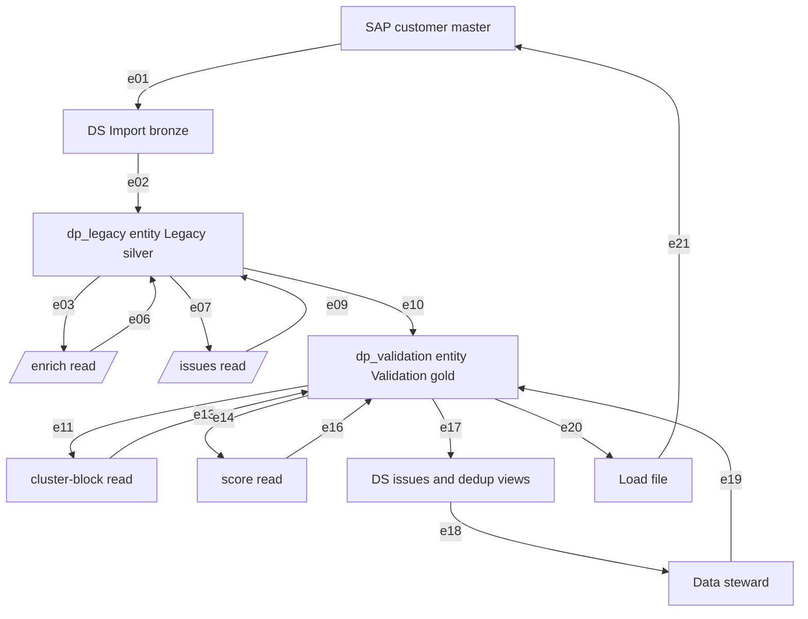
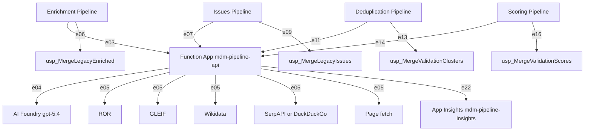
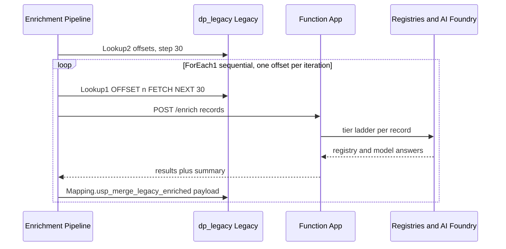
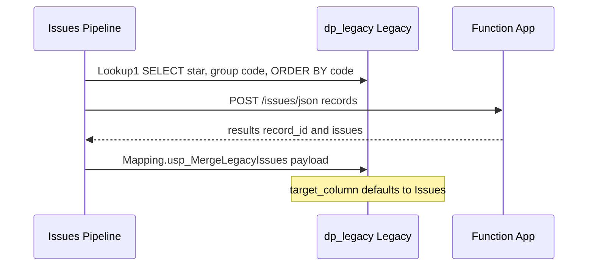
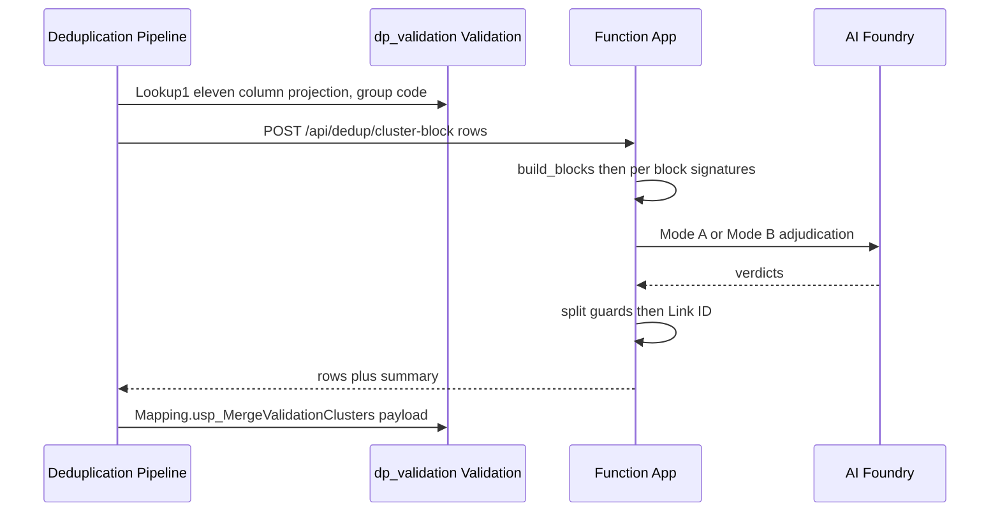
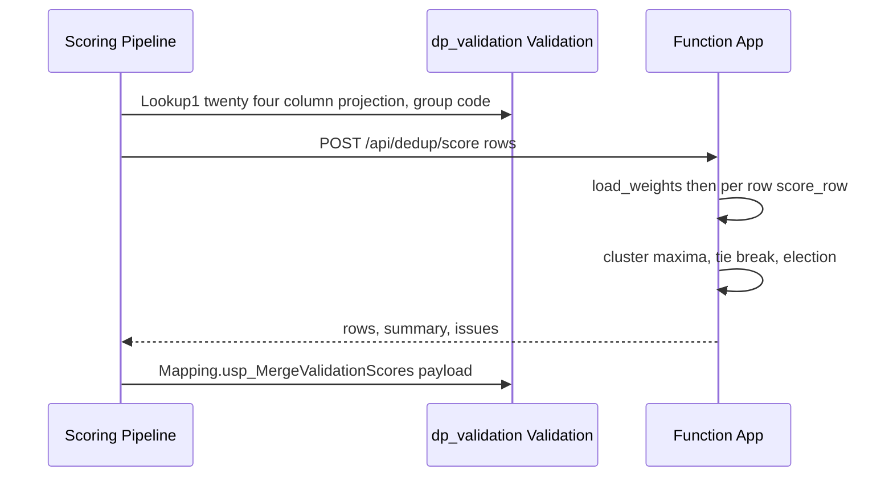
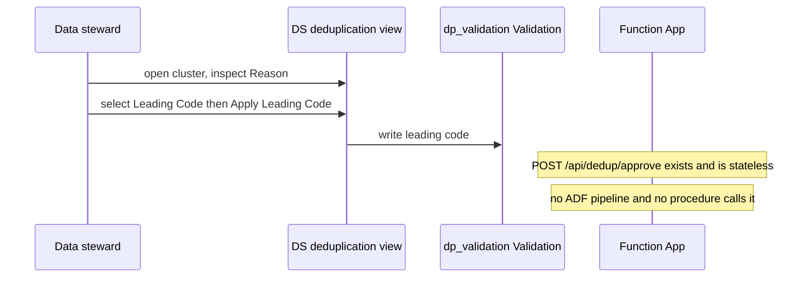

Generated: 2026-09-07 · Commit: 86d173b8a4d715a619b0a2656986c145da7fa81e · Branch: feature/llm-fixes · Pass: 02

# Pass 02 — Architecture

Tree state: `git status --porcelain` reports two modified paths,
`docs/thesis/00_INVENTORY.md` and `docs/thesis/01_TRACEABILITY.md` — the outputs of this
documentation run written into `docs/thesis/`. `git diff --stat -- . ':!docs/thesis'` is
empty: no source, test, SQL, ADF or configuration file differs from
`86d173b8a4d715a619b0a2656986c145da7fa81e`. Every citation below is read at that commit.

## 2.0 Evidence classes used in this pass

Three systems in the architecture do not live in this repository: Azure Data Factory, the
Azure SQL Managed Instance, and DATAshaper. Their evidence is of three different kinds and is
labelled at every use.

| class | meaning | where it comes from |
|---|---|---|
| code | read from a file in this repository at this commit | `adf/*.json`, `sql/*.sql`, `api/`, `dedup/`, `enrichment/`, `config.py`, `host.json` |
| [OBSERVED] | recorded from the DATAshaper Studio interface on 2026-08-16, per that file's own provenance convention | `docs/thesis/CONTEXT-EXTERNAL.md:7–15` |
| [AUTHOR] | stated by the author, unconfirmed against the system | `docs/thesis/CONTEXT-EXTERNAL.md:12–13` |

The ADF sections below are built **from `adf/*.json` only**. `docs/thesis/CONTEXT-EXTERNAL.md`
also quotes ADF JSON, at §2 and §3; that quotation is an earlier export and disagrees with the
files at this commit on three points (§2.7, ⚠-24). Where they differ the file in `adf/` wins.

## 2.1 Component diagram

The two halves carry the same `eNN` edge labels. An edge that crosses the two planes appears
in both. §2.1.3 is the single evidence table for all of them.

### 2.1a Data plane



### 2.1b Processing plane



### 2.1c Edge evidence

| edge | from → to | evidence | class |
|---|---|---|---|
| e01 | SAP → DS Import | "Create group code; import preprocessed file into DATAshaper", `docs/thesis/CONTEXT-EXTERNAL.md:419`; the preprocessing script is not in the repository (`:418`, `:444`) | [AUTHOR] |
| e02 | Import → Legacy | "Import (bronze) → Legacy (silver) → Validation (gold) → load file", `docs/thesis/CONTEXT-EXTERNAL.md:343`; DS tasks `LegacyMapping`, `MigrateData` (`:31–32`, `:352`) | [OBSERVED] |
| e03 | Legacy → `/enrich` | `adf/enrichment_pipeline.json:21` (offset driver) and `:68` (page read), both `FROM dp_legacy.[@{pipeline().parameters.chrEntity}].Legacy`; posted at `:105` | code |
| e04 | Function App → AI Foundry | `AZURE_OPENAI_ENDPOINT` / `AZURE_OPENAI_DEPLOYMENT` (`config.py:96–97`, `:214–215`); dedup override `AOAI_DEPLOYMENT_DEDUP` (`.env.example:28`) | code |
| e05 | Function App → external APIs | `ROR_API_BASE` `config.py:102`, `GLEIF_API_BASE` `config.py:105`, `WIKIDATA_API_BASE` `config.py:152`, SerpAPI/DuckDuckGo selection `config.py:195–202`, page fetch `search/page_fetcher.py:1` | code |
| e06 | `/enrich` → Legacy | `adf/enrichment_pipeline.json:136` calls `Mapping.usp_merge_legacy_enriched`; the procedure merges into `dp_legacy.[<entity>].Legacy` (`sql/usp_merge_legacy_enriched.sql:29`, `:86`) | code |
| e07 | Legacy → `/issues/json` | `adf/issues_pipeline.json:20`, posted at `:58` | code |
| e09 | `/issues/json` → Legacy | `adf/issues_pipeline.json:89` calls `Mapping.usp_MergeLegacyIssues`; merge target `dp_legacy.[<entity>].Legacy` (`sql/usp_merge_legacy_issues.sql:38`, `:66`) | code |
| e10 | Legacy → Validation | DS task `ProcessValidation`, `docs/thesis/CONTEXT-EXTERNAL.md:32`, `:352`; mapping configured separately for Legacy→Validation (`:343–345`) | [OBSERVED] |
| e11 | Validation → `/api/dedup/cluster-block` | `adf/deduplication_pipeline.json:21`, posted at `:58` | code |
| e13 | cluster response → Validation | `adf/deduplication_pipeline.json:89` calls `Mapping.usp_MergeValidationClusters`; merge target `dp_validation.[<entity>].Validation` (`sql/usp_merge_validation_clusters.sql:8`, `:33`, `:59`) | code |
| e14 | Validation → `/api/dedup/score` | `adf/scoring_pipeline.json:21`, posted at `:58` | code |
| e16 | score response → Validation | `adf/scoring_pipeline.json:89` calls `Mapping.usp_MergeValidationScores`; merge target `dp_validation.[<entity>].Validation` (`sql/usp_merge_validation_scores.sql:8`, `:33`, `:59`) | code |
| e17 | Validation → DS views | Issues view `docs/thesis/CONTEXT-EXTERNAL.md:362–385`; deduplication view `:387–401`; rules configured against the Validation table alias `W` (`:356`) | [OBSERVED] |
| e18 | DS views → steward | "Review issues in the DS issues view; assign to a data steward" (`docs/thesis/CONTEXT-EXTERNAL.md:426`); "Review clusters in the DS deduplication view" (`:428`) | [AUTHOR] |
| e19 | steward → Validation | `Leading Code` selector, `Assign for`, `Apply Leading Code` action (`docs/thesis/CONTEXT-EXTERNAL.md:395–398`). No ADF pipeline and no repository code performs this write; `POST /api/dedup/approve` (`api/routes.py:1488`) is stateless and persists nothing (`api/routes.py:1494–1495`) | [OBSERVED] + code |
| e20 | Validation → load file | `docs/thesis/CONTEXT-EXTERNAL.md:343` | [OBSERVED] |
| e21 | load file → SAP | `docs/thesis/CONTEXT-EXTERNAL.md:343` names the load file as the terminus; the SAP load itself is not evidenced in this repository | ⚠ UNVERIFIED |
| e22 | Function App → App Insights | `host.json:3–9` enables Application Insights with `samplingSettings.isEnabled: true` and `excludedTypes: "Request"`; instance named `mdm-pipeline-insights` at `README.md:3430` | code |

Edges e08, e12 and e15 are not used: the Web activity and its Lookup are one hop in this
model, already carried by e07, e11 and e14.

## 2.2 ADF orchestration, from JSON only

Four pipeline definitions are exported. No dataset, linked-service, trigger or integration-runtime
JSON is tracked (`git ls-files | grep -i 'dataset\|linkedservice\|trigger\|integrationruntime'`
returns nothing), so the objects the pipelines reference by name cannot be resolved here.

### 2.2.1 Shape common to all four

Every pipeline is `Lookup → WebActivity → SqlServerStoredProcedure`, chained on `Succeeded`.

| property | value | evidence |
|---|---|---|
| Parameters | `chrEntity` and `chrGroupCode`, both `{"type": "string"}` | `adf/deduplication_pipeline.json:106–113`, `adf/enrichment_pipeline.json:156–163`, `adf/issues_pipeline.json:106–113`, `adf/scoring_pipeline.json:106–113` |
| Activity policy | `timeout` `0.12:00:00`, `retry` **0**, `retryIntervalInSeconds` 30, `secureInput` false, `secureOutput` false | e.g. `adf/deduplication_pipeline.json:9–15`, `:44–50`, `:80–86` |
| Lookup source | `"type": "SqlMISource"`, `"partitionOption": "None"`, `"firstRowOnly": false` | e.g. `adf/deduplication_pipeline.json:18–30` |
| Web activity | `POST`, header `Content-Type: application/json`, `httpRequestTimeout` `00:10:00`, `connectVia` `AutoResolveIntegrationRuntime`, **no `authentication` block** | e.g. `adf/deduplication_pipeline.json:52–67` |
| Stored-proc parameter | exactly one, `payload`, type `String`, value `@string(activity('Web1').output)` | e.g. `adf/deduplication_pipeline.json:90–98` |

The parameter names are `chrEntity` and `chrGroupCode`, not `Entity` and `Groupcode`.

**Retry is 0 on every activity in every pipeline.** A Web activity that returns non-2xx, or
exceeds `httpRequestTimeout` of ten minutes, fails the pipeline; nothing is retried. The
`0.12:00:00` value is the activity `timeout`, which bounds the activity as a whole; the HTTP
call itself is bounded by the ten-minute `httpRequestTimeout`.

### 2.2.2 Group-code predicate — present in all four Lookups

The predicate is identical in every Lookup, quoted verbatim:

```
WHERE [code] LIKE '@{pipeline().parameters.chrGroupCode}\_%' ESCAPE '\'
```

| pipeline | Lookup | predicate present | file:line |
|---|---|---|---|
| Deduplication Pipeline | `Lookup1` | yes | `adf/deduplication_pipeline.json:21` |
| Enrichment Pipeline | `Lookup2` (offset driver) | yes | `adf/enrichment_pipeline.json:21` |
| Enrichment Pipeline | `Lookup1` (page read, in `ForEach1`) | yes | `adf/enrichment_pipeline.json:68` |
| Issues Pipeline | `Lookup1` | yes | `adf/issues_pipeline.json:21` |
| Scoring Pipeline | `Lookup1` | yes | `adf/scoring_pipeline.json:21` |

The predicate matches the record-code convention `<groupcode>_<sourcekey>`
(`sql/usp_merge_legacy_enriched.sql:26`; observed codes `TEST7_41000009`, `TEST10_42000001`,
`TEST10_44000003` at `docs/thesis/CONTEXT-EXTERNAL.md:34–35`), and is the same predicate the
merge procedures apply on the write side (§2.4).

### 2.2.3 Per pipeline

| pipeline | file | `lastPublishTime` | dataset | merge linked service | route |
|---|---|---|---|---|---|
| Deduplication Pipeline | `adf/deduplication_pipeline.json:2` | `2026-07-29T12:09:37Z` (`:115`) | `AzureSqlMITable3` (`:27`) | `ls_sqlmi_validation` (`:101`) | `/api/dedup/cluster-block` (`:58`) |
| Enrichment Pipeline | `adf/enrichment_pipeline.json:2` | `2026-09-06T16:49:32Z` (`:165`) | `AzureSqlMITable1` (`:27`, `:74`) | `ls_sqlmi_legacy` (`:148`) | `/enrich` (`:105`) |
| Issues Pipeline | `adf/issues_pipeline.json:2` | **absent** | `AzureSqlMITable1` (`:27`) | `ls_sqlmi_legacy` (`:101`) | `/issues/json` (`:58`) |
| Scoring Pipeline | `adf/scoring_pipeline.json:2` | `2026-07-31T18:27:48Z` (`:115`) | `AzureSqlMITable3` (`:27`) | `ls_sqlmi_validation` (`:101`) | `/api/dedup/score` (`:58`) |

`adf/issues_pipeline.json` carries no `lastPublishTime` key, while the other three do. On the
evidence in this repository the issues pipeline has been authored but not published to the
factory. See §2.7 (⚠-25).

**Request bodies.** Each Web activity wraps the Lookup output in one JSON key:

| pipeline | body expression | file:line |
|---|---|---|
| Enrichment | `@json(concat('{"records":', string(activity('Lookup1').output.value), '}'))` | `adf/enrichment_pipeline.json:111` |
| Issues | `@json(concat('{"records":', string(activity('Lookup1').output.value), '}'))` | `adf/issues_pipeline.json:64` |
| Deduplication | `@json(concat('{"rows":', string(activity('Lookup1').output.value), '}'))` | `adf/deduplication_pipeline.json:64` |
| Scoring | `@json(concat('{"rows":', string(activity('Lookup1').output.value), '}'))` | `adf/scoring_pipeline.json:64` |

These match the request models: `EnrichmentRequest.records` (`api/models.py:311`),
`IssueDetectionRequest.records` (`api/models.py:899`), `DedupRequest.rows`
(`dedup/models.py:74`), `ScoringRequest.rows` (`dedup/scoring.py:262`).

**ForEach batching — enrichment only.** `ForEach1` (`adf/enrichment_pipeline.json:34–35`)
iterates `@activity('Lookup2').output.value` (`:46–49`) with `"isSequential": true` (`:50`) and
**no `batchCount`**. `Lookup2` emits one row per 30-record offset:

```
SELECT (n.rn - 1) AS offset
FROM (
    SELECT ROW_NUMBER() OVER (ORDER BY (SELECT NULL)) AS rn
    FROM dp_legacy.[@{pipeline().parameters.chrEntity}].Legacy
    WHERE [code] LIKE '@{pipeline().parameters.chrGroupCode}\_%' ESCAPE '\'
) n
WHERE (n.rn - 1) % 30 = 0
```

and the inner `Lookup1` pages with `ORDER BY [code] OFFSET @{item().offset} ROWS FETCH NEXT 30
ROWS ONLY` (`adf/enrichment_pipeline.json:68`). The ordering column in `Lookup2` is
`ORDER BY (SELECT NULL)` while the page read orders by `[code]`; the two orderings are not the
same, but because the offsets are a fixed arithmetic series over a stable row count and only
the page read's ordering determines which rows land in a page, the partition is still a
disjoint cover of the group code. The other three pipelines have no `ForEach` and post their
whole Lookup result in one call.

The batch size 30 is set only in the ADF JSON. The service's own concurrency default is
separate: `EnrichmentOptions.max_concurrency` defaults to 5 (`api/routes.py:703` for the file
route) and bounds in-flight records inside one call
(`enrichment/orchestrator.py:4312`).

### 2.2.4 `Entity_BasicFlow`

⚠ NOT EXPORTED. No file in the repository defines it. `grep -rn 'Entity_BasicFlow' .` returns
hits only in the pass specifications (`docs/thesis-doc-prompt-v2.md:78`, `:270`). No exported
pipeline contains an `ExecutePipeline` activity — `grep -rn 'ExecutePipeline' adf/` returns
nothing — so at this commit no pipeline invokes another, and the order in which the four run
is not expressed anywhere in this repository. The production order is stated only by the
author (`docs/thesis/CONTEXT-EXTERNAL.md:412–432`).

### 2.2.5 Pipelines referenced but not exported

| pipeline | referenced by | status |
|---|---|---|
| `Entity_BasicFlow` | `docs/thesis-doc-prompt-v2.md:78`, `:270` | ⚠ NOT EXPORTED |
| Address validation / auto write-back above 80% confidence (workflow step 6) | `docs/thesis/CONTEXT-EXTERNAL.md:423`, open item `:442` | ⚠ NOT EXPORTED |
| Consolidation (`POST /api/preprocess/consolidate/file`, first step of the production sequence) | `README.md:3441` | ⚠ NOT EXPORTED |
| DS process invocations (`LegacyMapping`, `MigrateData`, `ProcessValidation`) as ADF stored-procedure activities | `docs/thesis/CONTEXT-EXTERNAL.md:349–352` | ⚠ NOT EXPORTED |
| Referenced ADF objects `AzureSqlMITable1`, `AzureSqlMITable3`, `ls_sqlmi_legacy`, `ls_sqlmi_validation`, `AutoResolveIntegrationRuntime` | the four pipelines above | ⚠ NOT EXPORTED |

## 2.3 Sequence diagrams

### 2.3.1 Enrichment run



Evidence: `adf/enrichment_pipeline.json:21` (offsets), `:46–49` and `:50` (ForEach,
sequential), `:68` (page read), `:105` and `:111` (POST and body), `:136` (merge back);
service side `api/routes.py:107` → `enrichment/orchestrator.py:4290`; merge
`sql/usp_merge_legacy_enriched.sql:86`. The merge runs **inside** the loop, once per 30-row
page, so a failure at page *k* leaves pages 1…*k*−1 already written.

### 2.3.2 Issues run — baseline and post-enrichment

Both runs are the same pipeline and the same endpoint. Nothing in the pipeline distinguishes
them: the Lookup is unconditioned on enrichment state
(`adf/issues_pipeline.json:21` reads every row of the group code), and `@target_column` is
never passed, so both write the same column.



**Is the baseline `/issues` run orchestrated by ADF or executed manually?**

On the evidence at this commit it is **not orchestrated by ADF, and no ADF path can produce a
baseline/post pair**. Three facts, each from a file:

1. An ADF pipeline for `/issues` exists (`adf/issues_pipeline.json`) but carries no
   `lastPublishTime`, unlike the other three (§2.2.3) — it has been authored, not published.
2. `usp_MergeLegacyIssues` admits two target columns, `N'Issues Before'` and `N'Issues'`
   (`sql/usp_merge_legacy_issues.sql:14`), and defaults to `N'Issues'` (`:5`). The pipeline
   passes only `payload` (`adf/issues_pipeline.json:90–99`), so every run writes `Issues`.
   A second run overwrites the first; the two counts cannot coexist in the table.
3. The pipeline reads the Legacy table (`adf/issues_pipeline.json:21`), which is populated by
   DS `LegacyMapping`/`MigrateData` — not the raw source file.

The before/after mechanism the repository actually implements is the file route
`POST /issues/compare` (`api/routes.py:917`), which takes two workbooks — `original` and
`enriched` (`:918–919`) — audits both (`:932–933`) and returns a delta report (`:943`). No
ADF pipeline calls it (`grep -rn 'issues/compare' adf/` returns nothing), and it is a
multipart file endpoint, so it is driven by a person with two files. That matches the
author's own note that the baseline path "may also be run standalone against the raw file"
and that "⚠ Whether that path is in ADF or manual is unconfirmed"
(`docs/thesis/CONTEXT-EXTERNAL.md:431–432`). It is manual. See §2.7 (⚠-26).

### 2.3.3 Deduplication cluster run



Evidence: `adf/deduplication_pipeline.json:21`, `:58`, `:64`, `:89`; service side
`api/routes.py:1331` → `dedup/adjudicator.py:1450`, blocks `dedup/signatures.py:260`, modes
`dedup/adjudicator.py:1349`/`:1352`, guards `:1375`/`:1379`, `Link ID`
`dedup/adjudicator.py:1518–1523`; merge `sql/usp_merge_validation_clusters.sql:59`.

The projection the Lookup sends is eleven columns (`adf/deduplication_pipeline.json:21`);
`DedupRow` is the request model (`dedup/models.py:74`).

### 2.3.4 Scoring run



Evidence: `adf/scoring_pipeline.json:21`, `:58`, `:64`, `:89`; service side
`api/routes.py:1438` → `dedup/scoring.py:1151`, weights `dedup/scoring.py:1173` over
`dedup/weights.json`, election `dedup/scoring.py:1231`, `:1243`; merge
`sql/usp_merge_validation_scores.sql:59`. No LLM call is made (`api/routes.py:1444`).

The response also carries `issues` — `DedupIssue` values from `dedup/scoring.py:485`,
returned at `api/routes.py:1475`. `usp_MergeValidationScores` parses `$.rows` only
(`sql/usp_merge_validation_scores.sql:49`) and never reads `$.issues`, so the scoring
diagnostics are computed and discarded at the write-back boundary. See §2.7 (⚠-28).

### 2.3.5 Steward approval



Evidence: the DS side is [OBSERVED] — `docs/thesis/CONTEXT-EXTERNAL.md:395–398`. The service
side is code: `POST /api/dedup/approve` (`api/routes.py:1488`) applies the decision to rows
supplied in the request and echoes them back; "Persistence is intentionally out of scope — a
durable approval store is a future step" (`api/routes.py:1494–1495`). No `adf/*.json` names
the route (`grep -rn 'dedup/approve' adf/` returns nothing). `usp_MergeValidationScores`
does write `approval_status` (`sql/usp_merge_validation_scores.sql:59`), so a column exists
for the outcome, but no exported orchestration reaches it through the endpoint. See §2.7
(⚠-27).

## 2.4 Merge-back procedures

All four share one shape: two guards, an `OPENJSON … WITH` parse into `#src`, one dynamic
`MERGE` executed through `sp_executesql`, then `DROP TABLE #src`. `WHEN MATCHED` only — no
`WHEN NOT MATCHED` clause exists in any of the four, so a merge never inserts a row.

| procedure | target table | key match | columns written | file:line |
|---|---|---|---|---|
| `usp_MergeLegacyEnriched` | `N'dp_legacy.' + QUOTENAME(@chrEntity) + N'.Legacy'` (`:29`) | `tgt.Customer = src.Customer` | 31 | `sql/usp_merge_legacy_enriched.sql:86` |
| `usp_MergeLegacyIssues` | `N'dp_legacy.' + QUOTENAME(@chrEntity) + N'.Legacy'` (`:38`) | `tgt.[Customer] = src.[record_id]` | 1, named by `QUOTENAME(@target_column)` | `sql/usp_merge_legacy_issues.sql:66` |
| `usp_MergeValidationClusters` | `QUOTENAME(@db) + N'.' + QUOTENAME(@chrEntity) + N'.Validation'`, `@db = N'dp_validation'` (`:8`, `:33`) | `tgt.Customer = src.row_id` | 6 | `sql/usp_merge_validation_clusters.sql:59` |
| `usp_MergeValidationScores` | `QUOTENAME(@db) + N'.' + QUOTENAME(@chrEntity) + N'.Validation'`, `@db = N'dp_validation'` (`:8`, `:33`) | `tgt.Customer = src.Customer` | 21 | `sql/usp_merge_validation_scores.sql:59` |

### 2.4.1 Group-code guard

Identical in all four. The pattern is built once and applied twice — as a pre-flight count and
inside the `MERGE` join:

```
DECLARE @pat NVARCHAR(60) = LTRIM(RTRIM(@chrGroupCode)) + N'\_%';
DECLARE @esc NCHAR(1) = N'\';
```

(`sql/usp_merge_legacy_enriched.sql:27–28`, `sql/usp_merge_legacy_issues.sql:36–37`,
`sql/usp_merge_validation_clusters.sql:31–32`, `sql/usp_merge_validation_scores.sql:31–32`.)

Inside the dynamic `MERGE`, quoted from `sql/usp_merge_legacy_enriched.sql:86`:

```
ON tgt.Customer = src.Customer
AND tgt.[code] LIKE @pat ESCAPE @esc
```

The `\` escape makes the `_` literal, so `TEST8\_%` matches `TEST8_41000009` and not
`TEST81000009`. The guard is therefore a genuine prefix test on the group code, not a
substring test.

Two guards precede it in every procedure:

| guard | test | error | file:line (enriched) |
|---|---|---|---|
| Guard 1 | entity exists as a schema | `THROW 50001` | `sql/usp_merge_legacy_enriched.sql:13–17` |
| Guard 2a | group code non-blank | `THROW 50002` | `:22–25` |
| Guard 2b | group code has ≥1 row in the target | `THROW 50003` | `:31–37` |

`usp_MergeLegacyIssues` adds Guard 0 — `@target_column` must be `N'Issues Before'` or
`N'Issues'`, else `THROW 50000` (`sql/usp_merge_legacy_issues.sql:14–17`). The two Validation
procedures reach Guard 1 through dynamic SQL because the database is a variable
(`sql/usp_merge_validation_clusters.sql:15–17`), where the two Legacy procedures test
`dp_legacy.sys.schemas` directly (`sql/usp_merge_legacy_enriched.sql:13`).

`THROW` is used throughout; `RAISERROR` appears nowhere in `sql/`.

### 2.4.2 Dynamic-SQL pattern

The same discipline in all four: **identifiers are spliced, values are parameterised.**

- Spliced into the statement text: `@tgt` only — the database, schema and table, built with
  `QUOTENAME` on the caller-supplied entity (`sql/usp_merge_legacy_enriched.sql:29`), plus
  `QUOTENAME(@target_column)` in the issues procedure
  (`sql/usp_merge_legacy_issues.sql:66`), which Guard 0 has already restricted to two literals.
- Passed as parameters to `sp_executesql`, never concatenated: `@pat` and `@esc`
  (`sql/usp_merge_legacy_enriched.sql:87`), and `@c`/`@x` as `OUTPUT` in the pre-flight counts
  (`:32`).
- `@payload` is never spliced. It is read by `OPENJSON` in **static** SQL
  (`sql/usp_merge_legacy_enriched.sql:45`), before any dynamic text is built.
- `SPACE(0)` stands in for a quoted empty string so the dynamic text carries no nested quotes
  — stated at `sql/usp_merge_legacy_enriched.sql:83–84`.

### 2.4.3 Blank-handling asymmetry in the enrichment merge

26 of the 31 columns use `COALESCE(NULLIF(LTRIM(RTRIM(src.[col])), SPACE(0)), tgt.[col])` — a
blank or whitespace-only enriched value leaves the target unchanged. Five do not, and
overwrite unconditionally:

| column | assignment | effect |
|---|---|---|
| `[Record Type]` | `LTRIM(RTRIM(src.[Record Type]))` | a blank clears the target |
| `[ROR ID]` | `LTRIM(RTRIM(src.[ROR ID]))` | a blank clears the target |
| `[LEI ID]` | `LTRIM(RTRIM(src.[LEI ID]))` | a blank clears the target |
| `[Flag for Review]` | `src.[Flag for Review]` | direct |
| `[Flag Reason]` | `src.[Flag Reason]` | direct |

All five at `sql/usp_merge_legacy_enriched.sql:86`. The asymmetry is deliberate for the two
flag columns — a run that clears a flag must be able to clear it — and is a behaviour worth
stating for the three identity columns: a record that resolved on run 1 and missed on run 2
loses its stored `ROR ID`. See §2.7 (⚠-29).

## 2.5 Write-back coverage against the API contract

The response models and the `OPENJSON` paths agree everywhere they overlap. Every one of the
32 JSON paths in `usp_MergeLegacyEnriched` is a declared response column: comparing the
`N'$."…"'` paths in `sql/usp_merge_legacy_enriched.sql:47–78` against `RESPONSE_COLUMNS`
(`api/output_columns.py`) leaves no unmatched path. `ScoringResultRow` serialises under the
same aliases the scores procedure reads — `Customer`, `score_final`, `Company_Code_Count` …
(`dedup/scoring.py:302–312` against `sql/usp_merge_validation_scores.sql:51–72`) — and
`DedupResultRow` field names match the clusters procedure's paths
(`dedup/models.py:74` block against `sql/usp_merge_validation_clusters.sql:51–57`).

The gap is in the other direction: **37 of the 69 response columns are never merged back.**

| group | columns not written back |
|---|---|
| Provenance (Scheme B) | `Name 1 Provenance`, `Name 2 Provenance`, `Domain Provenance`, `Record Type Provenance`, `ROR ID Provenance`, `LEI ID Provenance` |
| Flags | `Flag Codes`, `Flagged Fields` |
| Page-read outputs | `Operating Name`, `Operating Name Provenance` |
| Steward-facing | `Suggested Name`, `Suggestion Source` |
| Name block | `Name 5` |
| Diagnostics | `Error` |
| Pass-through SAP columns | 24 further columns, including `Country/Region Key`, `Postal Code`, `City`, `Region`, `Tax Jurisdiction` |

The pass-through columns are unproblematic — the pipeline echoes them unchanged, so not
writing them back is correct. Two of the others are architecturally load-bearing:

- **`Flag Codes` is the input to six issue codes.** `FLAG_CODE_ISSUES`
  (`enrichment/issue_detection.py:1515–1559`) maps 13 flag tokens onto 7 codes, three of which
  (`G3-NAME-006`, `G6-CONFIRM-001`, `G7-UNCHANGED-001`) have no content detector at all and can
  be raised only from that column. The Issues Pipeline reads the Legacy table
  (`adf/issues_pipeline.json:21`), the enrichment merge never writes `Flag Codes`
  (`sql/usp_merge_legacy_enriched.sql:47–78`), and `/issues/json` reads the columns the request
  carries (`api/routes.py:781`, `:784`). A post-enrichment issues run driven by ADF therefore
  cannot raise those three codes. See §2.7 (⚠-30).
- **`Operating Name` and `Operating Name Provenance`** are known-pending by the author:
  "the write-back side is not, and is deliberately left to Bernd/Bert", with the four steps
  listed (`README.md:3466–3476`). This pass confirms the state from code rather than from the
  note.

`link_id` is a third case, on the Validation side: `DedupResultRow.link_id`
(`dedup/models.py` block at `:74`, field declared with the "Same ORGANISATION, not the same
record" comment) is produced per row by `dedup/adjudicator.py:1518–1525`, and
`usp_MergeValidationClusters` parses `row_id, block_id, cluster_id, routing, signature_id,
confidence, reasoning` (`sql/usp_merge_validation_clusters.sql:51–57`) — `link_id` is not
among them. See §2.7 (⚠-31).

## 2.6 Security posture at this commit

Facts only; no assessment.

| aspect | state | evidence |
|---|---|---|
| Function App HTTP auth | `AuthLevel.ANONYMOUS` on the single catch-all binding | `function_app.py:12`, route `:15` |
| Caller authentication | The four Web activities send no credential: header block is `Content-Type` only and there is no `authentication` property on any of them | `adf/deduplication_pipeline.json:54–56`, `adf/enrichment_pipeline.json:101–103`, `adf/issues_pipeline.json:54–56`, `adf/scoring_pipeline.json:54–56` |
| Route-level auth | None. No dependency, middleware or decorator performs authentication or authorisation; the only middleware is `RequestLoggingMiddleware` (`api/app.py:28`), which logs and times | `api/middleware.py:18–21`; `api/routes.py` declares no `Security`/`Depends` auth |
| Transport | ADF calls the public endpoint over HTTPS | `https://mdm-pipeline-api.azurewebsites.net/…` in all four `adf/*.json`; "reached from ADF over the public endpoint" `docs/thesis/CONTEXT-EXTERNAL.md:405–408` [AUTHOR] |
| Outbound TLS trust | `SSL_CERT_FILE` and `REQUESTS_CA_BUNDLE` are overwritten at import when they point at a non-existent path, preferring `AZURE_OPENAI_CA_BUNDLE` when it is a real file and `certifi.where()` otherwise | `config.py:27–64`, invoked `config.py:67` |
| Model and API keys | Read from environment only; no key is committed. `.env.example` carries placeholders (`AZURE_OPENAI_API_KEY=your-azure-key-here` `.env.example:2`, `SERPAPI_KEY=your-serpapi-key-here` `:56`). In production they arrive as Azure Application Settings, not a `.env` file | `config.py:213–218`; `README.md:3430` |
| Startup validation | `validate_env()` warns and does not raise, so the app starts without `AZURE_OPENAI_API_KEY` and fails at call time | `config.py:180–193`, `REQUIRED_VARS` `config.py:95–98`, called `api/app.py:15` |
| Key exposure through the API | `/diag/llm` returns the endpoint, the deployment name, whether a key is set and its **length** (`api/routes.py:1584–1589`); `/diag/dedup-llm` returns the endpoint, the dedup deployment, the API version, the reasoning effort and whether a key is set (`:1617–1623`). `/diag/llm` also returns the exception type and message on failure (`:1600–1605`); `/diag/dedup-llm` returns the adjudicator's own `error` field and the API version in use (`:1632–1639`). Both are `GET` with no auth | `api/routes.py:1576`, `:1608` |
| Secure input/output in ADF | `secureInput: false` and `secureOutput: false` on every activity, so payloads and responses appear in ADF run history | e.g. `adf/deduplication_pipeline.json:13–14`, `:48–49`, `:84–85` |
| SQL injection surface | Identifiers spliced through `QUOTENAME`; values parameterised through `sp_executesql`; `@payload` never spliced (§2.4.2) | `sql/usp_merge_legacy_enriched.sql:29`, `:87`, `:45` |
| Telemetry | Application Insights enabled in `host.json` with request sampling excluded; structured logs carry `request_id`, method, path, status, duration | `host.json:3–9`; `api/middleware.py:22–35` |
| Network approvals, firewall rules, private endpoints, managed identity | ⚠ UNVERIFIED — no file in the repository records any of these. `grep -n -i 'firewall\|private endpoint\|vnet\|managed identity' README.md` returns nothing relevant, and no linked-service or networking JSON is tracked | — |

## 2.7 Discrepancies raised in this pass

**Numbering note.** Pass 00 at this commit raises ⚠-1 … ⚠-14. Pass 01 was generated at an
earlier commit and numbers its own items ⚠-13 … ⚠-23, so ⚠-13 and ⚠-14 currently name two
different things across the set (recorded in the closing note of `01_TRACEABILITY.md`). This
pass continues from Pass 01's highest, ⚠-23, and does not reuse anything below ⚠-24. Pass 08
must renumber the whole set.

| id | severity | statement | code side | other side |
|---|---|---|---|---|
| ⚠-24 | medium | `docs/thesis/CONTEXT-EXTERNAL.md` quotes ADF JSON that the files at this commit contradict on three points. | `adf/deduplication_pipeline.json:21` is parameterised on `chrEntity` and carries the group-code predicate; `adf/deduplication_pipeline.json:89` names `Mapping.usp_MergeValidationClusters`; `adf/enrichment_pipeline.json:21`, `:68` batch in 30s | `docs/thesis/CONTEXT-EXTERNAL.md:226` quotes `FROM test_77.Validation` — hard-coded entity, no predicate; `:281` quotes `dbo.usp_merge_validation_clusters`; `:188` states "50-row offsets". The exported files supersede the quotation; the external document has not been re-observed since 2026-08-16 (`:15`). |
| ⚠-25 | medium | Three pipelines carry a `lastPublishTime` and the issues pipeline does not. | `adf/deduplication_pipeline.json:115`, `adf/enrichment_pipeline.json:165`, `adf/scoring_pipeline.json:115` | `adf/issues_pipeline.json` has no such key. On repository evidence the issues pipeline is authored but unpublished, so the `/issues` leg of the production workflow (`docs/thesis/CONTEXT-EXTERNAL.md:424`, marked "ADF ⚠ pipeline not exported") is exported but not demonstrably live. ⚠ UNVERIFIED against the factory. |
| ⚠-26 | high | No ADF path can produce a before/after issue pair, so the reduction metric the evaluation rests on has no orchestrated source. | `usp_MergeLegacyIssues` defaults `@target_column` to `N'Issues'` (`sql/usp_merge_legacy_issues.sql:5`) and the pipeline passes only `payload` (`adf/issues_pipeline.json:90–99`), so a second run overwrites the first. `POST /issues/compare` (`api/routes.py:917`) is the only before/after mechanism and is a two-file multipart endpoint no pipeline calls | `docs/thesis/CONTEXT-EXTERNAL.md:431–432`: "`/issues` may also be run standalone against the raw file … ⚠ Whether that path is in ADF or manual is unconfirmed." This pass answers: manual. |
| ⚠-27 | medium | The steward approval step has no orchestrated write-back path. | `POST /api/dedup/approve` (`api/routes.py:1488`) is stateless — "Persistence is intentionally out of scope" (`:1494–1495`) — and no `adf/*.json` names the route | `usp_MergeValidationScores` writes `approval_status` (`sql/usp_merge_validation_scores.sql:59`), so the target column exists. The approval observed in DS Studio (`docs/thesis/CONTEXT-EXTERNAL.md:395–398`) is a DATAshaper action, not a call to this endpoint. The two approval mechanisms are unconnected. |
| ⚠-28 | medium | Scoring diagnostics are computed and discarded at the write-back boundary. | `/api/dedup/score` returns `issues` — `DedupIssue` values from `dedup/scoring.py:485`, attached at `api/routes.py:1475` | `usp_MergeValidationScores` parses `$.rows` only (`sql/usp_merge_validation_scores.sql:49`); no path reads `$.issues` and no column receives them. |
| ⚠-29 | medium | Three identity columns are overwritten unconditionally by the enrichment merge, so a run that fails to resolve clears a value an earlier run established. | `sql/usp_merge_legacy_enriched.sql:86`: `tgt.[Record Type] = LTRIM(RTRIM(src.[Record Type]))`, `tgt.[ROR ID] = LTRIM(RTRIM(src.[ROR ID]))`, `tgt.[LEI ID] = LTRIM(RTRIM(src.[LEI ID]))` | The other 26 value columns in the same statement use `COALESCE(NULLIF(…), tgt.[col])` and preserve the incumbent on a blank. The asymmetry is not stated in any comment; the only comment on the statement concerns `SPACE(0)` (`:83–84`). |
| ⚠-30 | high | `Flag Codes` is never written back, and three issue codes can be raised from nothing else. | `sql/usp_merge_legacy_enriched.sql:47–78` lists 32 `OPENJSON` paths; `Flag Codes` is not among them. `FLAG_CODE_ISSUES` (`enrichment/issue_detection.py:1515–1559`) is the only route to `G3-NAME-006`, `G6-CONFIRM-001` and `G7-UNCHANGED-001` | `api/output_columns.py` declares `Flag Codes` as a response column, and `api/routes.py:784` passes it to `detect_issues` when the request carries it. An ADF-driven post-enrichment issues run reads Legacy (`adf/issues_pipeline.json:21`), which never received the column, so those three codes cannot fire on that path. They can fire on the file path, where the enriched workbook still carries the column. |
| ⚠-31 | medium | `link_id` has no write-back path. | `DedupResultRow.link_id` is produced for every row (`dedup/adjudicator.py:1518–1525`) and serialised by the response model (`dedup/models.py:74` block) | `usp_MergeValidationClusters` parses seven fields (`sql/usp_merge_validation_clusters.sql:51–57`) and `link_id` is not one; the `MERGE` writes six columns (`:59`) and none is a link. The "same organisation, not the same record" outcome the field exists to express is dropped at the boundary. |
| ⚠-32 | low | Every ADF activity has `retry: 0`, so a single transient HTTP failure fails the run. | `retry` is `0` and `retryIntervalInSeconds` is `30` on all thirteen policy-carrying activities across the four pipelines (`ForEach1` carries none) (e.g. `adf/deduplication_pipeline.json:11–12`) | The enrichment pipeline merges inside its `ForEach` (`adf/enrichment_pipeline.json:136`), so a failure part-way leaves earlier pages committed and later pages not — a partially written group code with no compensating action. |
| ⚠-33 | low | The two enrichment Lookups order by different keys. | `Lookup2` counts rows with `ROW_NUMBER() OVER (ORDER BY (SELECT NULL))` (`adf/enrichment_pipeline.json:21`); `Lookup1` pages with `ORDER BY [code]` (`:68`) | The offsets are a fixed arithmetic series and only the page read's ordering assigns rows to pages, so the cover stays disjoint. Recorded because the two orderings read as if they were meant to agree. |
| ⚠-34 | low | The referenced ADF datasets, linked services and integration runtime are not exported, so the database each pipeline actually reads cannot be resolved from this repository. | `AzureSqlMITable1` (`adf/enrichment_pipeline.json:27`), `AzureSqlMITable3` (`adf/deduplication_pipeline.json:27`), `ls_sqlmi_legacy` (`adf/issues_pipeline.json:101`), `ls_sqlmi_validation` (`adf/deduplication_pipeline.json:101`), `AutoResolveIntegrationRuntime` (`:60`) | None is tracked. This is what leaves ⚠-12 (Pass 00) unresolvable here: the Validation-side Lookups carry no database prefix, and the default comes from the unexported linked service. |

Eleven items, ⚠-24 … ⚠-34, carried to `08_GAPS.md` in Pass 08.

---

**Pass 02 summary.** Recorded the architecture as two planes over 21 shared edges, each with
its evidence class; read all four exported ADF pipelines from JSON alone — one shape
(`Lookup → Web → stored procedure`), both parameters on all four, the group-code predicate
present and quoted in all five Lookups, `retry: 0` throughout, and 30-row sequential batching
in the enrichment pipeline only; found `Entity_BasicFlow` and four further pipelines
⚠ NOT EXPORTED and no `ExecutePipeline` activity anywhere, so no run order is expressed in the
repository; drew five sequence diagrams and answered the baseline `/issues` question — it is
manual, because the one exported issues pipeline always writes the same column and the only
before/after mechanism is the two-file `POST /issues/compare`; documented all four merge
procedures down to the quoted group-code guard and the identifier-spliced,
value-parameterised dynamic-SQL pattern; established that the write-back is lossy in three
load-bearing places (`Flag Codes`, `link_id`, scoring `issues`); and recorded the security
posture as anonymous auth end to end with unauthenticated diagnostic endpoints that disclose
deployment names and key length. Eleven ⚠ items raised (⚠-24 … ⚠-34).
