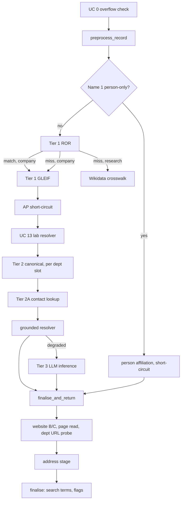

Generated: 2026-09-07 · Commit: 86d173b8a4d715a619b0a2656986c145da7fa81e · Branch: feature/llm-fixes · Pass: 03

# Pass 03 — Algorithms

## 3.0 Method, scope and conventions

This pass states, per stage, the procedure the code executes and one worked example
taken from a file in this repository. Pseudocode is a transcription of the cited
code, not a paraphrase of a design intent: every branch shown has a `file:line`
behind it, and every constant is copied verbatim.

**Tree state.** `git status --porcelain` at the time of writing reports three
modified files, all of them outputs of Passes 00–02 in this same regeneration
(`docs/thesis/00_INVENTORY.md`, `01_TRACEABILITY.md`, `02_ARCHITECTURE.md`), each
already carrying the header commit above. No source file is modified.

**Fixtures cited.** Worked examples are taken from `data/eval/S{1..5}_pre.xlsx`
(pre-enrichment SAP extract, 100 data rows each) and the matching
`data/eval/S{n}_post.xlsx` (the enriched export, 100 rows each);
`data/eval/dedup_STRESS_200_v1_enriched_dedup.xlsx` (200 rows through clustering); and
`data/eval/stress_200_scored.xlsx` (183 rows through clustering and scoring). Row counts
read with `openpyxl` (`max_row - 1`). Values are quoted from those files as they stand;
no run was executed for this pass.

**Reading conventions.**

| Notation | Meaning |
|---|---|
| `NAME_SLOTS` | `("name1" … "name5")` — `utils/name_slots.py:38-40`, count 5 at `:35` |
| `DEPT_SLOTS` | `NAME_SLOTS[1:]` — every slot below Name 1, `utils/name_slots.py:53` |
| `STREET_SLOTS` | `("street1" … "street5")` — `enrichment/preprocess.py:64-67` |
| "the gate" | `enrichment.name_gate.evaluate` — the single write gate for Name 1 / Name 2 candidates, `enrichment/name_gate.py:171-313` |
| "short-circuit" | a `return await self._finalise_and_return(...)` from inside `_enrich_single` |

**Two phases.** Phase 1 is per-record enrichment
(`Orchestrator._enrich_single`, `enrichment/orchestrator.py:7719-9273`) followed by
one batch pass (`enrichment/batch_consensus.py:611`). Phase 2 is entity resolution
over already-enriched rows: clustering (`dedup/adjudicator.py:1450`) then scoring
(`dedup/scoring.py:1151`). The two phases share no state other than the columns
written to the Validation table.

---

## 3.1 Phase 1 stage order

The order below is the execution order inside `_enrich_single`
(`enrichment/orchestrator.py:7719-9273`) and `_finalise_and_return`
(`:7067-7124`). Every numbered step is a section of this pass.



Legend — every node is a call site in `enrichment/orchestrator.py` unless noted:

1. `run_overflow_check_block` — `:7745-7749`, defined `enrichment/overflow_check.py:154`
2. `preprocess_record` — `:7795-7810`, defined `enrichment/preprocess.py:1810`
3. person-only test — `:8043-8052`; `_resolve_person_affiliation` — `:5163`
4. `self._ror_client.call` — `:8103-8111`; `call_ror` — `enrichment/tier1_ror.py:891`
5. `self._run_lei_lookup` — `:8265`, `:8409`; `call_lei` — `enrichment/tier1_lei.py:564`
6. `self._wikidata_crosswalk` — `:8349`, `:8419-8423`
7. AP short-circuit — `:8607-8624`
8. `run_lab_resolver` — `:8642-8652`, defined `enrichment/lab_resolver.py:1`
9. `run_tier2_canonical` — `:8862-8867`, defined `enrichment/tier2_canonical.py:179`
10. `run_tier2a` — `:9042-9055`, defined `enrichment/tier2a_contact.py:74`
11. `run_grounded_resolver` — `:9141-9163`, defined `enrichment/grounded_resolver.py:527`
12. `run_tier3` — `:9182-9195`, defined `enrichment/tier3_llm.py:74`
13. `_finalise_and_return` — `:7067`
14. `finalise` — `:2430`

There are eleven return points out of `_enrich_single` and all of them pass through
`_finalise_and_return` (`enrichment/orchestrator.py:7067-7124`), which is the reason
the fall-through lanes (`_grounded_fallthrough` `:6984`, `_dept_fallthrough` `:6827`)
are placed there rather than on the main exit.

---

## 3.2 Name 1 overflow — UC 0

A single organisation name longer than one SAP name column arrives cut across two
adjacent columns. UC 0 detects the cut and repairs it; it does not report it.

### 3.2.1 Detection

`run_overflow_check_block` (`enrichment/overflow_check.py:154-189`) walks every
adjacent pair in `ADJACENT_NAME_PAIRS` — `(name1,name2), (name2,name3), (name3,name4),
(name4,name5)`, built at `utils/name_slots.py:60-62` — upper slot first.

```
for (upper, lower) in ADJACENT_NAME_PAIRS:                  # overflow_check.py:168
    if blank(names[upper]) or blank(names[lower]): continue  # :171-174
    if _norm(names[upper]) == _norm(names[lower]): continue  # :175  (duplicate, not a split)
    outcome = run_overflow_check(upper_val, lower_val, upper, lower)   # :178-185
    if outcome.is_overflow: block.overflows.append(outcome)  # :186-187
```

`_norm` is `re.sub(r"\s+", " ", value.strip()).lower()` (`:98-99`).

`run_overflow_check` (`:102-151`) makes one LLM call per pair and accepts the verdict
only at `high` or `medium`:

```
extraction = llm.extract_json(OVERFLOW_CHECK_SYSTEM_PROMPT, user_prompt)   # :124-126
                                          # on exception: return no-overflow  :127-129
is_overflow = bool(extraction["is_overflow"])                              # :131
confidence  = (extraction["confidence"] or "low").lower()                  # :132
if is_overflow and confidence in ("high", "medium"):                       # :137
    result.is_overflow = True; result.fields = (upper_slot, lower_slot)    # :138-141
```

`low` is discarded at `:137`; the comment at `:135-136` states the rule as accepting
false negatives. `OverflowBlockResult.confidence` reports the strongest verdict across
the pairs, ranked by `_CONFIDENCE_RANK = {"none":0,"low":1,"medium":2,"high":3}`
(`:40`, `:64-71`).

### 3.2.2 Repair

On any overflow the orchestrator merges before enrichment
(`enrichment/orchestrator.py:7750-7818`):

```
merged, merged_runs = merge_split_runs(block_names, overflow.pairs)   # :7751-7753
record = record.model_copy(update={field: merged[slot] ...})          # :7776-7783
result["_uc0_merged"] = {"runs": …, "names": dict(merged)}            # :7791-7794
result["name1_supplied"] = record.name1     # re-taken over the merge  :7805
result["use_cases_triggered"].append(0)                               # :7806-7807
```

`merge_split_runs` (`enrichment/name_repack.py:57-104`) builds runs of consecutive
populated slots joined by a reported pair, joins each run with a single space, and
packs the results leftward:

```
joined = {tuple(pair) for pair in pairs if len(pair) == 2}      # name_repack.py:76
for index, slot in enumerate(NAME_SLOTS):                       # :80
    if blank(names[slot]): close current run; continue          # :81-87  (a blank breaks a run)
    if current and (NAME_SLOTS[index-1], slot) in joined: current.append(slot)   # :88-89
    else: close current run; current = [slot]                   # :90-93
merged_values = [" ".join(_norm(names[s]) for s in run) for run in runs]         # :97-99
merged = {slot_i: merged_values[i] if i < len(...) else None}   # :100-103
```

Consecutive pairs therefore chain: a name spilled Name 1 → Name 2 → Name 3 is reported
as two pairs and merges into one value (`:62-65`).

After enrichment, only a merged record is re-cut. `_repack_merged_name_block`
(`enrichment/orchestrator.py:2301`) calls `repack_name_block`
(`enrichment/name_repack.py:138-166`), which chunks each settled value with
`chunk_name` (`:107-135`) at `NAME_FIELD_WIDTH = int(os.getenv("NAME_FIELD_WIDTH", "40"))`
(`:50`) and fills the block from Name 1 down. A chunk boundary retreats to the last
word boundary that fits (`:120-129`); a single token longer than the column is cut at
the column edge (`:130-132`). Pieces past the last slot are returned as `dropped`
(`:165`) for the caller to flag.

The width is documented at `enrichment/name_repack.py:37-49` as SAP `ADRC-NAME1`
`CHAR(40)`, asserted from the corpus rather than from a schema in this repository.
⚠ UNVERIFIED — no DDIC export or column definition in this repository states the SAP
name-column width; the value rests on the comment's corpus observation.

### 3.2.3 Worked example

`data/eval/S3_pre.xlsx`, row for Customer `13212777`:

| Column | Value |
|---|---|
| Name 1 | `National Technology & Engineering` |
| Name 2 | `Solutions of Sandia LLC` |
| Name 3 | `Material Physics Org 8656` |
| House Number / Street 1 | `7011` / `EAST AVE` |
| City / Region / Country | `LIVERMORE` / `CA` / `US` |

Name 1 is 33 characters — the width of the column, minus the space before the word
that did not fit. `(name1, name2)` reads as one continuous name; `(name2, name3)` does
not. `merge_split_runs` therefore produces the runs `[name1, name2]` and `[name3]`, and
the block the tiers see is
`name1 = "National Technology & Engineering Solutions of Sandia LLC"`,
`name2 = "Material Physics Org 8656"`.

The shipped row in `data/eval/S3_post.xlsx` for the same customer carries
`Name 1 = "National Technology & Engineering"`, `Name 2 = "Solutions of Sandia LLC"`,
`Name 3 = "Material Physics"`, `Operating Name = "National Technology and Engineering
Solutions of Sandia, LLC."`, `Name 1 Provenance = "input:verified+web"`,
`Domain = "sandia.gov"`, `Search Term 1 = "SANDIA"`.

⚠ The shipped block is the two fragments, not the merged name: the repack at
`enrichment/name_repack.py:107-135` re-cuts the settled 57-character value at
`NAME_FIELD_WIDTH = 40`. `chunk_name("National Technology & Engineering Solutions of
Sandia LLC")` returns `['National Technology & Engineering', 'Solutions of Sandia LLC']`
(33 and 23 characters) — the source block exactly. The
merge is therefore visible only in the resolved identity (`Operating Name`, `Domain`,
`Search Term 1`), not in the name columns. Recorded for `08_GAPS.md`.

A second overflow in the same corpus, `data/eval/S1_pre.xlsx` Customer `13162559`:
`Name 1 = "Whitehead Institute"`, `Name 2 = "for Biomedical Research"`,
`Name 3 = "Accounts Payable Dept."`, `Name 4 = "AP@WI.MIT.EDU"`. The post file ships
`Name 1 = "Whitehead Institute for Biomedical"`, `Name 2 = "Research"`,
`Name 3 = "Accounts Payable"`, `Email = "ap@wi.mit.edu"`,
`ROR ID = "https://ror.org/04vqm6w82"`, `Name 1 Provenance = "ror:verified"`. Here the
repack is visible in the columns: the merged value
`"Whitehead Institute for Biomedical Research"` is 43 characters, and
`chunk_name` of it returns `['Whitehead Institute for Biomedical', 'Research']` —
exactly the shipped Name 1 / Name 2. The input's own split fell between "Institute"
and "for"; the output's falls between "Biomedical" and "Research", which is the
signature of a value that was merged and re-cut rather than passed through.

---

## 3.3 Deterministic preprocessing — UC 6–12 and neighbours

`preprocess_record` (`enrichment/preprocess.py:1810-2800`) is one pass with a fixed
step order; the order is load-bearing and each step's comment states why. The steps
below are in execution order. The LLM is called only for UC 7 Pattern B2, and not from
inside this function: the orchestrator runs `llm_classify_plain_names_async`
(defined `enrichment/preprocess.py:3332-3360`, its LLM call at `:3345`; invoked at
`enrichment/orchestrator.py:7831-7833` over the output of
`find_suspicious_plain_names` at `:7828-7830`, defined `enrichment/preprocess.py:3235`) over the values `find_suspicious_plain_names`
returned, and passes the verdicts in as `llm_person_verdicts`
(`enrichment/preprocess.py:1826`, `:1844`).

| # | Step | Lines | Slots touched |
|---|---|---|---|
| 0 | leading opaque-code strip | `:1852-1859` | all name slots |
| 1 | repeated-phrase collapse | `:1861-1875` | name + street slots |
| 2 | parent-organisation split | `:1877-1913` | name1 → dept block |
| 3 | acronym / full-form dedupe on Name 1 | `:1915-1936` | name1 |
| 4 | **UC 15** c/o + ATTN five-case classifier | `:1938-1941` | dept slots, care_of, contact, email |
| 5 | **UC 7** Pattern A (Attn prefix) | `:2160-2213` | all name slots, contact |
| 6 | **UC 6** Accounts Payable normalisation | `:2216-2251` | all name slots |
| 7 | **UC 8** email extraction | `:2253-2300` | name + street slots, email |
| 8 | **UC 9** street + delivery-instruction split | `:2302-2345` | dept slots → street slots |
| 9 | **UC 9** address extraction | `:2347-2372` | all name slots → street slots |
| 10 | **UC 12** bracketed span / site-qualifier strip | `:2374-2434` | all name slots |
| 11 | **UC 11** DBA normalisation | `:2435-2446` | all name slots |
| 12 | **UC 17** legal-suffix normalisation | `:2448-2461` | all name slots |
| 13 | **UC 10** opaque-code clearing | `:2463-2470` | dept slots only |
| 14 | **UC 7** contact extraction | `:2472-2520` | all name slots, contact |
| 15 | **UC 16** institution + embedded department split | `:2522-2549` | name1 → dept block |
| 16 | **UC 13** dept-slot residual junk cleanup | `:2551-2586` | dept slots |
| 17 | **UC 14** slot consolidation / leftward pack | `:2588-2633` | dept slots, name1 |
| 18 | **UC 12** duplicate-slot clearing | `:2635-2680` | all name slots |
| 19 | street-sourced and slot-origin resolution | `:2682-2727` | bookkeeping only |

### 3.3.1 UC 6 — Accounts Payable

Two shapes, tested in this order (`enrichment/preprocess.py:2216-2251`):

```
for field in NAME_SLOTS:                                          # :2219
    organisation = _split_ap_suffix(val) or _trailing_ap_phrase(val)   # :2229
    if organisation:                       # org AND desk in one field
        target = _first_empty_name_slot(res)                      # :2231
        if target is None: note("desk left in place"); continue   # :2232-2238
        field := organisation ; target := "Accounts Payable"      # :2239-2240
        continue
    if _is_ap_reference(val):              # desk-only field
        field := "Accounts Payable"                               # :2249-2250
```

`_is_ap_reference` (`:197-205`) matches `_AP_PATTERNS` (`:184-195`);
`_BARE_AP_SEGMENTS = {"ap", "a/p", "a.p.", "acctpay", "acctspay"}` (`:207`) is the
segment vocabulary, split on `_AP_DELIM_RE = r"\s*[|,;]\s*|\s+[-–—]\s+|\s*/\s*"`
(`:220`).

**Worked example** — `data/eval/S1_pre.xlsx`, Customer `13109812`:
`Name 1 = "University of West Florida"`, `Name 2 = "Accounts Payable Dept"`,
`Name 3 = "accountspayable@uwf.edu"`. `_is_ap_reference("Accounts Payable Dept")` is
true, so Name 2 is rewritten to `"Accounts Payable"` (`:2249-2250`), and UC 8 lifts
Name 3 into the Email column.

The record then meets the AP short-circuit at
`enrichment/orchestrator.py:8607-8624`: any name slot equal to `"accounts payable"`
after case folding ends the record at Tier 2 with `source = "pattern_match"`,
`confidence = "high"`, `enrichment_status = "enriched"`, and UC 6 recorded.

### 3.3.2 UC 8 — email

```
for field in (*NAME_SLOTS, *STREET_SLOTS):                        # :2262
    found = _find_emails(val)                                     # :2266
    for address in found:
        outcome = res.add_email(address)                          # :2270
        if outcome == "conflict": flags.append("email-conflict")  # :2272-2278
    stripped = _EMAIL_RE.sub("", val); tidy residue               # :2282-2284
    if _is_email_label_only(stripped): stripped = ""              # :2288-2294
    field := stripped or None                                     # :2295-2298
```

Both addresses are kept, not one (`:2258-2260`); the second raises `email-conflict`,
which `compute_flags` turns into the `email-conflict` code at
`enrichment/flags.py:1343-1344`.

**Worked example** — `data/eval/S2_pre.xlsx`, Customer `13047466`:
`Name 1 = "Shell Global Solutions Us Inc"`, `Name 2 = "Accounts Payable Dept"`,
`Name 3 = "USE6-INVOICES@SHELL.COM"`, `Name 4 = "USG5-INVOICES@SHELL.COM"`. Two
addresses, so `add_email` returns `conflict` on the second and `email-conflict` is
raised.

### 3.3.3 UC 9 — address out of a name field

`_extract_addresses` (`:602-617`) applies `_ADDRESS_PATTERNS` (`:395-446`) and returns
`(fragments, cleaned_remainder)`. Each fragment is dropped when
`_duplicates_existing_street(addr, res, house_number)` (`:468-491`) is true, otherwise
written to `_first_empty_street_slot` (`:2802-2807`); when no slot is free the flag
`street-slots-full` is raised (`:2364-2367`), which `compute_flags` reads as `overflow`
(`enrichment/orchestrator.py:8028-8030`, `enrichment/flags.py:1094-1108`).

A separate earlier rule (`:2302-2345`) handles a department slot holding a street line
*and* a delivery instruction: `_split_street_access_qualifier` (`:532-566`) returns the
two halves and **nothing moves unless every half has somewhere to go** (`:2325-2337`).

**Worked example** — `data/eval/S1_pre.xlsx`, Customer `13361199`:
`Name 1 = "Princeton University"`, `Name 2` blank, `Name 3 = "Crystalline Dr. Loading Dock"`,
`House Number = "35"`, `Street 1 = "IVY LANE"`. The Name 3 value is the exact shape
`_split_street_access_qualifier` names in its own comment at
`enrichment/preprocess.py:2302-2305`. The row's `expected_issue_codes` column in the
fixture reads `G1-NAME-004;G2-NAME-012`.

### 3.3.4 UC 10 — opaque codes

`_is_opaque_code` (`:714-729`) drives two sites. Inside preprocessing it clears
**department slots only** (`:2463-2470`) — Name 1 is excluded, because a Name 1 that is
only a code would leave the record with no name at all
(`enrichment/flags.py:1099-1104`). At the far end, `compute_flags` re-tests every name
slot's shipped value and raises `opaque-code` scoped to that slot
(`enrichment/flags.py:1113-1119`).

Separately, `_strip_leading_opaque_code` (`:998-1024`) removes a leading account/customer
code from any name slot as step 0 (`:1852-1859`), specifically so a following `c/o`
becomes a prefix UC 15 can route (`:1843-1846`).

### 3.3.5 UC 11 — DBA

`_normalise_dba` (`:642-665`) rewrites any variant of the marker to the literal `DBA`
and returns `(value, changed)`; changed slots are recorded in `res.dba_fields`
(`:2443`). The orchestrator copies them to `result["_dba_values"]`
(`enrichment/orchestrator.py:7938-7942`) and they then suppress LLM canonicalisation of
that slot (`:8797-8806`, rule id `uc11:dba-marker-skips-canonicalisation`), because the
model strips the marker. The gate compares on the payload, not the marked string:
`dba_payload` at `enrichment/name_gate.py:293-297`.

**Worked example** — `data/eval/S5_pre.xlsx`, Customer `13234625`:
`Name 1 = "JAMES ELECTRONICS, LTD DBA JAMECO E"` (35 characters — the marker plus a
truncated trading name). The post file ships
`Name 1 = "James Electronics, Ltd DBA Jameco E"`,
`Name 1 Provenance = "input:low"`, `Domain = "jameco.com"`,
`Domain Provenance = "web:jameco.com:low"`,
`Flag Codes = "low-confidence-unchanged; domain-unverified"`,
`Search Term 1 = "JAMES ELECTRONICS"`. The only change is casing
(`smart_title_case`); the DBA guard is what kept the marker.

### 3.3.6 UC 12 — duplicate and bracketed spans

Two rules share the code. The **bracketed-span** rule (`:2374-2434`) runs before the
dedupe so that `"3M (Detroit)"` and `"3M"` in adjacent slots collapse (`:2379-2380`).
It has three arms, in order: a *leading* bracketed organisation is rescued rather than
dropped (`_leading_bracketed_name`, `:1353-1378`; applied `:2386-2408`); a trailing
site qualifier is split off (`split_site_suffix`, applied `:2409-2427`, recording
`_record_site_conflict` at `:2426`); and any remaining parenthetical is stripped
(`:2428-2432`).

The **duplicate-slot** rule (`:2635-2680`) runs last, so it sees post-normalisation
values. Equivalence is canonical-form equality **or** `fuzz.ratio ≥ 92`:

```
def _norm(v):  return collapse_ws(canonicalise_unit_name(v) or v).lower()   # :2647-2652
def _equiv(a,b): na,nb=_norm(a),_norm(b)
                 return na and nb and (na == nb or fuzz.ratio(na, nb) >= 92) # :2659-2663
for i from last slot down to 1:                                             # :2669
    for upper in NAME_SLOTS[:i]:
        if _equiv(upper_val, lower_val): clear lower; break                 # :2676-2680
```

Lower slots are cleared first so `("A","A","A")` collapses to a single `A` in Name 1
(`:2665-2668`). The 92 threshold is justified in the comment at `:2655-2658` as strict
enough to keep "Physics" and "Physiology" apart.

### 3.3.7 UC 14 — leftward packing

Two parts (`:2588-2633`). First, when Name 1 held only a person (now in Contact) and an
organisation was parked in Name 2 by the street routers, the organisation is promoted
into Name 1 — gated on `_looks_like_institution(name2)` (`:3027`) or `_looks_like_org_acronym(name2)`
(`:3168`), applied at `:2601-2612`, so a bare department is left where it is. Then the whole department
block is packed leftward (`:2617-2633`), closing any gap a cleared slot left, because
the department tiers key on Name 2 (`:2591-2594`).

### 3.3.8 Non-determinism in this stage

Every rule in §3.3 is a pure function of the record's own fields except the UC 7
Pattern B2 verdicts, which come from an LLM call made outside `preprocess_record` and
passed in as a dict (`enrichment/orchestrator.py:7788-7793`). That call goes through
`OpenAIClient.extract_json`, so it is recorded in the evidence cache under
`llm_disk_key` (`llm/openai_client.py:439-452`) and replayed on a frozen run.

---

## 3.4 Care-of decomposition — UC 15

A `c/o` or `ATTN:` prefix in a department slot names a routing instruction, not a
unit. `_extract_co_attn_from_names` (`enrichment/preprocess.py:1588-1602`) runs the
classifier over **every** slot in `DEPT_SLOTS` — Name 1 is excluded because it holds
the organisation (`:1450-1454`) — and returns the set of slots it handled so the
legacy UC 7 Pattern A loop skips exactly those (`:2172-2174`).

### 3.4.1 The five-case classifier

`_extract_co_attn_from_slot` (`enrichment/preprocess.py:1439-1567`):

```
payload, had_prefix = _strip_co_attn_prefix(val)          # :1460  (marker regex :1168-1176)
payload             = _strip_parenthetical_noise(payload) # :1461
if not payload:
    if had_prefix: slot := None; return True              # :1463-1468   prefix-only
    return False

# ── Case D — email ───────────────────────────────────────────────
if _EMAIL_RE.search(payload):                             # :1470
    if had_prefix or payload_is_just_email:               # :1473
        outcome = res.add_email(email)                    # :1474
        if outcome == "conflict": flags += ["email-conflict"]   # :1475-1486
        slot := None; return True                         # :1489-1490

# ── no prefix: only Case E fires ─────────────────────────────────
if not had_prefix:
    if _is_job_title(payload): care_of := payload; slot := None; return True   # :1494-1499
    return False                                          # :1500

# ── Case C — department / functional unit ────────────────────────
if _is_department_payload(payload):                       # :1503
    slot := payload  (prefix stripped, value KEPT)         # :1504-1506

# ── Case B — company ─────────────────────────────────────────────
if _has_legal_suffix(payload):                            # :1509
    care_of := payload; slot := None                      # :1510-1512

# ── Case A — person ──────────────────────────────────────────────
candidate = payload.split("/",1)[0] if "/" in payload else payload   # :1518-1523
has_title    = _TITLE_PREFIX_RE.match(candidate)          # :1525
verdict_person = llm_person_verdicts.get(candidate.lower()) == "person"   # :1526-1529
is_plain_name  = _PLAIN_NAME_RE.match(candidate)
                 and not _ORG_SIGNAL_RE.search(candidate)
                 and not _is_job_title(candidate)         # :1533-1537
if has_title or is_plain_name or verdict_person:          # :1539
    contact := _strip_title(candidate)   (or flag contact-conflict)   # :1541-1547
    care_of := candidate ; slot := None                   # :1548-1549
    if slot == "name2": res.trigger_dept_lookup = True    # :1552-1553
    return True

# ── Case E — fallback ────────────────────────────────────────────
care_of := payload; slot := None                          # :1563-1565
```

The marker regex is
`_CO_ATTN_MARKER = r"\b(?:c\s*/\s*o|att?n+(?:ention|tion)?|att)\b"`
(`enrichment/preprocess.py:1168`).

`_set_care_of` (`:1569-1586`) enforces first-writer-wins across slots: Name 2 is
scanned before Name 3, and a second, different payload is discarded with the flag
`care-of-conflict` (`:1578-1584`) rather than overwriting.

### 3.4.2 Worked examples, one per case

| Case | Fixture | Input | Outcome |
|---|---|---|---|
| A — person | `data/eval/S1_pre.xlsx` `13105232` | `Name 1 = "Massachusetts Inst of Technology"`, `Name 2 = "c/o Joachim Dahl Thomsen"` | post: `Care Of = "Joachim Dahl Thomsen"`, `Contact = "Joachim Dahl Thomsen"`, Name 2 empty |
| A — person, with AP prefix retained | `data/eval/S1_pre.xlsx` `13340313` | `Name 1 = "University of Florida"`, `Name 2 = "Accounts Payable - ATTN: Christina Boske"` | post: `Contact = "Christina Boske"`, `Name 2 = "Accounts Payable"` |
| B — company | `data/eval/S4_pre.xlsx` `13343538` | `Name 1 = "Town and Country Hospital"`, `Name 2 = "C/O Parallon Business Solutions"` | payload carries no legal suffix; falls to Case E |
| C — department | `data/eval/S4_pre.xlsx` `13340639` | `Name 2 = "Attn:  Fiscal Services"` | `_is_department_payload` true → prefix stripped, `Name 2 = "Fiscal Services"` |
| D — email | `data/eval/S5_pre.xlsx` `13361731` | `Name 3 = "EMAIL: Invoices.Po@Healthtrustpg.com"` | address moved to Email, slot cleared |
| E — fallback | `data/eval/S3_pre.xlsx` `13216632` | `Name 1 = "US National Nuclear Security Admin"`, `Name 2 = "C/O Sandia National Lab"` | post: `Care Of = "Sandia National Lab"`, Name 2 empty |

The `13340313` row is the reason UC 7 Pattern A runs *before* UC 6 rather than after:
running UC 6 first would rewrite the whole field to `"Accounts Payable"` and lose the
contact (`enrichment/preprocess.py:2160-2164`). The shipped row in
`data/eval/S1_post.xlsx` carries `Name 1 = "University of Florida"`,
`Name 2 = "Accounts Payable"`, `Contact = "Christina Boske"`,
`ROR ID = "https://ror.org/02y3ad647"`, `Search Term 2 = "ADMIN"`,
`Flag for Review = False`.

The `13216632` row in `data/eval/S3_post.xlsx` ships
`Name 1 = "United States National Nuclear Security Administration"`,
`Care Of = "Sandia National Lab"`, `Domain = "energy.gov"`,
`Name 1 Provenance = "llm:provisional"`,
`Domain Provenance = "web:energy.gov:low"`,
`Flag Codes = "domain-unverified"` with the reason text
`"Domain: the domain shown (energy.gov) was found on the web but nothing independently
tied it to this organisation — confirm it — its page states 'U.S. Department of
Energy'"`. The trailing clause is the page-read note appended at
`enrichment/flags.py:1358-1364`.

⚠ Case B in the table above did not fire on the only `C/O <company>` rows in the
corpus, because `_has_legal_suffix` (`:1392-1403`) tests `_LEGAL_SUFFIX_RE` (`:1295`)
and `"Parallon Business Solutions"` carries no legal form. The value still leaves the
name block, via Case E, so the routing outcome is the same; the *classification*
recorded in the note differs. Recorded for `08_GAPS.md`.

---

## 3.5 Tier 1 — ROR

`call_ror` (`enrichment/tier1_ror.py:891-1607`) is a two-strategy lookup with a local
rescore and four refusal guards. The acceptance threshold is

```
threshold = float(os.getenv("ROR_CONFIDENCE_THRESHOLD", "0.8"))   # tier1_ror.py:934
```

### 3.5.1 Procedure

```
cache_key = lookup_key(name, country_code)                     # :925
if cache_key in _ror_cache: return _ror_cache[cache_key]       # :927-931   (per-batch memory)

ror_name           = _expand_state_abbrevs(name)               # :941   "Fla State Univ" → "Florida State Univ"
affiliation_string = ", ".join([ror_name, city, state, country])  # :944-949
location_tokens    = _extract_location_tokens(city, state, country)  # :956

# ── Strategy A: /organizations?affiliation=… ────────────────────
result = _try_affiliation(affiliation_string, rescore_names, "affiliation")   # :1385-1387
if result is None and _expand_institution_acronyms(name) != name:
    result = _try_affiliation(acr_aff_string, …, "affiliation_acronym")       # :1392-1406

# ── Strategy B: /organizations?query=… + country filter ─────────
params = {"query": ror_name}                                   # :1408
if country_code: params["filter"] =
    f"locations.geonames_details.country_code:{country_code}"  # :1409-1412
q_data = _fetch_query(params)                                  # :1421
if not q_data["items"] and country_code:                        # :1424
    q_data = _fetch_query({"query": ror_name})                 # :1429   (retry unfiltered)
items = [it for it in items if _country_ok(it, country_code)]  # :1436-1451   (guard survives the retry)
ranked = sorted(items, key=_sort_key)                          # :1489
best, best_score = ranked[0], _item_score(ranked[0])
if peers within ambiguity margin and best_score >= threshold: return no-match  # :1518-1540
if best_score < threshold: return no-match                     # :1543-1557
if not _short_name_ok(fields, score, org): return no-match     # :1567-1568
return matched
```

`_item_score` (`:1085-1089`) takes the maximum of `_score_org` against the
abbreviation-expanded query and against the raw name.

### 3.5.2 The local name score

`_compute_name_score` (`enrichment/tier1_ror.py:378-556`) is the pipeline's own
scorer, applied even to a candidate ROR itself chose, because ROR's affiliation
scorer lacks the identifier-token guard (`:1284-1288`). Four steps:

```
query_lower = _normalise_for_tokens(query)                     # :404
canonical_values = variants typed ror_display / label          # :412-421,  _CANONICAL_NAME_TYPES :351
all_values       = every variant

# 1 — exact against ANY variant (acronyms allowed)
for val in all_values: if query_lower == val: return 1.0       # :424-426

significant_query_tokens  = {t for t in query_tokens if len(t) >= 4}      # :430
distinctive_query_tokens  = significant_query_tokens - location_tokens    # :434
scoring_values            = [v for v in all_values if len(v) >= 5]        # :437
q_identifiers             = _guard_identifier_tokens(query)               # :461

# 2 + 3 — subset / substring, CANONICAL names only
for val in canonical_values:                                   # :464
    if q_identifiers and not q_identifiers <= val_tokens: continue        # :466-469
    if significant_query_tokens and not distinctive_query_tokens: continue # :470-474
    if significant_query_tokens <= val_tokens: return 1.0                 # :475-476
    if _length_ok(query_lower, val, ratio=0.9) and one contains the other: return 1.0  # :477-480

# 4 — token_sort_ratio, CANONICAL names only, with two caps
for val in canonical_scoring:                                   # :501
    token_ratio = fuzz.token_sort_ratio(query_lower, val) / 100.0         # :502
    q_distinctive = {t for t in query_tokens
                     if len(t) >= _DISTINCTIVE_TOKEN_MIN_LEN               # :4  (:593)
                     and t not in _COMMON_DOMAIN_WORDS                     # (:562-586)
                     and t not in _CONNECTOR_WORDS                         # (:619-634)
                     and t not in location_tokens}                         # :508-514
    if q_distinctive and not every one is covered by some val token:
        token_ratio = min(token_ratio, 0.7); caps.add("distinctive_token") # :515-541
    if q_identifiers and not q_identifiers <= v_tokens:
        token_ratio = min(token_ratio, 0.7); caps.add("identifier_token")  # :543-546
    best = max(best, token_ratio)

return max(best, _initialism_score(query, canonical_values))    # :553
```

Constants, verbatim:

| Constant | Value | Line |
|---|---|---|
| `_DISTINCTIVE_TOKEN_MIN_LEN` | `4` | `:593` |
| `_COMMON_DOMAIN_WORDS` | 40 words: `regional, health, medical, center, centre, research, hospital, clinic, system, systems, services, care, university, college, institute, school, department, division, faculty, laboratory, laboratories, labs, group, company, inc, corporation, corp, ltd, llc, gmbh, kgaa, sarl, intl, international, national, american, united, global` | `:562-586` |
| `_CONNECTOR_WORDS` | English/German/French/Spanish/Portuguese/Italian/Dutch articles and prepositions, including `fuer` and `für` | `:619-634` |
| `_CANONICAL_NAME_TYPES` | `{"ror_display", "label"}` | `:351` |
| subset/substring length ratio | `0.9` | `:478` |
| default `_length_ok` ratio | `0.6` | `:439` |
| cap value | `0.7` | `:541`, `:545` |

The cap at 0.7 is set below the 0.8 threshold, so a capped candidate cannot be
accepted (`:531-533`).

`_initialism_score` (`:635-674`) recovers an organisation referenced by initials. It
requires an all-caps token of ≥ 3 letters (`:659`), a contiguous run of leading
initials in a canonical name (`:667-669`), a shared organisation-type word when the
query has one (`:664-665`), and at least one word of ≥ 4 characters not in
`_COMMON_DOMAIN_WORDS` inside the matched run (`:671-673`).

### 3.5.3 The four refusal guards

| Guard | Rule | Lines |
|---|---|---|
| **country** | `_country_ok(org, want)` — every wrong-country candidate dropped before ranking, and again on the no-filter retry | `:745-757`, `:1436-1451`, `:1319-1332` |
| **local rescore** | ROR's chosen item is re-scored locally; below `threshold` it is refused and the capping guard is named in the rejection | `:1281-1300` |
| **ambiguity** | winner and next *peer* within `ambiguity_verdict` margin → no match. A peer is a candidate that neither `_is_exact` nor `_token_diff` separates from the winner | `:1246-1272`, `:1514-1540` |
| **short name** | `is_collision_prone(name)` requires a `second_signal` — locality agreement, or the candidate's own website equal to the record's domain | `:1035-1065`, `:1567-1568` |

The last two guards are shared with GLEIF and live in `enrichment/registry_match.py`:

| Helper | Rule | Line |
|---|---|---|
| `REGISTRY_AMBIGUITY_MARGIN` | `2.0`, on a 0-100 scale; `scaled_margin(scale_max)` re-expresses it for ROR's 0-1 scale | `:63`, `:129-136` |
| `ambiguity_verdict(scores)` | `sorted(scores, desc)[0] - [1] < scaled_margin`; fewer than two candidates is never ambiguous | `:150-161` |
| `is_collision_prone(name)` | true when the significant tokens (legal forms dropped, `name_core` `:90-96`) total ≤ `_SHORT_NAME_MAX_LEN = 4` characters, **or** the name is a single all-caps token of ≤ `_ACRONYM_MAX_LEN = 5` characters | `:99-125`, constants `:84`, `:88` |
| `second_signal(...)` | returns `"location"` when the locality verdict is `CONSISTENT`, `"domain"` when the candidate's host equals the record's; a `neutral` verdict is not agreement | `:164-186` |
| `rank_key(score, id, *prefix)` | `(*prefix, -score, candidate_id)` — ascending sort, id last, so the order is total | `:138-147` |

The `chosen: false` path (`:1189-1245`) accepts a non-chosen candidate only when a
name variant equals the query **verbatim once separators fold**:

```
_SEPARATORS = str.maketrans({c: " " for c in "+/–—-"})          # :1109
_fold_separators(v) = " ".join(v.translate(_SEPARATORS).split()).lower()   # :1111-1112
eligible = [it for it in scored if _is_exact_by_words(it["organization"])][:3]   # :1211-1214
```

Periods and apostrophes are deliberately **not** in the fold set (`:1104-1107`), and the
test is deliberately not `normalize_key`, which folds legal forms (`:1118-1129`).

### 3.5.4 Determinism

`_rank_key` (`:1466-1487`) produces one total order — `(exact desc, score desc,
token_diff asc, ROR id asc)` — with the ROR id as the final tiebreak, and the previous
`[:10]` truncation removed (`:1477-1483`). Registry responses are recorded by
`cached_registry_get`; the *decision* is memory-cached per batch only
(`:977-985`), so a change to the selection rules re-applies on a frozen re-run.

### 3.5.5 Worked example

`data/eval/S1_pre.xlsx`, Customer `13340313`: `Name 1 = "University of Florida"`,
`City = "GAINESVILLE"`, `Region = "FL"`, `Country/Region Key = "US"`.

* `affiliation_string` = `"University of Florida, GAINESVILLE, FL, US"` (`:944-949`).
* ROR returns its own chosen item above 0.8; `_evaluate` re-scores locally
  (`:1281-1289`). `query_lower = "university of florida"`;
  `significant_query_tokens = {"university", "florida"}`;
  `location_tokens` contains `florida` (from `Region = FL` via `_expand_state_abbrevs`
  and `_extract_location_tokens`, `:302-324`), so
  `distinctive_query_tokens = {"university"}` — non-empty, and the subset shortcut is
  not deferred (`:470-474`). The canonical `ror_display` is `"University of Florida"`,
  which the query matches **exactly**, so step 1 returns `1.0` (`:424-426`).
* `_country_ok` passes (`US`), `is_collision_prone("University of Florida")` is false,
  so `_short_name_ok` returns True without needing a second signal (`:1043-1044`).

`data/eval/S1_post.xlsx` for that customer: `ROR ID = "https://ror.org/02y3ad647"`,
`Name 1 = "University of Florida"`, `Domain = "ufl.edu"`,
`Name 1 Provenance = "ror:verified"`, `Domain Provenance = "ror:verified"`,
`Record Type = "research_institution"`, `Search Term 1 = "UF"`,
`Flag for Review = False`.

The domain came from ROR's own `links[]` via `extract_website_from_ror` (`:719-730`)
through `_apply_domain` (`enrichment/orchestrator.py:8250-8256`), which is why its
provenance is `ror:verified` rather than `web:…`.

### 3.5.6 What the orchestrator does with a match

`enrichment/orchestrator.py:8166-8320`. A fuzzy match whose name the gate reads as a
different organisation is **demoted to a miss before the branch is taken**
(`:8140-8166`), so the identifier and the name are never separated:

```
if ror_parent["matched"] and not _match_was_exact(...) and
   name_gate.evaluate(..., from_registry=True).reason == REASON_DIFFERENT_ENTITY:   # :8140-8156
       result["_ev_name_suggestion"]["name1"] = official_name                        # :8163-8165
       ror_parent = dict(ror_parent, matched=False)                                  # :8166
```

On acceptance the write is unconditional — there is no second threshold
(`:8172-8180`) — and goes through `_write_registry_name` (`:1049`), which prefers the
record's own spelling when ROR publishes it as a variant
(`_preferred_registry_variant`, `:851`). Then: `ror_id`, `tier_used = 1`,
`source = "ROR"`, `confidence = "high"`, `routing_type` from
`is_research_institution` (`:8248-8250`), `_apply_domain` (`:8250-8256`), and — for a
company — `_run_lei_lookup` (`:8263-8266`).

With no Name 2 and no contact the record returns immediately (`:8290-8296`), which is
what stops a later tier overwriting the registry name. Otherwise every department slot
is matched locally against `ror_parent["children"]` by `_match_child_locally`
(`:3635`), and a hit is written as registry-owned (`:8318-8320`).

---

## 3.6 Tier 1 — GLEIF / LEI

`call_lei` (`enrichment/tier1_lei.py:564-704`) resolves a company's legal name and
LEI. The name-verification threshold is a parameter default, not an env var:

```
async def call_lei(name, country_code=None,
                   base_url="https://api.gleif.org/api/v1",
                   timeout=15.0, max_retries=2, threshold=88.0, …)   # tier1_lei.py:564-573
```

### 3.6.1 Procedure

```
if not name.strip(): return {"matched": False, …}                # :586-587
cache_key = lookup_key(name, country_code)                       # :596
if cache_key in _lei_cache: return _lei_cache[cache_key]         # :598-601

# ── Strategy A: exact filter ───────────────────────────────────
params = {"filter[entity.legalName]": name,
          "filter[entity.status]":    "ACTIVE",
          "page[size]":               "10"}                      # :630-633
if country_code: params["filter[entity.legalAddress.country]"] = country_code   # :634-635
records = _get_json(...)["data"]                                 # :641-642
fields, best_score, refusal = _best_verified_candidate(name, records, threshold, …)  # :644-648
if fields: return {"matched": True, "strategy": "exact", "confidence": "high", …}     # :649-663

# ── Strategy B: fuzzycompletions ───────────────────────────────
fuzzy_result = _fuzzy_lookup(client, base, records_url, name, country_code,
                             max_retries, threshold, …)          # :673-677
return fuzzy_result or {"matched": False, "strategy": "fuzzy", "score": best_score,
                        "refused_by": refusal}                    # :678-685
```

`_FUZZY_RESOLVE_LIMIT = 5` (`:95`) bounds how many `fuzzycompletions` candidates are
resolved to full lei-records; the five taken are the five with the smallest LEI, not
the first five returned (`:92-94`).

### 3.6.2 Name verification

`_name_match_score` (`:132-155`) is
`max(token_sort_ratio(q, n), token_sort_ratio(strip_legal(q), strip_legal(n)))`,
both sides lower-cased. `token_set_ratio` is explicitly rejected in the docstring
(`:141-147`): it scores any contained substring 100 and would accept
`"Personalvorsorgestiftung der Pfizer AG in Liquidation"` for `"Pfizer AG"`, which
`token_sort` scores at ~21.

`_LEGAL_FORM_TOKENS` (`:82-88`) is the strip vocabulary — 39 tokens including
`ag, inc, incorporated, llc, ltd, limited, corp, corporation, co, company, gmbh, sa,
sas, sarl, nv, bv, plc, spa, srl, ab, oyj, oy, as, kg, kgaa, se, pty, llp, lp, pllc,
pc, aps, kk, ulc`.

### 3.6.3 Candidate selection — six rules in order

`_best_verified_candidate` (`enrichment/tier1_lei.py:284-519`). Every step is a
refusal (`:307-309`):

| # | Rule | Lines |
|---|---|---|
| 1 | **country guard** — candidate must have a registered address in the requested country. **Both** `legalAddress` and `headquartersAddress` count; agreement with either is agreement | `:352-380` |
| 2 | **name verification** — `_name_match_score < threshold` refuses, and the rejection is recorded as `gleif_name_verification` | `:381-402` |
| 3 | **total order** — survivors sorted by `rank_key(score, lei_id, -is_active, -region_agrees)`, i.e. ACTIVE first, then region agreement, then score, then LEI ascending | `:403-419`, `:420` |
| 4 | **ambiguity** — winner vs the best *other* country-passing candidate, verified or not, within the same registration status and excluding candidates the region already separated → no match | `:422-465` |
| 5 | **locality carried, not acted on** — `compare_registry_addresses` over both addresses, written to `location_verdict` / `location_detail` / `location_scope` / `location_notes` | `:467-481` |
| 6 | **collision-prone name** — `is_collision_prone(name)` requires a `second_signal`; GLEIF publishes no website field, so `candidate_domain=None` and only locality or the record's own domain can corroborate | `:489-518` |

Rule 3's region component (`_region_agrees`, `:265-282`) is ranked **below**
registration status and **above** score, and returns `False` when the record states no
region — silence is not agreement (`:271-274`), so a record without a region ranks
exactly as it did before the rule existed.

Rule 4 restricts the comparison to the same registration status (`:432-434`): an
inactive entity is not an alternative reading of an active one.

### 3.6.4 Where GLEIF runs

Three call sites, all `enrichment/orchestrator.py`:

1. **After a ROR match classified as a company** (`:8263-8266`). LEI overwrites Name 1
   on a company match; ROR's domain is preserved. A research institution never reaches
   this branch (`:8258-8262`).
2. **On the ROR-miss company branch, before the LLM** (`:8409-8411`) — the
   deterministic step. On a verified match `company_res` is set to `None` and the LLM
   canonicalisation is skipped entirely (`:8425-8433`).
3. **Typo recovery** (`:8483-8512`). GLEIF's name search is not typo-tolerant, so
   `"Bayr AG"` misses. When `run_company_canonical` proposes `"Bayer AG"` and the
   identity guard blocks it, but `canonical_is_spelling_variant(input, proposal)` is
   true, GLEIF is re-queried on the proposal; a confirmed ACTIVE entity in the right
   country attaches the LEI. The spelling-variant gate is what stops this laundering a
   hallucination (`:8477-8482`).

### 3.6.5 Retry policy

`_get_json` (`enrichment/tier1_lei.py:524-561`) retries transient errors with backoff,
bounded by `max_retries=2`. Every failure mode returns a dict rather than raising:
`RegistryUnavailableFrozen` → clean miss, not cached (`:687-693`);
`HTTPStatusError` → `{"matched": False, "error": True}` (`:694-700`); any other
exception → the same (`:701-703`). The docstring states the contract as "never raises
— a GLEIF failure must not fail the record" (`:585`).

### 3.6.6 Worked example

`data/eval/S2_pre.xlsx`, Customer `13342215`: `Name 1 = "Merck Sharp & Dohme Corp."`,
`Name 2 = "Merck Sharp & Dohme Corp."` (a duplicate slot, cleared by UC 12 at
`enrichment/preprocess.py:2669-2680`), `City = "PALO ALTO"`, `Region = "CA"`,
`Country/Region Key = "US"`.

* `is_collision_prone("Merck Sharp & Dohme Corp.")` — `name_core` drops `corp` and
  keeps `["Merck","Sharp","Dohme"]`, 15 significant characters over 3 tokens, so the
  guard does not fire (`enrichment/registry_match.py:118-125`).
* `_normalise_legal_name` reduces both sides to `"merck sharp dohme"`; the exact-filter
  strategy with `filter[entity.legalAddress.country]=US` returns the entity, and
  `_name_match_score` scores the stripped forms at 100 — above `threshold = 88.0`
  (`enrichment/tier1_lei.py:132-155`, `:570`).

`data/eval/S2_post.xlsx` for that customer:
`LEI ID = "MZK1AT00SJV4XB7WNL71"`, `LEI ID Provenance = "gleif:verified"`,
`Name 1 = "Merck Sharp & Dohme Corp."`, `Name 1 Provenance = "gleif:verified"`,
`Record Type = "company"`, `Domain = "merck.com"`,
`Domain Provenance = "web:merck.com:low"`, `Search Term 1 = "MERCK SHARP"`,
`Flag Codes = "entity-superseded; domain-unverified"`.

Two things are visible in that row that no other stage produces. `Name 1 Provenance =
"gleif:verified"` on a value byte-identical to the input is the registry confirming the
record's own string rather than rewriting it. `entity-superseded` comes from the
Wikidata liveness lane (`enrichment/orchestrator.py:6559-6683`,
`enrichment/flags.py:1124-1129`), not from GLEIF: the flag reports that the named
organisation has been dissolved or replaced, and the pipeline deliberately does not
rewrite the name to the successor — `enrichment/flags.py:151-157` states that which
legal entity a customer record should point at after a merger is a business decision.

Sibling rows `13342226` and `13342227` carry the same LEI at `gleif:verified` but
`Name 1 Provenance = "llm:provisional"`: their Name 2 was `"REF# , Attn: RECG"`, so
they took a different lane to the same identifier. That divergence within one address
block is what §3.11 (batch consensus) exists to resolve.

**Measured coverage.** In `data/eval/S2_post.xlsx` (the 100-row company stratum), 34
rows carry a non-empty `LEI ID` column. Counted with
`openpyxl` over the shipped file; the same count for the other strata is Pass 18's
work, not this pass's.

---

## 3.7 Person affiliation — Stage 2b

### 3.7.1 Precondition

`enrichment/orchestrator.py:8043-8052`:

```
if is_blank(pp_name1) and pp_contact and pre.name1_was_person:      # :8043-8047
    return await self._resolve_person_affiliation(
        result, record, pp_contact, pp_name2, start, cache)          # :8049-8051
```

`name1_was_person` is set by UC 7 when the extraction emptied Name 1
(`enrichment/preprocess.py:2519-2520`). The return is unconditional — taken whether or
not an organisation is found — which is what stops Tier 3 fabricating an institution
onto the record (`enrichment/orchestrator.py:8033-8042`).

### 3.7.2 Query construction

`_build_queries` (`enrichment/person_affiliation.py:78-101`), most specific first:

```
1. f'"{contact}" {email_domain}'      when the domain is not in _FREEMAIL   # :88-91
2. f'"{contact}" {city, region, country}'                                    # :92-93
3. f'"{contact}" university OR institute OR company OR hospital'             # :94
```

`_FREEMAIL` (`:37-43`) lists 27 consumer domains. `_email_domain` (`:64-71`) reads only
the **first** address, because the Email column can carry two (`:65-67`). Queries are
tried in order and the first that returns hits wins (`:128-140`).

### 3.7.3 Evidence ordering and the call

```
results = sorted(results[:5], key=lambda r: ((r.url or ""), (r.title or "")))   # :151
blob    = "\n\n".join(f"[{i+1}] {r.title}\nURL: {r.url}\n{r.snippet}" …)        # :152-155
data    = llm.extract_json(PERSON_AFFILIATION_SYSTEM_PROMPT, user_prompt)       # :163-165
```

The sort at `:151` is a determinism control, not a ranking: the snippet list is
evidence injected into a prompt, so it is ordered by a stable key of its own rather
than by the order the search API returned (`:146-150`).

Outcome handling (`:170-192`): `institution`, `department` and `confidence` are cleaned
by `_clean` (`:55-61`), which maps `"null" / "none" / "n/a" / "unknown" / "not
provided"` to `None`; a confidence outside `{high, medium, low}` falls back to `low`
(`:174-175`). A missing institution returns an empty `PersonAffiliation` (`:177-178`).

### 3.7.4 The caller's guards

The module proposes; the orchestrator confirms. The module docstring
(`enrichment/person_affiliation.py:9-15`) states three caller obligations, implemented
in `_resolve_person_affiliation` (`enrichment/orchestrator.py:5163`):

1. the proposed institution is confirmed against **ROR in the record's country**,
   which rejects a wrong-country match;
2. the official name, identifier and domain are taken from **ROR**, never from a
   website-resolver guess;
3. the record short-circuits either way.

### 3.7.5 Worked example

`data/eval/S3_pre.xlsx`, Customer `13135517`: `Name 1 = "SLAC/SU_MCCULSIMES(PC)"`,
`Name 2 = "Attn: Margo Holley/Julian Vigil"`, `City = "MENLO PARK"`, `Region = "CA"`.

This row exercises the *slash* arm of UC 15 Case A rather than Stage 2b: the payload
contains `/`, so `candidate` becomes the leading segment `"Margo Holley"`
(`enrichment/preprocess.py:1518-1523`), the remainder is flagged for manual review
(`:1554-1559`), and Name 1 survives, so `name1_was_person` is never set and the Stage 2b
precondition at `enrichment/orchestrator.py:8043` does not hold.

⚠ No row in `data/eval/S1..S5_pre.xlsx` has a Name 1 that is *only* a person's name, so
Stage 2b is not exercised by the stratum fixtures. The path is covered by
`tests/test_person_affiliation.py` and `tests/test_person_affiliation_guard.py`.
Recorded for `08_GAPS.md`.

---

## 3.8 Tier 2 — canonicalisation, contact lookup, lab resolution

Four lanes sit between Tier 1 and the grounded resolver. They run in this order and
each can short-circuit.

### 3.8.1 UC 13 — lab / group / centre → parent department

Gate (`enrichment/orchestrator.py:8635-8640`):

```
can_lab_resolve = routing_type == "research_institution"
                  and pp_name2 non-blank
                  and is_granular_unit(pp_name2)
                  and not ror_child_resolved
```

`ror_child_resolved` (`:8630-8634`) is true when the ROR child match already produced a
non-granular Name 2 — Tier 1's answer is authoritative and is not overwritten.

`run_lab_resolver` (`enrichment/lab_resolver.py:1-167`) searches the institution's
domain for the lab, fetches candidate pages, and asks the model for the **parent
academic department** (`:112`, prompt `LAB_PARENT_*` at `llm/prompts.py:154-193`). The
orchestrator then applies three further rules:

```
lab_parent_echoes_name1 = _echoes_name1(lab_res.parent_department, name1)   # :8664-8667
if lab_res.success and parent_department and not lab_parent_echoes_name1:   # :8676-8680
    demote_target = first free slot in DEPT_SLOTS[1:]                        # :8687-8694
    name2_enriched := parent_department   (llm_evidence, LAB_PARENT_PROMPT_VERSION)  # :8696-8708
    demote_target  := original lab name                                      # :8709-8710
    result["_ev_dept_via_lab"] = True                                        # :8720
    if no free slot: result["_ev_name3_not_demoted"] = True                  # :8721-8724
    elif demote_target != "name3": result["_ev_demoted_to"] = demote_target  # :8725-8728
    return _finalise_and_return(...)                                         # :8731
```

The echo test at `:8664` rejects a "parent department" that is the institution again —
the comment at `:8653-8663` names record `13348245`, whose "Gene Expression Laboratory"
resolved to "Salk Institute for Biological Studies".

**Worked example** — `data/eval/S5_pre.xlsx`, Customer `13357677`:

| | pre | post |
|---|---|---|
| Name 1 | `MGH` | `Massachusetts General Hospital` |
| Name 2 | `Colvin Lab` | `Department of Pathology` |
| Name 3 | — | `Colvin Laboratory` |
| Domain | — | `massgeneral.org` |
| Search Term 1 / 2 | — | `MGH` / `PATHOLOGY` |
| ROR ID | — | `https://ror.org/002pd6e78` |
| Name 1 / Name 2 Provenance | — | `ror:verified+wikidata` / `llm:provisional` |
| Flag Codes | — | `dept-via-lab` |
| Flagged Fields | — | `name2; name3` |

The flag reason is `"Name 2 and Name 3: parent department was inferred from the lab's
own page, not read from a stated department — confirm the department is the right
parent for this lab"` (`enrichment/flags.py:_REASONS[DEPT_VIA_LAB]`, `:286-376`). The
lab name was demoted to Name 3 (`demote_target == "name3"`, so no `_ev_demoted_to`
marker) and expanded to `"Colvin Laboratory"` by `expand_abbreviations`.

### 3.8.2 Tier 2 canonicalisation — UC 5

Gate (`enrichment/orchestrator.py:8775-8778`): `routing_type in
("research_institution","company")` and `name1_enriched` set. Then, per slot in
`DEPT_SLOTS` (`:8779-8781`), four skips before the call:

| Skip | Condition | Lines |
|---|---|---|
| already resolved | slot has a value **and** its `_slot_origin` is in `dept_block.RESOLVED_ORIGINS` (or `DEPT_SPLIT_CANONICALISES` is off) | `:8791-8796` |
| UC 11 DBA | slot is in `_dba_values` — the model strips the marker | `:8797-8806` |
| no canonical form | `has_no_canonical_form(pp_val, result)` — an admin desk, or a phrase built entirely of facility functions and scope qualifiers | `:8823-8840` |
| blank | slot empty | `:8782-8783` |

`has_no_canonical_form` (`enrichment/search_terms.py:678-708`) is the same test that
empties `search_term_2` to `ADMIN` and that the department probe and the flag decision
read, so the four agree by construction (`enrichment/orchestrator.py:8819-8822`).

`run_tier2_canonical` (`enrichment/tier2_canonical.py:179-265`) makes one LLM call, no
SERP, no page fetch. Confidence is **not** a write gate (`:225-231`); two deterministic
refusals remain:

```
if cleaned.lower() in {"null","none","n/a","na"}: return failure      # :214-216
if _is_prefix_downgrade(name2, cleaned):          return failure      # :247-252
```

`_is_prefix_downgrade` (`:41-48`) refuses `"Department of Biology" → "Biology"`: the
canonical direction is bare → `"Department of X"`, never the reverse.
`_UNIT_PREFIX_RE` (`:34-38`) is the prefix vocabulary.

The subject check is deliberately **not** repeated in the tier (`:238-242`);
`subject_preserved` (`:129-165`) is applied once, at the write point, by the gate.

The orchestrator then applies three post-conditions to a successful answer
(`enrichment/orchestrator.py:8878-8985`), in this order:

1. **echoes Name 1** → rejected, the slot retains its own value, and the proposal is
   handed to the suggestion machinery (`:8899-8930`);
2. **granular unit** → rejected, passthrough (`:8931-8944`);
3. **same value folded** → recorded as a `transform`, not a re-attribution, so the
   slot keeps its existing origin (`:8945-8956`);
4. otherwise written with `llm_evidence(("llm_canonical",), tier=2,
   prompt_version=TIER2_CANONICAL_PROMPT_VERSION, …)` (`:8957-8969`).

A failed call is a `transform` back to the input value, not an input write
(`:8970-8985`) — the origin follows the value.

### 3.8.3 Tier 2A — contact lookup

Gate, computed early so the canonical short-circuit does not steal the population
(`enrichment/orchestrator.py:8760-8770`, comment `:8753-8759`):

```
can_do_contact_lookup = routing_type == "research_institution"
                        and pp_contact non-blank
                        and not multi_contact
                        and institution_domain is not None
```

`run_tier2a` (`enrichment/tier2a_contact.py:74-193`) runs in one of two modes, chosen
by `is_blank(name2)` (`:90`): `2A_population` or `2A_verification`.

```
queries    = _build_queries(contact, institution, domain)     # :97   — exactly ONE query
candidates = _search_and_rank(queries, …)                     # :100  — top 3
verified   = _filter_candidates_by_name(candidates, contact)  # :112  — deterministic
for candidate in verified[:3]:                                # :118
    page = fetch_page_content(candidate.url)                  # :119
    blob = "URL host / URL path / Title / H1 / Breadcrumb / Body"   # :133-141
    extraction = _extract_affiliation(llm, contact, institution, departments, blob)  # :145-149
    if not extraction["person_found"]: continue               # :156-158
    if extraction["confidence"] == "low": continue            # :160-163
    apply Mode A or Mode B; if success: return                # :173-186
```

The single query is `f'"{clean}" site:{domain}'` when a domain is known, else
`f'"{clean}" "{institution}"'` (`:303-306`); the docstring states the one-query policy
at `:296-302`. `_clean_contact_name` (`:271-292`) strips `_HONORIFICS` (`:198-201`) and
`_NAME_SUFFIXES` (`:202-203`).

`_filter_candidates_by_name` (`:250-268`) requires **both** the first name and the
surname as whole words in the URL, title or snippet — a deterministic, zero-cost
rejection of near-miss profiles (`:252-256`). `_name_appears_in_text` (`:222-247`)
normalises `. - _ /` to spaces and also accepts the concatenated slug forms
`firstlast` and `lastfirst` (`:243-246`).

`_search_and_rank` (`:309-373`) ranks by `score_search_result` plus **+100** when both
names appear in the URL path (`:344-355`) and **+20** when the title starts with the
full name (`:356-359`), then sorts `(-rank, url)` so equally-ranked candidates do not
inherit SERP order (`:361-373`).

**Mode A** (`_apply_mode_a`, `:418-444`): `name2_enriched := official_dept`,
`name3_enriched := official_group`, `enrichment_status = "enriched"` at either
confidence — the department was read off the contact's own page on the institution's
domain and `source_url` records which page, so no review flag is raised (`:437-441`).

**Mode B** (`_apply_mode_b`, `:447-535`) compares the record's Name 2 against the page:

```
llm_score        = extraction["name2_match_score"]            # :469
our_score        = fuzz.token_sort_ratio(existing_name2, official_dept)   # :471-474
effective_score  = max(float(llm_score), our_score)           # :488
if effective_score >= fuzzy_threshold:                        # :490
    name2 := official_dept
    status = "verified"  if effective_score >= 95  else "enriched"        # :494-503
else:                                                          # :504
    if llm_confidence == "high": name2 := official_dept; status = "enriched"  # :507-513
    else: leave name2 untouched; status = "unresolved";
          low_conf_unchanged.add("name2")                      # :514-524
```

⚠ `effective_score` compares two numbers on different scales — the model's self-reported
match score against a RapidFuzz `token_sort_ratio` — and thresholds the winner with one
number. The code records this explicitly at `:476-487` as a known defect left in place,
and notes that the provenance event carries `llm_self_reported`, which is the scale of
whichever number won. Recorded for `08_GAPS.md`.

`fuzzy_threshold` is `settings.fuzzy_match_threshold`
(`enrichment/orchestrator.py:9052`, exposed by `GET /tiers` at `api/routes.py:1652`).

After a successful Tier 2A answer the orchestrator re-canonicalises a bare-subject
result (`"Anesthesia"` → the institution's full unit name) through
`run_tier2_canonical` (`:9078-9101`), rejecting a granular answer at either step
(`:9065-9076`, `:9084-9090`), then applies it and returns (`:9102-9110`).

### 3.8.4 Tier 2B — declared, not wired

`run_tier2b` (`enrichment/tier2b_dept.py:48-264`) reads the official department name
from four **authoritative page elements only** — URL path, title tag, H1, breadcrumb
(`llm/prompts.py:126-148`) — in that priority order, and returns null when none of them
names a unit. Its LLM call is at `enrichment/tier2b_dept.py:264`.

⚠ It has **no production call site**. `grep -rn "run_tier2b" --include='*.py' .` returns
its definition, `tests/test_tier2b.py:13,36,61,81,100`, and nothing else. Its prompt
constants remain registered (`llm/prompts.py:654-657`, version
`tier2b_dept/v1:0afb2238`), and `EnrichmentSummary.tier2b_count` (`api/models.py:850`)
is incremented at `enrichment/orchestrator.py:9305` only when `r.tier2_mode == "2B"` —
but `tier2_mode` is written at exactly one site, `enrichment/orchestrator.py:3854`, from
`Tier2AResult.mode`, which is `"2A_population"` or `"2A_verification"`
(`enrichment/tier2a_contact.py:90`) and never `"2B"`. The counter is therefore always
zero. This is the same finding as `00_INVENTORY.md` §0.9 (⚠-6); it is repeated here
because a reader of the algorithm chapter would otherwise expect a Tier 2B stage to
run.

**What actually fills an unresolved department slot** is `_dept_fallthrough`
(`enrichment/orchestrator.py:6827-6982`), invoked from `_finalise_and_return`
(`:7082`). It runs once per record (`:6843-6846`), only when
`settings.llm_fallback_authoritative` is on (`:6841-6842`), and for each slot in
`_dept_slots_needing_search` (`:6788`) it calls **`run_grounded_resolver`** — the same
lane Name 1 uses, through the same write gate (`:6858-6875`, docstring `:6833-6837`).

---

## 3.9 The grounded resolver, and Tier 3 as its degraded mode

Everything the registries and the short-circuit lanes could not settle arrives here
(`enrichment/orchestrator.py:9127-9200`). The lane replaces the question Tier 3 asks:
instead of asking a model what it remembers, it searches, fetches, hands the model the
record's own fields *and that evidence*, requires the answer to point at the evidence
item it came from, and then takes the answer back to ROR / GLEIF.

### 3.9.1 Procedure

`run_grounded_resolver` (`enrichment/grounded_resolver.py:527-809`):

```
if name1 and name2 both blank: degraded("no_names"); return           # :551-558
query = build_query(name1, name2, city, state)                        # :560
evidence, reason = _gather_evidence(record_id, query, …)              # :565-568
if reason: degraded(reason); return                                   # :570-578

rendered_evidence = "\n".join(item.render() for item in evidence)     # :582
extraction = llm.extract_json(GROUNDED_RESOLVER_SYSTEM_PROMPT,
                              user_prompt, temperature=0.0)           # :592-594
                              # on exception: degraded("llm_failed")    :595-601

kind = extraction["name2_kind"]                                       # :612-614
proposals = {}
if name1_canonical: proposals["name1"] = …                            # :616-619
if kind in CLEARING_KINDS: result.clear_name2 = True                  # :621-624
elif kind == "person": pass                                           # :625-627
elif name2_canonical and kind in WRITEABLE_KINDS or kind is None:
        proposals["name2"] = …                                        # :628-636

# ── deterministic guards, BEFORE any registry query ────────────────
for field in proposals:                                               # :644
    if _is_address_like_name(value, street): drop "address_like"      # :646-650
    if not _appears_in(value, evidence_haystack): drop "not_in_evidence"  # :651-666
    if field == "name1" and classify_name_change(...) == DIFFERENT:
        drop "identity_not_preserved"                                 # :667-680

# ── registry re-verification ───────────────────────────────────────
for field in ("name1", "name2"):                                      # :690
    registry, res = _re_verify(record_id, field, value, …)            # :698-709
    if registry and res and official and not address-like:            # :711-718
        proposal = GroundedProposal(value=official, origin=ror|lei,
                                    registry_id=identifier, …)        # :719-733
        if field == "name1": exclude_ids.add(identifier)              # :734-737
        continue
    if incumbent and normalize_key(incumbent) == normalize_key(value):
        result.confirmed[field] = value                               # :749-760
        continue
    proposal = GroundedProposal(value=value,
                                origin = serp if item else llm, …)    # :765-774
```

Budgets: `MAX_FETCHES = 3` (`:81-84`), `NUM_RESULTS = 5` (`:86-88`). The comment at
`:82-84` states the reason for three — past the third organic result the pages stop
being about the organisation and start being about the words in its name.

### 3.9.2 The containment guard — the constrained-reader enforcement

`_appears_in` (`enrichment/grounded_resolver.py:289-302`) is a **substring test, not a
fuzzy one**:

```
_flatten_for_containment(text):                                       # :271-286
    flat = re.sub(r"[.’']", "", str(text).casefold())   # periods/apostrophes REMOVED  :284
    return re.sub(r"\s+"," ", re.sub(r"[^\w\s]"," ", flat)).strip()   # every other mark → a gap  :285
_appears_in(value, haystack) = _flatten_for_containment(value) in haystack   # :301-302
```

Three differences are permitted — recasing, repunctuating, rewrapping — and no fourth
(`:275-278`). The docstring at `:290-302` gives the failure it exists to catch: two S3
rows sharing an address and differing only in the case of their input received
`"Redding VA Clinic"` (which the evidence states) and `"Veterans Affairs Medical Center
Redding"` (which it does not — the model assembled it from `"Veterans Affairs"` and the
place name, naming an institution that does not exist). Loosening the test to a ratio
would re-admit exactly that value.

`evidence_haystack` is built from `rendered_evidence`, the *same* string the model was
shown (`:580-582`, `:642`), so the two cannot drift.

### 3.9.3 What the model is allowed to read

`EvidenceItem.render` (`enrichment/grounded_resolver.py:131-152`):

```
[<index>] <url>
    search result title:   <serp title>
    search result snippet: <serp snippet>
    page url path:   <page.url_path>
    page title tag:  <page.page_title>
    page h1:         <page.h1>
    page breadcrumb: <page.breadcrumb>
```

**The page body is deliberately withheld** (`:137-141`): it is where marketing copy,
unrelated news items and other organisations' names live, and a model given it starts
sourcing claims to prose rather than to the page's own structural statement of what it
is.

A SERP result and the page behind it are **one** item, not two (`:113-119`), because
`evidence_index` would otherwise be ambiguous about exactly the thing it exists to
resolve.

### 3.9.4 Registry re-verification

`_re_verify` (`:404-524`) chooses which registry to ask:

```
if routing_type == "research_institution": order = ("ROR",)           # :443-444
elif routing_type == "company":            order = ("GLEIF",)         # :445-446
elif looks_like_research_institution(name): order = ("ROR","GLEIF")   # :447-450
else:                                      order = ("GLEIF","ROR")    # :451-452
```

A *decided* routing type asks exactly one registry — the branch it was routed down is
the branch its evidence supports (`:432-435`). An `unknown` type asks both, best guess
first, because that population is disproportionately what reaches this lane at all
(`:436-442`); the comment names NASA as the worked case.

Two re-verification-specific conditions, on top of the registry clients' own guards:

```
stated = normalise_country(res["country"]); ours = normalise_country(country)
if stated and ours and stated != ours: return (None, None)            # :493-506
if field != "name1" and str(identifier) in exclude_ids: return (None, None)   # :508-521
```

The second refuses a Name 2 that resolves to Name 1's own identifier — the registry has
matched the institution again, which the record already knows (`:508-510`).

### 3.9.5 Three outcomes

| Outcome | `origin` | What is written | Flag |
|---|---|---|---|
| registry hit | `ror` / `lei` | the **registry's** official name + identifier; the model's proposal is recorded as an earlier event on the same field | none |
| no registry hit, evidence-backed | `serp` | the model's canonical name, sourced to the page it pointed at | flagged, with a URL |
| no registry hit, no evidence | `llm` | the model's canonical name, sourced to the model | flagged, `unresolved` |

Stated at `enrichment/grounded_resolver.py:18-31`. The `confirmed` path
(`:749-760`, field documented `:243-262`) is a fourth, non-writing outcome: when the
proposal reproduces the value the record already held and no registry improved on it,
**nothing is written**, because writing the same string back costs the record its
`input:verified+web` attribution and buys nothing. The measurement recorded at `:257-261`
is 14 rows of the 100-row chemspeed batch shipping as `llm:provisional`, five of them
newly flagged, for a value that had not changed by a character.

### 3.9.6 Tier 3 — the degraded mode

```
if grounded.degraded:                                                 # :9176
    tier3_result = await run_tier3(record_id, name1..name5, contact,
                                   street, city, state, zip, country, llm)   # :9182-9195
    _apply_tier3(result, tier3_result, self._settings.openai_model)     # :9196
else:
    self._apply_grounded(result, grounded)                              # :9198
```

`degraded` is set by exactly three conditions: `serp_empty` (`:565-568`, `:363-364`),
`all_fetches_failed` (`:389-397`), and `llm_failed` (`:595-601`); plus `no_names`
(`:551-558`).

`run_tier3` (`enrichment/tier3_llm.py:74-184`) makes one LLM call with **no** external
evidence. Confidence is not a write gate (`:130-136`): `authoritative=True` (the
default, `:88`) accepts every band and records the model's own confidence as
`self_reported` provenance. One deterministic guard runs on the answer:

```
for attr in SUGGESTION_ATTRS:                                         # :156
    if val and _is_address_like_name(val, street): setattr(result, attr, None)   # :158-160
```

`_is_address_like_name` (`:33-49`) is true when the value carries a postal code
(`_POSTAL_RE`, `:23-26`), a street-suffix word **and** a digit (`_STREET_SUFFIX_RE`,
`:16-21`), or **≥ 50 % token overlap with the record's own street field** (`:45-48`).
The same function is imported — never reimplemented — by the grounded resolver
(`enrichment/grounded_resolver.py:63-65`) and by the gate
(`enrichment/name_gate.py:39`).

`_apply_tier3` (`enrichment/orchestrator.py:3914-4010`) routes every accepted
suggestion through the gate (`:3946-3953`) and, on refusal, records the candidate as a
suggestion rather than discarding it (`:3985-3996`).

Two further rules run after either lane (`enrichment/orchestrator.py:9207-9258`):

* **no department signal** — if the input carried neither a department nor a contact,
  **every** department slot is cleared, whatever any tier produced (`:9207-9225`);
* **preprocessing cleared it** — a slot preprocessing emptied (because it was a
  contact, an email, an address or an AP reference) may not be refilled by Tier 3
  (`:9227-9258`).

### 3.9.7 Worked example

`data/eval/S3_pre.xlsx`, Customer `13216632`: `Name 1 = "US National Nuclear Security
Admin"`, `Name 2 = "C/O Sandia National Lab"`, `City = "LIVERMORE"`, `Region = "CA"`.

UC 15 Case E routes Name 2 to `Care Of` and empties the slot (§3.4), so the record
reaches the ladder with a Name 1 only. `looks_like_research_institution("US National
Nuclear Security Admin")` is false, so no ROR/GLEIF branch settles it, and the record
arrives at the grounded lane with `routing_type = "unknown"` — the population
`_re_verify` asks both registries for (`enrichment/grounded_resolver.py:451-452`).

`data/eval/S3_post.xlsx` ships
`Name 1 = "United States National Nuclear Security Administration"`,
`Name 1 Provenance = "llm:provisional"` — the third outcome in §3.9.5: no registry hit,
adopted from the model, flagged. `Domain = "energy.gov"` at
`Domain Provenance = "web:energy.gov:low"`, `Flag Codes = "domain-unverified"`, and the
reason carries the page-read note `"its page states 'U.S. Department of Energy'"`.
`Care Of = "Sandia National Lab"`, `Search Term 1 = "UNITED STATES"`,
`Flag for Review = False` — `domain-unverified` is in `ADVISORY_CODES`
(`enrichment/flags.py:249-254`), so it populates the reason without entering the review
queue.

⚠ `Search Term 1 = "UNITED STATES"` is `_cap_to_two_terms`
(`enrichment/search_terms.py:709-762`) applied to the expanded name: the head is kept
and the second slot goes to the first token that narrows the search, which here is the
country word. The handle identifies no organisation. Recorded for `08_GAPS.md`.

---

## 3.10 Finalisation

`_finalise_and_return` (`enrichment/orchestrator.py:7067-7124`) runs on **every** return
path. Its order is fixed and each step's placement is justified in the code:

| # | Step | Line | Why here |
|---|---|---|---|
| 1 | `_grounded_fallthrough` | `:7080` | a record arriving with Name 1 unresolved has not yet been offered the grounded lane |
| 2 | `_dept_fallthrough` | `:7081` | unresolved department slots, one grounded call each |
| 3 | `_name_post_checks` | `:7082` | the dept-echoes-Name-1 rule, moved off the main exit so all eleven returns get it |
| 4 | `_retry_tier1_after_canonicalisation` | `:7086` | **first**, so a registry hit supplies the id *and* a registry-provenance domain before any website path proposes a candidate |
| 5 | `_site_qualifier_retry` | `:7089` | after (4), so the corrected full name is tried before the stripped head |
| 6 | `_retain_wikidata_website` | `:7092` | before a candidate domain exists, which is when the lane can still be asked |
| 7 | `_maybe_resolve_website_bc` | `:7093` | website Paths B and C |
| 8 | `_apply_domain` backstop | `:7097-7100` | a website arriving by any other route still reaches the ownership guard |
| 9 | `_corroborate_domain_from_wikidata` | `:7104` | counts + corroboration marker, never a withdrawal |
| 10 | `_corroborate_domain` (page read) | `:7112` | after a candidate exists to read; **before** the department probe, so a withdrawn domain is not mined for department URLs |
| 11 | `_probe_department_url` | `:7113` | |
| 12 | `_check_liveness` | `:7118` | after the probe (redirect resolution is warm); before `finalise`, because `compute_flags` turns its evidence into `entity-superseded` |
| 13 | `_run_address_stage` | `:7119` | |
| 14 | `finalise` | `:7120` | search terms, changed flags, provenance grammar, `compute_flags` |

### 3.10.1 Website resolution

Three paths.

**Path A — ROR `links[]`.** `extract_website_from_ror` (`enrichment/tier1_ror.py:719-730`)
through `_apply_domain` (`enrichment/orchestrator.py:8250-8256`, `_apply_domain` at
`:3550`). The match already passed ROR's country guard, so the ownership guard passes on
registry provenance; the URL is still canonicalised, because ROR often stores a deep
link.

**Path B — SERP.** `resolve_website_via_serp` (`enrichment/website_resolver.py:875-993`)
with the query from `_build_serp_query` (`:831-873`):

```
base = f'"{name1}" official website'                                   # :864
if record_type == "research_institution":
    parts = [city, state, country]; return f"{base} {' '.join(parts)}"  # :866-869 (:855-864 rationale)
geo = " ".join([city, state]);  if geo: return f"{base} {geo}"          # :870-871
if country: return f"{base} {country}"                                  # :872-873
```

`select_website_from_serp` (`:721-828`) then ranks. Eligibility first
(`_evaluate_candidates`, `:506-556`):

```
valid = [sr for sr in results if sr.url and _URL_RE.match(sr.url)
                              and not _is_blacklisted(sr.url)
                              and _name_overlap(name1, sr)
                              and not _wrong_country(sr.url, country)]   # :529-535
```

then a rank in `{0,1,2}` (`:539-546`):

* **2** — a distinctive/acronym host match with no foreign brand word, or a rank-0
  institution candidate restored by locality evidence (`_geo_rescues_host_miss`, `:359`);
* **1** — a host match whose label adds a foreign brand (`_domain_introduces_foreign_brand`, `:379`);
* **0** — the name overlaps the title only, not the host → the caller defers to Path C
  (`:552-555`).

`_sort_key` (`:450-497`) is a six-component total order:

```
(-rank,
 0 if (record_type == "research_institution" and _tld(url) in {"edu","gov","org"}) else 1,
 0 if _geo_corroborated(city, sr) else 1,
 _host_depth(url),
 SERP position,
 _candidate_key(sr))                                                    # :488-497
```

The docstring (`:459-478`) records why each key exists: an alphabetical-only tiebreak
made `texaslonghorns.com` beat `utexas.edu` deterministically for every University of
Texas record in the batch.

Confidence: for an institution, `high` requires rank 2 **and** an official TLD **and**
either the institution's name phrase in the SERP title or its acronym in the host
(`:792-802`); for a company/unknown, `high` is rank 2 (`:803-804`). A rank reached on
locality evidence rather than on the host is never `high` (`:805-811`).

**Path C — LLM.** `infer_website_via_llm` (`:1007-1109`). One call, prompt
`WEBSITE_INFERENCE_*` (`llm/prompts.py:289-315`). Post-conditions:

```
raw = payload["website_url"]
if raw.lower() in {"", "null","none","unknown","n/a","na"}: raw = None; sentinel  # :1076-1080
if not _looks_like_url(raw): return WebsiteResolution()                # :1082-1090
claimed = _wrong_country(raw, country) if country_gate else None        # :1092
if claimed: return WebsiteResolution()                                  # :1093-1103
return WebsiteResolution(url=raw, confidence="low", source="llm")       # :1109
```

A Path C answer is **always** `low` (`:1109`) — the country gate is applied on this path
too, because a country-mismatched candidate is what makes Path C run at all
(`:1027-1032`).

**Page read.** `_corroborate_domain` (`enrichment/orchestrator.py:7126-7353`) opens the
candidate site and asks what the page states, via `read_page`
(`enrichment/page_corroborator.py:346-380`). The fetch covers `/` plus the first
`IMPRINT_PATHS` entry that returns 2xx (`:311-327`); text below `_MIN_CONTENT_CHARS`
returns `None` without a call (`:350-352`). The verdict feeds `compare_location`
(`:383-420`), which delegates to `compare_locality`
(`enrichment/locality.py`); **only a region- or country-level contradiction may
withdraw a domain** (`enrichment/page_corroborator.py:417-419`).

**Shipping an unverified domain.** `_ship_unverified_domain`
(`enrichment/orchestrator.py:1922-2002`) keeps the candidate in the `domain` column at
`web:{domain}:low` and raises `domain-unverified` rather than blanking the column; the
three cases that do not ship are listed there, the substantive one being a page read
refuting the site outright (`enrichment/flags.py:130-137`).

### 3.10.2 Department-URL probe

`_probe_department_url` (`enrichment/orchestrator.py:4656-5082`).

**Gates, all before any network call** (`:4699-4747`):

```
routing_type != "research_institution"      → return          # :4699-4700
department_domain already set               → return          # :4701-4702
no institution domain                       → return          # :4703-4705
no name2                                    → return          # :4706-4712
is_admin_unit(name2)                        → return          # :4713-4721  (§5a)
identifies_nothing(name2, result)           → return          # :4722-4733
name2 is an address or location fragment    → return          # :4734-4745
is_granular_unit(name2)                     → return          # :4746-4752
```

**Needles** (`:4754-4770`): the donor-name prefix is stripped by `extract_dept_core`
(`"Russell H. Morgan Department of Radiology…"` → `"Radiology…"`), the phrase is cleaned
by `clean_name2_phrase`, and `_significant_dept_tokens` plus `derive_acronym` form the
match set. No tokens and no acronym → return (`:4765-4770`).

**Base resolution** (`:4772-4776`): `_resolve_probe_base` follows the institution
website's redirect once (`dur.ac.uk` → `durham.ac.uk`) and uses the full host when the
institution is itself a subdomain (`gc.cuny.edu`).

**Scoring, per candidate host** (`_score_dept_candidate`, `:542-596`; summarised
`:4680-4689`):

```
+3  a significant token appears in host_prefix (host minus the institution base)
+1  a significant token appears in the URL path
+1  a significant token appears in the link text / title
 0  forced, for generic admin hosts ("professorships", "inside", "news", …)
```

Highest score > 0 wins; ties go to the first encountered; no usable candidate leaves
`department_domain` null (`:4688-4691`). Strategy 1 is a homepage scrape scoring
outgoing links; strategy 2 is a SERP `<cleaned_name2> site:<domain>` (`:4673-4678`).

The probe's output clears exactly one flag and not the other:
`department_domain` answers *does this unit exist here*, which is what
`unverified-inference` asks, so it clears that code
(`enrichment/flags.py:1170-1180`); it does not clear the derived
`low-confidence-unchanged`, because a matching host says the unit is real, not that the
record spells it the way the institution does.

### 3.10.3 Address Stage 1

`_run_address_stage` (`enrichment/orchestrator.py:7570-7619`) reads the
**post-preprocess** street values from `result["_pp_streets"]` rather than the raw
originals, so a slot preprocessing emptied stays empty (`:7587-7591`), and swallows any
exception — the name enrichment result must still surface (`:7614-7620`).

`process_address` (`enrichment/address_processing.py:989-1290`) runs:

1. **clean + scrub** every street slot — `_clean` (`:143`) then `_scrub_street`
   (`:165`), which removes URLs, phones, emails and stray person references
   (`:1024-1031`);
2. **pull a street a later tier wrote into a name field** (`:1033-1073`) — the same
   `_extract_addresses` preprocessing used, re-run because Tier 3 can write
   `"104 Rhines Hall"` into Name 2 *after* preprocessing; a bare campus/site label goes
   through `_site_fragment` (`:1049-1057`); the name field is rewritten only when
   **every** fragment found a home (`:1069-1073`);
3. **elect the primary street** (`_reduce_primary_street`, `:895-987`) — which slot a
   line arrived in says nothing about what it is (`:1077-1082`);
4. **extract sub-locations** — PO Box (`_extract_po_box`, `:231`), Suite
   (`_SUITE_PATTERNS`, `:258`), Mail Stop (`_MAIL_STOP_RE`, `:245`), Building / Floor /
   Room / Unit (`_extract_sublocations`, `:329`), c/o (`_extract_care_of`, `:389`),
   logistics (`_extract_logistics`, `:423`), mail code (`_extract_mail_code`, `:458`);
5. **cross-field checks** (`_cross_field_checks`, `:706-744`) raising `G1-*` issue codes;
6. **LLM residual classification** on whatever remains in `street_2 … street_5`.

The residual step (`_apply_residual_llm`, `:796-858`) is the only LLM call in the
address stage:

```
if llm_client is None: return secondary                       # :806-807
for slot, current in secondary.items():                       # :809
    if blank or _looks_unambiguous(current): continue          # :810-813
    cls, conf = _classify_residual(current, name1, street, city, country, llm)   # :814-816
    if cls is None:                    res.issue("G1-ADDR-009"); continue   # :817-819
    if conf < _RESIDUAL_CONFIDENCE_THRESHOLD:                                # :820
                                       res.issue("G1-ADDR-009"); continue   # :821-822
    if cls == "DEPARTMENT": res.issue("G1-ADDR-011"); department_addendum := current  # :824-828
```

`_RESIDUAL_CONFIDENCE_THRESHOLD = 0.85` (`:751`). `_looks_unambiguous` (`:789-793`) is
`_looks_like_street` — a house number **and** a street-type word — and skips the call
entirely. The classification vocabulary is
`STREET_ADDRESS, DEPARTMENT, PERSON_NAME, ORG_NAME, LOGISTICS, MAIL_CODE, UNCLEAR`
(`llm/prompts.py:412-424`).

**Worked example** — `data/eval/S3_pre.xlsx`, Customer `13212777`:
`House Number = "7011"`, `Street 1 = "EAST AVE"`, `Street 2 = "MS 9161"`.
`_MAIL_STOP_RE` matches Street 2 deterministically, so no LLM call is made for it.
`data/eval/S3_post.xlsx` ships `House Number = "7011"`, `Street 1 = "E Ave"`,
`Mail Stop = "9161"`, Street 2 empty. `"EAST AVE"` → `"E Ave"` is
`_normalise_street_value` (`:875-893`) applying `DIRECTIONAL_ABBREVIATIONS` (`:78`).
The fixture's own `expected_issue_codes` for that row is `G1-ADDR-006`, described as
`"2a — extracts the mail stop"`.

A contrasting row, `data/eval/S1_pre.xlsx` Customer `13332345`:
`Street 1 = "OLDEN STREET"`, `Street 3 = "Equad A302"`. `"Equad A302"` has no house
number and no street type, so `_looks_unambiguous` is false and the residual classifier
is called. The fixture's `expected_issue_codes` is `G1-ADDR-009;G2-NAME-012` with the
note `"2b — classifies the address residual (LLM, low confidence)"` — i.e. the
confidence came back below 0.85 and `G1-ADDR-009` was raised at
`enrichment/address_processing.py:821-822`.

### 3.10.4 Search terms

`derive_search_terms` (`enrichment/search_terms.py:1110-1146`). Every input is a
**post-enrichment** value; the pre-enrichment SAP Search Term columns are never
consulted (`:1122-1124`, `:961-966`).

**`search_term_1`** (`_derive_search_term_1`, `:957-1008`):

```
1. result["_ror_acronym"]  — if _acronym_names_the_record(acronym, name1)   # :977-979
2. strip_tld(result["domain"])  — if _domain_is_confident_enough(result)    # :980-994
3. _name1_text_handle(name1_enriched) or name1_enriched                     # :1006-1008
4. None   — when name1_enriched is blank                                    # :1004-1005
```

Step 3 reads `name1_enriched` and **never** `name1_original` (`:995-1003`): a person
lifted out of Name 1 leaves the enriched slot blank, so the record gets no handle rather
than shipping the person's name as a search term.

**`search_term_2`** (`_derive_search_term_2`, `:1010-1105`):

```
guards:  UC 11 DBA slot                                → name2 := ""       # :1039-1041
         institution in the Name 2 slot (field swap)   → name2 := ""       # :1042-1047
0.  not has_identifying_token(name2, geo)              → name2 := ""       # :1049-1067
0b. is_admin_unit(name2)                               → "ADMIN"           # :1069-1071
0c. result["_dept_acronym"]  (the unit's own registry acronym)             # :1073-1083
1.  _subdomain_acronym(dept_domain, domain, name2)                          # :1085-1088
2.  parenthetical acronym in name2, else
    _fill_to_width(_strip_unit_keywords(clean_name2_phrase(name2)), 32)     # :1090-1101
3.  _dept_domain_to_search_term(dept_domain, domain), unless the segment is
    itself a structural or generic word                                     # :1103-1110
4.  None
```

Rule 0 runs **before** the admin override on purpose (`:1049-1060`): `is_admin_unit`
also covers goods-in / goods-out desks ("Central Receiving", "Stores"), and for those
the honest Search Term 2 is empty rather than a sentinel claiming a back-office desk was
identified. A finance or procurement desk always carries an identifying token
("payable", "purchasing", "treasury"), so it passes rule 0 and reaches the override.

Both terms then pass `_normalise_term` (`:763-781`) → `_cap_to_two_terms` (`:709-762`),
uppercase, trimmed, ≤ 32 characters.

`_cap_to_two_terms` keeps the head and gives the second slot to the first token that
narrows the search, stepping over legal forms, structural words, `_FACILITY_WORDS`
(`:500-513`), `_GENERIC_CORPORATE_WORDS` (`:514-526`), `_GEO_WORDS` (`:527-538`) and
anything in `_record_geo_tokens(result)` (`:539-576`). An `&` joining the two is kept
and counts as neither (`:22-24`).

**Worked examples**, all from `data/eval/*_post.xlsx`:

| Customer | Name 1 / Name 2 | Search Term 1 | Search Term 2 | Rule |
|---|---|---|---|---|
| `13340313` (S1) | `University of Florida` / `Accounts Payable` | `UF` | `ADMIN` | ST1 rule 1 (ROR acronym); ST2 rule 0b |
| `13162559` (S1) | `Whitehead Institute for Biomedical` / `Research` | `MIT` | `ADMIN` | ST1 rule 2 — `strip_tld("mit.edu")`; ST2 from `Name 3 = "Accounts Payable"` |
| `13357677` (S5) | `Massachusetts General Hospital` / `Department of Pathology` | `MGH` | `PATHOLOGY` | ST2 rule 2 — `_strip_unit_keywords` drops "Department of" |
| `13212777` (S3) | `National Technology & Engineering` / … / `Material Physics` | `SANDIA` | `MATERIAL PHYSICS` | ST1 rule 2 — `strip_tld("sandia.gov")` |
| `13234625` (S5) | `James Electronics, Ltd DBA Jameco E` | `JAMES ELECTRONICS` | — | ST1 rule 3 — `_name1_text_handle`, capped at two terms |
| `13216632` (S3) | `United States National Nuclear Security Administration` | `UNITED STATES` | — | ST1 rule 3 — capped at two terms |

⚠ `13162559` ships `Search Term 1 = "MIT"` for the Whitehead Institute, which is a
separate ROR entity (`ror.org/04vqm6w82`) from MIT. The handle came from rule 2 —
`strip_tld` of the ROR-supplied `Domain = "mit.edu"` — and rule 2 carries **no second
name check** by design, documented at `enrichment/search_terms.py:981-994` on the
grounds that a losing registry's domain is already gone by the time the chain runs.
Recorded for `08_GAPS.md`.

---

## 3.11 Batch consensus

`apply_batch_consensus` (`enrichment/batch_consensus.py:611`) runs once, after every
record has been finalised and before serialisation
(`enrichment/orchestrator.py:4290-4441`, `enrich_batch`). It never merges, drops or
deduplicates: the record count in equals the record count out
(`enrichment/batch_consensus.py:19-22`).

### 3.11.1 The grouping key

Two halves, both internal — never written to output, never sent to any API, never placed
in an LLM prompt, never fed to a scoring path (`:39-43`).

**Address block** — `_address_block_id` (`:177-199`) reuses
`dedup.signatures.derive_block_id`, the *same* function Phase 2 uses, so a batch and its
later dedup pass cannot disagree about what "the same address" means (`:181-186`). A
record with neither street nor postal code returns `None` and joins no group
(`:187-190`).

**Name + legal form** — `_name_parts` (`:201-233`) composes three existing normalisers
rather than writing a fourth:

```
canon = _normalise_for_tokens(normalize_key(name))      # :227   (accents, punctuation, then legal-form spelling)
base  = strip_legal_suffix(canon)                       # :230
return (base, canon[len(base):].strip())                # :236
```

The legal form is returned **separately and never folded into the base** (`:219-223`):
folding would group `"Delta Analytical Inc"` with `"Delta Analytical LLC"` at a shared
address, which is potentially two distinct legal entities and exactly the judgement
Phase 2 exists to make.

**Two keys per record**, not one (`:252-262`): the name it *ships* and the name it was
*supplied*. Keying on the enriched name alone asks the batch to agree after the
disagreement has already happened — the comment names two S3 rows whose inputs differ
only in case (`"VAMC REDDING VISN 21"` / `"VAMC Redding Visn 21"`) and which shipped
`"Redding VA Clinic"` and `"Veterans Affairs Medical Center Redding"`. A record joins a
bucket when **either** of its keys matches **either** key of a member already there, and
bridged buckets are unioned rather than the record being assigned to one of them
(`:275-303`).

Legal-form compatibility is **not transitive** — an absent form is compatible with every
form (`:235-238`) — so when a block holds two or more different legal forms under one
base name, each form gets its own group and every absent-form row is left in a singleton
(`:310-327`).

### 3.11.2 Two propagation modes

`_consensus_values` (`:452-536`). Conflicting registry identities in one group abort the
group entirely (`:521-524`).

| | `registry` | `name_form` |
|---|---|---|
| trigger | the group holds exactly one registry identity | the group holds none |
| `ror_id` / `lei_id` | the single identity | absent by definition |
| `name1_enriched` | the donor's name, outright | the group's **modal** surface form (`_consensus_name_form`, `:400-450`) |
| `domain` / `website_url` | the donor's, if it has one; else the group's single distinct domain | the group's single distinct domain only |
| `record_type` | the donor's, unless `"unknown"` | the group's single distinct non-`unknown` value |

`PROPAGATED_FIELDS` (`:80-93`) is exactly six: `ror_id, lei_id, name1_enriched, domain,
website_url, record_type`. `NEVER_PROPAGATED` (`:95-115`) is stated as data rather than
implied by absence, and includes every department slot, `department_domain`,
`contact_enriched`, `care_of_enriched`, `email_enriched`, `search_term_2`, and every
address field. The comment at `:100-104` names rows 12-14 of the demo batch — Stanford at
one address with three different departments — which must share the ROR id and domain
and keep their own department name and department domain.

`name_form` mode is **strictly weaker**: it never chooses between competing values, it
only fills gaps where the group is already unanimous (`:508-513`). `name1_enriched` is
the single exception, because its competing values are surface variants of a name every
member already holds (`:513-516`).

`_consensus_name_form` (`:400-450`) elects the modal form, breaking ties on closeness to
the **supplied** names (`_input_affinity`, `:384-398`), then tier, then batch order
(`:441-449`). The rationale at `:423-437` records the Coastal trio: three spellings of
one company, no two enriching to the same form, and the old tie-break electing
`"Coastal Diagnostics Inc."` — a string none of the three records was supplied with.

`domain` and `website_url` are taken from **one** record and never mixed (`:518-531`).

### 3.11.3 Flags

The pass raises none, and a record that inherits keeps every flag it earned
(`:23-32`). One exception: a propagated `name1_enriched` withdraws exactly the codes its
own write falsified, `_RETRACTED_BY_NAME1` (`:116-143`):

```
"registry":  (NO_MATCH, UNVERIFIED_INFERENCE)     # :140
"name_form": ()                                    # :141
```

`no-match` says no source identified the organisation and a registry identity now has;
`unverified-inference` says the value rests on no external evidence and it now rests on
the donor's registry match. Under `name_form` neither is answered — electing the batch's
modal spelling introduces no evidence — so both stand (`:130-138`).
`low-confidence-unchanged` is not named here: it is re-derived from the inheriting
event's provenance rather than withdrawn by code (`:120-126`).

### 3.11.4 Worked example

`data/eval/S2_post.xlsx`, rows `13342215`, `13342217`, `13342218`, `13342224`,
`13342226`, `13342227` — six Merck Sharp & Dohme records at one Palo Alto address.
`_name_parts("Merck Sharp & Dohme Corp.")` yields `base = "merck sharp dohme"`,
`legal_form = "corp"` for all six, and `_address_block_id` is identical, so they form one
group. The group holds exactly one registry identity — `MZK1AT00SJV4XB7WNL71` — so
**registry** mode applies and all six ship that LEI at `gleif:verified`.

Four of the six also ship `Name 1 Provenance = "gleif:verified"`; `13342226` and
`13342227` ship `llm:provisional`. That difference is what the pass does **not**
normalise: `Name 1 Provenance` is not in `PROPAGATED_FIELDS`, so the provenance string
records the lane each record actually took even where the value converged.

⚠ Under `_consensus_values` a registry-mode group takes `values["name1_enriched"] =
donor.name1_enriched` (`:498-501`), and the donor is `min(donors, key=_donor_rank)`
(`:487-489`). All six rows carry the same string, so no rewrite occurs and the
provenance difference survives. Whether a propagated identical value should re-attribute
the field is decided by `member.write` (`:611-694`) and not restated here.

---

## 3.12 Flag emission

`compute_flags` (`enrichment/flags.py:1059-1284`) is the single flag authority, called
once from `finalise` (`enrichment/orchestrator.py:2430`). Every tier's job is to leave
evidence behind; the decision about what that evidence means is taken here and nowhere
else (`:1063-1067`). Its first act is to pop the evidence keys off the result
(`:1069`, keys listed `:452-496`).

### 3.12.1 The vocabulary

`ALL_CODES` (`enrichment/flags.py:196-215`) — seventeen codes:

| Code | Constant line | Raised at | Advisory? |
|---|---|---|---|
| `no-match` | `:93` | `:1281-1282` — only when nothing more specific fired | no |
| `low-confidence-unchanged` | `:111` | **derived**, never raised — `render`'s `low_confidence=` | no |
| `dept-via-lab` | `:112` | `:1322-1323` | no |
| `dept-via-contact` | `:125` | `:1324-1335` | no |
| `person-unresolved` | `:126` | `:1121-1122` | no |
| `overflow` | `:127` | `:1094-1108` | no |
| `opaque-code` | `:128` | `:1113-1119` | no |
| `domain-unverified` | `:137` | `:1348-1364` | **yes** (`:249-254`) |
| `email-conflict` | `:142` | `:1343-1344` | no |
| `name3-not-demoted` | `:143` | `:1336-1337` | no |
| `multiple-contacts` | `:144` | `:1339-1341` | no |
| `relocated-unverified` | `:149` | `:1218-1219` | no |
| `unverified-inference` | `:151` | `:1221-1251`, `:1253-1282` | no |
| `entity-superseded` | `:158` | `:1124-1129` | no |
| `source-conflict` | `:166` | `:1133-1140` | no |
| `registry-location-mismatch` | `:175` | `:1142-1147` | **yes** (`:249-254`) |
| `name-states-another-site` | `:191` | `:1149-1157` | no |

`ADVISORY_CODES` (`:249-254`) is exactly two. Their code, prose and field scope are
emitted as any other; what changes is only whether the code's presence makes
`flag_for_review` true (`:220-230`). The reasons are recorded at `:232-248`: a register
holds the addresses of a legal *entity* and a large organisation operates from more
sites than that, so a queue entry per contradicted registry address would spend the
reviewer's attention on the ordinary case; the same argument reached from the domain
side for `domain-unverified`.

### 3.12.2 The derived code

`low-confidence-unchanged` is the one code no caller may raise
(`enrichment/flags.py:93-110`, `:836-846`): passing it in `scopes` without passing
`low_confidence=` raises `ValueError`. It is derived as the **union** of two sources
(`:1291-1314`, `:1379-1391`):

```
low_confidence = { f for f in (low_confidence_core_fields(result) | marker_low)
                   if _still_as_supplied(f) and f not in opaque_fields }   # :1379-1385
```

* `low_confidence_core_fields` (`:655-721`) reads the **provenance write history** for
  `CORE_PROVENANCE_FIELDS = ("name1_enriched", "name2_enriched")` (`:596`);
* `marker_low` (`:1291-1314`) is the `_ev_low_conf_unchanged` marker, kept because
  Name 3-5 are not yet in provenance scope and would otherwise lose their doubt
  silently (`:1284-1300`).

`_still_as_supplied` (`:1358-1377`) is the filter that stops the sentence being false.
Two ways it stops being true: the field was **rewritten** (`{field}_changed` and not a
pure repair), or the value was **confirmed** — a model, shown web evidence and never
told what the record said, produced the record's own value back. The measurement
recorded at `:1350-1357` is 15 of 21 Name 2 flags on the reference batch sitting on a
value that had changed, one of them on a slot that arrived empty and shipped `"Lot 20
Princeton Neuroscience"` under the sentence "left exactly as supplied".

### 3.12.3 Suppression rules

Three sets suppress a doubt about `name2`:

| Set | Built at | Clears |
|---|---|---|
| `registry_named` — `result["_registry_name_fields"]` | `:1163` | `unverified-inference` and `marker_low` |
| `corroborated` — a non-empty `department_domain` | `:1172-1174` | `unverified-inference` **only** — a matching host says the unit is real, not that it is spelled the institution's way (`:1164-1171`) |
| `name2_needs_no_verification(result)` (`:599-653`) | `:1201-1202` | **both** — an admin desk has no institutional spelling to be wrong about (`:1176-1200`) |

`name2_needs_no_verification` is the same test that empties `search_term_2` and that the
department probe reads (`:1190-1200`), so the three agree by construction.

### 3.12.4 Rendering

`render` (`enrichment/flags.py:797-912`) is the single place the five output columns are
built, so a pass that withdraws a code later (`retract`, `:974`) cannot render them
differently from the pass that raised it (`:805-808`).

```
for code in _CODE_ORDER:                                       # :870
    fields = low if code is the derived one else raised[code]  # :871-878
    prose  = _DETAILED_REASONS[code].format(detail=…) if a detail was supplied
             else _REASONS[code]                               # :885-889
    if code in kept_notes: prose = f"{prose} — {note}"         # :890-891
    reasons.append(f"{_label(fields)}: {prose}" if fields else prose)   # :892
return {"flag_codes": ordered, "flagged_fields": …, "flag_for_review": …,
        "flag_reason": "; ".join(reasons), "flag_scopes": …,
        "flag_details": …, "flag_notes": …, "flag_low_confidence": low}   # :894-911
```

`_CODE_ORDER` (`:256-285`) puts the most structural code first, so the leading clause of
a multi-code reason is the one that most changes what a reviewer does.

`flag_for_review` is **derived, not "true iff there is a code"**:

```
"flag_for_review": bool(set(ordered) - ADVISORY_CODES) or bool(low)      # :906-908
```

Three distinct output shapes follow. A record carrying only advisory codes ships
`flag_for_review = False` with a populated `flag_reason` — the finding is on the record
for anyone who looks at it, and nobody is asked to look (`:220-224`).

Two further mechanisms exist for decisions that cannot be taken inside `compute_flags`:
`raise_after` (`:917-972`) — used by UC 0's name-block rewrite, because whether a piece
was left without a slot is not known until the repack has run — and `retract`
(`:974-1057`), used by batch consensus. Both re-render through `render` rather than
editing prose by hand (`:928-932`).

### 3.12.5 Worked examples

**Multi-code record** — `data/eval/S2_post.xlsx`, Customer `13225826`:
`Name 1 = "Microsemi Corp"`, `Name 2 = "DBA Mircosemi Lowell"`,
`Domain = "microsemi.com"`, `Operating Name = "Mircosemi Lowell"`,
`Suggested Name = "Microsemi-Lowell Div"`.

```
Flag Codes:  low-confidence-unchanged; domain-unverified
Flag Reason: Name 2: left exactly as supplied — the canonical form could not be
             established with enough confidence to rewrite it; confirm the value is
             correct; Domain: the domain shown (microsemi.com) was found on the web
             but nothing independently tied it to this organisation — confirm it —
             its page states 'Microchip Technology Inc.' in Chandler
```

Every element is traceable: the `"Name 2: "` prefix is `_label(fields)` (`:502-509`); the
first clause is `_REASONS[LOW_CONFIDENCE_UNCHANGED]` (`:291-295`); the `"; "` join is
`:893`; the second clause is `_DETAILED_REASONS[DOMAIN_UNVERIFIED]` with
`detail = "microsemi.com"` (`:375-378`); the trailing `" — its page states …"` is the
page-read **note** appended at `:890-891` from `_domain_page_note` (`:1360-1364`). The
record is queued because `low` is non-empty (`:906-908`), not because of
`domain-unverified`, which is advisory.

The Name 2 doubt survives despite UC 11: the DBA marker blocked LLM canonicalisation
(§3.3.5), so nothing established a canonical form, and `_still_as_supplied("name2")` is
true because the value did not change.

**Advisory-only record** — `data/eval/S3_post.xlsx`, Customer `13216632`:
`Flag Codes = "domain-unverified"`, `Flag for Review = False`. One advisory code, no
derived low, so `set(ordered) - ADVISORY_CODES` is empty and the row is not queued.

**Structural record** — `data/eval/S5_post.xlsx`, Customer `13357677`:
`Flag Codes = "dept-via-lab"`, `Flagged Fields = "name2; name3"`,
`Flag for Review = True`. Raised at `:1322-1323` with the scope
`("name2", demoted_to)`, where `demoted_to` defaults to `"name3"` (`:1320`).

---

## 3.13 Clustering

Phase 2 Step A is deterministic signature collapse, Step B is LLM adjudication within a
block, Step C is emission. Three feature flags gate the v2 behaviour
(`dedup/flags.py:31-52`), all default-false, all read from the environment on every call
rather than captured at import (`:17-20`):

| Flag | Env var | Gates |
|---|---|---|
| `v2_blocking()` | `DEDUP_V2_BLOCKING` | delivery-point blocking (`dedup/address.py`) |
| `v2_name2()` | `DEDUP_V2_NAME2` | slot classification (`dedup/name_slots.py`) |
| `v2_id_conflict()` | `DEDUP_V2_ID_CONFLICT` | ROR/LEI conflict routed to review, not exploded |
| `v2_any()` | any of the three | the `Link ID` output column (`:55-63`) |

`_TRUTHY = {"1","true","yes","on"}` (`:29`); anything else, a typo included, fails safe
to v1.

### 3.13.1 Step A — blocking

**v1** (`_v1_blocks`, `dedup/signatures.py:180-190`): one key per row,
`derive_block_id` = `sha1(normalize_key(country) | postal_code | street | house_no)[:12]`
(`:51-62`).

**v2** (`_v2_blocks`, `:193-257`): a row can carry more than one key, so the keys form a
graph and a block is one connected component of it. Union-find is iterative and driven
off sorted keys, so components do not depend on the order the rows arrived in
(`:196-199`). A caller-supplied `block_id` still wins (`:201-204`, `:225-227`).

`parse_address` (`dedup/address.py:160-198`) reduces a row to a delivery point:

```
country    = row.country.upper()
zip5       = first five DIGITS for US/USA, else normalize_key(postal_code)   # :123-136
house      = _normalise_house(row.house_no)          # "45A"→"45a", "47-111"→"47111"  :118-120
if not house:                                        # recover from the street line
    if first street token is a house token: candidate, rest = tokens[0], tokens[1:]    # :176-177
    elif last  street token is a house token: candidate, rest = tokens[-1], tokens[:-1] # :178-179
    if candidate and _street_core(rest): house = candidate     # a number with a street beside it
    else: house_hint = candidate; rest = all tokens            # a street line of just "38"  :180-189
street_core = _street_core(rest)                     # name + its street type, stop there  :139-157
```

`block_keys` (`:204-221`):

```
house_less → [f"f:{country}|{zip5}"]                          # :217-218
else       → [f"z:{country}|{zip5}|{house}"]                  # :219
             + [f"c:{country}|{city_norm}|{house}"]  when zip and city known   # :220-221
```

The `z:` / `c:` / `f:` prefixes keep the three key spaces from colliding, which is what
makes "this block holds only house-less rows" a property of the key rather than
something the caller re-derives (`:211-215`). A house-less row names no delivery point,
blocks only with other house-less rows, and every cluster it forms is routed to manual
review (`:26-33`, `dedup/adjudicator.py:1204-1210`, `:1237-1241`).

The `c:` key exists so a zip typo cannot split one door (`:19-23`); the pairwise check in
`address_compatible` is what stops that widening being abused:

```
if a.house and b.house and a.house != b.house:                    return "incompatible"  # :283-284
if a.zip5 and b.zip5 and a.zip5 != b.zip5
   and DamerauLevenshtein.distance(...) > ZIP_EDIT_TOLERANCE:      return "incompatible"  # :285-291
if a.street_core and b.street_core
   and not streets_compatible(...):                               return "incompatible"  # :292-293
```

`ZIP_EDIT_TOLERANCE = 1` (`:91`) — a single edit including a transposition
(90003/90030 is one keystroke, not two).

`streets_compatible` (`:232-271`) runs a **numeric veto over both tests**: a number
inside a street core is part of the street's name, and two streets that disagree on one
are different streets however well the words match — `"11 mile road"` against
`"13 mile road"` is one character, which Jaro-Winkler reads at 0.94 (`:246-253`). After
the veto:

```
if JaroWinkler.similarity(left, right) >= STREET_NAME_THRESHOLD: return True   # :255-256  (0.85 at :87)
shorter, longer = the two token lists by length
needed  = 1 if len(shorter) == 1 else max(2, ceil(len(shorter)/2))             # :265
matched = tokens of shorter with a ≥0.85 counterpart in longer                 # :266-270
return matched >= needed
```

The token rule exists because a prefix-weighted metric collapses on a missing leading
word: `"E Qume Dr"` against `"Qume Dr"` scores 0.72 (`:239-243`).

### 3.13.2 Step A — signatures

A **signature** is a distinct `(norm_name1, norm_department)` key within a block
(`dedup/signatures.py:302-380`). 100 byte-identical rows collapse to one signature; the
LLM only ever works on distinct signatures (`:3-5`). The normalised key is internal and
never reaches the model, which always sees the original names (`:12-13`).

`normalize_key` (`:35-48`): NFKD accent fold, lowercase, trim, punctuation → space,
whitespace collapse. `"u.s.a"` → `"u s a"`, not `"usa"` (`:45`).

The department half reads the **whole** name block below Name 1, not Name 2 alone
(`department_text`, `:65-76`): two rows at one address whose units differ only in
Name 3 are two departments, and collapsing them would merge records that name different
things (`:7-10`).

Under **v2** the two halves come from `classify_slots` (`dedup/name_slots.py:345-450`)
instead. v1 reads every populated slot below Name 1 as a department; in real SAP data
that slot holds five other things, each costing a merge (`dedup/name_slots.py:9-26`):

| Slot content | Stress-batch example | v1 reading |
|---|---|---|
| a delivery desk | `"Central Receiving"` | a department |
| a trading name | `"DBA Lee Health"` | a department |
| Name 1's own tail | `"Institute, Inc"` | a department |
| the institution itself | `"Case Western Reserve"` under Name 1 `"GHW23"` | a department |
| a person | `"Emanuela Zacco - LCA Core"` | a department |

`classify_slots` asks four rewriting rules in a load-bearing order (`:355-368`):

```
1. _is_institution(name1, head, block_name1s)   — Name 1 is an opaque code    # :385-390
2. _institution_split(name1, head, block_name1s) — both slots hold pieces of one name  # :392-411
3. _is_overflow(name1, head, block_name1s)      — Name 2 is the rest of Name 1  # :413-418
4. per-slot _slot_kind: alias | logistics | contact | department               # :420-437
```

`_is_overflow` (`:231-248`) fires on any of three tests: the rebuilt `f"{name1} {head}"`
scores ≥ `OVERFLOW_THRESHOLD = 0.92` (`:109`) against another Name 1 in the block;
`head` is only `_CONTINUATION_NOUNS` (`:93-102`) and legal forms; or Name 1's last token
is in `_DANGLING_CONNECTORS = {"for","of","and","the","&","at","in","de"}` (`:104`) —
"a Name 1 that ends on 'and' is not a name that ended, it is one that was cut off"
(`:239-247`).

`LOGISTICS_TERMS` (`:67-72`) is the desk vocabulary: `receiving, shipping, warehouse,
distribution, central supply, stores, dock, purchasing, procurement, accounts payable,
a/p, invoicing, billing, mailroom, materials management`.

`has_name2` (`dedup/signatures.py:141-155`) then becomes a statement about the
**department the classifier found**, not about whether a cell below Name 1 was populated:
a record whose Name 2 reads "Central Receiving" names no department, and putting it on
the far side of the asymmetry rule from its own institution is how the pair stopped
being compared (`:150-154`).

### 3.13.3 Step B — Mode A and Mode B

Selection (`dedup/adjudicator.py:1350-1357`):

```
n = len(signatures)
n <= 1        → no LLM call at all; identical rows still cluster           # :1352-1355
n <= threshold → Mode A       (SIG_PARTITION_THRESHOLD, default 12)        # :1356-1358
else           → Mode B                                                    # :1359-1361
```

`DEFAULT_SIG_PARTITION_THRESHOLD = 12`, `DEFAULT_DEDUP_MAX_CONCURRENCY = 5`
(`dedup/adjudicator.py:39-40`), both overridable by env var at `:1454-1457`.

**Mode A** (`_mode_a`, `:444-573`) — one partition call per `has_name2` bucket:

```
buckets = {True: [s for s in signatures if s.has_name2],
           False:[s for s in signatures if not s.has_name2]}                # :460-463
for bucket in buckets:
    if len(bucket) == 1: entity, no call                                     # :467-472
    evidence = pair_evidence for every pair in the bucket        (v2 only)   # :477-482
    call = llm.adjudicate(system_prompt(), build_mode_a_user_prompt[_v2])    # :485-486
    parsed = parse_json_object(call.raw)                                     # :490
    if parsed is None: every signature uncertain, own entity, continue       # :491-506
    for ent in parsed["entities"]: build Entity, stamp reasoning + confidence
                                   on EVERY member                           # :511-531
    for sid in parsed["uncertain_signature_ids"]: uncertain, own entity      # :544-556
    for any signature the model DROPPED:          uncertain, own entity      # :558-566
entities, _ = _enforce_name2_split(entities, next_index)                     # :571
```

The empty-vs-populated decision is **never sent to the LLM** — it is deterministic
(`:450-455`).

**Mode B** (`_mode_b`, `:586-722`) — incremental canonical assignment, O(signatures)
calls with each prompt bounded (`:592-596`):

```
for sig in signatures:
    compatible = [e for e in canonicals if e.has_name2 == sig.has_name2]     # :607
    if not compatible: new entity, NO LLM CALL                               # :608-613
    call = llm.adjudicate(..., max_tokens=1000)                              # :634-635
    decision = parsed["decision"]
      "match" → append to target; stamp reasoning on the JOINING signature   # :655-672
      "new"   → own entity, reasoning recorded                               # :685-694
      other   → uncertain, own entity, reasoning + confidence recorded       # :695-713
```

The Name 2 constraint is enforced by only ever presenting canonicals whose `has_name2`
matches the candidate (`:594-596`).

### 3.13.4 The Name 2 asymmetry rule

Stated three times, deliberately. In the **bucketing** (`:460-463`, `:607`), in the
**prompt** (`dedup/prompts.py:82-86`), and in a **deterministic safety net** after the
model returns:

```
def _enforce_name2_split(entities, next_index):                # adjudicator.py:139-172
    for ent in entities:
        populated = [s for s in ent.signatures if s.has_name2]
        empty     = [s for s in ent.signatures if not s.has_name2]
        if populated and empty:
            log warning; ent.signatures = populated
            new Entity(signatures=empty, department="",
                       reasoning="Split from a mixed-Name2 group (deterministic rule).")
```

The v2 system prompt states it as a **biconditional** (`dedup/prompts.py:82-86`), which
the v1 prompt did not:

```
SAME ENTITY when: same institution at this delivery point AND
  (a) both have no department, or
  (b) both have a department and one is a variant, abbreviation, or sub-unit of the other.
DIFFERENT ENTITY when: one has a department and the other has none; or the departments are
different organisational units; or the institutions are different organisations.
```

The rationale at `dedup/prompts.py:61-65` records that v3's one-sided phrasing was silent
on the case this batch is full of — one record with a department and one without, at one
door — and that the silence was being resolved toward merging.

### 3.13.5 Residue nomination and adjudication

Mode A and Mode B never compare pairs the asymmetry rule keeps apart, nor a signature
alone in its bucket; those pairs bypass the LLM entirely and default to `unique` with no
reasoning (`dedup/candidates.py:3-7`). `_adjudicate_residue`
(`dedup/adjudicator.py:814-993`) nominates them.

**Nomination is candidacy only — it never merges** (`dedup/candidates.py:10-12`).
`nominate` (`:216-258`), priority order:

| Rule | Test | Threshold | Line |
|---|---|---|---|
| `id` | `_ids_converge` — same non-empty LEI or ROR | — | `:238-239` |
| `name` | `JaroWinkler(strip_legal_suffix(x), strip_legal_suffix(y))` | `name_threshold`, default `0.85` | `:241-244` |
| `acronym` | `_acronym_score` — one side's initials against the other, short side only | `ACRONYM_THRESHOLD = 0.8` | `:246-249`, `:159` |
| `cross_slot` | `_cross_slot_score` — aliases / operating name / suggested name against the other institution | `CROSS_SLOT_THRESHOLD = 0.85` | `:250-252`, `:160` |
| `token` | Jaccard over token sets | `token_threshold`, default `0.6` | `:254-256` |

`ACRONYM_MIN_LEN = 3` (`:158`) and `ACRONYM_MAX_LEN = 6` (`:151`). The floor is
justified at `:153-157`: two characters is not an initialism but a coincidence — `"HP"`
matches the initials of every two-word name beginning H, P, including "Hewlett Packard
Enterprise", which is a different company at the same address and one of the traps the
stress batch contains.

The two v2 rules are off for small blocks (`extra_rules`, `:230-234`): a small block's
signatures are all compared in one Mode A partition call anyway, so nominating them
again would buy a second opinion on a question already asked, at one LLM call each.
`_process_block` sets `extra_rules=v2_name2() and n > threshold`
(`dedup/adjudicator.py:1367-1370`).

`_eligible` (`dedup/candidates.py:346-369`) drops a pair when both units already went
through the LLM in the same `has_name2` bucket, and — under v2 — when the address gate
says their delivery points are incompatible.

Adjudication (`dedup/adjudicator.py:857-955`): one pairwise call per candidate,
union-find over entity indices, transitively-merged pairs are not re-asked (`:874-875`).
Every verdict records reasoning on **both** sides, rejects included (`:942-947`). On
exceeding the cap:

```
if len(candidates) > cfg.max_candidates:                        # :846
    stats.candidate_cap_exceeded = True
    every signature: uncertain, merge_reasoning = "candidate_cap_exceeded: …"   # :856-863
    return entities                       # whole block to manual_review
```

`DEFAULT_MAX_CANDIDATES_PER_BLOCK = 50` (`:43`). The ordered candidate list puts
id-convergence pairs first (`Candidate.sort_key`, `dedup/candidates.py:125-135`), so the
cap retains those.

**Deterministic evidence for the prompt.** `pair_evidence`
(`dedup/candidates.py:308-343`) computes `id / acronym / suffix_only / name_variant /
cross_slot` for every pair in a prompt, ungated by block size. The rationale at
`:311-320` is that the model kept declining to apply rules the prompt already stated —
told that acronyms are the same institution, it still answered `"'Ges Inc' could be an
abbreviation of 'Global Equipment Services Inc' … there is no explicit alias support"`
and refused four merges on the same reasoning. The rules were not the problem; the model
wanted a field to point at. `render_evidence` (`dedup/prompts.py:144-163`) prints only
pairs where something fired: a listing of every pair with most of them blank reads as a
table of negative findings, and there is no such finding.

### 3.13.6 Deterministic verdict guards

Applied after the model returns, in this order (`dedup/adjudicator.py:1363-1400`):

| # | Guard | Rule | Line |
|---|---|---|---|
| 0 | address split | an entity may not span incompatible delivery points; members incompatible with the entity's **first** signature are split off and both sides routed to review | `:367-425`, applied `:1373-1376` |
| 1 | identity split | an entity may never hold two different non-empty ROR ids, nor two different LEI ids | `:188-249`, applied `:1380` |
| 2 | reasoning contradiction | a merged entity whose reasoning asserts a non-merge routes the **whole block** to review rather than guessing toward merging | `:426-438`, applied `:1383-1391` |
| 3 | institution conflicts | model-vs-evidence disagreement flagged, structure untouched | `:1026-1119`, `:1172-1184`, applied `:1393-1396` |

Guard 0 splits off members incompatible with the *first* signature specifically so the
outcome does not depend on which member the LLM named first (`:377-379`).

Guard 1 has two behaviours. v1 explodes the entity into singletons; **v2**
(`_route_identity_conflict`, `:309-355`) keeps the entity, routes it to review, and names
both ids in the reasoning. The argument at `:311-317`: either the records are the same
and the split is wrong, or they are different and the ids are doing their job — and in
both cases the thing a steward needs is the pair, with both ids named. Split apart they
become two unremarkable unique rows. `_inferred_from_short_name` (`:282-306`) adds a
note when Phase 1's provenance says the id was not registry-verified **and** the name it
came from is one or two tokens — `"Scripps"`, `"Takeda"` — because a brand names a
family with several members and a resolver picking one of them is choosing, not
resolving.

`_NONMERGE_MARKERS` (`:356-366`) is read **only** to demote toward manual review, never
to merge, so a coarse phrase match is the safe direction.

### 3.13.7 Step C — emission and routing

`_emit_rows` (`dedup/adjudicator.py:1187-1285`), one output row per input row:

```
cluster_id = cluster_hash(row_ids) if len(row_ids) >= 2 else None      # :1200-1205
routing:
    sig.uncertain                        → "manual_review"             # :1210-1212
    cluster_id and unverified_block      → "manual_review", demoted    # :1213-1216
    cluster_id                           → "cluster"                    # :1217-1219
    else                                 → "unique"                     # :1220-1222
reasoning surfaced when ent.adjudicated or sig.uncertain                # :1229-1236
confidence surfaced when ent.llm_merged or sig.uncertain                # :1238-1247
```

The two output columns carry different contracts (`:1224-1228`, `:1238-1241`):
**Reasoning is an adjudication signal** — surfaced for any entity the LLM decided,
merged or rejected or uncertain, so an empty Reasoning means exactly "never nominated";
**Confidence is a merge signal** — surfaced only for a genuine merge or an uncertain
row, never for a pure identical-collapse or a distinct verdict, where a spurious
confidence would wrongly trip the election confidence gate.

`cluster_hash` (`dedup/cluster_key.py:17-24`) is
`"c_" + sha256(";".join(sorted(row_ids)))[:12]` — same membership gives the same id
across runs, machines and input orderings, and a membership change gives a new id.

### 3.13.8 Link ID

`Link ID` answers "same **organisation**?"; `Cluster ID` answers "same **record**?". The
two are computed independently (`dedup/adjudicator.py:1026-1119`): deriving the link
from the merge outcome would make it say nothing the cluster id does not already say,
and the cases worth linking are exactly the ones that did **not** merge — a company and
its research institute, a parent and its subsidiary, a university and the LLC that runs
its warehouse (`:1032-1039`).

A pair is one family when any of these holds (`:1041-1050`, implemented `:1084-1103`):

* they share a ROR or LEI (`_ids_converge_pair`, `:1165-1170`);
* a deterministic `pair_evidence` line fires **and** the model called the institution
  the "same" on either side;
* a deterministic line fires **and** the model was "uncertain" on either side.

The fourth case is a **conflict**: deterministic evidence says one organisation and the
model says "different". It **links and routes to review** (`:1096-1103`,
`_flag_institution_conflicts`, `:1172-1184`) — a flag with no connection is useless to
whoever opens the workbook, and resolving it either way in code would be inventing an
answer neither source gave.

Union-find is keyed on **position, never on `signature_id`** (`:1068-1072`): ids restart
at `s1` in every block, so across blocks they collide and every block's first signature
would be unioned with every other block's — which produced one Link ID for the entire
file.

`cross_block=True` (`:1052-1057`) restricts the pair test to the registry arm: an
institution family is not a property of one delivery point, and the model only ever
compares within a block. `_merge_link_maps` (`:1122-1163`) then unions the within-block
families with the across-block ones, because two rows are one family if either map says
so.

`link_hash` (`dedup/cluster_key.py:27-36`) is the same shape as `cluster_hash` with an
`"l_"` prefix, deliberately different so a reader glancing at a cell can tell the two
apart without consulting a legend.

### 3.13.9 Worked examples

**Signature collapse and an acronym merge** —
`data/eval/dedup_STRESS_200_v1_enriched_dedup.xlsx`, cluster `c_88e8e1d4a7a8`:

| Customer | Name 1 | Name 2 | Street | Postal | Confidence |
|---|---|---|---|---|---|
| `13057667` | `HGST Inc` | — | `5601 Great Oaks Pkwy` | `95119` | 0.99 |
| `13118081` | `Hitachi Global Storage Technologies` | — | `5601 Great Oaks Pkwy` | `95119` | 0.99 |

Reasoning, as shipped: `"HGST is a well-known abbreviation of Hitachi Global Storage
Technologies. Both records have no department, so they refer to the same
institution-level entity."` Both signatures have `has_name2 == False`, so they sit in the
same Mode A bucket and are compared directly; the acronym rule also nominates them
(`_acronym_score`: initials of the long name are `hgst`, the short side is `hgst` after
`strip_legal_suffix` drops `inc`, Jaro-Winkler 1.0 ≥ 0.8).

The same pair recurs at a **second address** as cluster `c_cb265fde5898`
(`3403 Yerba Buena Rd`, `95135`). Two clusters, because the delivery points differ —
which is the case §3.13.8's `cross_block` arm exists for.

**Link ID across delivery points** — `data/eval/stress_200_scored.xlsx`, link
`l_86b05b9e38cb`, five rows, **no cluster at all**:

| Customer | Name 1 | Name 2 | Street | Postal | Cluster ID | Routing |
|---|---|---|---|---|---|---|
| `13011572` | `Massachusetts Institute of Technology` | `Department of Chemistry` | `Massachusetts Ave` | `02139` | — | unique |
| `13088325` | `Massachusetts Institute of Technology` | — | `Massachusetts Ave` | `02139` | — | unique |
| `13335096` | `MIT` | — | `43 Vassar St` | `02139` | — | unique |
| `13340969` | `Massachusetts Institute of Technology` | `Accounts Payable` | — | `02139` | — | unique |
| `13346853` | `Massachusetts Institute of Technology` | — | — | `02139` | — | unique |

All five carry `ROR ID = https://ror.org/042nb2s44`. No two are the same **record** — the
departments differ, the doors differ, and two rows carry no house number at all — so no
cluster is formed and every row routes `unique`. They are one **organisation**, so the
registry arm of `_institution_links` unions them and `_merge_link_maps` gives all five
one `l_` id. This is the case the two-id design exists for: the cluster column is
correctly empty and the link column is correctly populated.

**Institution family spanning clusters** — link `l_fa56b257f84f`, eight Merck rows across
three clusters (`c_d2aab5dcfa8f`, `c_bfecb3d6ea82`, `c_fa5b11d02c61`) and one `unique`
row, at two addresses (`Bent St 02141` and `E Lincoln Ave 07065`). The Cambridge rows
carry no ROR; the Rahway rows carry `https://ror.org/02891sr49`. The Cambridge pair
reaches the Rahway group only through the within-block links to
`"Merck Research Labs"` / `"Merck Research Laboratories"`, and those reach each other
through the shared ROR — which is exactly the two-map union `_merge_link_maps` describes
at `dedup/adjudicator.py:1123-1130`.

**Identity conflict routed to review** — link `l_98c476241085`, five EMD Serono rows at
`Middlesex Turnpike 01821`:

| Customer | Name 1 | Name 2 | Cluster ID | Routing | ROR ID |
|---|---|---|---|---|---|
| `13033988` | `EMD Serono, Inc.` | — | — | manual_review | `https://ror.org/027zrs220` |
| `13135468` | `EMD Serono Research & Development Institute, Inc.` | `Institute, Inc` | `c_04029e90502f` | manual_review | — |
| `13138597` | `EMD Serono Research Institute, Inc.` | `Research and Development Institute` | — | unique | — |
| `13353599` | `EMD Serono, Inc.` | `EMD Serono Research & Development` | `c_04029e90502f` | manual_review | `https://ror.org/027zrs220` |
| `13364185` | `EMD Serono Research & Development Institute, Inc.` | — | `c_04029e90502f` | manual_review | — |

This group is the worked example `_institution_split`'s own docstring names
(`dedup/name_slots.py:257-262`, citing rows `13353599`, `13138597`, `13364185`).
Executing `classify_slots` against this block, with `block_name1s` set to the five
Name 1 values above:

```
classify_slots("EMD Serono, Inc.", "EMD Serono Research & Development", block)
  → SlotResult(institution="EMD Serono Research & Development Institute, Inc.",
               department="", kind="institution_split",
               hints=["EMD Serono, Inc.", "EMD Serono Research & Development"])

classify_slots("EMD Serono Research & Development Institute, Inc.", "Institute, Inc", block)
  → SlotResult(institution="EMD Serono Research & Development Institute, Inc.",
               department="", kind="logistics", hints=["Institute Inc"])
```

Two different rules, one outcome. Row `13353599` takes the **institution-split** arm:
both slots hold a piece of one name, and the name another record in the block spells in
full is *selected*, never composed (`dedup/name_slots.py:279-284`) — concatenating them
would invent a third spelling no record states and no registry holds. Row `13135468`
takes the **logistics** arm: `_is_logistics("Institute, Inc")`
(`dedup/name_slots.py:184-185`) is true through `has_no_canonical_form`, because a
phrase built entirely of structural words names no unit; the leftover is kept as a hint
and never appended to the institution (`_logistics_leftover`, `:188-199`).

Both therefore leave `department == ""`, so `has_name2` is false for both and they sit
in the same Mode A bucket as the bare `"EMD Serono, Inc."` rows — which is the point.
Under v1 the first two would be departmental records and the third a bare institution,
and the asymmetry rule would call them different entities, correctly applying the rule
to a false premise (`dedup/name_slots.py:266-271`).

What keeps them from simply merging is `NAME_VARIANT_MAX_EXTRA_TOKENS = 1`
(`dedup/candidates.py:279`): `"EMD Serono"` and `"EMD Serono Research and Development
Institute"` differ by four tokens, so `_name_variant` (`:294-305`) does not fire and the
comment at `:275-278` states why — calling them the same institution would merge a
company with its own research arm. The whole group is linked and routed to review rather
than merged or split silently.

---

## 3.14 Scoring and golden-record election

`elect_golden_records` (`dedup/scoring.py:1151-1278`) scores every row and elects one
golden record per cluster. Every election is a **proposal**, never auto-committed
(`:1180-1181`).

### 3.14.1 The weights table

`dedup/weights.json` (57 lines) is the reference table; the scorer never hardcodes
points (`:2`). Loaded by `load_weights` (`dedup/scoring.py:649-655`) from
`WEIGHTS_PATH = Path(__file__).parent / "weights.json"` (`:45`) — the file is at
`dedup/weights.json`, not at the repository root. Its content hash is emitted per row as
`scored_with_weights_version` (`weights_version`, `:641-647`); the value observed in
`data/eval/stress_200_scored.xlsx` is `3147cac47910`.

Band grammar, stated in the file's own `_comment` (`dedup/weights.json:2`): `'a-b'`
inclusive range, `'>n'` strictly greater, `'n+'` greater-or-equal, a bare number exact,
`'X/Y'` either literal case-insensitively. A value matching no band scores 0.

| Criterion | Bands | Max |
|---|---|---|
| `sales_order_last_used` | `0:20, 1:15, 2:10, 3:5` | 20 |
| `sales_order_count` | `1-5:5, 6-10:15, >10:25` | 25 |
| `sales_order_partner_last_used` | `0:20, 1:15, 2:10, 3:5` | 20 |
| `sales_order_partner_count` | `1-5:5, 6-10:15, >10:25` | 25 |
| `equipment_count` | `1-3:5, 4-8:12, 9-15:20, >15:30` | 30 |
| `sleeping_customer` | `No:15, Yes:0` | 15 |
| `customer_status` | `active:10, blocked:0` | 10 |
| `account_group` | `DRIT:20, 0002/SHIP2:15, 0003:10, 0004:10, 0005/LIEF/MLIEF:5` | 20 |
| `company_code_count` | `1:5, 2-4:15, 5+:25` | 25 |
| `combined_presence_bonus` | `company code AND sales org: 10` | 10 |
| `salesforce_instance_count` | `per instance: 10` | unbounded |

The two `*_last_used` ladders are banded on the **offset** from the election's reference
year, not on absolute years (`_year_offset`, `dedup/scoring.py:763-771`): `0` = this
year, `1` = last year. A future-dated order yields a negative offset, matches no band,
and scores 0.

The three count ladders start at `1`, not `0`, because the source report encodes "none"
as NULL and never as a literal 0 (`dedup/weights.json:2`).

⚠ The file's own `_comment` marks three values UNCONFIRMED, to verify with Bernd: the
`combined_presence_bonus` value, the `sales_order_partner_count` tiers, and
`account_group DRIT` (the transcript said `DRID`; live SAP shows `DRIT`). Two matching
`# UNCONFIRMED` comments sit in the scorer at `dedup/scoring.py:986` and `:1019`.

`git log -1 --format=%h -- dedup/weights.json` → `f5c8d8d`. Pass 04 reproduces the file
in full.

### 3.14.2 Per-row scoring

`score_row` (`dedup/scoring.py:903-1032`). The breakdown always carries every criterion
key, 0 where nothing matched, so the audit trail and the file writeback are
column-stable (`:912-914`).

```
last_year      = _coerce_int(row.last_order_year,   allow_date=True)          # :968-970
order_count    = _coerce_int(row.orders_in_last_used_year)                    # :971-973
partner_year   = _coerce_int(row.partner_last_order_year, allow_date=True)    # :974-977
partner_count  = _coerce_int(row.partner_orders_in_last_used_year)            # :978-981
equipment      = _coerce_int(row.equipment_count)                             # :982
company_codes, sales_orgs, sf_instances = derived_counts(row)                 # :983

breakdown["sales_order_last_used"] =
    _match_numeric_band(_year_offset(last_year, current_year), weights[...])  # :986-988

count_pts = _match_numeric_band(order_count, weights["sales_order_count"])    # :992
if _award_count(last_year, cluster_max_year): breakdown[...] = count_pts      # :993-994
else: breakdown[...] = 0
      if count_pts > 0 and cluster_max_year is not None: warn "suppressed (G1)"  # :996-1006
… same pair for the partner ladder …                                          # :1007-1023
breakdown["equipment_count"]      = _match_numeric_band(equipment, …)         # :1024-1026
breakdown["sleeping_customer"]    = _match_label_band(sleeping_band, …)       # :1027-1030
breakdown["customer_status"]      = _match_label_band(customer_status, …)     # :1033-1036
breakdown["account_group"]        = _match_label_band(account_group, …,
                                                      warn_unknown=False)     # :1039-1042
breakdown["company_code_count"]   = _match_numeric_band(company_codes, …)     # :1043-1045
breakdown["combined_presence_bonus"] =
    _single_band_value(...) if company_codes > 0 and sales_orgs > 0 else 0    # :1047-1051
breakdown["salesforce_instance_count"] = sf_instances * _single_band_value(...)  # :1052-1054
```

`"blocked"` scores 0 but stays **eligible to win** — a differentiator, not an
eligibility exclusion; an absent status is never defaulted to `"active"`
(`:1031-1032`). `account_group` has an explicit anything-else-is-0 band, so unknown
values score 0 silently (`:1037-1038`).

`current_year` is keyword-only and **required** (`:934-940`): resolving it from the clock
inside the function would re-read the date per row, so callers thread one value resolved
once per election. `elect_golden_records` resolves it at `:1190` — never at import (the
Function App runs warm and a module-level value would go stale across New Year) and
never per row (a batch straddling midnight on 31 December would band its first and last
rows differently) (`:1186-1189`).

`derived_counts` (`:795-809`) is the single source of truth for the three counts — always
derived from the consolidated fields and the `sf1..sf8` id slots, never read from the
file. `split_consolidated` (`:780-793`) accepts **both** `,` and `;`:

```
return [part.strip() for part in re.split(r"[,;]", str(value)) if part.strip()]   # :792-793
```

The preprocess stage joins on `CONSOLIDATED_DELIMITER = ","`
(`dedup/consolidate.py:44`) while every historic extract uses `;`; a splitter that knew
only one would count a whole comma-joined list as a single value and silently flatten
`score_CompanyCodeCount` and `score_CombinedPresence` across the run (`:784-791`).

### 3.14.3 The G1 recency-dominance gate

`_award_count` (`dedup/scoring.py:882-901`):

```
if row_year is None:        return False    # a row with no year never receives count points
if cluster_max_year is None: return True    # context-free (singleton / unique row)
return row_year == cluster_max_year         # in a cluster, only the most recent year
```

The stated rule (`:886-889`) is that the count is always "in relation to the year": it
differentiates only records sharing the most-recent year, and "does not define what is
the golden record, it just adds something". Without it an older, higher-volume record
could out-score a more recent one (`:990-992`).

The cluster maxima are computed **before** scoring (`_cluster_year_maxima`, `:1097-1119`,
called `:1204-1208`) and only for clusters with ≥ 2 members (`:1207`); single-member
clusters and unclustered rows are scored context-free.

The suppression warning is emitted **only for genuine recency losses** — points that
would have scored (> 0), suppressed because a strictly more recent record exists
(`cluster_max_year is not None`) (`:997-1000`). A context-free suppression is not
evidence of volume losing to recency and would only be noise.

### 3.14.4 Election, tie-break, merge confidence

```
duplicates = row_ids appearing more than once → raise DuplicateRowIdError     # :1192-1197
cluster_maxima computed for clusters of >= 2                                  # :1199-1208
scored     = [_Scored(row, weights, *maxima, current_year=…) for row in rows]  # :1210-1214

partial_clusters: a content-hash cluster_id whose PRESENT members do not
    reproduce the hash — warn, never fail, elect within what is seen           # :1221-1229

for cluster_id, members in clusters.items():
    if len(members) < 2: continue                    # degrades to unique       # :1233-1234
    numeric_ids = all(_parses_as_int(m.row.row_id) for m in members)            # :1235
    winner      = min(members, key=lambda m: _tiebreak_key(m, numeric_ids))     # :1236
    inherited_mr  = any(routing == "manual_review" for m in members)            # :1245-1247
    all_blocked   = all(status == "blocked"        for m in members)            # :1248
    merge_conf    = _cluster_merge_confidence(members)                          # :1249
    low_confidence= merge_conf is not None and merge_conf < threshold           # :1250
    zero_signal   = all(m.total == 0 for m in members)                          # :1253
    if any of the four: manual_review_clusters.add(cluster_id)                  # :1254-1255
```

`_tiebreak_key` (`:1048-1065`), ascending, best first:

```
(-total,
 -(last_year        if not None else -1),
 -(equipment_count  if not None else -1),
 -company_codes,
 row_id)                        # int when EVERY row_id in the cluster parses as one, else text
```

`row_id` is the final uniqueness guarantee, so the winner is invariant under input
shuffling (`:1057-1059`). The ordering is marked UNCONFIRMED at `:1053-1054`.

`_cluster_merge_confidence` (`:1138-1149`) is the **lowest** non-None member confidence
— conservative on purpose: if any member joined below threshold the whole merge is
gated. All-None (a deterministic identical-collapse with no LLM merge) returns `None` and
never gates.

`DEFAULT_CONFIDENCE_MERGE_THRESHOLD = 0.95` (`:50`); `_resolve_confidence_threshold`
(`:1122-1136`) is explicit argument > `CONFIDENCE_MERGE_THRESHOLD` env var > default.

### 3.14.5 `election_status`

Three values, assigned at `:1256-1276`:

| Value | When | Row's own fields |
|---|---|---|
| `unique` | no cluster, or a cluster that degrades to one member, and the row was not routed `manual_review` upstream | golden = true, self-reference, `approval_status` None |
| `proposed` | a real cluster (≥ 2 members) with none of the four demotions | winner: golden = true, self-reference; loser: golden = false, points at the winner; `approval_status = "proposed"` |
| `manual_review` | any of: inherited upstream `manual_review`, every member blocked, merge confidence below threshold, every member scored 0 | as `proposed`, with the status changed |

The four demotions are in **precedence order** (`:1238-1244`) and any one is sufficient:
election can never upgrade upstream uncertainty. A lone row that clustering flagged
`manual_review` stays `manual_review` rather than becoming a confident `unique`
(`:1259-1266`). `zero_signal` (`:1252-1253`) is the fourth: an election in which every
member scored 0 has no basis to pick a winner beyond the tie-break and must not look
confident.

Observed distribution in `data/eval/stress_200_scored.xlsx` (183 data rows):
`unique` 88, `proposed` 70, `manual_review` 25 — counted with `openpyxl` over the
`election_status` column.

### 3.14.6 `DedupIssue` — a separate vocabulary

`detect_issues` (`dedup/scoring.py:485-568`) derives eight cluster-quality diagnostics,
`ISSUE_TYPES` (`:434-442`):

| Type | Level | Trigger | Line |
|---|---|---|---|
| `verdict_contradiction` | row | reasoning starts `"split:"` or contains a `_CONTRADICTION_MARKERS` phrase | `:475-483`, `:511-517` |
| `candidate_cap_exceeded` | block | reasoning carries the adjudicator's cap marker; one issue per capped block | `:518-527` |
| `count_suppressed_by_recency` | row | a `score_row` warning containing `"count suppressed (G1)"` | `:530-537` |
| `low_confidence_merge` | cluster | `min(member confidences) < threshold` | `:545-550` |
| `all_blocked_cluster` | cluster | every member blocked | `:551-555` |
| `tiebreak_decided` | cluster | the top score is shared by ≥ 2 members | `:556-562` |
| `empty_scoring_payload` | cluster | every member scored 0 | `:563-567` |
| `missing_building_inconsistency` | — | declared in `ISSUE_TYPES` (`:437`) | — |

`missing_building_inconsistency` is declared and never emitted. This is stated in the
code rather than accidental: `dedup/scoring.py:430-433` records it as "reserved for the
upstream building differentiator (Phase 1); it is a declared type here but not emitted
from election (no building signal at this stage)".
`grep -rn "missing_building_inconsistency" --include='*.py' .` returns exactly two hits,
both in that block (`:431`, `:437`). A consumer enumerating `ISSUE_TYPES` will therefore
never see it in output.

These are **not** `ISSUE_CATALOGUE` codes. Pass 18's vocabulary rule keeps the two apart:
`DedupIssue` codes are cluster-quality diagnostics, reported in their own table and never
summed with catalogue codes. Pass 15 documents the two as distinct vocabularies by
design.

### 3.14.7 Worked example — the G1 gate deciding an election

`data/eval/stress_200_scored.xlsx`, cluster `c_442cbdd87877`, two rows, both
`Name 1 = "Takeda Pharmaceuticals U.S.A., Inc."`, no Name 2,
`scored_with_reference_year = 2026`, `scored_with_weights_version = 3147cac47910`.

| Input | `13017986` | `13057204` |
|---|---|---|
| `Sales_Order_Partner_Last_Used` | `2025` | `2024` |
| `Sales_Order_Partner_Total_Count` | `6` | `3` |
| `Sales_Order_Last_Used` / `Total_Count` | — / — | — / — |
| `Equipment_Total_Count` | — | — |
| `SleepingCustomer` | `No` | `>5` |
| `CustomerStatus` | `Active` | `Active` |
| `Account group` | `DRIT` | `DRIT` |
| `Company_Code_Consolidated` | 10 codes | 9 codes |
| `Sales_Org_Consolidated` | 6 orgs | 3 orgs |

Scoring, criterion by criterion:

| Criterion | `13017986` | `13057204` | Rule |
|---|---|---|---|
| `sales_order_last_used` | 0 | 0 | year is None → no band |
| `sales_order_count` | 0 | 0 | count is None |
| `sales_order_partner_last_used` | **15** | **10** | offset `2026-2025 = 1` → 15; `2026-2024 = 2` → 10 |
| `sales_order_partner_count` | **15** | **0** | `6` → band `6-10` → 15. For `13057204`, `3` → band `1-5` → 5 points, **suppressed to 0** by `_award_count`: `cluster_max_partner_year = 2025`, this row's `2024 ≠ 2025` |
| `equipment_count` | 0 | 0 | None |
| `sleeping_customer` | **15** | **0** | `"No"` → 15; `">5"` matches no band → 0 |
| `customer_status` | 10 | 10 | `active` → 10 |
| `account_group` | 20 | 20 | `DRIT` → 20 |
| `company_code_count` | 25 | 25 | 10 and 9 both → band `5+` → 25 |
| `combined_presence_bonus` | 10 | 10 | codes > 0 **and** orgs > 0 |
| `salesforce_instance_count` | 0 | 0 | no `sf*` slots populated |
| **`score_final`** | **110** | **75** | |

Both totals reproduce the shipped `score_final` column exactly. `13017986` wins on total
score alone, before the tie-break is consulted; `is_golden_record = True`,
`golden_record_id = 13017986` on both rows, `election_status = "proposed"` on both.

The G1 gate is what makes the gap 35 rather than 30: `13057204`'s five volume points are
suppressed because a strictly more recent partner-order year exists in its cluster, and
`score_row` emits the warning
`"partner order count suppressed (G1): partner last-used year 2024 is not the cluster's
most recent (2025)"` (`dedup/scoring.py:1020-1023`), which `detect_issues` turns into a
`count_suppressed_by_recency` issue (`:530-537`).

### 3.14.8 Worked example — a demoted cluster

Cluster `c_d5db8f3960cf`, three rows, `Confidence = 0.91` on all three,
`Routing = "cluster"`, `election_status = "manual_review"`, `is_golden_record` **empty**
on every row.

| Customer | Name 1 | `score_final` |
|---|---|---|
| `13336698` | `VAMC Dallas VISN 17` | 40 |
| `13346536` | `VA North Texas Health Care System` | 125 |
| `13348400` | `VA North Texas Health Care System` (Name 2 `"VA North Texas Health Care System - Dall"`) | 95 |

`_cluster_merge_confidence` is `min(0.91, 0.91, 0.91) = 0.91`, below
`DEFAULT_CONFIDENCE_MERGE_THRESHOLD = 0.95`, so `low_confidence` is true and the cluster
is demoted (`dedup/scoring.py:1249-1255`). `13346536` is still the computed winner at
125 — the demotion changes the **status**, not the arithmetic (`:1268-1272`) — and
`detect_issues` raises `low_confidence_merge` with the detail
`"min merge confidence 0.91 < 0.95"` (`:545-550`).

The empty `is_golden_record` cell is a **writeback** behaviour, not an election one.
`_build_result` (`dedup/scoring.py:1280-1327`) fills `is_golden_record`,
`golden_record_id` and `proposed_golden_id` identically for `proposed` and
`manual_review` (`:1313-1327`); the blanking the spec calls for is applied in
`dedup.scoring_xlsx` at file writeback (`:1290-1294`), so the JSON model keeps the
proposal for summary accounting and Phase-3 promotion-on-approval. Counted over
`data/eval/stress_200_scored.xlsx`: `unique`/True 88, `proposed`/True 33,
`proposed`/False 37, `manual_review`/empty 25.

The shipped `Reasoning` is the adjudicator's, carried through: `"Both records point to
the Dallas VA facility at this delivery point: s1 names the Dallas VAMC within VISN 17,
while s2 names the VA North Texas Health Care System and suggests Dallas VA Medical
Center. …"` — the model merged, at 0.91, and the scorer declined to propose on that
confidence.

---

## 3.15 Consolidation — `POST /api/preprocess/consolidate`

**Present.** Two endpoints: `POST /api/preprocess/consolidate` (JSON,
`api/routes.py:960-1024`) and `POST /api/preprocess/consolidate/file` (XLSX in / XLSX
out, `api/routes.py:1026`).

The SAP extract arrives at **row grain** — one row per customer per company-code /
sales-area assignment, so a single customer occupies 1 to 68 rows
(`dedup/consolidate.py:3-6`). The scorer needs two **customer-level** columns the extract
does not carry, because `derived_counts` turns them into `Company_Code_Count`,
`Sales_Org_Count`, `score_CompanyCodeCount` and `score_CombinedPresence` (`:8-12`).

This stage is a **column-append, not a collapse**: rows in equals rows out, in the same
order, with two strings computed per customer and written onto every row of that customer
(`:19-22`). Collapsing the extract to one row per customer is a separate, downstream
concern and deliberately not done here.

### 3.15.1 Procedure

```
customer_key(value)      = cell_text(value).lstrip("0") or "0"        # consolidate.py:85-97
cell_text(value)         = "" if None; int-valued floats render as ints (1140.0 → "1140")  # :70-82
consolidate_values(vals) = delimiter.join(sorted(distinct non-blank, key=_value_sort_key)) # :100-115
_value_sort_key(v)       = (0, int(v)) if v.isdigit() else (1, v)     # :99
```

`"0013119338"` and `"13119338"` are one customer; the key is used for **grouping only**
and the Customer cell itself is never rewritten (`:87-93`). An all-zero customer number
is dirt but is still one group rather than an empty key colliding with the genuinely
blank rows (`:94-96`).

Blanks are **dropped, never emitted as empty positions**: a group of 7 rows carrying one
sales org yields `"2401"`, not `",,2401,,,,"`; a value appearing on six rows appears once
(`:104-107`).

| Constant | Value | Line |
|---|---|---|
| `CONSOLIDATED_DELIMITER` | `","` | `:44` |
| input columns read | `Customer`, `Company Code`, `Sales Organization` — nothing else | `:49-52` |
| output columns written | `Company_Code_Consolidated`, `Sales_Org_Consolidated` — **exactly** these two | `:54-60` |

`Company_Code_Count` / `Sales_Org_Count` are deliberately **not** emitted here: they are
derived by the scorer from these strings, and emitting them would create a second source
of truth for the same number (`:54-57`).

The header matcher is imported from the scorer (`dedup/scoring_xlsx._norm`, `:39-41`) so
the writer here and the reader downstream can never disagree about which spelling of a
header is "Company Code". The snake_case spellings (`customer`, `company_code`,
`sales_organization`) normalise onto the same keys (`:46-48`).

### 3.15.2 The batching invariant

Consolidation is only correct when **every** row of a customer is in the same request
(`api/routes.py:1005-1010`). The JSON endpoint cannot verify that from inside one
request, so it emits a **heuristic** warning naming the customers at the first and last
row positions — the only places a split would show (`consolidate_rows(...,
warn_batch_boundary=True)`, `api/routes.py:1013`). The docstring states this is a
warning, not a guarantee, and directs callers to the file endpoint, which always sees the
whole file (`:1009-1010`).

A blank Customer is an error counted in `summary.errors`; the row is still returned,
unchanged, with both columns empty. Never a 500 (`api/routes.py:1012-1014`,
`dedup/consolidate.py:23-26`).

---

## 3.16 Register of LLM calls

Every LLM call in the pipeline, with the guard that constrains it. **Fourteen call
sites**, thirteen of them in Phase 1 and one in Phase 2.

### 3.16.1 Sampling parameters

Phase 1 — `llm/openai_client.py`:

| Parameter | Value | Line |
|---|---|---|
| `temperature` | `LLM_TEMPERATURE = 0.0` | `:102` |
| `top_p` | `LLM_TOP_P = 1.0` | `:103` |
| `seed` | `LLM_SEED = 42` | `:108` |
| `response_format` | `{"type": "json_object"}` | `:318` |
| `max_completion_tokens` | `max_tokens`, default `1024` in `extract_json` (`:411`), `500` in `call_openai` (`:282`) | `:315` |
| deployment | `os.getenv("AZURE_OPENAI_DEPLOYMENT", "gpt-5.4")` | `:310`, `:381` |
| API version | `DEFAULT_AZURE_OPENAI_API_VERSION = "2024-08-01-preview"` | `:81` |

These are module constants rather than env knobs on purpose: a reproducibility control
that can be changed per environment is not a control (`:88-92`). The comment at
`:94-101` records why `temperature=0` alone is insufficient — a tie between two equally
likely tokens is still broken by the server, and MoE routing makes the logits themselves
vary; two runs of the identical chemspeed batch flipped three records' `confidence`
self-reports between `self_high` and `self_medium` on exactly that.

`seed` is dropped **once, process-wide** if the deployment rejects it, logged, and the
call retried without it (`:329-344`); `_SEED_SUPPORTED` is a process-global one-shot
(`:110-114`).

Phase 2 — `dedup/llm.py`:

| Parameter | Value | Line |
|---|---|---|
| `temperature` | `DedupLLM.TEMPERATURE = 0.0`, sent **only** when `reasoning_effort` is not in play | `:138`, `:238-240` |
| `top_p` | `LLM_TOP_P` (imported) | `:222` |
| `seed` | `LLM_SEED` (imported) | `:223-224` |
| `reasoning_effort` | `os.getenv("DEDUP_REASONING_EFFORT", "low")` | `:148`, `:225-226` |
| `max_completion_tokens` | `4000` default; `1000` for Mode B and residue | `:194`, `:216` |
| deployment | `AOAI_DEPLOYMENT_DEDUP` → `AZURE_OPENAI_DEPLOYMENT` → `"gpt-5.4"` | `:143-147` |
| API version | `AOAI_API_VERSION_DEDUP` → `AZURE_OPENAI_API_VERSION` → `"2025-04-01-preview"` | `:132`, `:150-154` |
| retries | `DEDUP_MAX_RETRIES`, default `3`, exponential backoff `0.5 * 2**attempt` | `:149`, `:264-272` |

Temperature and `reasoning_effort` are mutually exclusive on reasoning deployments:
gpt-5.4 answers a request carrying both with "temperature does not support 0.0 … only the
default (1) is supported", so temperature is sent only when `reasoning_effort` is not in
play (`:231-240`). Each of the three optional parameters has the same one-shot
disable-and-retry fallback (`:246-282`).

### 3.16.2 Response handling

`OpenAIClient.extract_json` (`llm/openai_client.py:405-497`) strips a `` ``` `` fence
(`_FENCE_RE`, `:75`; applied `:472-474`), parses, and **retries once** on invalid JSON
(`:476-483`). After the retry it raises `ValueError`. Every caller treats an exception as
"the model did not answer" and proceeds without it.

Answers are recorded in the evidence cache under `llm_disk_key` (`:439-452`), a digest
of deployment, API version, temperature, top_p, seed, max_tokens and both prompts. A
frozen run replays (`:453-455`) or raises `LLMUnavailableFrozen` (`:456-459`), which is
traced as `evidence-unavailable-frozen`. The rationale at `:424-433`: `seed` is
documented as best-effort, this deployment returns no `system_fingerprint`, and measured
with the seed accepted and sent, two warm runs of the chemspeed batch still differed on
10 of 100 rows, every one of them an LLM decision.

Phase 2 uses its own defensive parser, `parse_json_object`
(`dedup/llm.py:95-121`): plain JSON, fenced block, or the outermost `{…}` span; `None`
when unreadable, which callers treat as "uncertain" rather than failing the block.

### 3.16.3 The register

`PV` = the prompt version recorded on the write (`llm/prompts.py:646-691`), computed as
`<name>/<major>:<sha256(system + "\0" + user + "\0")[:8]>` (`:184-198`). The prompt
**text** is never logged (`:619-627`).

| # | Call site | Prompt constants (`llm/prompts.py`) | `max_tokens` | Response schema | Evidence in context | Constrained reader? |
|---|---|---|---|---|---|---|
| 1 | `enrichment/overflow_check.py:124` | `OVERFLOW_CHECK_SYSTEM_PROMPT` `:10-14`, `OVERFLOW_CHECK_USER_PROMPT_TEMPLATE` `:20-53` | 1024 (default) | `{is_overflow: bool, confidence: high\|medium\|low, reasoning: str}` | the two adjacent field values and their SAP column labels — nothing else | **Yes, structurally.** The answer is a boolean about two supplied strings; the model returns no field value. |
| 2 | `enrichment/preprocess.py:3345` | `PERSON_CLASSIFIER_SYSTEM_PROMPT` **`enrichment/preprocess.py:3314-3317`**, `PERSON_CLASSIFIER_USER_PROMPT_TEMPLATE` `:3319-3330` — the two prompts *not* in `llm/prompts.py`, and the only pair with no registered `prompt_version` | 1024 (default) | `{kind: person\|organisation\|other, confidence: high\|medium\|low}` | the candidate string only | **Yes, structurally.** A closed-vocabulary classification; the model returns no field value. Guard: only `kind == "person"` **and** `confidence == "high"` enters the verdict dict (`:3355-3356`); everything else leaves the field untouched (`:3336-3338`). |
| 3 | `enrichment/tier2a_contact.py:415` | `TIER2A_*` `:59-116` | 1024 | `{person_found: bool, official_dept, official_group, title, name2_match, name2_match_score, confidence, reasoning}` | URL host, URL path, page title, H1, breadcrumb **and body text** of one fetched page (`tier2a_contact.py:133-141`) | **Refuted.** Rule 2 (`:80-88`) directs the model to *infer* the full canonical department name from a subdomain abbreviation, and rule 4 (`:93-94`) to *expand* it. No containment check runs on the answer. |
| 4 | `enrichment/tier2b_dept.py:264` | `TIER2B_*` `:121-148` | 1024 | `{official_name, confidence, reasoning}` | URL path, title tag, H1, breadcrumb — **no body** | **Asserted in the prompt, unenforced in code.** Rules 1-3 (`:140-148`) say "Extract ONLY from the four authoritative elements above. Do not invent, reformat, abbreviate, or expand anything" and "Copy the wording verbatim". No code guard verifies it — and the call has no production call site (§3.8.4). |
| 5 | `enrichment/lab_resolver.py:112` | `LAB_PARENT_*` `:154-193` | 1024 | `{parent_department, confidence, reasoning}` | URL path, title tag, H1, breadcrumb of the lab's page | **Refuted.** Rule 2 (`:174-179`) asks the model to *derive* the parent from a URL path (`/chemistry/research/nmr-lab/` → `"Department of Chemistry"`), which is a value the page does not print. The guard is the caller's `_echoes_name1` test (`enrichment/orchestrator.py:8664-8667`), which refuses only the specific failure of naming the institution again. |
| 6 | `enrichment/tier2_canonical.py:198` | `TIER2_CANONICAL_*` `:199-234` | 1024 | `{official_name, confidence, reasoning}` | the verified institution name and the user-supplied department text — **no page, no SERP** | **Refuted, by design.** Rule 1 (`:216-223`) is an explicit repair duty: expand abbreviations, complete a truncated value, correct misspellings; "abbreviated or incomplete input is not a reason to return null; it is the reason you were asked". The guards are `_is_prefix_downgrade` (`tier2_canonical.py:41-48`) and `subject_preserved` at the write point (`:129-165`). |
| 7 | `enrichment/company_canonical.py:81` | `COMPANY_CANONICAL_*` `:240-282` | 1024 | `{official_name, confidence, reasoning}` | name, street, postal code, city, state, country — **no page, no SERP** | **Refuted, by design.** Same repair duty (rule 3, `:270-276`). Two guards: `classify_name_change` refuses a `DIFFERENT` verdict (`company_canonical.py:109-123`), and rule 2 (`:261-269`) forbids replacing the given name with a different company sharing an address. |
| 8 | `enrichment/website_resolver.py:1062` | `WEBSITE_INFERENCE_*` `:289-315` | 1024 | `{website_url, confidence}` | company name, city, state, country — **no page, no SERP** | **Refuted.** The prompt asks for recalled knowledge; rule 3 (`:311-313`) says "Do not guess or hallucinate URLs". Guards: URL shape (`_looks_like_url`, `:994-1005`), the ccTLD country gate (`_wrong_country`, `:407-422`, applied `:1092-1103`), and a fixed `confidence="low"` on the result (`:1109`). |
| 9 | `enrichment/page_corroborator.py:363` | `PAGE_READ_*` `:345-398` | 1024 | `{stated_org_name, stated_city, stated_region, stated_country, stated_postal_code, legal_form_present}` | one page's URL, title, H1 and readable text, plus a `[footer]`-marked slice (`_readable_text`, `enrichment/page_corroborator.py:129-148`) and the first successful imprint path (`:311-327`) | **Asserted, and the strongest case in the register.** The system prompt (`:345-350`) says "You are a reader, not a source of knowledge: nothing you already know about any company may appear in your answer"; rule 1 (`:365-368`) requires every field to be supported by text on **this** page, else JSON null. Rules 2-7 name the specific failures. The model is never shown the record and never asked whether it is right (`:321-325`). **No code guard verifies containment**; enforcement is prompt-only. |
| 10 | `enrichment/address_processing.py:771` | `ADDRESS_RESIDUAL_*` `:405-424` | **200** (`address_processing.py:775`) | `{classification: one of 7 labels, confidence: 0.0-1.0}` | the residual value plus Name 1, Street 1, City, Country | **Yes, structurally.** A closed-vocabulary classification; the model returns no field value. Guard: `_RESIDUAL_CONFIDENCE_THRESHOLD = 0.85` (`address_processing.py:751`). |
| 11 | `enrichment/tier3_llm.py:120` | `TIER3_*` `:430-487` | 1024 | `{name1..name5_suggestion, confidence, reasoning, requires_verification}` | the record's own five name slots, contact and address — **no external evidence at all** | **Refuted, explicitly.** Rule 2 (`:463-471`) asks for "a SPECIFIC department-level guess … from public knowledge". The single code guard is `_is_address_like_name` (`tier3_llm.py:33-49`, applied `:156-160`), which refuses address content, not unsupported content. Everything Tier 3 writes is flagged `unverified-inference` regardless of the model's confidence (`enrichment/flags.py:1164-1168`). |
| 12 | `enrichment/person_affiliation.py:163` | `PERSON_AFFILIATION_*` `:500-538` | 1024 | `{institution: str\|null, department: str\|null, confidence}` | up to five SERP snippets, sorted by URL then title | **Asserted in the prompt, enforced by the caller.** Rules 1, 4 and 7 (`:507-527`) require grounding in the snippets and prefer null to a plausible guess. No containment check runs here; the enforcement is the caller confirming the proposed institution against **ROR in the record's country** and taking the name, id and domain from ROR (`person_affiliation.py:9-15`). |
| 13 | `enrichment/grounded_resolver.py:596` | `GROUNDED_RESOLVER_*` `:552-613` | 1024, `temperature=0.0` passed explicitly | `{name1_canonical, name2_canonical, name2_kind, per_field_confidence{name1,name2}, evidence_index{name1,name2}, reasoning}` | numbered evidence items: each SERP result's title and snippet plus the fetched page's URL path, title tag, H1 and breadcrumb — **the page body is withheld** (`grounded_resolver.py:137-141`) | **Asserted AND enforced.** Rule 1 (`:573-578`) confines the model to the numbered evidence; `evidence_index` (`:579-581`) requires it to point at the item. The code guard is `_appears_in` (`grounded_resolver.py:289-302`), a **substring containment test** against the exact string the model was shown; a proposal that fails it is dropped as `not_in_evidence` (`:651-666`). This is the only call in the register where the constrained-reader claim is checked in code. |
| 14 | `dedup/llm.py:239` (`DedupLLM.adjudicate`, `:189-292`) | `dedup/prompts.py` — `SYSTEM_PROMPT` `:27-49` / `SYSTEM_PROMPT_V2` `:66-108`; user prompts `:125-234` | 4000 / 1000 | Mode A: `{entities[{signature_ids, institution, department, department_relation, confidence, reasoning}], uncertain_signature_ids, uncertain_reasons, institution_relation}`. Mode B / residue: `{decision: match\|new\|uncertain, matched_entity_id, department_relation, institution_relation, confidence, reasoning}` | per signature: institution, department, aliases, operating_name, suggested_name, record_type, ror_id, lei_id, street_match, hints; plus the deterministic `evidence` block | **Not applicable — and enforced anyway.** The model returns a *partition*, not field values, so there is nothing to hallucinate into a column. Its verdicts are then overruled by four deterministic guards (§3.13.6): `_enforce_name2_split`, `_enforce_identity_split`, `_enforce_address_split` and `_reasoning_disowns_membership`. |

Two further `call_openai` uses exist and are **not pipeline calls**:
`GET /diag/llm` (`api/routes.py:1592-1596`), a diagnostic that sends
`'Return {"ok": true}'`, and `llm/test_connection.py:21`.
`scripts/verify_fixes.py:38` is a local script. None writes to a record.

### 3.16.4 The constrained-reader claim, assessed

The claim — *the model cannot return a value that is not present in its context* — holds
for **four of the thirteen** Phase 1 call sites (one enforced in code, three by the
shape of the response schema), is asserted in prompt text but unchecked at three more,
and is **refuted** at six:

| Verdict | Calls | Basis |
|---|---|---|
| **Holds, enforced in code** | 13 (grounded resolver) | `_appears_in` substring containment against the rendered evidence (`enrichment/grounded_resolver.py:289-302`, applied `:651-666`) |
| **Holds structurally** | 1 (overflow), 2 (person classifier), 10 (address residual) | the response schema is a boolean or a closed-vocabulary label; there is no free-text field to fill |
| **Asserted in the prompt, not checked in code** | 4 (Tier 2B), 9 (page read), 12 (person affiliation) | the prompt forbids outside knowledge; nothing verifies the answer against the context. For 12, the caller's ROR confirmation supplies an independent check on the institution but not on the department |
| **Refuted — the prompt asks for outside knowledge** | 3 (Tier 2A), 5 (lab parent), 6 (Tier 2 canonical), 7 (company canonical), 8 (website inference), 11 (Tier 3) | each prompt explicitly directs inference or repair beyond the supplied text; see the register's per-row citations |
| **Not applicable** | 14 (adjudicator) | the model partitions supplied ids and returns no field value |

The refutations are not defects; they are the design. `enrichment/company_canonical.py:5-12`
and `llm/prompts.py:216-223` state the repair duty as deliberate — an answer below `high`
used to be discarded, which threw away correct canonical names for every record whose
input the model could read but not certify, and the record then shipped its raw input
under a flag saying the canonical form "could not be established", which was not what had
happened. What replaced confidence as the write gate is **identity**, not containment:
`enrichment.name_gate.evaluate` (`enrichment/name_gate.py:171-313`) is the single gate
every candidate passes, and only a `DIFFERENT` verdict refuses. Pass 12 carries the
interpretation of that trade.

---

## 3.17 Discrepancies raised in this pass

Every `⚠` above, collected for `08_GAPS.md`. Each names both sides.

| # | Finding | Evidence |
|---|---|---|
| 03-1 | The SAP name-column width is not stated anywhere in this repository. `NAME_FIELD_WIDTH = 40` rests on a comment asserting SAP `ADRC-NAME1` is `CHAR(40)` plus a corpus observation. No DDIC export or column definition is present. | `enrichment/name_repack.py:37-50` |
| 03-2 | A UC 0 merge is invisible in the shipped name columns when the merged value re-cuts to the same pieces. `chunk_name("National Technology & Engineering Solutions of Sandia LLC")` returns exactly the source block, so `data/eval/S3_post.xlsx` `13212777` ships the two fragments and the merge is visible only in `Operating Name`, `Domain` and `Search Term 1`. | `enrichment/name_repack.py:107-135`; `data/eval/S3_pre.xlsx` / `S3_post.xlsx` row `13212777` |
| 03-3 | UC 15 Case B (`_has_legal_suffix`) does not fire on the corpus's `C/O <company>` rows: `"Parallon Business Solutions"` carries no legal form, so the value routes through Case E instead. The routing outcome is the same; the recorded classification differs. | `enrichment/preprocess.py:1392-1403`, `:1295`, `:1563-1565`; `data/eval/S4_pre.xlsx` `13343538` |
| 03-4 | Stage 2b (person affiliation) is not exercised by any row in `data/eval/S1..S5_pre.xlsx`: no stratum row has a Name 1 that is only a person's name. Coverage is by unit test only. | `enrichment/orchestrator.py:8043-8052`; `tests/test_person_affiliation.py`, `tests/test_person_affiliation_guard.py` |
| 03-5 | `run_tier2b` has no production call site. Its prompt constants and telemetry counter remain; `EnrichmentSummary.tier2b_count` is structurally always zero because `tier2_mode` is only ever written from `Tier2AResult.mode`. Same finding as `00_INVENTORY.md` §0.9 (⚠-6). | `enrichment/tier2b_dept.py:48`; `llm/prompts.py:654-657`; `api/models.py:850`; `enrichment/orchestrator.py:3854`, `:9305`; `enrichment/tier2a_contact.py:90` |
| 03-6 | Tier 2A Mode B compares two numbers on different scales — the model's self-reported `name2_match_score` against a RapidFuzz `token_sort_ratio` — and thresholds the winner with a single number. The code records this as a known defect left in place. | `enrichment/tier2a_contact.py:476-490` |
| 03-7 | `search_term_1` rule 2 (`strip_tld(domain)`) carries no second name check, so `data/eval/S1_post.xlsx` `13162559` (Whitehead Institute, `ror.org/04vqm6w82`) ships `Search Term 1 = "MIT"` from its ROR-supplied `Domain = "mit.edu"`. The absence of the check is documented as deliberate. | `enrichment/search_terms.py:980-994`; `data/eval/S1_post.xlsx` `13162559` |
| 03-8 | `_cap_to_two_terms` can produce a handle that identifies no organisation: `"United States National Nuclear Security Administration"` normalises to `"UNITED STATES"`, verified by executing `_normalise_term` on that string. | `enrichment/search_terms.py:709-762`, `:763-781`; `data/eval/S3_post.xlsx` `13216632` |
| 03-9 | `dedup/weights.json` marks three values UNCONFIRMED pending confirmation with Bernd: the `combined_presence_bonus` value, the `sales_order_partner_count` tiers, and `account_group DRIT` (transcript said `DRID`). Two matching comments sit in the scorer. | `dedup/weights.json:2`; `dedup/scoring.py:986`, `:1019` |
| 03-10 | `_tiebreak_key`'s ordering is marked UNCONFIRMED in its own docstring. | `dedup/scoring.py:1048-1059` |
| 03-11 | `missing_building_inconsistency` is a declared `ISSUE_TYPES` member that no branch emits. Documented as reserved for a Phase 1 building differentiator, so a consumer enumerating the tuple will never see it. | `dedup/scoring.py:430-433`, `:437` |
| 03-12 | Two prompt constants live outside `llm/prompts.py`, whose own docstring says "All LLM prompt strings as module-level constants. Centralised here so they can be versioned, reviewed, and tested independently". `PERSON_CLASSIFIER_SYSTEM_PROMPT` / `_USER_PROMPT_TEMPLATE` are in `enrichment/preprocess.py` and are the only production prompt pair with no registered `prompt_version`, so a write influenced by them is not reproducible from the recorded provenance. | `llm/prompts.py:1-4`, `:646-691`; `enrichment/preprocess.py:3314-3330` |
| 03-13 | The constrained-reader claim is enforced in code at exactly one of thirteen Phase 1 call sites. Three more hold structurally (closed-vocabulary schema), three are asserted in prompt text only, and six prompts explicitly direct inference beyond the supplied context. The last group is deliberate — identity, not containment, is the write gate — but the claim as stated cannot be made of the pipeline as a whole. | §3.16.4; `enrichment/grounded_resolver.py:289-302`; `enrichment/name_gate.py:171-313` |
| 03-14 | A record can ship a divergent `Name 1 Provenance` within one batch-consensus group when the value itself converges: `data/eval/S2_post.xlsx` rows `13342215` and `13342226` share one address, one name and one `gleif:verified` LEI, but ship `gleif:verified` and `llm:provisional` respectively. `Name 1 Provenance` is not in `PROPAGATED_FIELDS`. | `enrichment/batch_consensus.py:80-93`; `data/eval/S2_post.xlsx` |

---

## 3.18 Non-determinism, by stage

| Stage | Deterministic? | Residual variability |
|---|---|---|
| UC 0 overflow (§3.2) | no | one LLM verdict per adjacent pair; recorded and replayed under `llm_disk_key` |
| Preprocessing (§3.3, §3.4) | yes, except UC 7 B2 | the B2 person verdicts are LLM; every other rule is a pure function of the record |
| Tier 1 ROR (§3.5) | yes, given a response | `_rank_key` is a total order ending in the ROR id; the `[:10]` truncation is removed; registry responses are cached |
| Tier 1 GLEIF (§3.6) | yes, given a response | `rank_key(score, lei_id, -is_active, -region_agrees)` is total; `_FUZZY_RESOLVE_LIMIT` takes the five smallest LEIs, not the first five returned |
| Person affiliation (§3.7) | no | LLM; snippets sorted by `(url, title)` before the prompt is built |
| Tier 2 / 2A (§3.8) | no | LLM; SERP candidates sorted `(-rank, url)` |
| Grounded / Tier 3 (§3.9) | no | LLM; evidence rendered once and reused as the containment haystack |
| Website Path B (§3.10.1) | yes, given a SERP | `_sort_key` is a six-component total order ending in `_candidate_key` |
| Department probe (§3.10.2) | ties go to the first encountered | `enrichment/orchestrator.py:4688-4691` |
| Address residual (§3.10.3) | no | LLM, gated at confidence ≥ 0.85 |
| Search terms (§3.10.4) | yes | pure functions of the finalised result |
| Batch consensus (§3.11) | yes | bucket members sorted before donor ranking (`enrichment/batch_consensus.py:298-303`) |
| Blocking (§3.13.1) | yes | union-find driven off sorted keys; block rows sorted by `row_id` (`dedup/signatures.py:248-256`) |
| Adjudication (§3.13.3-6) | no | LLM; four deterministic guards overrule it; candidate list fully ordered before the cap |
| Emission (§3.13.7) | yes | `cluster_hash` / `link_hash` are content hashes over sorted row ids |
| Scoring (§3.14) | yes | `current_year` resolved once per election; `_tiebreak_key` ends in `row_id` |
| Consolidation (§3.15) | yes | distinct values sorted by `_value_sort_key` |

`tools/run_diff.py` is the repository's determinism harness; Pass 06b documents it and
Pass 18 reports its result on a stratum.

---

**Summary.** Pass 03 documents the two-phase pipeline stage by stage as pseudocode
against `86d173b` — §3.2 to §3.15 — each with a worked example drawn from `data/eval/`,
plus a register of all fourteen LLM call sites with their prompts, sampling parameters,
schemas and guards; it finds the constrained-reader claim enforced in code at one call
site of the thirteen in Phase 1, and raises fourteen discrepancies for `08_GAPS.md`.
