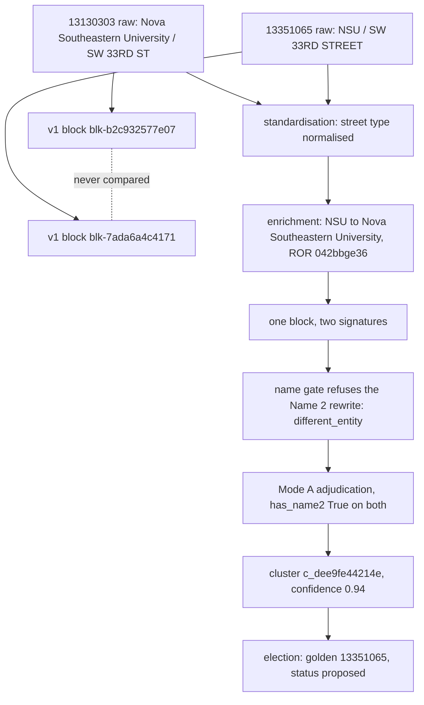

Generated: 2026-09-07 · Commit: 86d173b8a4d715a619b0a2656986c145da7fa81e · Branch: feature/llm-fixes · Pass: 03b

# Pass 03b — Exemplars

## 3b.0 Method, scope and conventions

This pass follows one real record per stratum through every stage the pipeline has an
output for, and then one pair of records through the stage where standardisation and
enrichment change the clustering outcome. Every value is quoted from a file in this
repository. No enrichment run, clustering run or scoring run was executed for this pass.

**Tree state.** `git status --porcelain` reports five modified files, all of them
outputs of Passes 00–03b in this same regeneration (`docs/thesis/00_INVENTORY.md`,
`01_TRACEABILITY.md`, `02_ARCHITECTURE.md`, `03_ALGORITHMS.md`, and this file), each
already carrying the header commit above. No source file is modified.

### 3b.0.1 Files read

Row counts read with `openpyxl` (`max_row - 1`); invocation and verbatim output in
§3b.8.1.

| File | Rows | Cols | Role in this pass |
|---|---|---|---|
| `data/eval/S{1..5}_pre.xlsx` | 100 each | 42 | raw SAP extract + pre-enrichment issue codes |
| `data/eval/S{1..5}_post.xlsx` | 100 each | 83–85 | enriched export + post-enrichment issue codes |
| `data/eval/stress_200_pre.xlsx` | 183 | 38 | raw values behind the clustering set, with ground truth |
| `data/eval/dedup_STRESS_200_v1_enriched_dedup.xlsx` | 200 | 87 | enriched rows + `Cluster ID`, `Routing`, `Confidence`, `Reasoning` |
| `data/eval/stress_200_scored.xlsx` | 183 | 117 | the above + `Link ID`, per-criterion scores, `election_status` |
| `logs/enrichment_api.log.2`, `.5` | — | — | per-record stage trace (see the caveat below) |

### 3b.0.2 Five stages, and what carries each one

| Stage | Carried by | Cited as |
|---|---|---|
| raw | `S{n}_pre.xlsx` name/address columns | file + `Customer` |
| issues (pre) | `S{n}_pre.xlsx` `Issues` | file + `Customer`, predicate at `enrichment/issue_detection.py:LINE` |
| enrichment tiers hit | `logs/enrichment_api.log*` `step` records | `logs/…:LINE` — **untracked**, see below |
| enriched | `S{n}_post.xlsx` | file + `Customer` |
| issues (post) | `S{n}_post.xlsx` `Issues` | as pre; flag-derived codes via `FLAG_CODE_ISSUES` (`:1515-1559`) |
| cluster | `stress_200_scored.xlsx` `Cluster ID` / `Routing` / `Confidence` / `Reasoning` | file + `Customer` |
| score | `stress_200_scored.xlsx` `score_*`, `election_status` | file + `Customer` |

### 3b.0.3 ⚠ The tier trace is not a committed artefact

The shipped provenance columns record a **source**, never a tier:
`provenance := source ":" confidence ("+" witness)?` with
`source := "input" | "ror" | "gleif" | "wikidata" | "web:" domain | "llm"`
(`enrichment/confidence.py:33-36`). The module states the exclusion as a decision —
"the tier is a route, not a warrant" (`:12-16`). `ror:verified` therefore does not
distinguish a Tier 1 hit from a Tier 1 retry after canonicalisation, and
`llm:provisional` does not distinguish the grounded resolver from Tier 3.

The tier route is recoverable only from `logs/enrichment_api.log*`, which
**`.gitignore:21` excludes from the repository** (`git ls-files logs/` returns nothing).
Those files are local to this machine and are not reproducible from the commit. Where
this pass names a tier, it cites a log line **and** states whether the outcome recorded
there matches the workbook value. Where they do not match, the log is not used.

⚠ **MEASUREMENT REQUIRED** for a committed tier trace: the `provenance` event list is
carried on the `/enrich` response (`api/models.py:545-546`) and is not written to any
column of the `S{n}_post.xlsx` export.

### 3b.0.4 ⚠ Two `Issues` columns, disagreeing

Three of the ten workbooks carry the header `Issues` **twice**; the other seven carry it
once. The position is not stable across files either — in seven of the ten the column is
the last one, in `S1_pre` neither occurrence is:

| File | `Issues` occurrences (column, 0-based index) | Codes per column | Agreement |
|---|---|---|---|
| `S1_pre` | `C(2)`, `H(7)` | 195 / 152 | **30 of 100 rows** |
| `S1_post` | `H(7)`, `CE(82)` | 116 / 116 | 100 of 100 rows |
| `S2_pre` | `G(6)`, `AP(41)` | 214 / 214 | 100 of 100 rows |
| `S2_post` | `CF(83)` | 166 | — |
| `S3_pre`, `S4_pre`, `S5_pre` | `AP(41)` | 191 / 245 / 213 | — |
| `S3_post`, `S5_post` | `CF(83)` | 135 / 211 | — |
| `S4_post` | `CG(84)` | 279 | — |

In `S1_pre` the two columns are two different runs, not one filtered view of the other:
`C(2)` carries `G4-ADDR-008` ×17 and `G1-NAME-001` ×15; `H(7)` carries no `G4-ADDR-008`
and `G1-NAME-001` ×26. `G4-ADDR-008` is `status="withdrawn"`
(`enrichment/issue_detection.py:353-361`) and `G1-NAME-001` is `status="withdrawn"` with
`reason="withdrawn 2026-09-07; …"` (`:270-274`), so neither is emittable at this commit
and every one of the ten workbooks predates the current catalogue.

**Convention adopted here:** this pass quotes the **first** `Issues` occurrence in each
file — `C(2)` in `S1_pre`, `H(7)` in `S1_post`, `G(6)` in `S2_pre`, the single column
elsewhere — and states the second occurrence's value wherever the two differ, which is
only in `S1_pre`. Invocation and verbatim output in §3b.8.2.

### 3b.0.5 ⚠ Phase 2 output exists for three strata only

`data/eval/` holds no clustering or scoring export keyed to `S{n}_post.xlsx`. The Phase 2
workbooks are the stress set, which shares `Customer` ids with the strata only in part:

| Stratum | `category` | Rows also in `stress_200_scored.xlsx` |
|---|---|---|
| S1 | `academic_research` | 3 |
| S2 | `large_corporate` | **0** |
| S3 | `government_labs` | 2 |
| S4 | `hospital_health` | **0** |
| S5 | `smb_residual` | 2 |

The S1, S3 and S5 exemplars below are chosen from the intersection and carry a real
cluster and election. The S2 and S4 exemplars carry `⚠ NOT MEASURED` for those two
stages; §3b.8.5 names the route that would produce them.

---

## 3b.1 The five strata

`eval_set` and `category` are columns of the pre and post files; one `category` per
`eval_set`, read across all 500 rows.

| Stratum | `category` | Exemplar `Customer` | Raw Name 1 | Phase 2 present |
|---|---|---|---|---|
| S1 | `academic_research` | `13337284` | `Case Western Reserve University` | yes |
| S2 | `large_corporate` | `13342215` | `Merck Sharp & Dohme Corp.` | no |
| S3 | `government_labs` | `13128613` | `NASA` | yes |
| S4 | `hospital_health` | `13341941` | `Brigham and Women's Hospital Inc` | no |
| S5 | `smb_residual` | `13342545` | `UCSF` | yes |

---

## 3b.2 S1 — `academic_research`, Customer `13337284`

### 3b.2.1 Raw — `data/eval/S1_pre.xlsx`

| Field | Value |
|---|---|
| Name 1 | `Case Western Reserve University` |
| Name 2–4 | *(empty)* |
| House Number | `2109` |
| Street 1 | `ADELBERT RD` |
| Street 2 | `BXT181, 9th Floor, RM 947B` |
| Street 3 | `Biomedical Research Bldg` |
| City / Postal / Region / Country | `CLEVELAND` / `44106` / `OH` / `US` |
| Account group | `0002` |
| Comments | `Attn 947B Banumathi Tamilselvan` |

### 3b.2.2 Issues raised on the raw record

`Issues` at `C(2)` = `G1-ADDR-003; G1-ADDR-006; G4-ADDR-008; G2-NAME-012`.
The second occurrence, at `H(7)`, reads `G1-ADDR-003; G1-ADDR-006; G2-NAME-012` — the two
differ by exactly the withdrawn `G4-ADDR-008` (§3b.0.4).

| Code | Catalogue | Predicate that fires | Value it fires on |
|---|---|---|---|
| `G1-ADDR-003` | `:266` Sub-location Embedded in Street | `any(pat.search(st) for pat, _ in _SUITE_PATTERNS)` — `:1093-1100` | Street 2 `9th Floor, RM 947B` |
| `G1-ADDR-006` | `:268` Mail Code in Street Field | bare `[A-Z]{2,4}\d{1,4}` on a slot after Street 1 — `:1130-1136` | Street 2 `BXT181` |
| `G4-ADDR-008` | `:353-361` **withdrawn** | none at this commit | — |
| `G2-NAME-012` | `:299-305` Research Institution Missing Department | `looks_like_university_or_research_institute(name_1) and classify(name_2) in ("empty","admin")` — `:1249-1254` | Name 1 university, Name 2 empty |

Verified against the predicates directly:
`looks_like_university_or_research_institute("Case Western Reserve University")` → `True`;
`classify("")` → `"empty"` (§3b.8.4).

`expected_issue_codes` on the same row reads `G1-ADDR-006;G4-ADDR-025;G2-NAME-012`, which
names `G4-ADDR-025` (withdrawn, `:362-366`) where the detector emitted `G4-ADDR-008`, and
omits `G1-ADDR-003`. ⚠ Design expectation and detector output are two vocabularies here;
neither is derived from the other.

### 3b.2.3 Tiers hit

⚠ Trace from `logs/enrichment_api.log.5`, untracked (§3b.0.3). Every value in it matches
`S1_post.xlsx`.

| Line | `step` | Payload |
|---|---|---|
| `:45536` | `preprocess` | `use_cases: [9]`, `flags: ["named building moved from street3 to Building ('Biomedical Research Bldg')"]` |
| `:45539` | `tier1_ror_parent` | `query: 'Case Western Reserve University'`, `matched: True`, `score: 1.0`, `official_name: 'Case Western Reserve University'`, `is_research: True`, `domain: 'case.edu'` |
| `:45540` | `registry_name_write` | `registry: 'ROR'`, `value: 'Case Western Reserve University'`, `verdict: 'same'` |
| `:45542` | `address_stage1` | `mail_code: True`, all other extractors `False` |

Tier 1 ROR answers on the first call at score 1.0; no lower tier runs. `verdict: 'same'`
is why Name 1 ships unchanged.

### 3b.2.4 Enriched — `data/eval/S1_post.xlsx`

| Field | Value |
|---|---|
| Name 1 | `Case Western Reserve University` |
| Street 1 / House Number | `Adelbert Rd` / `2109` |
| Building / Floor / Room / Mail Code | `Biomedical Research Bldg` / `9` / `947B` / `BXT181` |
| Street 2–5 | *(empty)* |
| Domain | `case.edu` |
| ROR ID | `https://ror.org/051fd9666` |
| Record Type | `research_institution` |
| Search Term 1 | `CWRU` |
| Name 1 / Domain / Record Type / ROR ID Provenance | `ror:verified` (all four) |
| Flag Codes | *(empty)*, Flag for Review `False` |

### 3b.2.5 Issues remaining

`Issues` at `H(7)` = `G2-NAME-012`; the second occurrence at `CE(82)` is identical.

| Code | Pre | Post | Why |
|---|---|---|---|
| `G1-ADDR-003` | ✓ | — | no street slot holds a sub-location; `Floor`/`Room` carry the values |
| `G1-ADDR-006` | ✓ | — | `BXT181` sits in `Mail Code` |
| `G4-ADDR-008` | ✓ | — | withdrawn at this commit |
| `G2-NAME-012` | ✓ | ✓ | Name 2 still empty; `remedy="steward"` (`:299-305`) — no automated route to a department remains, the two contact-based paths being withdrawn (`:311-323`) |

### 3b.2.6 Cluster — `data/eval/stress_200_scored.xlsx`, `c_2759839874b4`

| Customer | Enriched Name 1 | Enriched Name 2 | Street / House / Zip | ROR ID | Routing | Confidence | Reasoning |
|---|---|---|---|---|---|---|---|
| `13210816` | `KMB3 LLC` | `Case Western Reserve University` | `Adelbert Rd` / `2109` / `44106` | *(none)* | `cluster` | *(empty)* | *(empty)* |
| `13337284` | `Case Western Reserve University` | *(empty)* | `Adelbert Rd` / `2109` / `44106` | `https://ror.org/051fd9666` | `cluster` | *(empty)* | *(empty)* |

`Link ID` = `l_7ea37a4bd0bd` on both. The `Link ID` column exists only when `v2_any()` is
true (`dedup/flags.py:55-63`), so this run had at least one v2 flag set.

Empty `Confidence` and empty `Reasoning` together mean the pair never reached the model:
Reasoning is surfaced for any entity the LLM decided and Confidence only for a genuine
merge (`dedup/adjudicator.py:1229-1247`). The collapse is deterministic, and it is
reproducible from the two name blocks alone. `_OPAQUE_NAME1_RE = r"^[A-Z0-9]{3,6}(?: LLC| Inc\.?)?$"`
(`dedup/name_slots.py:85`) matches `KMB3 LLC`, and `_is_institution` then requires the
row's Name 2 to reach `INSTITUTION_THRESHOLD = 0.85` (`:111`) against another Name 1 in
the block (`:325-330`). Executing it (§3b.8.3):

```
classify_slots('KMB3 LLC', 'Case Western Reserve University')
   kind='institution' institution='Case Western Reserve University' department='' aliases=['KMB3 LLC']
   signature=('case western reserve university', '')
classify_slots('Case Western Reserve University', '')
   kind='none' institution='Case Western Reserve University' department='' aliases=[]
   signature=('case western reserve university', '')
```

One signature, so `n <= 1` and no LLM call is made at all
(`dedup/adjudicator.py:1352-1355`). `gt_expected_action` on both rows is
`MERGE - collapse into one golden record`, `gt_difficulty` `hard`, `gt_why`
`"Name 1 is the opaque SAP code 'KMB3'; Name 2 + 2109 Adelbert Rd match the CWRU record"`.

### 3b.2.7 Score

Reference year `2026` (`scored_with_reference_year`), weights version `3147cac47910`
(`scored_with_weights_version`).

| Criterion | `13210816` input → points | `13337284` input → points |
|---|---|---|
| `sales_order_last_used` | `2026` → 20 | *(null)* → 0 |
| `sales_order_count` | `29` → 25 | *(null)* → 0 |
| `sales_order_partner_last_used` | *(null)* → 0 | `2026` → 20 |
| `sales_order_partner_count` | *(null)* → 0 | `24` → 25 |
| `sleeping_customer` | `No` → 15 | `No` → 15 |
| `customer_status` | `Active` → 10 | `Active` → 10 |
| `account_group` | `0002` → 15 | `0002` → 15 |
| `company_code_count` | 0 → 0 | 0 → 0 |
| **`score_final`** | **85** | **85** |

`election_status` = `proposed`, `golden_record_id` = `13210816` on both rows;
`is_golden_record` is `True` for `13210816` and `False` for `13337284`.

The totals tie, so the winner comes from `_tiebreak_key` (`dedup/scoring.py:1048-1065`),
whose second element is `-(last_year if last_year is not None else -1)`: `13210816`
carries `2026`, `13337284` carries null, and null sorts last. The tie also satisfies the
`tiebreak_decided` trigger — the top score shared by ≥ 2 members
(`dedup/scoring.py:556-562`) — which is a `DedupIssue`, never summed with catalogue codes.

`13337284` scoring 0 on `sales_order_count` is the G1 recency gate, not a missing input:
`_award_count` returns `False` for a row whose year is `None` (`dedup/scoring.py:882-887`).

---

## 3b.3 S2 — `large_corporate`, Customer `13342215`

### 3b.3.1 Raw — `data/eval/S2_pre.xlsx`

| Field | Value |
|---|---|
| Name 1 | `Merck Sharp & Dohme Corp.` |
| Name 2 | `Merck Sharp & Dohme Corp.` |
| Street 1 | `901 CALIFORNIA AVE` |
| Street 2 | `(PALO ALTO-ROOM 163)` |
| House Number | *(empty)* |
| City / Postal / Region / Country | `PALO ALTO` / `94304` / `CA` / `US` |
| Account group | `DRIT` |

### 3b.3.2 Issues raised on the raw record

`Issues` at `G(6)` = `G1-ADDR-001; G1-ADDR-003; G3-NAME-005; G5-NAME-001; G5-NAME-002`;
the second occurrence at `AP(41)` is identical.

| Code | Catalogue | Predicate | Value |
|---|---|---|---|
| `G1-ADDR-001` | `:265` | `is_blank(house_number)` and `_looks_like_street(st)` — `:1086-1091` | Street 1 `901 CALIFORNIA AVE`, House Number empty |
| `G1-ADDR-003` | `:266` | `_SUITE_PATTERNS` — `:1093-1100` | Street 2 `ROOM 163` |
| `G3-NAME-005` | `:325` | `_norm(upper) == _norm(lower)` over `ADJACENT_RECORD_NAME_PAIRS` — `:1291-1297` | Name 1 == Name 2 |
| `G5-NAME-001` | `:370-373` | `_is_non_canonical_name(name_1, _NONCANON_TOKENS_ORG)` — `:1434-1437` | `Corp.` |
| `G5-NAME-002` | `:374` | same over Name 2..N — `:1442-1447` | `Corp.` in Name 2 |

`_is_non_canonical_name("Merck Sharp & Dohme Corp.", _NONCANON_TOKENS_ORG)` → `True`
(§3b.8.4).

### 3b.3.3 Tiers hit

⚠ **UNVERIFIED** — `13342215` appears in no file under `logs/`. The tier route is not
recoverable at this commit. What the export does state is the source of each written
value:

| Column | Value | Reading (`enrichment/confidence.py:33-36`) |
|---|---|---|
| `Name 1 Provenance` | `gleif:verified` | authored by GLEIF, witness-less `verified` permitted for a registry source (`:73-79`) |
| `Record Type Provenance` | `gleif:verified` | as above |
| `LEI ID Provenance` | `gleif:verified` | as above |
| `Domain Provenance` | `web:merck.com:low` | a page, not a registry; `low` |

So the company lane answered and the research lane did not: `ROR ID` is empty and
`LEI ID` is populated.

### 3b.3.4 Enriched — `data/eval/S2_post.xlsx`

| Field | Value |
|---|---|
| Name 1 | `Merck Sharp & Dohme Corp.` |
| Name 2–5 | *(empty)* |
| Street 1 / House Number | `901 California Ave` / *(empty)* |
| Street 2 | `(Palo Alto-)` |
| Room | `163` |
| Domain | `merck.com` |
| LEI ID | `MZK1AT00SJV4XB7WNL71` |
| ROR ID | *(empty)* |
| Record Type | `company` |
| Search Term 1 | `MERCK SHARP` |
| Flag Codes | `entity-superseded; domain-unverified` |
| Flagged Fields | `name1; domain` |
| Flag for Review | `True` |

`Flag Reason`, verbatim:

```
Name 1: names an organisation that no longer exists as a separate entity (GLEIF
records this entity as INACTIVE) — decide which entity this record should point
to; Domain: the domain shown (merck.com) was found on the web but nothing
independently tied it to this organisation — confirm it
```

`flag_for_review` is `True` because `entity-superseded` is not advisory:
`ADVISORY_CODES` holds exactly `domain-unverified` and `registry-location-mismatch`
(`enrichment/flags.py:249-254`), and `bool(set(ordered) - ADVISORY_CODES)` is therefore
non-empty (`:906-908`).

### 3b.3.5 Issues remaining

`Issues` = `G1-ADDR-001; G5-NAME-001; G6-CONFIRM-001`.

| Code | Pre | Post | Why |
|---|---|---|---|
| `G1-ADDR-001` | ✓ | ✓ | Street 1 still reads `901 California Ave` and House Number is still empty — the number was not split out |
| `G1-ADDR-003` | ✓ | — | `163` sits in `Room` |
| `G3-NAME-005` | ✓ | — | Name 2 cleared |
| `G5-NAME-001` | ✓ | ✓ | `Corp.` survives; GLEIF wrote `verdict`-equal text |
| `G5-NAME-002` | ✓ | — | no Name 2 to judge |
| `G6-CONFIRM-001` | — | ✓ | `FLAG_CODE_ISSUES["domain-unverified"] = "G6-CONFIRM-001"` (`:1535`) |

`entity-superseded` appears in no `FLAG_CODE_ISSUES` key (`:1515-1559`), so it raises no
catalogue code; it reaches the reviewer through `Flag Codes` only.

### 3b.3.6 Cluster and score

⚠ **NOT MEASURED.** `13342215` is absent from `data/eval/dedup_STRESS_200_v1_enriched_dedup.xlsx`
and from `data/eval/stress_200_scored.xlsx`; no clustering or scoring output keyed to
`S2_post.xlsx` exists in the repository. `cluster_id = S2-C01` and
`cluster_role = "same entity, same site"` are **design** columns of the eval workbook —
six rows carry `S2-C01` — not pipeline output. See §3b.8.5 for the route that would
supply the measurement.

---

## 3b.4 S3 — `government_labs`, Customer `13128613`

### 3b.4.1 Raw — `data/eval/S3_pre.xlsx`

| Field | Value |
|---|---|
| Name 1 | `NASA` |
| Name 2 | `Ames Research Center` |
| Street 1 | `MARK AVE, BLDG N239 ROOM` |
| House Number | *(empty)* |
| City / Postal / Region / Country | `MOFFETT FIELD` / `94035` / `CA` / `US` |

### 3b.4.2 Issues raised on the raw record

`Issues` = `G1-ADDR-003`.

| Code | Catalogue | Predicate | Value |
|---|---|---|---|
| `G1-ADDR-003` | `:266` | `_SUITE_PATTERNS` — `:1093-1100` | `BLDG N239 ROOM` in Street 1 |

⚠ The snapshot `Issues` column reads `G1-ADDR-003; G2-NAME-009`. `G2-NAME-009` is no
longer emitted here: it is now gated on `looks_like_university_or_research_institute(Name 1)`,
the same gate as `G2-NAME-012`, and `NASA` is not a university or research institute. The
rule encodes lab ⊂ department ⊂ institution; an agency's field centre is a unit in its own
right, not a lab short of a department. `Ames Research Center` is still `is_granular_unit`
→ `True` — it is the gate, not the unit test, that stays silent.

⚠ `expected_issue_codes` reads `G1-ADDR-003;G5-NAME-001`. `G5-NAME-001` is **not**
emitted and cannot be: `_is_non_canonical_name("NASA", _NONCANON_TOKENS_ORG)` → `False`
(§3b.8.4). The module states this limit rather than leaving it implicit — an acronym
carrying no abbreviation token is out of scope for a deterministic detector, and the
correction surfaces in the before/after comparison instead
(`enrichment/issue_detection.py:95-110`).

### 3b.4.3 Tiers hit

⚠ Trace from `logs/enrichment_api.log.5`, untracked. The final ROR id and Name 1 in it
match `S3_post.xlsx`.

| Line | `step` | Payload |
|---|---|---|
| `:47880` | `tier1_ror_parent` | `query: 'NASA'`, `matched: False` |
| `:47881` | `tier1_ror_miss` | `name1_cleaned: 'NASA'`, `looks_research: False` |
| `:47890` | `tier1_lei` | `query: 'NASA'`, `matched: False`, `strategy: 'fuzzy'`, `score: 66.66666666666667` |
| `:47902` | `wikidata` | `outcome: 'no_match'`, `reasons: ['type_rejected']`, 5 candidates, `api_calls: 2` |
| `:47924` | `tier2_canonical_result_name2` | `found: True`, `confidence: 'high'`, `enriched: 'NASA Ames Research Center'` |
| `:47925` | `tier2_canonical_rejected_scope_name2` | `rejected: 'NASA Ames Research Center'` |
| `:47927`–`:47959` | `grounded_start` … `grounded_result` | `confirmed: ['name1','name2']`, `name2_kind: 'department'`, no candidate adopted |
| `:47961` | `tier1_retry` | `original_query: 'NASA'`, `canonical_query: 'National Aeronautics and Space Administration'` |
| `:47962` | `registry_name_write` | `registry: 'ROR'`, `value: 'National Aeronautics and Space Administration'`, `verdict: 'same'` |
| `:47964` | `tier1_retry_hit` | `ror_id: 'https://ror.org/027ka1x80'` |
| `:47966` | `registry_location_unconfirmed` | `detail: 'states region District of Columbia; record says CA (California)'` |

Every tier in the ladder runs. The registry id arrives on the **retry after
canonicalisation**, not on the first Tier 1 call — a distinction the shipped
`ROR ID Provenance = ror:verified` does not carry (§3b.0.3).

### 3b.4.4 Enriched — `data/eval/S3_post.xlsx`

| Field | Value |
|---|---|
| Name 1 | `National Aeronautics and Space Administration` |
| Name 2 | `Ames Research Center` |
| Street 1 | `Mark Ave` |
| Building | `N239` |
| Domain | `nasa.gov` |
| ROR ID | `https://ror.org/027ka1x80` |
| Record Type | `research_institution` |
| Search Term 1 / 2 | `NASA` / `AMES RESEARCH` |
| Name 1 Provenance | `ror:verified` |
| Name 2 Provenance | `input:low` |
| Flag Codes | *(empty)*, Flag for Review `False` |

### 3b.4.5 Issues remaining

`Issues` = *(empty)*. (The snapshot reads `G2-NAME-009`; see §3b.4.2 for why it is no
longer emitted.)

| Code | Pre | Post | Why |
|---|---|---|---|
| `G1-ADDR-003` | ✓ | — | `N239` sits in `Building` |
| `G2-NAME-009` | — | — | Name 1 `National Aeronautics and Space Administration` does not pass the university / research-institute gate, on either side |

### 3b.4.6 Cluster — `stress_200_scored.xlsx`, `c_4b36bea42391`

| Customer | Name 1 | Name 2 | Name 3 | Street | Building | ROR ID | Routing |
|---|---|---|---|---|---|---|---|
| `13057138` | `National Aeronautics and Space Administration` | `Ames Research Center` | `Space Biosciences Research Branch` | *(empty)* | `236` | `…/027ka1x80` | `manual_review` |
| `13120409` | `National Aeronautics and Space Administration` | `Ames Research Center` | *(empty)* | *(empty)* | `N245` | `…/027ka1x80` | `manual_review` |
| `13128613` | `National Aeronautics and Space Administration` | `Ames Research Center` | *(empty)* | `Mark Ave` | `N239` | `…/027ka1x80` | `manual_review` |

`Confidence` `0.94`, `Link ID` `l_267419dbea0f` on all three. `Reasoning`, verbatim:

```
unverified delivery point: Both records name the same institution, supported by the
shared ROR and identical institution name. The departments are in a parent/sub-unit
relationship, with Space Biosciences Research Branch nested within Ames Research
Center, which counts as the same entity by rule.
```

The `unverified delivery point` prefix is `UNVERIFIED_DELIVERY_POINT`
(`dedup/adjudicator.py:999`) and the routing is the second branch of `_emit_rows`:
`cluster_id is not None and unverified_block` → `manual_review`, `demoted = True`
(`:1225-1228`). Computing the block keys from the enriched values (§3b.8.3):

```
13057138 street=None       house='' house_less=True street_core=''            keys=['f:US|94035']
13120409 street=None       house='' house_less=True street_core=''            keys=['f:US|94035']
13128613 street='Mark Ave' house='' house_less=True street_core='mark avenue' keys=['f:US|94035']
```

All three name no delivery point, so all three take the house-less `f:` key
(`dedup/address.py:217-218`) and the block is unverified — a `Building` value is a hint
and never reaches blocking (`dedup/models.py:66-72`).

Ground truth on all three rows is `LINK - same organisation, different site: do not
collapse`, `gt_why` = `"same organisation by name evidence; no comparable street
address, so it must not be collapsed blindly"`. The cluster is an over-merge against
that reference, and the house-less demotion is what routes it to a reviewer instead of
asserting it.

### 3b.4.7 Score

| Criterion | `13057138` | `13120409` | `13128613` |
|---|---|---|---|
| `sales_order_last_used` | `2024` → 10 | *(null)* → 0 | *(null)* → 0 |
| `sales_order_count` | `1` → 5 | *(null)* → 0 | *(null)* → 0 |
| `sales_order_partner_last_used` | *(null)* → 0 | `2025` → 15 | `2025` → 15 |
| `sales_order_partner_count` | *(null)* → 0 | `6` → 15 | `3` → 5 |
| `sleeping_customer` / `customer_status` | 15 / 10 | 15 / 10 | 15 / 10 |
| `account_group` | `DRIT` → 20 | `DRIT` → 20 | `0002` → 15 |
| `company_code_count` | 8 → 25 | 7 → 25 | 0 → 0 |
| `combined_presence_bonus` | 10 | 10 | 0 |
| **`score_final`** | **95** | **110** | **60** |

`election_status` = `manual_review` on all three; `is_golden_record` and
`golden_record_id` are empty and `proposed_golden_id` = `13120409`. The election ran and
named a candidate, and the status carries the upstream demotion forward: any member
routed `manual_review` demotes the whole cluster, and election can never upgrade upstream
uncertainty (`dedup/scoring.py:1238-1247`, `:1259-1266`).

---

## 3b.5 S4 — `hospital_health`, Customer `13341941`

### 3b.5.1 Raw — `data/eval/S4_pre.xlsx`

| Field | Value |
|---|---|
| Name 1 | `Brigham and Women's Hospital Inc` |
| Name 2 | `Div Rheumatology, Inflammation, and` |
| Name 3 | `Immunity MSK-Rheumatology` |
| House Number | `60` |
| Street 1 | `FENWOOD RD` |
| Street 2 | `BTM LAB 6006 BBF6006` |
| City / Postal / Region / Country | `BOSTON` / `02115` / `MA` / `US` |
| Account group | `DRIT` |

### 3b.5.2 Issues raised on the raw record

`Issues` = `G1-ADDR-003; G1-ADDR-006; G1-NAME-001; G5-NAME-001`.

| Code | Catalogue | Predicate | Value |
|---|---|---|---|
| `G1-ADDR-003` | `:266` | `_SUITE_PATTERNS` — `:1093-1100` | `LAB 6006` in Street 2 |
| `G1-ADDR-006` | `:268` | bare mail code on a slot after Street 1 — `:1130-1136` | `BBF6006` |
| `G1-NAME-001` | `:270-274` **withdrawn** | none at this commit | — |
| `G5-NAME-001` | `:370-373` | `_is_non_canonical_name(name_1, …)` — `:1434-1437` | `Inc` |

### 3b.5.3 Tiers hit

⚠ **UNVERIFIED.** `13341941` appears in `logs/` only once, in a `flags_computed` record
whose `flag_codes` are `['low-confidence-unchanged']` — which is **not** the workbook's
value (`unverified-inference`). That log line belongs to a different run and is not used.
What the export states:

| Column | Value | Reading |
|---|---|---|
| `Name 1 Provenance` | `llm:provisional` | a model wrote Name 1; `llm` can never carry `verified` (`enrichment/confidence.py:104-107`) |
| `ROR ID` / `ROR ID Provenance` | `https://ror.org/04b6nzv94` / `ror:verified` | a registry answered on the id |
| `Domain` / `Domain Provenance` | `brighamandwomens.org` / `ror:verified` | the registry supplied the domain |

The registry answered on the identifier and the domain while the shipped Name 1 rests on
the model — which is what `unverified-inference` scoped to `name1` records.

### 3b.5.4 Enriched — `data/eval/S4_post.xlsx`

| Field | Value |
|---|---|
| Name 1 | `Brigham and Women's Hospital` |
| Name 2–5 | *(empty)* |
| `Name` (extra column, S4 only) | `Brigham and Women's Hospital Inc` |
| Street 1 / House Number | `Fenwood Rd` / `60` |
| Street 2 | `BTM` |
| Room / Mail Code | `LAB 6006` / `BBF6006` |
| Domain | `brighamandwomens.org` |
| ROR ID | `https://ror.org/04b6nzv94` |
| Record Type | `research_institution` |
| Search Term 1 | `BRIGHAMANDWOMENS` |
| Flag Codes / Flagged Fields | `unverified-inference` / `name1` |
| Flag Reason | `Name 1: inferred without external evidence — confirm against an authoritative source` |
| Flag for Review | `True` |

⚠ Name 2 and Name 3 arrive populated and ship empty. The department the raw record named
— `Div Rheumatology, Inflammation, and` / `Immunity MSK-Rheumatology`, which
`defect_evidence` on the same row identifies as one value split across two slots — is in
no output column: not `Name 2..5`, not `Care Of`, not `Contact`, not `Operating Name`,
not `Department Domain`. Census in §3b.8.6.

### 3b.5.5 Issues remaining

`Issues` = `G6-CONFIRM-001`.

| Code | Pre | Post | Why |
|---|---|---|---|
| `G1-ADDR-003` | ✓ | — | `LAB 6006` sits in `Room` |
| `G1-ADDR-006` | ✓ | — | `BBF6006` sits in `Mail Code` |
| `G1-NAME-001` | ✓ | — | withdrawn at this commit; not emittable either side |
| `G5-NAME-001` | ✓ | — | `_is_non_canonical_name("Brigham and Women's Hospital", …)` → `False` (§3b.8.4) |
| `G6-CONFIRM-001` | — | ✓ | `FLAG_CODE_ISSUES["unverified-inference"] = "G6-CONFIRM-001"` (`:1536`) |

⚠ The four-to-one reduction is measured over a name block that lost its department. No
issue code reports that loss: `G2-NAME-012` does not fire because
`looks_like_university_or_research_institute("Brigham and Women's Hospital")` is `False`
(§3b.8.4), and no catalogue code tests for a slot that was populated on input and is
empty on output.

### 3b.5.6 Cluster and score

⚠ **NOT MEASURED**, for the same reason as S2 (§3b.3.6): no S4 `Customer` appears in
either Phase 2 workbook. `cluster_id` is absent on this row.

---

## 3b.6 S5 — `smb_residual`, Customer `13342545`

### 3b.6.1 Raw — `data/eval/S5_pre.xlsx`

| Field | Value |
|---|---|
| Name 1 | `UCSF` |
| Name 2 | `Emanuela Zacco - LCA Core (re: Katharina` |
| Street 1 | `1855 FOLSOM ST.` |
| Street 2 | `Rm 425` |
| House Number | *(empty)* |
| City / Postal / Region / Country | `SAN FRANCISCO` / `94143` / `CA` / `US` |
| Account group / Company Code / Sales Org | `DRIT` / `1543` / `5431` |

### 3b.6.2 Issues raised on the raw record

`Issues` = `G1-ADDR-001; G1-ADDR-003`.

| Code | Catalogue | Predicate | Value |
|---|---|---|---|
| `G1-ADDR-001` | `:265` | `is_blank(house_number)` and `_looks_like_street(st)` — `:1086-1091` | Street 1 `1855 FOLSOM ST.` |
| `G1-ADDR-003` | `:266` | `_SUITE_PATTERNS` — `:1093-1100` | Street 2 `Rm 425` |

`G2-NAME-009` does **not** fire on the raw record:
`is_granular_unit("Emanuela Zacco - LCA Core (re: Katharina")` → `False`, the value
classifying as `unit` rather than `granular` (§3b.8.4). `expected_issue_codes` names
`G1-ADDR-001;G2-NAME-009;G5-NAME-001`; two of those three are not emitted on this side.

### 3b.6.3 Tiers hit

⚠ Trace from `logs/enrichment_api.log.5`, untracked. Every value in it matches
`S5_post.xlsx`, including the refused candidate and the flag.

| Line | `step` | Payload |
|---|---|---|
| `:46601` | `preprocess` | `use_cases: [12]`, `flags: ["parenthetical dropped from name2 (was 'Emanuela Zacco - LCA Core (re: Katharina')"]` |
| `:46604` | `tier1_ror_parent` | `query: 'UCSF'`, `matched: True`, `score: 0.88`, `official_name: 'University of California, San Francisco'`, `domain: 'ucsf.edu'` |
| `:46605` | `registry_name_write` | `registry: 'ROR'`, `value: 'UCSF'`, `verdict: 'same'` |
| `:46606` | `tier1_child_local_match_name2` | `num_children: 5`, `best_child: None`, `best_score: 0` |
| `:46630` | `uc13_lab_resolver_result` | `lab: 'Emanuela Zacco - LCA Core'`, `parent: None`, `confidence: 'none'` |
| `:46647` | `tier2_canonical_result_name2` | `found: True`, `confidence: 'high'`, `enriched: 'Laboratory for Cell Analysis Core'` |
| `:46648` | `tier2_canonical_rejected_scope_name2` | `rejected: 'Laboratory for Cell Analysis Core'` |
| `:46696` | `grounded_registry_hit` | `field: 'name1'`, `identifier: 'https://ror.org/043mz5j54'` |
| `:46701` | `grounded_adopted` | `field: 'name2'`, `value: 'LCA - Genome Analysis Core Services'`, `origin: 'serp'`, `confidence: 'medium'` |
| `:46703` | `name_gate_different_entity` | `input_value: 'Emanuela Zacco - LCA Core'`, `candidate: 'LCA - Genome Analysis Core Services'` |
| `:46706` | `flags_computed` | `flag_codes: ['low-confidence-unchanged']`, `flagged_fields: ['name2']` |

Tier 1 ROR matches at 0.88 and writes `verdict: 'same'`, so Name 1 ships as `UCSF` even
though the registry's official name is longer. UC 13, Tier 2 canonicalisation and the
grounded resolver each produce a Name 2 candidate and each candidate is refused — the
last of them by the name gate, on `different_entity`.

### 3b.6.4 Enriched — `data/eval/S5_post.xlsx`

| Field | Value |
|---|---|
| Name 1 | `UCSF` |
| Name 2 | `Emanuela Zacco - LCA Core` |
| Suggested Name | `LCA - Genome Analysis Core Services` |
| Suggestion Source | `grounded, refused: different_entity` |
| Street 1 / House Number | `1855 Folsom St.` / *(empty)* |
| Room | `425` |
| Domain | `ucsf.edu` |
| ROR ID | `https://ror.org/043mz5j54` |
| Record Type | `research_institution` |
| Search Term 1 / 2 | `UCSF` / `EMANUELA ZACCO` |
| Name 1 Provenance / Name 2 Provenance | `ror:verified` / `input:low` |
| Flag Codes / Flagged Fields | `low-confidence-unchanged` / `name2` |
| Flag Reason | `Name 2: left exactly as supplied — the canonical form could not be established with enough confidence to rewrite it; confirm the value is correct` |
| Flag for Review | `True` |

The refused candidate is not discarded: it ships in `Suggested Name` with
`Suggestion Source` naming the refusal reason, and the record keeps its own value under
`input:low`.

### 3b.6.5 Issues remaining

`Issues` = `G1-ADDR-001; G2-NAME-009; G7-UNCHANGED-001`.

| Code | Pre | Post | Why |
|---|---|---|---|
| `G1-ADDR-001` | ✓ | ✓ | Street 1 still reads `1855 Folsom St.` with House Number empty |
| `G1-ADDR-003` | ✓ | — | `425` sits in `Room` |
| `G2-NAME-009` | — | ✓ | **raised by the repair.** Dropping the truncated parenthetical (UC 12) turns the value from `unit` into `granular`: `is_granular_unit("Emanuela Zacco - LCA Core (re: Katharina")` → `False`, `is_granular_unit("Emanuela Zacco - LCA Core")` → `True` (§3b.8.4). The now-visible lab has no parent department, which is exactly what `:1256-1266` tests |
| `G7-UNCHANGED-001` | — | ✓ | `FLAG_CODE_ISSUES["low-confidence-unchanged"] = "G7-UNCHANGED-001"` (`:1556`) |

The count goes from 2 to 3. Both new codes are consequences of the pipeline having done
something: one repair made a defect legible, and one abstention was reported.

### 3b.6.6 Cluster — `stress_200_scored.xlsx`, `c_7977d1f5450d`

| Customer | Raw Name 1 | Raw Name 2 | Enriched Name 1 | Enriched Name 2 | Street / House / Zip | ROR ID |
|---|---|---|---|---|---|---|
| `13161437` | `University of California` | `San Francisco` (N3 `Accounts Payable`) | `University of California, San Francisco` | `Accounts Payable` | `Folsom St` / `1855` / `94103` | `…/043mz5j54` |
| `13342545` | `UCSF` | `Emanuela Zacco - LCA Core (re: Katharina` | `UCSF` | `Emanuela Zacco - LCA Core` | `1855 Folsom St.` / *(empty)* / `94143` | `…/043mz5j54` |

`Routing` `cluster`, `Confidence` `0.99`, `Link ID` `l_e3807a9e5c04` on both.
`Reasoning`, verbatim:

```
"UCSF" is a standard acronym for University of California, San Francisco, and the
shared ROR confirms the same institution. Both records name no department, so they
refer to the same entity at this delivery point.
```

"Both records name no department" is a statement about the classifier, not about whether
a cell below Name 1 is populated — both cells are. Executing `classify_slots` on the two
enriched name blocks (§3b.8.3):

```
classify_slots('University of California, San Francisco', 'Accounts Payable')
   kind='logistics' institution='University of California, San Francisco' department='' hints=[]
   signature=('university of california san francisco', '')
classify_slots('UCSF', 'Emanuela Zacco - LCA Core')
   kind='contact' institution='UCSF' department='' hints=['Emanuela Zacco - LCA Core']
   signature=('ucsf', '')
```

A delivery desk and a person, neither of which names a unit, so `has_name2` is false on
both (`dedup/signatures.py:141-155`) and the two sit in the same Mode A bucket
(`dedup/adjudicator.py:460-463`) where they can be compared at all. Under v1 both cells
would read as departments and the asymmetry rule would not have been reached, the two
being compared as two different departments instead.

The postal codes differ (`94103` / `94143`). `address_compatible` tolerates one
Damerau-Levenshtein edit — `ZIP_EDIT_TOLERANCE = 1` (`dedup/address.py:91`,
`:285-291`) — and `94103` → `94143` is one substitution.

### 3b.6.7 Score

| Criterion | `13161437` | `13342545` |
|---|---|---|
| `sleeping_customer` / `customer_status` | 15 / 10 | 15 / 10 |
| `account_group` | `DRIT` → 20 | `DRIT` → 20 |
| `company_code_count` | `1225,1240,1506,1543,1563,1571` → 6 → 25 | `1543` → 1 → 5 |
| `combined_presence_bonus` | 10 | 10 |
| every order / equipment ladder | *(null)* → 0 | *(null)* → 0 |
| **`score_final`** | **80** | **60** |

`election_status` = `proposed`; `golden_record_id` = `13161437` on both;
`approval_status` = `proposed`. `Company_Code_Count` is derived from the consolidated
field and never read from the file (`derived_counts`, `dedup/scoring.py:795-809`), the
splitter accepting both `,` and `;` (`:780-793`). Ground truth is
`MERGE - collapse into one golden record`, `gt_why` =
`"canonical forms agree: 'university california'"`.

---

## 3b.7 The coupling exemplar — `13130303` / `13351065`

The pair that does not cluster on raw values and clusters on enriched ones. Both rows are
in `data/eval/stress_200_pre.xlsx` (raw) and
`data/eval/dedup_STRESS_200_v1_enriched_dedup.xlsx` (enriched + clustering);
`data/eval/stress_200_scored.xlsx` carries the election. Ground truth on both rows:
`gt_dup_group = D070`, `gt_expected_action = MERGE - collapse into one golden record`,
`gt_difficulty = hard`, `gt_why = "'NSU' is the acronym of 'Nova Southeastern University'"`.

### 3b.7.1 The two records, field by field

| Field | `13130303` raw | `13130303` enriched | `13351065` raw | `13351065` enriched |
|---|---|---|---|---|
| Name 1 | `Nova Southeastern University` | `Nova Southeastern University` | **`NSU`** | **`Nova Southeastern University`** |
| Name 2 | `Center for Collaborative Research` | `Center for Collaborative Research` | `Center of Collaboration Research` | `Center of Collaboration Research` |
| Street 1 | `SW 33RD ST` | `SW 33RD St` | **`SW 33RD STREET`** | **`SW 33RD St`** |
| House Number | `7595` | `7595` | `7595` | `7595` |
| City / Postal / Country | `DAVIE` / `33314` / `US` | as raw | `DAVIE` / `33314` / `US` | as raw |
| ROR ID | *(none in raw)* | `https://ror.org/042bbge36` | *(none in raw)* | `https://ror.org/042bbge36` |

Two fields change on `13351065`: the institution name and the street type. Nothing else
on either record moves.

### 3b.7.2 The block key and the signature, before and after

Computed with the repository's own functions over the two workbooks; invocation and
verbatim output in §3b.8.3.

```
13130303 RAW      block=blk-b2c932577e07 signature=('nova southeastern university', 'center for collaborative research')
13130303 ENRICHED block=blk-b2c932577e07 signature=('nova southeastern university', 'center for collaborative research')
13351065 RAW      block=blk-7ada6a4c4171 signature=('nsu', 'center of collaboration research')
13351065 ENRICHED block=blk-b2c932577e07 signature=('nova southeastern university', 'center of collaboration research')
```

| | raw | enriched |
|---|---|---|
| v1 block id (`derive_block_id`, `dedup/signatures.py:50-62`) | `blk-b2c932577e07` vs `blk-7ada6a4c4171` — **two blocks** | `blk-b2c932577e07` on both — **one block** |
| signature institution half | `'nova southeastern university'` vs `'nsu'` — **no shared token** | identical on both |
| signature department half | `'center for collaborative research'` vs `'center of collaboration research'` | unchanged; still two signatures |

Under v1 blocking the pair is never compared: `derive_block_id` hashes
`country|postal_code|street|house_no` through `normalize_key`, which strips punctuation
and folds case but expands no abbreviation (`:35-48`), so `SW 33RD ST` and
`SW 33RD STREET` are two different blocks. Standardisation writes `SW 33RD St` on both
sides and the two block ids become one.

Under v2 delivery-point blocking the address half is already tolerant, and the raw pair
blocks together (§3b.8.3):

```
13130303 RAW      street_core='sw 33rd street' house='7595' zip5='33314' keys=['z:US|33314|7595', 'c:US|davie|7595']
13351065 RAW      street_core='sw 33rd street' house='7595' zip5='33314' keys=['z:US|33314|7595', 'c:US|davie|7595']
```

`_street_core` normalises the street type before the key is built
(`dedup/address.py:139-157`), so under v2 the coupling that matters is **not** the
address one. What raw values still break is the signature: `'nsu'` and
`'nova southeastern university'` share no token, and the merge rests on the model being
told these are one institution.

### 3b.7.3 Where the institution half converges

⚠ Trace from `logs/enrichment_api.log.5`, untracked. Its `flags_computed` record for
`13351065` — `flag_codes: ['low-confidence-unchanged']`, `flagged_fields: ['name2']` —
matches `Flag Codes` and `Flagged Fields` in `stress_200_scored.xlsx` for that row, and
the `ror_id` it records matches the workbook's `ROR ID`.

| Line | `step` | Payload |
|---|---|---|
| `:46675` | `tier1_ror_parent` | `query: 'NSU'`, `matched: False` |
| `:46676` | `tier1_ror_miss` | `name1_cleaned: 'NSU'`, `looks_research: False` |
| `:46695` | `tier1_lei` | `query: 'NSU'`, `matched: False`, `score: 15.384615384615385` |
| `:46707` | `wikidata` | `outcome: 'ambiguous'`, `reasons: ['country_rejected','type_rejected']`; among the five candidates `Q1798499 'Nova Southeastern University'` at `name_score: 100.0` with `rejected_by: None`, alongside `Q2001231 'Northwestern State University'` and `Q632506 'Norfolk State University'`, both also at `100.0` |
| `:46735` | `tier2_canonical_result_name2` | `found: True`, `confidence: 'medium'`, `enriched: 'Center for Collaborative Research'` |
| `:46736` | `tier2_canonical_rejected_scope_name2` | `rejected: 'Center for Collaborative Research'` |
| `:46758` | `grounded_adopted` | `field: 'name1'`, `value: 'Nova Southeastern University'`, `origin: 'serp'`, `confidence: 'high'` |
| `:46763` | `name_gate_different_entity` | `field: 'name2'`, `input_value: 'Center of Collaboration Research'`, `candidate: 'Center for Collaborative Research'` |
| `:46764` | `name_gate_refused_grounded` | `reason: 'different_entity'` |
| `:46872` | `tier1_retry` | `original_query: 'NSU'`, `canonical_query: 'Nova Southeastern University'` |
| `:46875` | `tier1_retry_hit` | `registry: 'ROR'`, `ror_id: 'https://ror.org/042bbge36'` |
| `:46879` | `flags_computed` | `flag_codes: ['low-confidence-unchanged']`, `flagged_fields: ['name2']` |

The route is: Tier 1 misses on the acronym, GLEIF misses, Wikidata declines as ambiguous —
three institutions score 100.0 on the same three letters — the grounded resolver reads
web evidence and writes `Nova Southeastern University`, and the **retry after
canonicalisation** takes that name back to ROR, which returns `042bbge36`. The registry
id is not available to the acronym; it is available only to the name the resolver wrote.

The same trace records the abstention on the other half: the resolver's Name 2 candidate
`Center for Collaborative Research` is exactly the spelling the sibling record carries,
and the name gate refuses it as `different_entity`. `13351065` therefore ships its own
department wording, and the department halves stay different.

### 3b.7.4 What the model is then asked, and what it answers

Both signatures are in one block, both carry `department != ""` so both have
`has_name2 == True`, and they sit in one Mode A bucket
(`dedup/adjudicator.py:460-463`). `Reasoning` on both rows, verbatim:

```
Both signatures share the same institution and ROR ID. The department names are very
close wording variants likely referring to the same unit, with only minor preposition
and noun-form differences.
```

`Cluster ID` = `c_dee9fe44214e`, `Routing` = `cluster`, `Confidence` = `0.94`,
`LLM Flag` = `True` on both rows. The first clause of the reasoning names two things the
raw records do not have: a shared institution name and a shared ROR id. Both are
enrichment outputs. The second clause is the question that remained after enrichment had
done what it could — the one the name gate declined to answer deterministically.

### 3b.7.5 The three layers, one pair



### 3b.7.6 Election

| Criterion | `13130303` | `13351065` |
|---|---|---|
| `sales_order_partner_last_used` | *(null)* → 0 | `2026` → 20 |
| `sales_order_partner_count` | *(null)* → 0 | `12` → 25 |
| `sleeping_customer` / `customer_status` | 15 / 10 | 15 / 10 |
| `account_group` | `0002` → 15 | `0002` → 15 |
| every other criterion | 0 | 0 |
| **`score_final`** | **40** | **85** |

`election_status` = `proposed`, `golden_record_id` = `13351065` on both,
`Link ID` = `l_dee9fe44214e`, reference year `2026`, weights version `3147cac47910`.

The record elected golden is `13351065` — the one that arrived as `NSU` at
`SW 33RD STREET`, and that under raw values was in a different block from its own
duplicate.

---

## 3b.8 Reproduction

Every command below is read-only over files in this repository and was run from the
repository root. Output is pasted verbatim.

### 3b.8.1 Row counts

```
$ python3 - <<'PY'
import openpyxl, glob
for f in sorted(glob.glob("data/eval/*.xlsx")):
    wb = openpyxl.load_workbook(f, read_only=True); ws = wb[wb.sheetnames[0]]
    print(f"{f}\t{ws.max_row - 1}\t{ws.max_column}")
    wb.close()
PY
data/eval/S1_post.xlsx	100	83
data/eval/S1_pre.xlsx	100	42
data/eval/S2_post.xlsx	100	84
data/eval/S2_pre.xlsx	100	42
data/eval/S3_post.xlsx	100	84
data/eval/S3_pre.xlsx	100	42
data/eval/S4_post.xlsx	100	85
data/eval/S4_pre.xlsx	100	42
data/eval/S5_post.xlsx	100	84
data/eval/S5_pre.xlsx	100	42
data/eval/dedup_STRESS_200_v1-verified.xlsx	183	34
data/eval/dedup_STRESS_200_v1_enriched_dedup.xlsx	200	87
data/eval/stress_200_pre.xlsx	183	38
data/eval/stress_200_scored.xlsx	183	117
data/eval/test-all-100-original.xlsx	99	50
data/eval/test-all-100-original_enriched (4).xlsx	99	81
```

### 3b.8.2 The `Issues` columns

```
$ python3 - <<'PY'
import openpyxl
from collections import Counter
WITHDRAWN = {"G1-NAME-001","G1-ADDR-009","G2-CONTACT-008","G2-CONTACT-009",
             "G4-ADDR-008","G4-ADDR-025","G2-VAL-003","G2-VAL-006",
             "G6-RESOLVE-001","G7-VERIFY-001"}
def letter(i):
    s = ""; i += 1
    while i:
        i, r = divmod(i - 1, 26); s = chr(65 + r) + s
    return s
for n in range(1, 6):
    for kind in ("pre", "post"):
        p = f"data/eval/S{n}_{kind}.xlsx"
        wb = openpyxl.load_workbook(p, read_only=True, data_only=True)
        ws = wb[wb.sheetnames[0]]; it = ws.iter_rows(values_only=True)
        hdr = list(next(it))
        cols = [i for i, h in enumerate(hdr) if h == "Issues"]
        counters = [Counter() for _ in cols]
        rows = agree = 0
        for r in it:
            if all(v is None for v in r):
                continue
            rows += 1
            sets = []
            for k, c in enumerate(cols):
                codes = [t.strip() for t in str(r[c] or "").split(";") if t.strip()]
                counters[k].update(codes); sets.append(codes)
            if len(sets) > 1 and sets[0] == sets[1]:
                agree += 1
        wb.close()
        where = ", ".join(f"{letter(c)}({c})" for c in cols)
        tot = "/".join(str(sum(x.values())) for x in counters)
        wdr = " | ".join(str({k: v for k, v in x.items() if k in WITHDRAWN}) for x in counters)
        extra = f" agree={agree}/{rows}" if len(cols) > 1 else ""
        print(f"S{n}_{kind:4s} ncols={len(hdr):3d} Issues at {where:12s} "
              f"codes={tot:9s}{extra}  withdrawn={wdr}")
PY
S1_pre  ncols= 42 Issues at C(2), H(7)   codes=195/152   agree=30/100  withdrawn={'G4-ADDR-008': 17, 'G1-NAME-001': 15} | {'G1-NAME-001': 26}
S1_post ncols= 83 Issues at H(7), CE(82) codes=116/116   agree=100/100  withdrawn={'G1-NAME-001': 17} | {'G1-NAME-001': 17}
S2_pre  ncols= 42 Issues at G(6), AP(41) codes=214/214   agree=100/100  withdrawn={'G1-NAME-001': 5} | {'G1-NAME-001': 5}
S2_post ncols= 84 Issues at CF(83)       codes=166        withdrawn={'G1-NAME-001': 3}
S3_pre  ncols= 42 Issues at AP(41)       codes=191        withdrawn={'G1-NAME-001': 5}
S3_post ncols= 84 Issues at CF(83)       codes=135        withdrawn={'G1-NAME-001': 1}
S4_pre  ncols= 42 Issues at AP(41)       codes=245        withdrawn={'G1-NAME-001': 5}
S4_post ncols= 85 Issues at CG(84)       codes=279        withdrawn={}
S5_pre  ncols= 42 Issues at AP(41)       codes=213        withdrawn={'G1-NAME-001': 3}
S5_post ncols= 84 Issues at CF(83)       codes=211        withdrawn={'G1-NAME-001': 2}
```

### 3b.8.3 Blocks, signatures and slot classification

```
$ python3 - <<'PY'
import openpyxl
from dedup.models import DedupRow
from dedup.signatures import derive_block_id, normalize_key, department_text

def rows(path):
    wb = openpyxl.load_workbook(path, read_only=True, data_only=True)
    ws = wb[wb.sheetnames[0]]; it = ws.iter_rows(values_only=True)
    hdr = [str(h) if h is not None else "" for h in next(it)]
    out = [dict(zip(hdr, r)) for r in it if any(v is not None for v in r)]
    wb.close(); return out

def blank(v): return None if v is None or not str(v).strip() else str(v).strip()
def mk(d):
    return DedupRow(row_id=str(d["Customer"]), name1=blank(d.get("Name 1")), name2=blank(d.get("Name 2")),
                    name3=blank(d.get("Name 3")), name4=blank(d.get("Name 4")),
                    street=blank(d.get("Street 1")), house_no=blank(d.get("House Number")),
                    postal_code=blank(d.get("Postal Code")), city=blank(d.get("City")),
                    country=blank(d.get("Country/Region Key")))

RAW = {str(d["Customer"]): d for d in rows("data/eval/stress_200_pre.xlsx")}
ENR = {str(d["Customer"]): d for d in rows("data/eval/dedup_STRESS_200_v1_enriched_dedup.xlsx")}

for cid in ("13130303", "13351065"):
    for stage, src in (("RAW", RAW), ("ENRICHED", ENR)):
        r = mk(src[cid])
        print(f"{cid} {stage:8s} block={derive_block_id(r)} "
              f"signature=({normalize_key(r.name1)!r}, {normalize_key(department_text(r))!r})")
PY
13130303 RAW      block=blk-b2c932577e07 signature=('nova southeastern university', 'center for collaborative research')
13130303 ENRICHED block=blk-b2c932577e07 signature=('nova southeastern university', 'center for collaborative research')
13351065 RAW      block=blk-7ada6a4c4171 signature=('nsu', 'center of collaboration research')
13351065 ENRICHED block=blk-b2c932577e07 signature=('nova southeastern university', 'center of collaboration research')
```

v2 delivery-point keys, and the NASA block from the enriched values in
`stress_200_scored.xlsx`:

```
$ DEDUP_V2_BLOCKING=1 python3 - <<'PY'
import openpyxl
from dedup.models import DedupRow
from dedup.address import parse_address, block_keys

def rows(path):
    wb = openpyxl.load_workbook(path, read_only=True, data_only=True)
    ws = wb[wb.sheetnames[0]]; it = ws.iter_rows(values_only=True)
    hdr = [str(h) if h is not None else "" for h in next(it)]
    out = [dict(zip(hdr, r)) for r in it if any(v is not None for v in r)]
    wb.close(); return out

def blank(v): return None if v is None or not str(v).strip() else str(v).strip()
def mk(d):
    return DedupRow(row_id=str(d["Customer"]), street=blank(d.get("Street 1")),
                    house_no=blank(d.get("House Number")), postal_code=blank(d.get("Postal Code")),
                    city=blank(d.get("City")), country=blank(d.get("Country/Region Key")))

SRC = {"RAW": rows("data/eval/stress_200_pre.xlsx"),
       "ENRICHED": rows("data/eval/dedup_STRESS_200_v1_enriched_dedup.xlsx"),
       "SCORED": rows("data/eval/stress_200_scored.xlsx")}
IDX = {k: {str(d["Customer"]): d for d in v} for k, v in SRC.items()}

for cid in ("13130303", "13351065"):
    for stage in ("RAW", "ENRICHED"):
        a = parse_address(mk(IDX[stage][cid]))
        print(f"{cid} {stage:8s} street_core={a.street_core!r} house={a.house!r} "
              f"zip5={a.zip5!r} keys={block_keys(a)}")
for cid in ("13057138", "13120409", "13128613"):
    d = IDX["SCORED"][cid]; a = parse_address(mk(d))
    print(f"{cid} street={blank(d.get('Street 1'))!r} house={a.house!r} "
          f"house_less={a.house_less} street_core={a.street_core!r} keys={block_keys(a)}")
PY
13130303 RAW      street_core='sw 33rd street' house='7595' zip5='33314' keys=['z:US|33314|7595', 'c:US|davie|7595']
13130303 ENRICHED street_core='sw 33rd street' house='7595' zip5='33314' keys=['z:US|33314|7595', 'c:US|davie|7595']
13351065 RAW      street_core='sw 33rd street' house='7595' zip5='33314' keys=['z:US|33314|7595', 'c:US|davie|7595']
13351065 ENRICHED street_core='sw 33rd street' house='7595' zip5='33314' keys=['z:US|33314|7595', 'c:US|davie|7595']
13057138 street=None house='' house_less=True street_core='' keys=['f:US|94035']
13120409 street=None house='' house_less=True street_core='' keys=['f:US|94035']
13128613 street='Mark Ave' house='' house_less=True street_core='mark avenue' keys=['f:US|94035']
```

Slot classification:

```
$ DEDUP_V2_NAME2=1 python3 - <<'PY'
from dedup.name_slots import classify_slots
from dedup.signatures import normalize_key
for block, pairs in (
    (["KMB3 LLC", "Case Western Reserve University"],
     [("KMB3 LLC", "Case Western Reserve University"),
      ("Case Western Reserve University", "")]),
    (["University of California, San Francisco", "UCSF"],
     [("University of California, San Francisco", "Accounts Payable"),
      ("UCSF", "Emanuela Zacco - LCA Core")]),
):
    for n1, n2 in pairs:
        r = classify_slots(n1, n2, None, None, None, block_name1s=block)
        print(f"classify_slots({n1!r}, {n2!r})")
        print(f"   kind={r.kind!r} institution={r.institution!r} department={r.department!r} "
              f"aliases={r.aliases} hints={r.hints}")
        print(f"   signature=({normalize_key(r.institution)!r}, {normalize_key(r.department)!r})")
PY
classify_slots('KMB3 LLC', 'Case Western Reserve University')
   kind='institution' institution='Case Western Reserve University' department='' aliases=['KMB3 LLC'] hints=[]
   signature=('case western reserve university', '')
classify_slots('Case Western Reserve University', '')
   kind='none' institution='Case Western Reserve University' department='' aliases=[] hints=[]
   signature=('case western reserve university', '')
classify_slots('University of California, San Francisco', 'Accounts Payable')
   kind='logistics' institution='University of California, San Francisco' department='' aliases=[] hints=[]
   signature=('university of california san francisco', '')
classify_slots('UCSF', 'Emanuela Zacco - LCA Core')
   kind='contact' institution='UCSF' department='' aliases=[] hints=['Emanuela Zacco - LCA Core']
   signature=('ucsf', '')
```

### 3b.8.4 Detection predicates, evaluated on the exemplar values

```
$ python3 - <<'PY'
from enrichment.issue_detection import (
    _NONCANON_TOKENS_ORG, _is_non_canonical_name,
    looks_like_university_or_research_institute as L, classify, is_granular_unit,
)
for n in ["Brigham and Women's Hospital Inc", "Brigham and Women's Hospital",
          "Merck Sharp & Dohme Corp.", "JERSEY SHORE UNIV MED CTR",
          "Jersey Shore University Medical Center", "Case Western Reserve University",
          "NASA", "National Aeronautics and Space Administration", "UCSF", "Veracyte", "Veracyte, Inc."]:
    print(f"G5-NAME-001 {n!r:48s} {_is_non_canonical_name(n, _NONCANON_TOKENS_ORG)}")
for n in ["Case Western Reserve University", "Jersey Shore University Medical Center",
          "JERSEY SHORE UNIV MED CTR", "Brigham and Women's Hospital",
          "National Aeronautics and Space Administration", "UCSF"]:
    print(f"looks_like_univ {n!r:48s} {L(n)}")
for d in ["", "Ames Research Center", "Accounts Payable",
          "Emanuela Zacco - LCA Core (re: Katharina", "Emanuela Zacco - LCA Core"]:
    print(f"classify {d!r:45s} {classify(d):10s} granular={is_granular_unit(d)}")
PY
G5-NAME-001 "Brigham and Women's Hospital Inc"               True
G5-NAME-001 "Brigham and Women's Hospital"                   False
G5-NAME-001 'Merck Sharp & Dohme Corp.'                      True
G5-NAME-001 'JERSEY SHORE UNIV MED CTR'                      True
G5-NAME-001 'Jersey Shore University Medical Center'         False
G5-NAME-001 'Case Western Reserve University'                False
G5-NAME-001 'NASA'                                           False
G5-NAME-001 'National Aeronautics and Space Administration'  False
G5-NAME-001 'UCSF'                                           False
G5-NAME-001 'Veracyte'                                       False
G5-NAME-001 'Veracyte, Inc.'                                 True
looks_like_univ 'Case Western Reserve University'                True
looks_like_univ 'Jersey Shore University Medical Center'         True
looks_like_univ 'JERSEY SHORE UNIV MED CTR'                      False
looks_like_univ "Brigham and Women's Hospital"                   False
looks_like_univ 'National Aeronautics and Space Administration'  False
looks_like_univ 'UCSF'                                           False
classify ''                                            empty      granular=False
classify 'Ames Research Center'                        granular   granular=True
classify 'Accounts Payable'                            admin      granular=False
classify 'Emanuela Zacco - LCA Core (re: Katharina'    unit       granular=False
classify 'Emanuela Zacco - LCA Core'                   granular   granular=True
```

### 3b.8.5 ⚠ MEASUREMENT REQUIRED — Phase 2 for S2 and S4

No file in `data/eval/` carries a `Cluster ID` for any S2 or S4 `Customer`. The routes
that would produce one, over `data/eval/S2_post.xlsx` and `data/eval/S4_post.xlsx`:

| Stage | Route | Definition |
|---|---|---|
| clustering | `POST /api/dedup/file` | `api/routes.py:1360` |
| scoring | `POST /api/dedup/score/file` | `api/routes.py:1518` |

`tools/dedup_v2_real_model_run.py` runs the 200-row fixture and scores it, replaying a
committed LLM cache by default (`:1-22`); it is bound to that fixture, not to the strata.

### 3b.8.6 ⚠ Name-block loss between pre and post

Rows whose Name 2 is populated on input, counted by where the name block ends up on
output. "wholly absent" means no `Name 2..5`, no `Care Of`, no `Contact`, no
`Operating Name`, no `Email`.

```
$ python3 - <<'PY'
import openpyxl
def rows(p):
    wb = openpyxl.load_workbook(p, read_only=True, data_only=True)
    ws = wb[wb.sheetnames[0]]; it = ws.iter_rows(values_only=True)
    hdr = [str(h) if h is not None else "" for h in next(it)]
    out = [dict(zip(hdr, r)) for r in it if any(v is not None for v in r)]
    wb.close(); return out
def ne(v): return v is not None and str(v).strip() != ""
for n in range(1, 6):
    P = {str(d["Customer"]): d for d in rows(f"data/eval/S{n}_post.xlsx")}
    kept = moved = 0; lost = []
    for d in rows(f"data/eval/S{n}_pre.xlsx"):
        q = P.get(str(d["Customer"]))
        if not q or not ne(d.get("Name 2")):
            continue
        if any(ne(q.get(k)) for k in ("Name 2", "Name 3", "Name 4", "Name 5")):
            kept += 1
        elif any(ne(q.get(k)) for k in ("Care Of", "Contact", "Operating Name", "Email")):
            moved += 1
        else:
            lost.append(str(d["Customer"]))
    print(f"S{n}: name block kept {kept}, moved to care-of/contact/operating {moved}, "
          f"wholly absent {len(lost)} {lost[:6]}")
PY
S1: name block kept 74, moved to care-of/contact/operating 5, wholly absent 4 ['13345790', '13349006', '13356689', '13345493']
S2: name block kept 48, moved to care-of/contact/operating 13, wholly absent 6 ['13342215', '13342218', '13348125', '13345108', '13225415', '13341398']
S3: name block kept 58, moved to care-of/contact/operating 6, wholly absent 5 ['13225339', '13224157', '13354443', '13340387', '13335888']
S4: name block kept 34, moved to care-of/contact/operating 6, wholly absent 12 ['13334000', '13341941', '13336873', '13333886', '13334384', '13335397']
S5: name block kept 21, moved to care-of/contact/operating 11, wholly absent 9 ['13237446', '13336918', '13337181', '13336652', '13337368', '13334930']
```

36 rows across the five strata. Some are correct clearings: `13342215` (§3b.3) held a
Name 2 identical to Name 1, and `13348125` held address content in Name 2. The count is
not a defect count; it is the population a defect count would have to be drawn from, and
no code in `ISSUE_CATALOGUE` tests the condition.

---

## 3b.9 Discrepancies raised in this pass

| # | Statement | Evidence | Severity |
|---|---|---|---|
| 3b-1 | The tier route is recoverable only from `logs/`, which `.gitignore:21` excludes. Provenance columns record a source, not a tier, by decision (`enrichment/confidence.py:12-16`) | `git ls-files logs/` returns nothing; §3b.0.3 | high — no committed artefact reproduces the tier trace this pass cites |
| 3b-2 | The `Issues` column is not one column: three of the ten workbooks carry the header twice and seven carry it once, at seven different positions across the set, and the two occurrences in `S1_pre` disagree on 70 of 100 rows | §3b.0.4, §3b.8.2 | high — the reduction metric depends on which occurrence is read, and no file states which is authoritative |
| 3b-3 | Nine of the ten workbooks carry at least one code with `status="withdrawn"` at this commit (`G1-NAME-001` `:270-274` in nine, `G4-ADDR-008` `:353-361` in `S1_pre`), so every one of them predates the current catalogue | §3b.8.2 | high — pre/post counts are not measured against the catalogue at this commit |
| 3b-4 | No clustering or scoring output exists for any S2 or S4 `Customer` | §3b.0.5, §3b.8.5 | medium — two of five strata have no Phase 2 exemplar |
| 3b-5 | 36 rows ship with the whole name block below Name 1 empty after arriving with Name 2 populated, `13341941` among them, and no catalogue code tests the condition | §3b.5.4, §3b.8.6 | medium |
| 3b-6 | `expected_issue_codes` and the emitted `Issues` disagree on every exemplar examined: S1 (`G4-ADDR-025` expected, `G4-ADDR-008` emitted, `G1-ADDR-003` unexpected), S3 (`G5-NAME-001` expected, not emittable), S5 (`G2-NAME-009` and `G5-NAME-001` expected, neither emitted on the raw side) | §3b.2.2, §3b.4.2, §3b.6.2, §3b.8.4 | medium — the two are separate vocabularies and neither derives from the other |
| 3b-7 | `G1-ADDR-001` persists from raw to enriched on `13342215` and `13342545`: the house number stays inside Street 1 and House Number stays empty, though the code's `remedy` is `"rule"` (`:265`) | §3b.3.5, §3b.6.5 | medium |
| 3b-8 | Enrichment introduces catalogue codes by writing a registry name. `13334231` (S4): raw `JERSEY SHORE UNIV MED CTR` → `looks_like_university_or_research_institute` `False`, enriched `Jersey Shore University Medical Center` → `True` with Name 2 empty → `G2-NAME-012` appears post-only. `13348125` (S2): raw `Veracyte` → `_is_non_canonical_name` `False`, enriched `Veracyte, Inc.` → `True` → `G5-NAME-001` appears post-only | §3b.8.4; `data/eval/S4_post.xlsx`, `data/eval/S2_post.xlsx` | medium — a before/after count is not a count of the same predicate over the same text |
| 3b-9 | `S4_post.xlsx` carries an extra column `Name` (85 columns against 83–84 in the other four post files) holding the input Name 1 | §3b.5.4; §3b.8.1 | low — the post files are not one schema |
| 3b-10 | The clustering run that produced the stress workbooks had at least one v2 flag set, inferred from the populated `Link ID` column (`dedup/flags.py:55-63`). Which of the three flags were set is not recorded in any output column | `data/eval/stress_200_scored.xlsx` `Link ID`; `dedup/flags.py:55-63` | low — ⚠ the v2 behaviours this pass attributes to the run are consistent with the output but not asserted by it |
| 3b-11 | The `c_4b36bea42391` cluster contradicts its own ground truth: three rows are clustered where `gt_expected_action` on all three is `LINK - same organisation, different site: do not collapse` | §3b.4.6 | medium — the house-less demotion routes it to review rather than asserting it |

---

Pass 03b complete: five stratum traces (S1, S3, S5 through election; S2, S4 through
enrichment with Phase 2 marked ⚠ NOT MEASURED), one coupling exemplar
(`13130303` / `13351065`) with block ids, signatures and slot classification computed
from repository code, and eleven discrepancies recorded.
