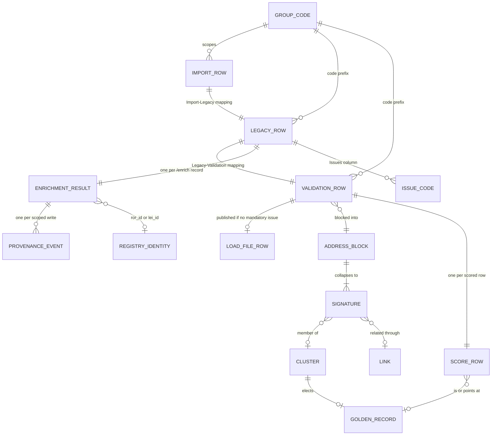
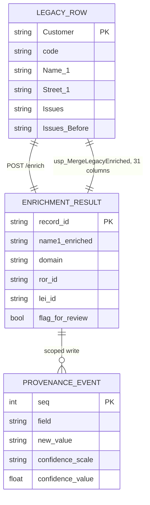
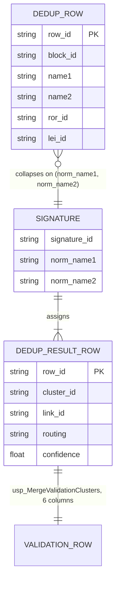
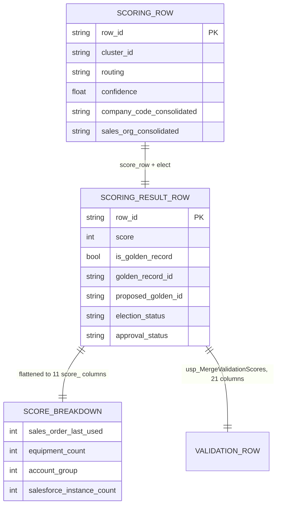

Generated: 2026-09-07 · Commit: 86d173b8a4d715a619b0a2656986c145da7fa81e · Branch: feature/llm-fixes · Pass: 05

# Pass 05 — Data model

Every schema the system reads or writes at this commit: the four DATAshaper (DS) table
layers, the load file, the workbooks each file endpoint emits, and every request and
response model the service declares. Column names are reproduced verbatim, including
their spacing and capitalisation, because the join between the service and the database
is by header string and a space is load-bearing.

`Evidence` in the tables below is one of:

| class | meaning |
|---|---|
| `code` | a Python declaration in this repository |
| `SQL` | a `sql/*.sql` merge procedure at this commit |
| `ADF` | an `adf/*.json` pipeline at this commit |
| `output` | observed in a workbook under `data/eval/` |
| `external` | `docs/thesis/CONTEXT-EXTERNAL.md` or a `Datashaper-Tutorial-Part*.txt` transcript — outside the repository's control, inheriting that document's `[EXPORT]` / `[OBSERVED]` / `[AUTHOR]` markers |

Sections: §1 evidence limits · §2 the `code` column and group-code scoping · §3 the DS
table progression · §4 file schemas · §5 request/response models · §6 identifiers ·
§7 provenance · §8 ER overview · §9 detail figures · §10 discrepancies.

## 0. Method

The tree at this commit carries modifications to the Pass 00–04 outputs in this same
set. No source, SQL, ADF or data file is modified, so `86d173b` is the state every
citation below refers to.

```
$ git status --porcelain
 M docs/thesis/00_INVENTORY.md
 M docs/thesis/01_TRACEABILITY.md
 M docs/thesis/02_ARCHITECTURE.md
 M docs/thesis/03_ALGORITHMS.md
 M docs/thesis/03b_EXEMPLARS.md
 M docs/thesis/04_PARAMETERS.md
$ git rev-parse HEAD
86d173b8a4d715a619b0a2656986c145da7fa81e
$ git rev-parse --abbrev-ref HEAD
feature/llm-fixes
$ date -I
2026-09-07
```

---

## 1. What is and is not evidenced for the persisted tables

No DDL for the Import, Legacy, Validation or load-file tables exists in this repository.

```
$ grep -rln "CREATE TABLE\|ALTER TABLE" --include="*.sql" --include="*.py" --include="*.md" .
(no output)
```

The DS layers are therefore reconstructed from three repository sources and one external
one:

| source | what it establishes | limit |
|---|---|---|
| ADF `sqlReaderQuery` projections (`adf/deduplication_pipeline.json:21`, `adf/scoring_pipeline.json:21`, `adf/enrichment_pipeline.json:21`, `:68`, `adf/issues_pipeline.json:21`) | that a named column **exists** and is read | two of the five read `SELECT *`, which enumerates nothing |
| merge-procedure `OPENJSON … WITH` blocks and their `MERGE` targets (`sql/*.sql`) | that a named column exists and is **written**, and its SQL type as declared for the *source* projection | the declared type belongs to the temp table `#src`, not to the target column |
| the service's own models (`api/models.py`, `dedup/models.py`, `dedup/scoring.py`) | the header string the service **binds** on | the service reads a payload, not a table |
| `docs/thesis/CONTEXT-EXTERNAL.md`, `Datashaper-Tutorial-Part1–3.txt` | the layer progression, the load-file concept, the studio views | [OBSERVED] 2026-08-16, not re-observed since; three of its ADF quotations are superseded by the exported files (`02_ARCHITECTURE.md:25`, ⚠-24) |

⚠ Every column type, nullability, length and key constraint on the four DS tables is
`⚠ NOT EVIDENCED` in this repository. Nothing below asserts one. Where an SQL type
appears it is the type the merge procedure declares for its own `#src` projection, cited
as such.

---

## 2. The `code` column and the group-code prefix convention

### 2.1 The convention

Every row in Legacy and Validation carries a `code` column whose value is
`<groupcode>_<sourcekey>`. The convention is stated identically in all four merge
procedures and is the mechanism by which one import is addressed inside a table that
holds every import under an entity.

| statement | evidence |
|---|---|
| `-- Group code is scoped by the code prefix: <groupcode>_<source key>` | `sql/usp_merge_legacy_enriched.sql:26`, `sql/usp_merge_legacy_issues.sql:35`, `sql/usp_merge_validation_clusters.sql:30`, `sql/usp_merge_validation_scores.sql:30` |
| the entity is the SQL **schema** name; the group code identifies one import; Legacy and Validation hold rows from all group codes under the entity | `docs/thesis/CONTEXT-EXTERNAL.md:26–28` (external, [OBSERVED]) |
| observed values `TEST7_41000009`, `TEST10_42000001`, `TEST10_44000003` | `docs/thesis/CONTEXT-EXTERNAL.md:34–35` (external, [OBSERVED]) |
| entity `test_77`, group codes `TEST2`…`TEST10` | `docs/thesis/CONTEXT-EXTERNAL.md:21–23` (external, [OBSERVED]) |

The separator is an underscore, which is also the SQL `LIKE` single-character wildcard.
Every predicate in the system therefore escapes it:

```sql
DECLARE @pat NVARCHAR(60) = LTRIM(RTRIM(@chrGroupCode)) + N'\_%';
DECLARE @esc NCHAR(1) = N'\';
```
`sql/usp_merge_legacy_enriched.sql:27–28`, and identically at
`sql/usp_merge_legacy_issues.sql:36–37`, `sql/usp_merge_validation_clusters.sql:31–32`,
`sql/usp_merge_validation_scores.sql:31–32`.

### 2.2 Where the predicate appears

| site | predicate | evidence |
|---|---|---|
| enrichment offset driver | `WHERE [code] LIKE '@{pipeline().parameters.chrGroupCode}\_%' ESCAPE '\'` | `adf/enrichment_pipeline.json:21` |
| enrichment page read | same, plus `ORDER BY [code] OFFSET … ROWS FETCH NEXT 30 ROWS ONLY` | `adf/enrichment_pipeline.json:68` |
| issues read | same, plus `ORDER BY [code]` | `adf/issues_pipeline.json:21` |
| clustering read | same, over `[@{…chrEntity}].Validation` | `adf/deduplication_pipeline.json:21` |
| scoring read | same, over `[@{…chrEntity}].Validation` | `adf/scoring_pipeline.json:21` |
| all four merges, pre-flight count | `SELECT @c = COUNT(*) FROM <tgt> WHERE [code] LIKE @pat ESCAPE @esc` | `sql/usp_merge_legacy_enriched.sql:31`, `usp_merge_legacy_issues.sql:40`, `usp_merge_validation_clusters.sql:35`, `usp_merge_validation_scores.sql:35` |
| all four merges, `MERGE … ON` | `AND tgt.[code] LIKE @pat ESCAPE @esc` alongside the `Customer` match | `sql/usp_merge_legacy_enriched.sql:86`, `usp_merge_legacy_issues.sql:66`, `usp_merge_validation_clusters.sql:63`, `usp_merge_validation_scores.sql:78` |

`code` is the only column that carries the group code. It is not projected into any
service payload: no request or response model in this repository declares a `code`
field, and no merge procedure writes it. The service is group-code-blind by
construction — scoping is entirely the caller's and the procedure's responsibility.

### 2.3 The join key is `Customer`, not `code`

Every merge matches on `Customer` **and** the `code` prefix, never on `code` alone.

| procedure | join predicate | evidence |
|---|---|---|
| `usp_MergeLegacyEnriched` | `tgt.Customer = src.Customer AND tgt.[code] LIKE @pat` | `sql/usp_merge_legacy_enriched.sql:86` |
| `usp_MergeLegacyIssues` | `tgt.[Customer] = src.[record_id] AND tgt.[code] LIKE @pat` | `sql/usp_merge_legacy_issues.sql:66` |
| `usp_MergeValidationClusters` | `tgt.Customer = src.row_id AND tgt.[code] LIKE @pat` | `sql/usp_merge_validation_clusters.sql:63` |
| `usp_MergeValidationScores` | `tgt.Customer = src.Customer AND tgt.[code] LIKE @pat` | `sql/usp_merge_validation_scores.sql:78` |

All four are `WHEN MATCHED` only — no `WHEN NOT MATCHED` clause exists in any of them,
so a merge updates and never inserts (`02_ARCHITECTURE.md:457–459`).

⚠ `record_id` on the `/issues/json` response is `(customer or ecc_customer_number or
"").strip()` (`api/models.py:52–56`, `:57–60`; property at `api/models.py:242–244`), so a record carrying
neither identifier yields `""`. `usp_MergeLegacyIssues` joins that value against
`tgt.[Customer]` (`sql/usp_merge_legacy_issues.sql:66`); an empty string matches no row
under the `code` predicate, so such a record's issues are silently not written.

---

## 3. The DS table progression

`Import (bronze) → Legacy (silver) → Validation (gold) → load file`
(`docs/thesis/CONTEXT-EXTERNAL.md:343`, external). Mapping is configured separately for
Import→Legacy and Legacy→Validation, and mappings may be bound to a group code or left
universal (`:343–345`, external).

### 3.1 Import

⚠ NOT EVIDENCED. No repository artefact names a single Import-table column. No ADF
Lookup reads Import; no merge procedure writes it. The transcripts describe the layer's
existence and its mapping step (`Datashaper-Tutorial-Part1.txt:74`, `:485`;
`Datashaper-Tutorial-Part2.txt:410`) and nothing more. The columns are whatever the
uploaded preprocessed file carries (workflow step 2,
`docs/thesis/CONTEXT-EXTERNAL.md:419`, external).

### 3.2 Legacy — `dp_legacy.[<entity>].Legacy`

Target resolved as `N'dp_legacy.' + QUOTENAME(@chrEntity) + N'.Legacy'`
(`sql/usp_merge_legacy_enriched.sql:29`, `sql/usp_merge_legacy_issues.sql:38`).

**Read.** Both Legacy readers project `SELECT *`
(`adf/enrichment_pipeline.json:68`, `adf/issues_pipeline.json:21`), so the table's full
column list is not enumerable from this repository. What *is* enumerable is the set of
header strings the service binds when that row arrives as JSON — the 41 fields of
`EnrichmentRecord` (§5.1). A Legacy column whose header is not among those aliases is
read by neither `/enrich` nor `/issues` detection.

**Written — columns evidenced by the merge procedures.**

| Legacy column | written by | write rule | evidence |
|---|---|---|---|
| `Name 1`, `Name 2`, `Name 3`, `Name 4` | `usp_MergeLegacyEnriched` | preserve incumbent on blank | `sql/usp_merge_legacy_enriched.sql:86` |
| `Domain`, `Department Domain` | same | preserve on blank | `:86` |
| `Search Term 1`, `Search Term 2` | same | preserve on blank | `:86` |
| `Care Of`, `Contact`, `Email` | same | preserve on blank | `:86` |
| `Street 1`, `House Number`, `Street 2`, `Street 3`, `Street 4`, `Street 5` | same | preserve on blank | `:86` |
| `PO Box`, `Suite`, `Building`, `Floor`, `Room`, `Unit`, `Mail Stop`, `Unloading`, `Mail Code` | same | preserve on blank | `:86` |
| `Record Type`, `ROR ID`, `LEI ID` | same | **overwrite unconditionally** | `:86` (⚠-29, Pass 02) |
| `Flag for Review`, `Flag Reason` | same | overwrite unconditionally | `:86` |
| `Issues` **or** `Issues Before` | `usp_MergeLegacyIssues` | overwrite with the `"; "`-joined code list | `sql/usp_merge_legacy_issues.sql:66` |
| `Customer` | — | join key, never written | `:86`, `:66` |
| `code` | — | scoping predicate, never written | `:86`, `:66` |

31 value columns from the enrichment merge, plus one issues column. The preserve-on-blank
form is `COALESCE(NULLIF(LTRIM(RTRIM(src.[col])), SPACE(0)), tgt.[col])`; `SPACE(0)` is
used in place of a quoted empty string so the dynamic text contains no nested quotes
(`sql/usp_merge_legacy_enriched.sql:83–84`).

⚠-35 (naming) — the source JSON path is `$."Unloading Point"` and the target column is
`[Unloading]` (`sql/usp_merge_legacy_enriched.sql:72`, `:86`). The response column
(`api/output_columns.py:75`) and the Legacy column do not share a name; every other
merged pair does.

**The issues column.** `@target_column` is constrained to exactly two values:

```sql
IF @target_column NOT IN (N'Issues Before', N'Issues')
BEGIN
    THROW 50000, N'target_column must be Issues Before or Issues.', 1;
END;
```
`sql/usp_merge_legacy_issues.sql:14–17`, default `N'Issues'` at `:5`. The value written
is the record's `issues` array flattened by
`STRING_AGG(x.[value], N'; ') WITHIN GROUP (ORDER BY CAST(x.[key] AS INT))`
(`:53–55`), i.e. the array's own order preserved, `N''` for a record with no issues
(`ISNULL`, `:53`). That order is catalogue order — `detect_issues` returns
`[code for code in ISSUE_CATALOGUE if code in found]`
(`enrichment/issue_detection.py:1710`, docstring `:1665`).

The two columns are visible in the eval fixtures: `S2_pre.xlsx` and `S2_post.xlsx` both
carry an `Issues` header (`data/eval/S2_pre.xlsx`, `data/eval/S2_post.xlsx`).

### 3.3 Validation — `dp_validation.[<entity>].Validation`

Target resolved as `QUOTENAME(@db) + N'.' + QUOTENAME(@chrEntity) + N'.Validation'` with
`@db = N'dp_validation'` (`sql/usp_merge_validation_clusters.sql:8`, `:33`;
`sql/usp_merge_validation_scores.sql:8`, `:33`). Both declarations carry the author's
own marker `-- <<< confirm` at `:8`, so the database name is ⚠ UNVERIFIED against the
deployed factory. The two ADF Lookups name no database at all
(`FROM [@{…chrEntity}].Validation`, `adf/deduplication_pipeline.json:21`,
`adf/scoring_pipeline.json:21`), taking it from the unexported linked service (⚠-34,
Pass 02).

**Read by the clustering Lookup** — 11 columns, aliased to `DedupRow` field names:

| Validation column | alias | evidence |
|---|---|---|
| `Customer` | `row_id` | `adf/deduplication_pipeline.json:21` |
| `[Block ID]` | `block_id` | same |
| `[Name 1]` | `name1` | same |
| `[Name 2]` | `name2` | same |
| `[Street 1]` | `street` | same |
| `[House Number]` | `house_no` | same |
| `[Postal Code]` | `postal_code` | same |
| `City` | `city` | same |
| `[Country/Region Key]` | `country` | same |
| `[ROR ID]` | `ror_id` | same |
| `[LEI ID]` | `lei_id` | same |

**Read by the scoring Lookup** — 23 columns:

| Validation column | alias | evidence |
|---|---|---|
| `Customer` | `row_id` | `adf/scoring_pipeline.json:21` |
| `[Cluster ID]`, `[Confidence]`, `[Routing]`, `[Reasoning]` | unchanged (`Confidence`, `Routing`, `Reasoning` unbracketed in the alias) | same |
| `Sales_Order_Last_Used`, `Sales_Order_Total_Count`, `Sales_Order_Partner_Last_Used`, `Sales_Order_Partner_Total_Count`, `Equipment_Total_Count` | unchanged | same |
| `SleepingCustomer`, `CustomerStatus`, `[Account group]` | unchanged | same |
| `Company_Code_Consolidated`, `Sales_Org_Consolidated` | unchanged | same |
| `SF_ID_Biosystems`, `SF_ID_AXS`, `SF_ID_3` … `SF_ID_8` | `sf1` … `sf8` | same |

The eight `SF_ID_*` spellings match `dedup/scoring_xlsx.py:66–70` exactly.

**Written by the two Validation merges:**

| Validation column | written by | source JSON path | evidence |
|---|---|---|---|
| `[Block ID]` | `usp_MergeValidationClusters` | `$.block_id` | `sql/usp_merge_validation_clusters.sql:52`, `:63` |
| `[Cluster ID]` | same | `$.cluster_id` (a content-hash string, not an INT — comment at `:53`) | `:53`, `:63` |
| `[Routing]` | same | `$.routing` | `:54`, `:63` |
| `[Signature ID]` | same | `$.signature_id` | `:55`, `:63` |
| `[Confidence]` | same | `$.confidence` (`FLOAT`) | `:56`, `:63` |
| `[Reasoning]` | same | `$.reasoning` (`NVARCHAR(MAX)`) | `:57`, `:63` |
| `[score_final]` | `usp_MergeValidationScores` | `$.score_final` | `sql/usp_merge_validation_scores.sql:52`, `:78` |
| `[Company_Code_Count]`, `[Sales_Org_Count]`, `[Salesforce_Instance_Count]` | same | `$.…` (`INT`) | `:53–55`, `:78` |
| `[is_golden_record]` | same | `$.is_golden_record` (`BIT`) | `:56`, `:78` |
| `[golden_record_id]`, `[proposed_golden_id]` | same | `$.…` | `:57–58`, `:78` |
| `[election_status]`, `[approval_status]` | same | `$.…` (`NVARCHAR(30)`) | `:59–60`, `:78` |
| `[scored_with_weights_version]` | same | `$.…` | `:61`, `:78` |
| the eleven `[score_*]` criterion columns | same | `$.score_*` (`FLOAT`) | `:62–72`, `:78` |

Six columns from clustering, 21 from scoring, both unconditional assignments (no
`COALESCE` guard on either statement).

Note that `[Block ID]` is both read (`adf/deduplication_pipeline.json:21`) and written
(`sql/usp_merge_validation_clusters.sql:63`) by the clustering leg: the service accepts
an incoming block id and echoes or derives one (`dedup/signatures.py:158–162`).

### 3.4 Load file

⚠ Evidenced only externally. The load file is the terminus of the progression
(`docs/thesis/CONTEXT-EXTERNAL.md:343`, external). The transcripts state:

| statement | evidence |
|---|---|
| a default load file is created automatically with the same layout as the Validation table, mapped one-to-one | `Datashaper-Tutorial-Part3.txt:554–557` (external) |
| the load file contains "all the records without mandatory issues" | `Datashaper-Tutorial-Part3.txt:575` (external) |
| load files are stored per entity in a separate database, with a per-day copy per environment and one "latest" | `Datashaper-Tutorial-Part3.txt:566–572` (external) |
| multiple load files per entity are configurable, each with its own mapping (e.g. a Salesforce-shaped one) | `Datashaper-Tutorial-Part3.txt:587–599` (external) |
| technical (SAP) column names may be required and would be a further mapping | `Datashaper-Tutorial-Part1.txt:701` (external) |

No load-file column is evidenced in this repository, and no code, SQL or pipeline here
reads or writes one. The `mandatory` attribute the load-file filter depends on is
declared per issue code on the service side — `IssueDefinition.mandatory`, projected to
the DS severity by `IssueDefinition.severity` returning `"Error"` or `"Warning"`
(`enrichment/issue_detection.py:230`, `:245–248`).

---

## 4. File schemas

### 4.1 The enriched workbook — `POST /enrich/file`

One column per entry in `RESPONSE_COLUMNS`, in declaration order, followed by the input
columns nothing consumed (`api/routes.py:385–428`). 69 columns.

```
$ python3 -c "from api.output_columns import RESPONSE_COLUMNS; print(len(RESPONSE_COLUMNS))"
69
```

| # | column | result field | block |
|---|---|---|---|
| 1 | `Customer` | `record_id` | identity |
| 2–9 | `ECC Customer Number`, `Central Deletion Flag`, `Comments`, `Account group`, `Company Code`, `Sales Organization`, `Distribution Channel`, `Division` | carried verbatim | administrative |
| 10–14 | `Name 1` … `Name 5` | `name1_enriched` … `name5_enriched` | name block |
| 15–16 | `Operating Name`, `Operating Name Provenance` | `operating_name`, `operating_name_provenance` | page-read witness |
| 17–18 | `Suggested Name`, `Suggestion Source` | `suggested_name`, `suggestion_source` | steward-facing |
| 19–20 | `Domain`, `Department Domain` | `domain`, `department_domain` | web |
| 21–23 | `Care Of`, `Contact`, `Email` | `care_of_enriched`, `contact_enriched`, `email_enriched` | contact |
| 24–38 | `Street 1`, `House Number`, `Street 2`–`Street 5`, `PO Box`, `Suite`, `Building`, `Floor`, `Room`, `Unit`, `Mail Stop`, `Unloading Point`, `Mail Code` | `street_cleaned`, `house_number`, `street_2_cleaned` … , `po_box_extracted`, `suite` … `mail_code` | address stage 1 |
| 39–55 | `Country/Region Key`, `Postal Code`, `City`, `Region`, `Language Key`, `Reconciliation acct`, `Tax Jurisdiction`, `Central delivery block`, `Delivery Priority`, `Shipping Conditions`, `Delivering Plant`, `Created On`, `Created By`, `VAT Registration No.`, `Search Term 1`, `Search Term 2`, `Terms of Payment` | same-named result fields | geography + remaining SAP |
| 56–61 | `Flag for Review`, `Flag Codes`, `Flagged Fields`, `Flag Reason`, `Error`, `Record Type` | `flag_for_review`, `flag_codes`, `flagged_fields`, `flag_reason`, `error`, `record_type` | review metadata |
| 62–63 | `ROR ID`, `LEI ID` | `ror_id`, `lei_id` | registry ids |
| 64–69 | `Name 1 Provenance`, `Name 2 Provenance`, `Domain Provenance`, `Record Type Provenance`, `ROR ID Provenance`, `LEI ID Provenance` | the six derived scalars | provenance (Scheme B) |

Declaration: `api/output_columns.py:22–121`. The same mapping is the serialization-alias
generator on `EnrichmentResult` (`api/models.py:329–335`), so the JSON response body and
the workbook carry identical column names by construction.

Writer behaviour:

| rule | evidence |
|---|---|
| list-valued fields (`flag_codes`, `flagged_fields`) are joined with `"; "`; an empty list becomes `None` | `api/routes.py:372–383` |
| input columns not consumed and not re-emitted are appended verbatim after the 69, deduplicated by normalised header | `api/routes.py:351–370`, applied `:406–410` |
| passthrough values join **by position**, relying on results arriving in input order | `api/routes.py:392–395`, `:417–421` |
| every non-active sheet of the upload (e.g. `Weights`) is copied over | `api/routes.py:326–349`, called `:429` |
| header row detection skips leading fully-empty rows; a blank cell is dropped, not stored | `api/routes.py:252–281` |

⚠-36 — `Terms of Payment` is a declared output column (`api/output_columns.py:94`) fed
only by `EnrichmentRecord.terms_of_payment_contact`, whose aliases are
`"Terms of Payment Contact"` and `"terms_of_payment_contact"` (`api/models.py:208–211`;
copied to the result at `enrichment/orchestrator.py:741`). A file whose column is spelled
`Terms of Payment` binds nothing, and because that header is already in the output set it
is not appended as a passthrough either (`api/routes.py:355–356`). The value is dropped.

```
$ python3 -c "from api.routes import _norm_header,_input_alias_to_field; m=_input_alias_to_field(); print(m.get(_norm_header('Terms of Payment')), m.get(_norm_header('Terms of Payment Contact')))"
None terms_of_payment_contact
```

Confirmed in the fixtures: `data/eval/S2_pre.xlsx` carries `Terms of Payment = NT30` on
every row read; `data/eval/S2_post.xlsx` carries an empty `Terms of Payment` column.

⚠-37 — a workbook may carry a repeated header. `data/eval/S1_post.xlsx` carries
`Flag Codes` twice and `Issues` twice; `data/eval/S1_pre.xlsx` carries `Issues` twice and
one `None` header. `_parse_xlsx` builds one dict per row keyed by header
(`api/routes.py:268–277`), so of two identically-named columns the **rightmost non-empty**
value survives and the other is unreachable. The file schema is a list, the parsed row is
a set; the two are reconciled silently.

### 4.2 The issues workbook — `POST /issues`

The uploaded sheet echoed verbatim with exactly one appended column, `Issues`, holding
the `"; "`-joined codes (empty string when clean) — `api/routes.py:430–454`, header row
at `:445`, join at `:449`. Output filename `<stem>_issues.xlsx` (`:874`).

### 4.3 The comparison workbook — `POST /issues/compare`

Three sheets (`api/routes.py:503–698`):

| sheet | content | evidence |
|---|---|---|
| `Sheet` (active, "Issue Reduction Summary") | matched/only-before/only-after record counts, then three segment blocks — **Reduced** (G1–G5, the reduction metric), **Expected to persist** (G6), **Verification** (G7) — then a per-code table `Code, Name, Group, Segment, Before, After, Delta` | `api/routes.py:605–671`, header row `:663` |
| `Per Record` | one row per matched record: before codes, after codes, resolved, introduced | `api/routes.py:673–686` |
| `Remaining Issues` | `Code, Name, Group, Segment, Customer` — one row per record still carrying each code | `api/routes.py:688–693` |

The segmentation rule is stated in the builder's own docstring
(`api/routes.py:507–529`): the headline percentage is computed over G1–G5 alone.

### 4.4 The clustered workbook — `POST /api/dedup/file`

The uploaded sheet echoed verbatim plus appended result columns, joined by `row_id`
(`api/routes.py:1259–1325`):

| set | columns | evidence |
|---|---|---|
| result columns, v1 | `Cluster ID`, `Routing`, `LLM Flag`, `Confidence`, `Reasoning` | `api/routes.py:1204` |
| result columns, v2 (any `DEDUP_V2_*` flag on) | `Cluster ID`, **`Link ID`**, `Routing`, `LLM Flag`, `Confidence`, `Reasoning` | `api/routes.py:1212–1214`, gated by `dedup.flags.v2_any()` (`dedup/flags.py:56–62`) |
| `Dedup Debug` sheet, v1 | `row_id`, `Cluster ID`, `Block ID`, `Signature ID` | `api/routes.py:1205–1206` |
| `Dedup Debug` sheet, v2 | `row_id`, `Cluster ID`, `Link ID`, `Block ID`, `Signature ID` | `api/routes.py:1215–1217` |
| `Run` sheet | `setting` / `value` pairs from `_dedup_run_metadata` | `api/routes.py:1220`, `:1296–1299`, builder `:1223` |

A row the adjudicator did not return gets blank result cells rather than being dropped
(`api/routes.py:1304–1306`). Both column sets are observable: `data/eval/
dedup_STRESS_200_v1_enriched_dedup.xlsx` carries the v1 set plus a `Dedup Debug` sheet of
`row_id, Cluster ID, Block ID, Signature ID`; `data/eval/stress_200_scored.xlsx` carries
the v2 set including `Link ID` in both the data sheet and `Dedup Debug`.

### 4.5 The scored workbook — `POST /api/dedup/score/file`

Edited **in place**: existing columns are located by normalised header name and written,
missing ones appended; every other sheet and column survives
(`api/routes.py:1524–1530`, writer `dedup/scoring_xlsx.py:284–291`).

| set | columns | evidence |
|---|---|---|
| input columns bound | `Customer` (or `Customer No.`), `Account group` (or `Customer Account Group`), `Sales_Order_Last_Used`, `Sales_Order_Total_Count`, `Sales_Order_Partner_Last_Used`, `Sales_Order_Partner_Total_Count`, `Equipment_Total_Count`, `SleepingCustomer`, `CustomerStatus`, `Company_Code_Consolidated`, `Sales_Org_Consolidated` | `dedup/scoring_xlsx.py:41–61` |
| Salesforce slots | `SF_ID_Biosystems`, `SF_ID_AXS`, `SF_ID_3` … `SF_ID_8` | `dedup/scoring_xlsx.py:66–70` |
| clustering columns read | `Routing` + `Cluster ID` preferred as a pair | `dedup/scoring_xlsx.py:162–168` |
| eleven criterion columns | `score_SalesOrderLastUsed`, `score_SalesOrderCount`, `score_SalesOrderPartnerLastUsed`, `score_SalesOrderPartnerCount`, `score_EquipmentCount`, `score_SleepingCustomer`, `score_CustomerStatus`, `score_AccountGroup`, `score_CompanyCodeCount`, `score_CombinedPresence`, `score_SalesforceInstances` | `dedup/scoring.py:67–79` (shared with the JSON model) |
| derived counts | `Company_Code_Count`, `Sales_Org_Count`, `Salesforce_Instance_Count` | `dedup/scoring_xlsx.py:74` |
| election columns | `is_golden_record`, `golden_record_id`, `proposed_golden_id`, `election_status`, `approval_status` | `dedup/scoring_xlsx.py:75–78` |
| `Weights` sheet | read as a wholesale override of `dedup/weights.json`; a broken sheet is ignored wholesale with a warning | `dedup/scoring_xlsx.py:29`, endpoint docstring `api/routes.py:1526–1530` |
| `Issues` sheet | `row_id`, `cluster_id`, `issue_type`, `detail` | `dedup/scoring_xlsx.py:31`, written `:331–333` |

All of these are observable in `data/eval/stress_200_scored.xlsx`, which additionally
carries `score_final` and `scored_with_weights_version` / `scored_with_reference_year`.

### 4.6 The consolidated extract — `POST /api/preprocess/consolidate/file`

Two appended columns, located or appended by header name so a re-run overwrites rather
than duplicating (`api/routes.py:1035–1039`):

| constant | value | evidence |
|---|---|---|
| `CUSTOMER_HEADER` | `"Customer"` | `dedup/consolidate.py:50` |
| `COMPANY_CODE_HEADER` | `"Company Code"` | `dedup/consolidate.py:51` |
| `SALES_ORG_HEADER` | `"Sales Organization"` | `dedup/consolidate.py:52` |
| `COMPANY_CODE_CONSOLIDATED_HEADER` | `"Company_Code_Consolidated"` | `dedup/consolidate.py:57` |
| `SALES_ORG_CONSOLIDATED_HEADER` | `"Sales_Org_Consolidated"` | `dedup/consolidate.py:58` |
| `CONSOLIDATED_DELIMITER` | `","` | `dedup/consolidate.py:45` |

The two written headers are exactly the two the scoring stage binds
(`dedup/scoring_xlsx.py:57–59`), which is the reason the comment at
`dedup/consolidate.py:36` names the writer and the reader together.

---

## 5. Request and response models

Twenty-seven Pydantic v2 models are declared outside `tests/`:

```
$ grep -rn "class .*(BaseModel)" --include="*.py" . | grep -v "/tests/" | wc -l
      27
```

### 5.1 `POST /enrich` — `api/routes.py:106`

**Request.** `EnrichmentRequest` (`api/models.py:311–314`): `records` (≥1
`EnrichmentRecord`) and `options` (`EnrichmentOptions`).

`EnrichmentOptions` (`api/models.py:304–308`): `max_concurrency` (int, default 5,
1 ≤ n ≤ 20), `serp_provider` (`"serpapi"` | `"duckduckgo"`, default `"serpapi"`),
`skip_tier` (optional int).

`EnrichmentRecord` (`api/models.py:31–302`) — 41 fields, every one optional including the
identifier (`api/models.py:232–235`), `populate_by_name=True` (`:49`). Each field's
primary alias is the SAP header string; a snake_case alias is accepted for compatibility.

| field | primary alias | further aliases | file:line |
|---|---|---|---|
| `customer` | `Customer` | `customer`, `record_id` | `api/models.py:52–56` |
| `ecc_customer_number` | `ECC Customer Number` | snake | `:57–60` |
| `central_deletion_flag` | `Central Deletion Flag` | snake | `:61–64` |
| `comments` | `Comments` | snake | `:65–68` |
| `account_group` | `Account group` | snake | `:69–72` |
| `company_code` | `Company Code` | snake | `:73–76` |
| `sales_organization` | `Sales Organization` | snake | `:77–80` |
| `distribution_channel` | `Distribution Channel` | snake | `:81–84` |
| `division` | `Division` | snake | `:85–88` |
| `name_1` … `name_5` | `Name 1` … `Name 5` | `name1` … `name5` | `:91–110` |
| `street_1` | `Street 1` | `street1`, `street` | `:113–117` |
| `house_number` | `House Number` | snake | `:118–121` |
| `street_2` … `street_5` | `Street 2` … `Street 5` | `street2` … `street5` | `:122–137` |
| `po_box` | `PO Box` | snake | `:138–141` |
| `country_region_key` | `Country/Region Key` | `country` | `:142–145` |
| `postal_code` | `Postal Code` | `zip` | `:146–149` |
| `city` | `City` | snake | `:150–153` |
| `region` | `Region` | `state` | `:154–157` |
| `language_key` | `Language Key` | snake | `:160–163` |
| `reconciliation_acct` | `Reconciliation acct` | snake | `:164–167` |
| `tax_jurisdiction` | `Tax Jurisdiction` | snake | `:168–171` |
| `central_delivery_block` | `Central delivery block` | snake | `:172–175` |
| `delivery_priority` | `Delivery Priority` | snake | `:176–179` |
| `shipping_conditions` | `Shipping Conditions` | snake | `:180–183` |
| `delivering_plant` | `Delivering Plant` | snake | `:184–187` |
| `created_on` | `Created On` | snake | `:188–191` |
| `created_by` | `Created By` | snake | `:192–195` |
| `vat_registration_no` | `VAT Registration No.` | snake | `:196–199` |
| `search_term_1`, `search_term_2` | `Search Term 1`, `Search Term 2` | snake | `:200–207` |
| `terms_of_payment_contact` | `Terms of Payment Contact` | snake | `:208–211` |
| `care_of` | `care_of` | `Care Of`, `c/o` | `:220–223` |
| `contact` | `contact` | `Contact` | `:224–227` |
| `email` | `email` | `Email` | `:228–231` |

The last three have no SAP column; they are auxiliary inputs the Tier 2A contact lane and
the c/o handling consume when present, recovered from the Name block otherwise
(`api/models.py:213–219`). Fifteen read-only compatibility properties expose the
normalised names the orchestrator uses — `record_id`, `name1`–`name5`, `street`,
`street1`–`street5`, `state`, `zip`, `country` (`api/models.py:241–302`).

**Response.** `EnrichmentResponse` (`api/models.py:868–871`): `results`
(`List[EnrichmentResult]`) and `summary` (`EnrichmentSummary`).

`EnrichmentResult` (`api/models.py:321–695`) — 98 declared fields, of which 26 carry
`exclude=True` and 72 serialise:

```
$ python3 -c "from api.models import EnrichmentResult as R; f=R.model_fields; print(len(f), sum(1 for x in f.values() if x.exclude))"
98 26
```

The 69 serialising fields named in `RESPONSE_COLUMNS` are the file columns of §4.1. The
three remaining serialising fields are nested and deliberately absent from the file
schema:

| field | shape | evidence |
|---|---|---|
| `provenance` | `List[Dict[str, Any]]` — one event per write | `api/models.py:550`, rationale `:544–549` |
| `provenance_rejected` | `List[Dict[str, Any]]` — guard refusals only, capped per field per record | `api/models.py:556`, rationale `:551–555` |
| `provenance_rejected_omitted` | `Dict[str, int]` — count beyond the cap | `api/models.py:557` |

The 26 excluded fields are internal state kept for tier logic, the batch summary and the
tests (`api/models.py:559–562`). The load-bearing ones:

| field | type | why it is excluded | file:line |
|---|---|---|---|
| `name2_registry_id` | `Optional[str]` | a unit's own registry id would converge the wrong rows if exported | `api/models.py:512`, rationale `:502–511` |
| `name1_supplied` | `Optional[str]` | the input, already the caller's; carried so batch consensus need not reconstruct it from the log | `:528`, rationale `:514–527` |
| `tier_used`, `tier2_mode` | `Literal[1,2,3]`, `Optional[Literal[…]]` | internal tier accounting | `:563–564` |
| `confidence` | `Literal["high","medium","low","none"]` | a coarse projection over non-commensurable scales, kept only for backward compatibility | `:580`, rationale `:565–579` |
| `source` | 14-value `Literal` incl. `"batch_consensus"` | telemetry | `:581–592` |
| `source_url`, `website_url`, `domain_verified_by`, `domain_rejected` | — | derivable or telemetry-only | `:593–604` |
| `tier1_retry_attempted`, `tier1_page_retry_attempted`, `tier1_retry_hit` | — | retry budgets | `:612–617` |
| `unchanged_name1_state` | `Optional[Literal["unchanged-verified","unchanged-confirmed","unchanged-unresolved"]]` | same fact as `name1_provenance`, in countable form | `:620–622` |
| `record_type_source`, `routing_type`, `routing_type_mismatch` | — | classifier and routing diagnostics | `:631–641` |
| `contact_used`, `name2_match_result`, `use_cases_triggered`, `enrichment_status`, `duration_ms` | — | per-record diagnostics | `:642–647` |
| `flag_scopes`, `flag_details`, `flag_notes`, `flag_low_confidence` | `Dict`/`List` | already rendered into the three exported flag columns; kept so batch consensus can retract one code without re-deriving the rest | `:472–492` |

`EnrichmentResult` is **write-locked** on the six scoped fields: `__setattr__` raises
`UnattributedWriteError` for any of them, and the only write path is
`result.write(field, value, evidence)`, which appends the event and regenerates that
field's derived scalar from the log (`api/models.py:655–693`).

`EnrichmentSummary` (`api/models.py:697–866`) — 80 counters covering tier outcomes, the
LEI lane, Tier 1 retries, the three unchanged-Name-1 states, the page-read corroborator,
the Wikidata crosswalk and liveness lanes, the evidence cache, domain-ownership
provenance, Tier 2A/2B/3 counts and the batch-consensus pass. Two are not integers:
`evidence_network_calls_by_namespace` (`dict[str,int]`, `:810–812`) and
`consensus_fields_propagated` (`Dict[str,int]`, `:861`); `evidence_cache_frozen` is a
bool (`:808`).

**`POST /enrich/file`** (`api/routes.py:700–705`) takes the same content as a multipart
XLSX plus three query parameters — `max_concurrency` (1–20, default 5), `serp_provider`,
`skip_tier` — and returns `StreamingResponse` of the §4.1 workbook named
`<stem>_enriched.xlsx` (`:752`).

### 5.2 `POST /issues`, `/issues/json`, `/issues/compare`

| endpoint | request | response | file:line |
|---|---|---|---|
| `/issues` | multipart `UploadFile` (`.xlsx`/`.xlsm`) | `StreamingResponse` — §4.2 workbook | `api/routes.py:837–840` |
| `/issues/json` | `IssueDetectionRequest` | `IssueDetectionResponse` | `api/routes.py:883–884` |
| `/issues/compare` | two `UploadFile`s, `original` and `enriched` | `StreamingResponse` — §4.3 workbook | `api/routes.py:916–919` |

`IssueDetectionRequest` (`api/models.py:899–919`) declares one field: `records`,
`List[Dict[str, Any]]`, `min_length=1`. The records are **deliberately untyped**:
detection is column-aware — which keys are present is itself an input, and a typed model
cannot distinguish "absent" from "null" (`api/models.py:910–914`).

`IssueDetectionResult` (`api/models.py:921–930`): `record_id` (str; empty when the record
carries neither `Customer` nor `ECC Customer Number`) and `issues` (`List[str]`, catalogue
order, empty when clean). `IssueDetectionResponse` (`:932–937`): `results`, one per
request record in request order.

The vocabulary of `issues` is `ISSUE_CATALOGUE` — 43 declared entries keyed by code, each
an `IssueDefinition` carrying `code`, `group`, `name`, `field`, `mandatory`, `origin`,
`raised`, `remedy`, `status`, `reason` (`enrichment/issue_detection.py:224–247`,
catalogue `:260–423`). `EMITTED_CODES` is the live + unlisted subset (`:426–428`).
`group` is an attribute, not a prefix: `code.split("-")[0]` is unsafe and `issue_group()`
is the accessor (`:456–462`, stated `:25–30`). Groups: `QUALITY_GROUPS = ("G1"…"G5")`
(`:432`) and `VERIFICATION_GROUPS = ("G6","G7")`, which never enter a reduction figure
(`:446`). Pass 15 documents the catalogue per code.

### 5.3 `POST /api/dedup/cluster-block` — `api/routes.py:1330`

**Request.** `DedupRequest` (`dedup/models.py:74–81`): `rows`, ≥1 `DedupRow`.

`DedupRow` (`dedup/models.py:18–71`) — 21 fields, `populate_by_name=True` (`:27`), only
`row_id` required:

| field | type | role | file:line |
|---|---|---|---|
| `row_id` | `str` (required) | caller's stable key, echoed back verbatim | `dedup/models.py:29` |
| `block_id` | `Optional[str]` | address block; derived from the normalised `(country, postal_code, street, house_no)` when null | `:30–36` |
| `name1`, `name2` | `Optional[str]` | institution, department | `:37–38` |
| `name3`, `name4`, `name5` | `Optional[str]` | further sub-unit slots — the signature key reads all of them | `:42–44`, `dedup/signatures.py:65–77` |
| `street`, `house_no`, `postal_code`, `city`, `country` | `Optional[str]` | address | `:45–49` |
| `ror_id`, `lei_id` | `Optional[str]` | Phase 1 registry hints | `:50–51` |
| `enriched_name` | `Optional[str]` | Phase 1 official name | `:52` |
| `operating_name`, `suggested_name`, `record_type`, `ror_id_provenance`, `lei_id_provenance` | `Optional[str]` | Phase 1 columns added in v2 (C.4); consumed only when `DEDUP_V2_NAME2` is on | `:56–65`, `dedup/signatures.py:341–345` |
| `building` | `Optional[str]` | shown to the model as a hint; never reaches blocking or the signature key | `:70–71` |

**Response.** `DedupResponse` (`dedup/models.py:133–137`): `rows`
(`List[DedupResultRow]`) and `summary` (`DedupSummary`).

`DedupResultRow` (`dedup/models.py:88–112`) — 12 fields:

| field | type | semantics | file:line |
|---|---|---|---|
| `row_id` | `str` | echoed | `dedup/models.py:91` |
| `block_id` | `str` | resolved or derived | `:92` |
| `cluster_id` | `Optional[str]` | `"c_"` + 12 hex of sha256 over the sorted member `row_id`s; null when the row is in no duplicate cluster | `:96`, rationale `:93–95` |
| `link_id` | `Optional[str]` | same **organisation**, not the same record: two rows sharing a Link ID and no Cluster ID are related and not duplicates | `:101`, rationale `:97–100` |
| `routing` | `Literal["cluster","unique","manual_review"]` | | `:102` |
| `llm_flag` | `bool` | | `:103` |
| `signature_id` | `str` | | `:104` |
| `confidence` | `Optional[float]` | set only for a genuine LLM merge (≥2 distinct signatures) or an uncertain row; null for a unique row **and** for a pure identical-signature collapse | `:108`, rationale `:105–107` |
| `reasoning` | `Optional[str]` | | `:109` |
| `model`, `model_version`, `prompt_version` | `str` | run provenance | `:110–112` |

`DedupSummary` (`dedup/models.py:115–130`) — 12 counters: `blocks`, `rows_in`,
`distinct_signatures`, `clusters`, `rows_clustered`, `rows_unique`, `rows_manual_review`,
`llm_calls`, `errors`, plus the residue-nomination trio `candidates_generated`,
`rejected_with_reasoning`, `candidate_cap_exceeded_blocks`.

**`POST /api/dedup/file`** (`api/routes.py:1360–1363`) accepts the same rows as an XLSX,
binding either the SAP headers `/enrich/file` emits or the snake_case `DedupRow` names
(`:1367–1371`), and returns the §4.4 workbook.

### 5.4 `POST /api/dedup/score` — `api/routes.py:1437`

**Request.** `ScoringRequest` (`dedup/scoring.py:262–280`): `rows`
(`List[ScoringRow]`, default empty — an empty list is valid and returns a zeroed
summary, `:264–266`) and `weights` (optional dict, same structure as
`dedup/weights.json`; applied wholesale when valid, ignored wholesale with a warning when
malformed, `:270–279`).

`ScoringRow` (`dedup/scoring.py:98–259`) — 23 fields, `populate_by_name=True` (`:111`):

| field | input alias(es) | type | file:line |
|---|---|---|---|
| `row_id` | `Customer`, `Customer No.`, `row_id` (serialises as `Customer`) | `str` (required) | `dedup/scoring.py:120–125` |
| `cluster_id` | `Cluster ID` | `Optional[str]` | `:126–129` |
| `confidence` | `Confidence` | `Optional[float]` | `:130–137` |
| `routing` | `Routing` | `Optional[str]` — a `manual_review` is inherited by election and can never be upgraded | `:138–145` |
| `reasoning` | `Reasoning` | `Optional[str]` | `:146–153` |
| `last_order_year` | `Sales_Order_Last_Used` | `Scalar` | `:154` |
| `orders_in_last_used_year` | `Sales_Order_Total_Count`, `orders_in_last_used_year`, `order_count` | `Scalar` — a **within-year** count, not a lifetime total | `:160–167`, rationale `:155–159` |
| `partner_last_order_year` | `Sales_Order_Partner_Last_Used` | `Scalar` | `:168–170` |
| `partner_orders_in_last_used_year` | `Sales_Order_Partner_Total_Count` + two legacy names | `Scalar` | `:173–181` |
| `equipment_count` | `Equipment_Total_Count` | `Scalar` | `:182` |
| `sleeping_band` | `SleepingCustomer` | `Optional[str]` — plain `str`, not `Literal`, so one stray value cannot 422 the request | `:184`, rationale `:101–105` |
| `customer_status` | `CustomerStatus` | `Optional[str]` | `:186` |
| `account_group` | `Account group`, `Customer Account Group`, `account_group` | `Optional[str]` | `:188–195` |
| `company_code_consolidated` | `Company_Code_Consolidated` | `Optional[str]`, `","`- or `";"`-delimited | `:196–198` |
| `sales_org_consolidated` | `Sales_Org_Consolidated` | `Optional[str]`, same | `:199–201` |
| `sf1` … `sf8` | field names | `Optional[str]` — eight flat scalars, no list on the wire | `:204–211` |

Three validators shape the input: a legacy `salesforce_ids` list is spread across
`sf1..sf8` when no explicit `sf*` key is present (`:213–228`); Excel-native cell types are
stringified rather than rejected (`:230–248`); a blank or dirty `Confidence` cell is
coerced to `None`, which never gates (`:250–259`).

**Response.** `ScoringResponse` (`dedup/scoring.py:467–473`): `rows`, `summary`, and
`issues` (`List[DedupIssue]`).

`ScoringResultRow` (`dedup/scoring.py:282–412`) — 15 declared fields (13 serialising) plus
11 computed fields:

| field | alias | type | file:line |
|---|---|---|---|
| `row_id` | `Customer` | `str` | `dedup/scoring.py:302` |
| `cluster_id` | `Cluster ID` | `Optional[str]` | `:303` |
| `score` | `score_final` | `int` | `:304` |
| `company_code_count`, `sales_org_count`, `salesforce_instance_count` | `Company_Code_Count`, `Sales_Org_Count`, `Salesforce_Instance_Count` | `int` — **raw counts**, distinct from the points in the `score_*` columns | `:309–311`, rationale `:305–308` |
| `is_golden_record` | — | `bool` | `:312` |
| `golden_record_id`, `proposed_golden_id` | — | `Optional[str]` — a `manual_review` row leaves the first empty and keeps its computed winner only in the second | `:313–317` |
| `election_status` | — | `Literal["proposed","manual_review","unique"]` | `:318` |
| `approval_status` | — | `Optional[Literal["proposed","approved","rejected"]]` — the pipeline only ever writes `"proposed"` | `:322`, rationale `:319–321` |
| `scored_with_weights_version` | — | `Optional[str]` — 12-hex fingerprint of the weights used | `:325` |
| `scored_with_reference_year` | — | `Optional[int]` — the anchor year the two `*_last_used` ladders were scored against | `:331`, rationale `:326–330` |
| `score_breakdown` | — | `Dict[str,int]`, **excluded** — flattened into the eleven computed columns | `:336` |
| `warnings` | — | `List[str]`, **excluded** | `:338` |

The eleven computed fields project `score_breakdown` onto the file's `score_*` headers
(`dedup/scoring.py:358–411`, mapping `:67–79`); a `/score` output round-trips back into
`/approve` because `_fold_score_columns` reassembles the dict from the flat columns
(`:341–354`).

The model states its own consumption contract: **consume only rows with
`approval_status == "approved"` or `election_status == "unique"`** — everything else is a
proposal awaiting sign-off (`dedup/scoring.py:290–292`).

`ScoringSummary` (`dedup/scoring.py:415–426`) — 10 fields: `rows_in`, `clusters`,
`rows_elected`, `rows_duplicates`, `rows_unique`, `rows_manual_review`,
`all_blocked_clusters`, `rows_with_warnings`, `errors`, `warnings` (`List[str]`).

`DedupIssue` (`dedup/scoring.py:458–464`) — `row_id`, `cluster_id`, `issue_type`,
`detail`. Its vocabulary is `ISSUE_TYPES` (`dedup/scoring.py:429–438`):
`low_confidence_merge`, `verdict_contradiction`, `missing_building_inconsistency`,
`all_blocked_cluster`, `tiebreak_decided`, `empty_scoring_payload`,
`count_suppressed_by_recency`, `candidate_cap_exceeded`. This is a **second, disjoint
vocabulary** from `ISSUE_CATALOGUE` (§5.2): different codes, different consumer, and by
the evaluation rule the two are never summed (Pass 15; `docs/thesis-doc-prompt-v2.md:245`).

### 5.5 `POST /api/dedup/approve` — `api/routes.py:1487`

`ApprovalRequest` (`dedup/scoring.py:581–592`): `cluster_id` (str), `decision`
(`Literal["approved","rejected"]`), `approver` (str, `min_length=1`), `rows`
(`List[ScoringResultRow]`, `min_length=1`). Stateless — the caller submits the scored
rows, the decision is applied to the named cluster and the updated rows are echoed back;
persistence is out of scope (`:584–586`).

`ApprovalResponse` (`dedup/scoring.py:595–602`): `cluster_id`, `decision`, `approver`,
`updated_row_ids` (`List[str]`), `rows` (`List[ScoringResultRow]`).

On `"approved"` the proposed winner is promoted into the golden fields; on `"rejected"`
they are left as-is; a `cluster_id` present on no row raises `ClusterNotFoundError`
(`dedup/scoring.py:605–620`).

### 5.6 `POST /api/preprocess/consolidate` — `api/routes.py:960`

The endpoint **is present** at this commit (`api/routes.py:960–962`, file twin `:1026`).

`ConsolidateRequest` (`dedup/consolidate.py:467–493`): `rows`, `List[dict]`, default
empty. Rows are free-form on purpose — every original column is echoed back untouched and
only `Customer`, `Company Code` and `Sales Organization` are read, matched
case-, space- and punctuation-insensitively (`:469–472`, `:481–491`).

`ConsolidateResponse` (`dedup/consolidate.py:496–520`): `rows` (same count, same order,
each with the two consolidated columns added) and `summary` (`ConsolidationSummary`).

`ConsolidationSummary` (`dedup/consolidate.py:125–…`): `rows_in`, `rows_out` (equal by
construction — the endpoint is a column-append, not a collapse, and both are reported so a
caller can assert it, `:135–147`), `customers` (distinct, keyed on `Customer` with
leading zeros stripped, `:148–155`), `customers_with_no_company_code`,
`customers_with_multiple_company_codes` (`:156–164`).

### 5.7 Diagnostic and configuration models

| endpoint | response model | fields | file:line |
|---|---|---|---|
| `GET /health` | `HealthResponse` | `status` (default `"healthy"`), `version` (`"1.0.0"`), `env` (`"production"`), `mock_mode` (bool), `tiers_available` (default `[1,2,3]`) | `api/models.py:874–881`, route `api/routes.py:93` |
| `GET /tiers` | `TierConfigResponse` | `ror_confidence_threshold` (float), `fuzzy_match_threshold` (int), `max_page_content_chars` (int), `page_fetch_timeout_seconds` (int), `default_max_concurrency` (int), `serp_provider` (str), `mock_mode` (bool) | `api/models.py:883–892`, route `api/routes.py:1646` |
| `GET /diag/llm` | untyped `dict` | endpoint, deployment, whether a key is set and its **length**; exception type and message on failure | `api/routes.py:1575–1605` |
| `GET /diag/dedup-llm` | untyped `dict` | endpoint, dedup deployment, API version, reasoning effort, whether a key is set | `api/routes.py:1607–1639` |

---

## 6. Identifiers and keys

| identifier | shape | generated by | scope of uniqueness | persisted to |
|---|---|---|---|---|
| `Customer` | SAP customer / BP number, string | SAP | the entity's tables | Legacy, Validation (join key of all four merges) |
| `code` | `<groupcode>_<sourcekey>` | DS on import | the entity | Legacy, Validation (scoping predicate only) |
| `block_id` | supplied, else `"blk-"` + 12 hex of sha1 over `normalize_key(country)|postal|street|house_no` | `dedup/signatures.py:51–62`, resolution `:158–162` | the request | Validation `[Block ID]` |
| `signature_id` | `"s1"`, `"s2"` … in first-appearance order | `dedup/signatures.py:379` | **the block**, not the request or the table | Validation `[Signature ID]` |
| `cluster_id` | `"c_"` + first 12 hex of sha256 over the sorted member `row_id`s | `dedup/cluster_key.py:17–24`, prefix `:13` | content-addressed: same membership ⇒ same id across runs; a membership change ⇒ a new id | Validation `[Cluster ID]` |
| `link_id` | `"l_"` + first 12 hex of sha256 over the sorted member `row_id`s | `dedup/cluster_key.py:27–36`, prefix `:14` | as above; a deliberately different prefix so a link can never be mistaken for a cluster (`:30–32`) | ⚠ nowhere — no merge parses it (⚠-31, Pass 02) |
| `golden_record_id` | a member `row_id` | `dedup/scoring.py:1306`, `:1319` | the cluster | Validation `[golden_record_id]` |
| `proposed_golden_id` | a member `row_id` | `dedup/scoring.py:1319` block | the cluster; the only surviving proposal on a `manual_review` row | Validation `[proposed_golden_id]` |
| `ror_id`, `lei_id` | external registry identifiers | ROR / GLEIF via Tier 1 | global | Legacy `[ROR ID]`, `[LEI ID]`; read back by the clustering Lookup |
| `scored_with_weights_version` | 12-hex fingerprint | scoring | the weights table | Validation `[scored_with_weights_version]` |

⚠-38 — `signature_id` is assigned per block (`s1`, `s2`, … restarting in every block,
`dedup/signatures.py:302–306`, `:379`) and is merged into `Validation.[Signature ID]`
with no block component (`sql/usp_merge_validation_clusters.sql:55`, `:63`). Two rows in
different blocks both carrying `s1` are unrelated; the persisted column is a label, not a
key, and cannot be joined on.

The observed DS deduplication view lists `Cluster_ID` values as opaque `c_`-prefixed
hashes — `c_22b1a6e41a78` (`docs/thesis/CONTEXT-EXTERNAL.md:392`, external), matching the
`dedup/cluster_key.py:13` shape.

---

## 7. The provenance data model

Six fields are *scoped* — the fields where a wrong value is a defect worth defending:

```python
SCOPED_FIELDS: tuple[str, ...] = (
    "name1_enriched", "name2_enriched", "domain",
    "record_type", "ror_id", "lei_id",
)
```
`enrichment/provenance.py:70–77`. Each has one derived scalar column
(`DERIVED_SCALAR_FIELDS`, `:110–117`) and one short label used inside the event
(`FIELD_LABELS`, `:81–89`), so an event reads `{"field": "name1"}` while the column is
`Name 1 Provenance`.

| structure | fields | file:line |
|---|---|---|
| `Evidence` (frozen dataclass — the argument every scoped write must supply) | `producer_chain: tuple[str, ...]`, `tier: int | None`, `confidence_scale: str`, `confidence_value: float | None`, `evidence_ref: Any`, `rule_id: str | None`, `kind: str = "write"` | `enrichment/provenance.py:282–332` |
| `ProvenanceEvent` (one per write; serialised into `EnrichmentResult.provenance`) | `seq: int`, `field: str`, `old_value`, `new_value`, `producer_chain`, `evidence_ref`, `confidence_scale`, `confidence_value`, `rule_id`, `tier`, `kind` | `:334–364` |
| `RejectedCandidate` (guard refusals only; serialised into `provenance_rejected`) | `seq`, `field`, `candidate`, `guard`, `reason`, `producer_chain`, `evidence_ref`, `confidence_scale`, `confidence_value`, `tier` | `:366–385` |

The derived scalar's grammar is Provenance Scheme B — `source:confidence[+witness]`,
e.g. `ror:verified`, `input:verified+web`, `llm:provisional`,
`web:acme.com:provisional` (`api/models.py:530–535`, grammar in
`enrichment/confidence.py`). The six columns are **regenerated from the log on every
write** and never maintained separately, so the column and the log cannot drift
(`api/models.py:536–539`, mechanism `:673–693`). A null field carries a null provenance
(`:684–686`).

Every event carries the *scale* its confidence value is on, because a ROR local rescore
(0–1), a GLEIF fuzzy ratio (0–100) and a model's self-report are not commensurable and
nothing compares two values without first comparing their scales
(`enrichment/provenance.py:120–128`).

---

## 8. ER overview

Entities and relationships only; attributes are in §3 and §5.



Legend:

| entity | realised as | evidence |
|---|---|---|
| `GROUP_CODE` | the `code` prefix | `sql/usp_merge_legacy_enriched.sql:26–28` |
| `IMPORT_ROW` | DS Import table row | `docs/thesis/CONTEXT-EXTERNAL.md:343` (external) |
| `LEGACY_ROW` | `dp_legacy.[<entity>].Legacy` row | `sql/usp_merge_legacy_enriched.sql:29` |
| `VALIDATION_ROW` | `dp_validation.[<entity>].Validation` row | `sql/usp_merge_validation_clusters.sql:33` |
| `LOAD_FILE_ROW` | DS load-file row | `Datashaper-Tutorial-Part3.txt:554–575` (external) |
| `ENRICHMENT_RESULT` | `EnrichmentResult` | `api/models.py:321` |
| `PROVENANCE_EVENT` | `ProvenanceEvent` | `enrichment/provenance.py:334` |
| `ISSUE_CODE` | an `ISSUE_CATALOGUE` key | `enrichment/issue_detection.py:260` |
| `REGISTRY_IDENTITY` | ROR record / GLEIF LEI | `api/models.py:495–501` |
| `ADDRESS_BLOCK` | `Block` | `dedup/signatures.py:165–177` |
| `SIGNATURE` | `Signature` | `dedup/signatures.py:79–89` |
| `CLUSTER` | a `cluster_id` group | `dedup/cluster_key.py:17` |
| `LINK` | a `link_id` group | `dedup/cluster_key.py:27` |
| `SCORE_ROW` | `ScoringResultRow` | `dedup/scoring.py:282` |
| `GOLDEN_RECORD` | the elected `golden_record_id` | `dedup/scoring.py:1306` |

`ADDRESS_BLOCK ||--|{ SIGNATURE` is one-to-many-and-at-least-one: a block always holds at
least one signature because signatures are built by collapsing the block's own rows
(`dedup/signatures.py:302–380`). `SIGNATURE }o--o| CLUSTER` is optional on both sides: a
signature in no duplicate cluster carries a null `cluster_id`
(`dedup/models.py:93–96`).

## 9. Detail figures

### 9.1 Ingestion



| # | element | file:line |
|---|---|---|
| 1 | `LEGACY_ROW.Customer` as join key | `sql/usp_merge_legacy_enriched.sql:86` |
| 2 | `LEGACY_ROW.code` as scoping predicate | `sql/usp_merge_legacy_enriched.sql:31`, `:86` |
| 3 | `Issues` / `Issues Before`, the two permitted targets | `sql/usp_merge_legacy_issues.sql:14–17` |
| 4 | `ENRICHMENT_RESULT` fields | `api/models.py:341`, `:352`, `:391`, `:498–499`, `:454` |
| 5 | `PROVENANCE_EVENT` fields | `enrichment/provenance.py:338–348` |
| 6 | the 31-column merge | `sql/usp_merge_legacy_enriched.sql:86` |

Underscores stand for the spaces in the real column names (`Name_1` is `[Name 1]`);
Mermaid attribute names cannot contain spaces.

### 9.2 Clustering



| # | element | file:line |
|---|---|---|
| 1 | `DEDUP_ROW` fields | `dedup/models.py:29`, `:30`, `:37–38`, `:50–51` |
| 2 | signature key `(norm_name1, norm_name2)` where `norm_name2` is the whole department block | `dedup/signatures.py:81–89`, `:65–77`, built `:319–326` |
| 3 | `signature_id` assignment, block-local | `dedup/signatures.py:379` |
| 4 | `DEDUP_RESULT_ROW` fields | `dedup/models.py:91–108` |
| 5 | six columns written | `sql/usp_merge_validation_clusters.sql:63` |
| 6 | `link_id` present on the response, absent from the merge | `dedup/models.py:101` vs `sql/usp_merge_validation_clusters.sql:51–57` (⚠-31, Pass 02) |

### 9.3 Scoring



| # | element | file:line |
|---|---|---|
| 1 | `SCORING_ROW` fields | `dedup/scoring.py:120`, `:126`, `:138`, `:130`, `:196–201` |
| 2 | the eleven criterion keys and their columns | `dedup/scoring.py:67–79` |
| 3 | `SCORING_RESULT_ROW` fields | `dedup/scoring.py:302–325` |
| 4 | `score_breakdown` excluded, projected by eleven computed fields | `dedup/scoring.py:336`, `:358–411` |
| 5 | 21 columns written | `sql/usp_merge_validation_scores.sql:78` |
| 6 | consumption contract (`approved` or `unique` only) | `dedup/scoring.py:290–292` |

---

## 10. Discrepancies raised in this pass

Continuing from Pass 02's highest item, ⚠-34. Pass 08 renumbers the whole set.

| id | severity | statement | code side | other side |
|---|---|---|---|---|
| ⚠-35 | low | The enrichment merge's source path and target column disagree on a name. | `sql/usp_merge_legacy_enriched.sql:72` reads `$."Unloading Point"` into `#src.[Unloading]`; `:86` writes `tgt.[Unloading]` | `api/output_columns.py:75` declares the response column `Unloading Point`. Every other merged pair shares one name, so the Legacy column name is not derivable from the file schema. |
| ⚠-36 | high | A populated SAP column is silently dropped by the file route. | `EnrichmentRecord` binds only `Terms of Payment Contact` (`api/models.py:208–211`); the result field is fed from it (`enrichment/orchestrator.py:741`); `Terms of Payment` is a declared output column (`api/output_columns.py:94`) and is therefore excluded from the passthrough set (`api/routes.py:355–356`) | `data/eval/S2_pre.xlsx` carries `Terms of Payment = NT30`; `data/eval/S2_post.xlsx` carries the column empty. The value is neither bound nor passed through. |
| ⚠-37 | medium | A repeated header collapses silently. | `_parse_xlsx` keys each row dict by header (`api/routes.py:268–277`), so the rightmost non-empty duplicate wins; `_passthrough_headers` deduplicates by normalised header (`api/routes.py:360–369`) | `data/eval/S1_post.xlsx` carries `Flag Codes` twice and `Issues` twice; `data/eval/S1_pre.xlsx` carries `Issues` twice and a `None` header. No validation rejects or reports the collision. |
| ⚠-38 | medium | `Signature ID` is persisted as if it were a key and is not one. | `signature_id` is `s1`, `s2` … assigned per block (`dedup/signatures.py:302–306`, `:379`) | `sql/usp_merge_validation_clusters.sql:55`, `:63` writes it into `Validation.[Signature ID]` with no block component. Two unrelated rows in different blocks both carry `s1`. |
| ⚠-39 | medium | `scored_with_reference_year` has no write-back column. | `ScoringResultRow.scored_with_reference_year` serialises (`dedup/scoring.py:331`) and exists so a proposal and a later approval can be checked for **ladder** drift the way `scored_with_weights_version` checks for weights drift (`:326–330`) | `sql/usp_merge_validation_scores.sql:51–72` parses 22 paths and this is not among them; `:78` writes 21 columns and none is a reference year. `Validation` receives the weights fingerprint and not the year it was anchored to, so half the drift check is unavailable on the ADF path. Observable in the file path only (`data/eval/stress_200_scored.xlsx`). |
| ⚠-40 | high | The ADF-orchestrated clustering runs on a strictly smaller feature set than the file-orchestrated one. | `DedupRow` declares 21 fields (`dedup/models.py:18–71`); the signature key reads the **whole** name block below Name 1 — `DEPT_SLOTS = NAME_SLOTS[1:]` = `name2`…`name5` (`utils/name_slots.py:53`), joined by `department_text` (`dedup/signatures.py:65–77`) and normalised into `norm_name2` (`:321–323`) | `adf/deduplication_pipeline.json:21` projects 11 columns. `name3`, `name4`, `name5`, `enriched_name`, `operating_name`, `suggested_name`, `record_type`, `ror_id_provenance`, `lei_id_provenance` and `building` are never supplied. A record whose unit sits in Name 3 is, on the ADF path, a record with no department at all — which is the far side of the deterministic Name 2 asymmetry rule (`dedup/signatures.py:142–156`). |
| ⚠-41 | high | All four stored-procedure activities pass one parameter; all four procedures require three. | `usp_MergeLegacyEnriched`, `usp_MergeValidationClusters` and `usp_MergeValidationScores` declare `@chrEntity SYSNAME`, `@chrGroupCode NVARCHAR(50)`, `@payload NVARCHAR(MAX)`, none with a default (`sql/usp_merge_legacy_enriched.sql:2–4`, `usp_merge_validation_clusters.sql:2–4`, `usp_merge_validation_scores.sql:2–4`); `usp_MergeLegacyIssues` adds `@target_column` with a default (`sql/usp_merge_legacy_issues.sql:2–5`) | Every `SqlServerStoredProcedure` activity supplies `storedProcedureParameters` of exactly `{payload}` (`adf/deduplication_pipeline.json:91–99`, `adf/enrichment_pipeline.json:138–146`, `adf/issues_pipeline.json:91–99`, `adf/scoring_pipeline.json:91–99`). The entity and group code the Lookups are parameterised on never reach the merge. ⚠ UNVERIFIED whether the deployed factory differs from the exported JSON. |
| ⚠-42 | medium | The enrichment pipeline names a procedure the SQL file does not create. | `sql/usp_merge_legacy_enriched.sql:1` creates `[Mapping].[usp_MergeLegacyEnriched]` | `adf/enrichment_pipeline.json:136` calls `Mapping.usp_merge_legacy_enriched`. The two differ by more than case, so SQL Server's case-insensitive default collation does not reconcile them. The other three pipelines name their procedures exactly as created (`adf/issues_pipeline.json:89`, `adf/deduplication_pipeline.json:89`, `adf/scoring_pipeline.json:89`). |
| ⚠-43 | medium | No DDL for any persisted table exists in the repository. | `grep -rln "CREATE TABLE\|ALTER TABLE" --include="*.sql" --include="*.py" --include="*.md" .` returns nothing | Column existence is inferred from ADF projections and merge targets; type, length, nullability and key constraints for Import, Legacy, Validation and the load file are ⚠ NOT EVIDENCED throughout §3. |
| ⚠-44 | low | The Validation database name carries the author's own open marker. | `DECLARE @db SYSNAME = N'dp_validation';  -- <<< confirm` (`sql/usp_merge_validation_clusters.sql:8`, `sql/usp_merge_validation_scores.sql:8`) | The two Validation Lookups name no database (`adf/deduplication_pipeline.json:21`, `adf/scoring_pipeline.json:21`), taking it from the unexported linked service (⚠-34). Nothing in the repository confirms the two agree. |
| ⚠-45 | low | A record with no identifier cannot receive its issues. | `IssueDetectionResult.record_id` is `(customer or ecc_customer_number or "").strip()` (`api/models.py:242–244`, model field `:923–925`) | `sql/usp_merge_legacy_issues.sql:66` joins that value to `tgt.[Customer]`; an empty string matches nothing and the record's codes are dropped without an error. The file route excludes such rows explicitly and logs them (`api/routes.py:459–461`); the JSON route returns them with an empty id. |

Eleven items, ⚠-35 … ⚠-45, carried to `08_GAPS.md` in Pass 08.

---

**Pass 05 summary.** Recorded the data model at `86d173b`: no DDL exists for any persisted
table, so Import is ⚠ NOT EVIDENCED, Legacy and Validation are reconstructed from five ADF
Lookup projections and four merge procedures (31 Legacy value columns plus one of two
issues columns; 6 Validation columns from clustering, 21 from scoring), and the load file
rests on the DS transcripts alone; documented the `<groupcode>_<sourcekey>` `code`
convention and its escaped `LIKE` predicate at all thirteen sites, and established that
`Customer` — never `code` — is the join key of every merge; enumerated the 69-column file
schema against the 72-key JSON response and the four other workbook schemas; specified all
27 request/response models field by field, including the 26 internal-only
`EnrichmentResult` fields, the write lock on the six scoped fields, and the two disjoint
issue vocabularies; tabulated ten identifiers with their generation site and scope; drew
the attribute-free ER overview and the three detail figures. Eleven ⚠ items raised
(⚠-35 … ⚠-45), of which three are high: a populated SAP column dropped by the file route,
the ADF clustering path running on 11 of 21 declared row fields, and every stored-procedure
activity passing one of the three required parameters.
