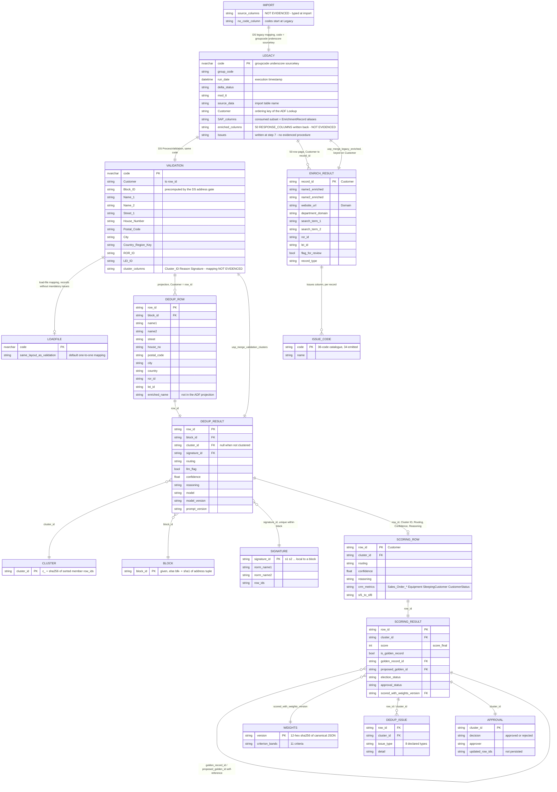

Generated: 2026-08-17 · Commit: 515cc7c1a84f55f817d63b4f3f094ce47d57f7fd · Branch: diag/website-trace

# Pass 5 — Data Model

This document records every schema the system reads or writes, the provenance of every
derived or written column, the join structure across the DATAshaper (DS) table progression
and the service's own payloads, the state sequence a single record passes through, the
field-level request/response contracts of the four integration endpoints, and the personal
data those payloads and the log stream carry.

**Evidence conventions.** Claims about this repository cite `path/file.py:LINE` or
`path/file.py:LINE-LINE`. Claims about systems outside the repository cite
`CONTEXT-EXTERNAL.md:LINE` and inherit its provenance markers ([EXPORT] verbatim artefact,
[OBSERVED] 2026-08-16 interface observation, [AUTHOR] pending confirmation). DATAshaper
behaviour additionally cites the vendor onboarding transcripts as
`Datashaper-Tutorial-PartN.txt` — an internal recorded call, for internal traceability only.

**What is and is not evidenced for the external tables.** No DDL exists in this repository
for the DS Import, Legacy, or Validation tables, and the two merge-back stored procedures'
bodies are not exported (`CONTEXT-EXTERNAL.md:318-321`). The external table schemas below are
therefore reconstructed from three evidence sources only — the ADF `sqlReaderQuery`
projections (`CONTEXT-EXTERNAL.md:64,106,226`), the payload the service returns into the merge
(`api/output_columns.py:22-89`), and the DS structural facts stated in the transcripts. Every
column whose existence, type, nullability, or key status is not carried by one of those three
is marked `⚠ NOT EVIDENCED`. Types for external columns are marked `⚠ NOT EVIDENCED` throughout
except where a transcript states one.

Sections: §1 schemas · §2 lineage · §3 ER diagram · §4 record lifecycle · §5 request/response
contracts · §6 PII and retention · §7 defects and discrepancies found in this pass.

---

## 1 · Schemas

### 1.1 · Notation

Pydantic models are v2 (`api/models.py:1`, `dedup/models.py:1-11`, `dedup/scoring.py:29-37`).
For these models:

- **Nullability** — `Optional[X] = None` is nullable with default `null`; a field declared
  without a default (e.g. `record_id: str`) is required and non-null.
- **Key** — Pydantic declares no keys; "key" below names the field the rest of the system
  joins on, evidenced by the code that performs the join.
- **Alias** — `validation_alias` is the accepted input name(s); `alias` sets both;
  `serialization_alias` (or the `AliasGenerator`) sets the emitted JSON key.

### 1.2 · `EnrichmentRecord` — POST /enrich request row

Defined `api/models.py:22-284`. `model_config = ConfigDict(populate_by_name=True)`
(`api/models.py:40`) — every field is additionally settable by its own snake_case name. No
field is mandatory, including the customer identifier (`api/models.py:220-223`). Unknown keys
are accepted and discarded: no `extra="forbid"` is declared, so a Legacy column the model does
not know is silently dropped (`api/models.py:40` is the whole config).

| Field | Type | Null? | Default | Input aliases (validation_alias) | Cited |
|---|---|---|---|---|---|
| `customer` | `Optional[str]` | yes | `None` | `Customer`, `customer`, `record_id` | `api/models.py:43-47` |
| `ecc_customer_number` | `Optional[str]` | yes | `None` | `ECC Customer Number`, `ecc_customer_number` | `api/models.py:48-51` |
| `central_deletion_flag` | `Optional[str]` | yes | `None` | `Central Deletion Flag`, … | `api/models.py:52-55` |
| `comments` | `Optional[str]` | yes | `None` | `Comments`, `comments` | `api/models.py:56-59` |
| `account_group` | `Optional[str]` | yes | `None` | `Account group`, `account_group` | `api/models.py:60-63` |
| `company_code` | `Optional[str]` | yes | `None` | `Company Code`, … | `api/models.py:64-67` |
| `sales_organization` | `Optional[str]` | yes | `None` | `Sales Organization`, … | `api/models.py:68-71` |
| `distribution_channel` | `Optional[str]` | yes | `None` | `Distribution Channel`, … | `api/models.py:72-75` |
| `division` | `Optional[str]` | yes | `None` | `Division`, `division` | `api/models.py:76-79` |
| `name_1` | `Optional[str]` | yes | `None` | `Name 1`, `name_1`, `name1` | `api/models.py:82-85` |
| `name_2` | `Optional[str]` | yes | `None` | `Name 2`, `name_2`, `name2` | `api/models.py:86-89` |
| `name_3` | `Optional[str]` | yes | `None` | `Name 3`, `name_3`, `name3` | `api/models.py:90-93` |
| `name_4` | `Optional[str]` | yes | `None` | `Name 4`, `name_4`, `name4` | `api/models.py:94-97` |
| `street_1` | `Optional[str]` | yes | `None` | `Street 1`, `street_1`, `street1`, `street` | `api/models.py:100-104` |
| `house_number` | `Optional[str]` | yes | `None` | `House Number`, `house_number` | `api/models.py:105-108` |
| `street_2` … `street_5` | `Optional[str]` | yes | `None` | `Street N`, `street_N`, `streetN` | `api/models.py:109-124` |
| `po_box` | `Optional[str]` | yes | `None` | `PO Box`, `po_box` | `api/models.py:125-128` |
| `country_region_key` | `Optional[str]` | yes | `None` | `Country/Region Key`, `country_region_key`, `country` | `api/models.py:129-132` |
| `postal_code` | `Optional[str]` | yes | `None` | `Postal Code`, `postal_code`, `zip` | `api/models.py:133-136` |
| `city` | `Optional[str]` | yes | `None` | `City`, `city` | `api/models.py:137-140` |
| `region` | `Optional[str]` | yes | `None` | `Region`, `region`, `state` | `api/models.py:141-144` |
| `language_key` | `Optional[str]` | yes | `None` | `Language Key`, … | `api/models.py:147-150` |
| `reconciliation_acct` | `Optional[str]` | yes | `None` | `Reconciliation acct`, … | `api/models.py:151-154` |
| `tax_jurisdiction` | `Optional[str]` | yes | `None` | `Tax Jurisdiction`, … | `api/models.py:155-158` |
| `central_delivery_block` | `Optional[str]` | yes | `None` | `Central delivery block`, … | `api/models.py:159-162` |
| `delivery_priority` | `Optional[str]` | yes | `None` | `Delivery Priority`, … | `api/models.py:163-166` |
| `shipping_conditions` | `Optional[str]` | yes | `None` | `Shipping Conditions`, … | `api/models.py:167-170` |
| `delivering_plant` | `Optional[str]` | yes | `None` | `Delivering Plant`, … | `api/models.py:171-174` |
| `created_on` | `Optional[str]` | yes | `None` | `Created On`, `created_on` | `api/models.py:175-178` |
| `created_by` | `Optional[str]` | yes | `None` | `Created By`, `created_by` | `api/models.py:179-182` |
| `vat_registration_no` | `Optional[str]` | yes | `None` | `VAT Registration No.`, … | `api/models.py:183-186` |
| `search_term_1` | `Optional[str]` | yes | `None` | `Search Term 1`, `search_term_1` | `api/models.py:187-190` |
| `search_term_2` | `Optional[str]` | yes | `None` | `Search Term 2`, `search_term_2` | `api/models.py:191-194` |
| `terms_of_payment_contact` | `Optional[str]` | yes | `None` | `Terms of Payment Contact`, … | `api/models.py:195-198` |
| `care_of` | `Optional[str]` | yes | `None` | `care_of`, `Care Of`, `c/o` | `api/models.py:207-210` |
| `contact` | `Optional[str]` | yes | `None` | `contact`, `Contact` | `api/models.py:211-214` |
| `email` | `Optional[str]` | yes | `None` | `email`, `Email` | `api/models.py:215-218` |

`care_of` / `contact` / `email` have no SAP column; they are auxiliary enrichment inputs and,
when absent, the same signals are recovered from the Name fields during preprocessing
(`api/models.py:200-206`).

**Read-only accessors** (not serialised fields; the pipeline reads these):
`record_id` = `(customer or ecc_customer_number or "").strip()` (`api/models.py:229-231`);
`name1`…`name4` (`:233-247`); `street`/`street1`…`street5` (`:249-272`); `state` ← `region`
(`:274-276`); `zip` ← `postal_code` (`:278-280`); `country` ← `country_region_key` (`:282-284`).

### 1.3 · `EnrichmentOptions`, `EnrichmentRequest`

| Model | Field | Type | Null? | Default | Cited |
|---|---|---|---|---|---|
| `EnrichmentOptions` | `max_concurrency` | `int`, `ge=1`, `le=20` | no | `5` | `api/models.py:289` |
| | `serp_provider` | `Literal["serpapi","duckduckgo"]` | no | `"serpapi"` | `api/models.py:290` |
| | `skip_tier` | `Optional[int]` | yes | `None` | `api/models.py:291` |
| `EnrichmentRequest` | `records` | `List[EnrichmentRecord]`, `min_length=1` | no | — (required) | `api/models.py:296` |
| | `options` | `EnrichmentOptions` | no | `EnrichmentOptions()` | `api/models.py:297` |

### 1.4 · `EnrichmentResult` — POST /enrich response row

Defined `api/models.py:304-427`. Serialisation keys come from an `AliasGenerator` that looks
each field up in `RESPONSE_COLUMNS` (`api/models.py:312-318`), so the JSON body and the
`/enrich/file` workbook carry identical columns under identical names
(`api/output_columns.py:1-13`). That the wire format really uses those aliases is asserted by
the route test: `data["results"][0]["Customer"]` (`tests/test_routes.py:73`).

Serialised fields, in declaration (= output column) order:

| Field | Output name | Type | Null? | Default | Cited |
|---|---|---|---|---|---|
| `record_id` | `Customer` | `str` | **no** | — (required) | `api/models.py:324`; `api/output_columns.py:24` |
| `ecc_customer_number` | `ECC Customer Number` | `Optional[str]` | yes | `None` | `:325`; `output_columns.py:25` |
| `central_deletion_flag` | `Central Deletion Flag` | `Optional[str]` | yes | `None` | `:326`; `:26` |
| `comments` | `Comments` | `Optional[str]` | yes | `None` | `:327`; `:27` |
| `account_group` | `Account group` | `Optional[str]` | yes | `None` | `:328`; `:28` |
| `company_code` | `Company Code` | `Optional[str]` | yes | `None` | `:329`; `:29` |
| `sales_organization` | `Sales Organization` | `Optional[str]` | yes | `None` | `:330`; `:30` |
| `distribution_channel` | `Distribution Channel` | `Optional[str]` | yes | `None` | `:331`; `:31` |
| `division` | `Division` | `Optional[str]` | yes | `None` | `:332`; `:32` |
| `name1_enriched` | `Name 1` | `Optional[str]` | yes | `None` | `:335`; `:34` |
| `name2_enriched` | `Name 2` | `Optional[str]` | yes | `None` | `:336`; `:35` |
| `name3_enriched` | `Name 3` | `Optional[str]` | yes | `None` | `:337`; `:36` |
| `name4_enriched` | `Name 4` | `Optional[str]` | yes | `None` | `:338`; `:37` |
| `website_url` | `Domain` | `Optional[str]` | yes | `None` | `:340`; `:41` |
| `department_domain` | `Department Domain` | `Optional[str]` | yes | `None` | `:344`; `:42` |
| `care_of_enriched` | `Care Of` | `Optional[str]` | yes | `None` | `:348`; `:44` |
| `contact_enriched` | `Contact` | `Optional[str]` | yes | `None` | `:350`; `:45` |
| `email_enriched` | `Email` | `Optional[str]` | yes | `None` | `:351`; `:46` |
| `street_cleaned` | `Street 1` | `Optional[str]` | yes | `None` | `:354`; `:48` |
| `house_number` | `House Number` | `Optional[str]` | yes | `None` | `:356`; `:49` |
| `street_2_cleaned` … `street_5_cleaned` | `Street 2`…`Street 5` | `Optional[str]` | yes | `None` | `:357-360`; `:50-53` |
| `po_box_extracted` | `PO Box` | `Optional[str]` | yes | `None` | `:361`; `:54` |
| `suite` | `Suite` | `Optional[str]` | yes | `None` | `:362`; `:55` |
| `building` | `Building` | `Optional[str]` | yes | `None` | `:363`; `:56` |
| `floor` | `Floor` | `Optional[str]` | yes | `None` | `:364`; `:57` |
| `room` | `Room` | `Optional[str]` | yes | `None` | `:365`; `:58` |
| `unit` | `Unit` | `Optional[str]` | yes | `None` | `:366`; `:59` |
| `mail_stop` | `Mail Stop` | `Optional[str]` | yes | `None` | `:367`; `:60` |
| `unloading_point` | `Unloading Point` | `Optional[str]` | yes | `None` | `:368`; `:61` |
| `mail_code` | `Mail Code` | `Optional[str]` | yes | `None` | `:369`; `:62` |
| `country_region_key` | `Country/Region Key` | `Optional[str]` | yes | `None` | `:372`; `:64` |
| `postal_code` | `Postal Code` | `Optional[str]` | yes | `None` | `:373`; `:65` |
| `city` | `City` | `Optional[str]` | yes | `None` | `:374`; `:66` |
| `region` | `Region` | `Optional[str]` | yes | `None` | `:375`; `:67` |
| `language_key` | `Language Key` | `Optional[str]` | yes | `None` | `:376`; `:68` |
| `reconciliation_acct` | `Reconciliation acct` | `Optional[str]` | yes | `None` | `:377`; `:69` |
| `tax_jurisdiction` | `Tax Jurisdiction` | `Optional[str]` | yes | `None` | `:378`; `:70` |
| `central_delivery_block` | `Central delivery block` | `Optional[str]` | yes | `None` | `:379`; `:71` |
| `delivery_priority` | `Delivery Priority` | `Optional[str]` | yes | `None` | `:380`; `:72` |
| `shipping_conditions` | `Shipping Conditions` | `Optional[str]` | yes | `None` | `:381`; `:73` |
| `delivering_plant` | `Delivering Plant` | `Optional[str]` | yes | `None` | `:382`; `:74` |
| `created_on` | `Created On` | `Optional[str]` | yes | `None` | `:383`; `:75` |
| `created_by` | `Created By` | `Optional[str]` | yes | `None` | `:384`; `:76` |
| `vat_registration_no` | `VAT Registration No.` | `Optional[str]` | yes | `None` | `:385`; `:77` |
| `search_term_1` | `Search Term 1` | `Optional[str]` | yes | `None` | `:389`; `:78` |
| `search_term_2` | `Search Term 2` | `Optional[str]` | yes | `None` | `:390`; `:79` |
| `terms_of_payment` | `Terms of Payment` | `Optional[str]` | yes | `None` | `:391`; `:80` |
| `flag_for_review` | `Flag for Review` | `bool` | no | `False` | `:394`; `:82` |
| `flag_reason` | `Flag Reason` | `Optional[str]` | yes | `None` | `:395`; `:83` |
| `error` | `Error` | `Optional[str]` | yes | `None` | `:396`; `:84` |
| `record_type` | `Record Type` | `Literal["research_institution","company","unknown"]` | no | `"unknown"` | `:397`; `:85` |
| `ror_id` | `ROR ID` | `Optional[str]` | yes | `None` | `:401`; `:87` |
| `lei_id` | `LEI ID` | `Optional[str]` | yes | `None` | `:402`; `:88` |

Fields carried internally but **excluded from serialisation** (`exclude=True`) — populated and
used by tier logic, batch summary counts, and tests (`api/models.py:404-427`):

| Field | Type | Default | Cited |
|---|---|---|---|
| `tier_used` | `Literal[1,2,3]` | `1` | `api/models.py:408` |
| `tier2_mode` | `Optional[Literal["2A_population","2A_verification","2B"]]` | `None` | `:409` |
| `confidence` | `Literal["high","medium","low","none"]` | `"none"` | `:410` |
| `source` | `Literal["ROR","ROR+child","contact_lookup_found","contact_lookup_corrected","dept_search","LLM","llm_canonical","SERP+LLM","pattern_match","web_search","passthrough","gleif","none"]` | `"none"` | `:411-416` |
| `source_url` | `Optional[str]` | `None` | `:417` |
| `domain` | `Optional[str]` | `None` | `:421` |
| `contact_used` | `bool` | `False` | `:422` |
| `name2_match_result` | `Literal["exact","partial","no_match","not_applicable","unknown"]` | `"not_applicable"` | `:423` |
| `use_cases_triggered` | `List[int]` | `[]` | `:425` |
| `enrichment_status` | `Literal["enriched","verified","unresolved","failed"]` | `"failed"` | `:426` |
| `duration_ms` | `int` | `0` | `:427` |

### 1.5 · `EnrichmentSummary`, `EnrichmentResponse`, `HealthResponse`, `TierConfigResponse`

`EnrichmentSummary` (`api/models.py:430-453`) — all `int`, all default `0`, none nullable:
`total`, `enriched`, `verified`, `unresolved`, `failed`, `research_institution_count`,
`company_count`, `tier1_resolved`, `tier1_lei_count`, `lei_attempts`, `lei_hits_exact`,
`lei_hits_fuzzy`, `lei_misses`, `lei_errors`, `tier2a_population_count`,
`tier2a_verification_count`, `tier2b_count`, `tier3_count`, `contact_lookup_attempted`,
`contact_lookup_success`, `processing_time_ms`.

`EnrichmentResponse` — `results: List[EnrichmentResult]`, `summary: EnrichmentSummary`, both
required (`api/models.py:456-459`).

`HealthResponse` — `status: str = "healthy"`, `version: str = "1.0.0"`,
`env: str = "production"`, `mock_mode: bool = False`, `tiers_available: List[int] = [1,2,3]`
(`api/models.py:462-468`).

`TierConfigResponse` — `ror_confidence_threshold: float`, `fuzzy_match_threshold: int`,
`max_page_content_chars: int`, `page_fetch_timeout_seconds: int`,
`default_max_concurrency: int`, `serp_provider: str`, `mock_mode: bool`; all required, none
nullable (`api/models.py:471-480`).

### 1.6 · `DedupRow`, `DedupRequest` — POST /api/dedup/cluster-block request

`model_config = ConfigDict(populate_by_name=True)` (`dedup/models.py:27`).

| Field | Type | Null? | Default | Key | Cited |
|---|---|---|---|---|---|
| `row_id` | `str` | **no** | — (required) | caller's stable key, echoed verbatim | `dedup/models.py:29` |
| `block_id` | `Optional[str]` | yes | `None` | block partition key; derived when null | `dedup/models.py:30-36` |
| `name1` | `Optional[str]` | yes | `None` | — | `:37` |
| `name2` | `Optional[str]` | yes | `None` | — | `:38` |
| `street` | `Optional[str]` | yes | `None` | block-derivation input | `:39` |
| `house_no` | `Optional[str]` | yes | `None` | block-derivation input | `:40` |
| `postal_code` | `Optional[str]` | yes | `None` | block-derivation input | `:41` |
| `city` | `Optional[str]` | yes | `None` | — | `:42` |
| `country` | `Optional[str]` | yes | `None` | block-derivation input | `:43` |
| `ror_id` | `Optional[str]` | yes | `None` | identity hint | `:44` |
| `lei_id` | `Optional[str]` | yes | `None` | identity hint | `:45` |
| `enriched_name` | `Optional[str]` | yes | `None` | — | `:46` |

`DedupRequest.rows: List[DedupRow]`, `min_length=1` (`dedup/models.py:56`).

### 1.7 · `DedupResultRow`, `DedupSummary`, `DedupResponse` — cluster-block response

| Field | Type | Null? | Default | Cited |
|---|---|---|---|---|
| `row_id` | `str` | no | required | `dedup/models.py:66` |
| `block_id` | `str` | no | required | `:67` |
| `cluster_id` | `Optional[str]` | yes | `None` (null when the row is not in a duplicate cluster) | `:68-71` |
| `routing` | `Literal["cluster","unique","manual_review"]` | no | required | `:72` |
| `llm_flag` | `bool` | no | required | `:73` |
| `signature_id` | `str` | no | required | `:74` |
| `confidence` | `Optional[float]` | yes | `None` (null for a unique row and for a pure identical-signature collapse) | `:75-78` |
| `reasoning` | `Optional[str]` | yes | `None` | `:79` |
| `model` | `str` | no | required | `:80` |
| `model_version` | `str` | no | required | `:81` |
| `prompt_version` | `str` | no | required | `:82` |

`DedupSummary` (`dedup/models.py:85-100`) — all `int` default `0`: `blocks`, `rows_in`,
`distinct_signatures`, `clusters`, `rows_clustered`, `rows_unique`, `rows_manual_review`,
`llm_calls`, `errors`, `candidates_generated`, `rejected_with_reasoning`,
`candidate_cap_exceeded_blocks`. `DedupResponse` = `rows` + `summary` (`:103-107`).

### 1.8 · `ScoringRow`, `ScoringRequest` — POST /api/dedup/score request

`populate_by_name=True` (`dedup/scoring.py:103`), so every field accepts either its file column
header (the alias) or its snake_case name. `Scalar = Union[int, float, str, None]` — numeric-ish
fields are typed permissively so a dirty extract cell can never 422 the request; coercion and
warnings happen in the scorer (`dedup/scoring.py:50-53`).

| Field | Type | Null? | Default | Alias (file column) | Cited |
|---|---|---|---|---|---|
| `row_id` | `str` | **no** | required | `Customer` | `dedup/scoring.py:105-107` |
| `cluster_id` | `Optional[str]` | yes | `None` | `Cluster ID` | `:108-111` |
| `confidence` | `Optional[float]` | yes | `None` | `Confidence` | `:112-119` |
| `routing` | `Optional[str]` | yes | `None` | `Routing` | `:120-127` |
| `reasoning` | `Optional[str]` | yes | `None` | `Reasoning` | `:128-134` |
| `last_order_year` | `Scalar` | yes | `None` | `Sales_Order_Last_Used` | `:135` |
| `orders_in_last_used_year` | `Scalar` | yes | `None` | in: `Sales_Order_Total_Count` / `orders_in_last_used_year` / `order_count` (deprecated); out: `Sales_Order_Total_Count` | `:141-147` |
| `partner_last_order_year` | `Scalar` | yes | `None` | `Sales_Order_Partner_Last_Used` | `:148-150` |
| `partner_orders_in_last_used_year` | `Scalar` | yes | `None` | in: `Sales_Order_Partner_Total_Count` / … / `partner_order_count`; out: `Sales_Order_Partner_Total_Count` | `:153-161` |
| `equipment_count` | `Scalar` | yes | `None` | `Equipment_Total_Count` | `:162` |
| `sleeping_band` | `Optional[str]` | yes | `None` | `SleepingCustomer` (expected `"No"`/`"3-4"`/`">5"`) | `:163-164` |
| `customer_status` | `Optional[str]` | yes | `None` | `CustomerStatus` (expected `"active"`/`"blocked"`) | `:165-166` |
| `account_group` | `Optional[str]` | yes | `None` | `Account group` | `:167` |
| `company_code_consolidated` | `Optional[str]` | yes | `None` | `Company_Code_Consolidated` (`";"`-delimited) | `:168-170` |
| `sales_org_consolidated` | `Optional[str]` | yes | `None` | `Sales_Org_Consolidated` (`";"`-delimited) | `:171-173` |
| `sf1` … `sf8` | `Optional[str]` | yes | `None` | field name (sf1 = Biosystems, sf2 = AXS) | `:176-183` |

Validators: a legacy `salesforce_ids` list is spread across `sf1..sf8` when no explicit `sf*`
key is present (`dedup/scoring.py:185-200`); string-ish fields stringify native Excel types
rather than reject them, with `float.is_integer()` collapsing `1003.0` → `"1003"`
(`:202-222`); `confidence` coerces to float or falls back to `None`, which never gates
(`:224-234`). `ScoringRequest` = `rows: List[ScoringRow]` (default `[]`, **no** `min_length`)
plus an optional `weights` override dict (`:237-254`).

### 1.9 · `ScoringResultRow`, `ScoringSummary`, `DedupIssue`, `ScoringResponse`

`ScoringResultRow` (`dedup/scoring.py:257-381`). Every serialised key is the exact file column
header, so `/api/dedup/score` JSON matches `/api/dedup/score/file` column for column
(`:271-275`).

| Field | Type | Null? | Default | Alias | Cited |
|---|---|---|---|---|---|
| `row_id` | `str` | no | required | `Customer` | `dedup/scoring.py:277` |
| `cluster_id` | `Optional[str]` | yes | `None` | `Cluster ID` | `:278` |
| `score` | `int` | no | required | `score_final` | `:279` |
| `company_code_count` | `int` | no | `0` | `Company_Code_Count` | `:284` |
| `sales_org_count` | `int` | no | `0` | `Sales_Org_Count` | `:285` |
| `salesforce_instance_count` | `int` | no | `0` | `Salesforce_Instance_Count` | `:286` |
| `is_golden_record` | `bool` | no | required | — | `:287` |
| `golden_record_id` | `Optional[str]` | yes | `None` | — | `:288` |
| `proposed_golden_id` | `Optional[str]` | yes | `None` | — | `:292` |
| `election_status` | `Literal["proposed","manual_review","unique"]` | no | required | — | `:293` |
| `approval_status` | `Optional[Literal["proposed","approved","rejected"]]` | yes | `None` | — | `:297` |
| `scored_with_weights_version` | `Optional[str]` | yes | `None` | — | `:300` |
| `score_breakdown` | `Dict[str,int]` | no | `{}` | **excluded** (flattened into `score_*`) | `:305` |
| `warnings` | `List[str]` | no | `[]` | **excluded** (summary accounting only) | `:307` |

Eleven computed fields flatten `score_breakdown` into the file's per-criterion point columns —
`score_SalesOrderLastUsed`, `score_SalesOrderCount`, `score_SalesOrderPartnerLastUsed`,
`score_SalesOrderPartnerCount`, `score_EquipmentCount`, `score_SleepingCustomer`,
`score_CustomerStatus`, `score_AccountGroup`, `score_CompanyCodeCount`,
`score_CombinedPresence`, `score_SalesforceInstances` (`dedup/scoring.py:328-381`; column names
from `SCORE_BREAKDOWN_COLUMNS`, `:59-71`). A `model_validator(mode="before")` reassembles
`score_breakdown` from those flat columns on input so a `/score` output round-trips losslessly
into `/approve` (`:309-323`).

Table invariant, stated in the model docstring and enforced by `_build_result`: a unique row
and an approved winner are `is_golden_record=true` and self-reference; a duplicate is
`false` and points at its survivor; a `manual_review` row leaves `is_golden_record` /
`golden_record_id` empty **in the file writeback** and keeps its computed winner only in
`proposed_golden_id` (`dedup/scoring.py:257-268`, `:1155-1197`, `dedup/scoring_xlsx.py:291-298`).

`ScoringSummary` (`dedup/scoring.py:384-396`): `rows_in`, `clusters`, `rows_elected`,
`rows_duplicates`, `rows_unique`, `rows_manual_review`, `all_blocked_clusters`,
`rows_with_warnings`, `errors` — all `int` default `0` — plus `warnings: List[str]` default `[]`.

`DedupIssue` (`dedup/scoring.py:427-433`): `row_id: Optional[str]=None`,
`cluster_id: Optional[str]=None`, `issue_type: str` (required),
`detail: str` (required). Recognised `issue_type` values are the eight in `ISSUE_TYPES`
(`:403-412`): `low_confidence_merge`, `verdict_contradiction`,
`missing_building_inconsistency` (declared but never emitted from election — `:400-402`),
`all_blocked_cluster`, `tiebreak_decided`, `empty_scoring_payload`,
`count_suppressed_by_recency`, `candidate_cap_exceeded`.

`ScoringResponse` = `rows` + `summary` + `issues` (default `[]`) (`dedup/scoring.py:436-441`).

### 1.10 · `ApprovalRequest`, `ApprovalResponse`

| Model | Field | Type | Null? | Default | Cited |
|---|---|---|---|---|---|
| `ApprovalRequest` | `cluster_id` | `str` | no | required | `dedup/scoring.py:558` |
| | `decision` | `Literal["approved","rejected"]` | no | required | `:559` |
| | `approver` | `str`, `min_length=1` | no | required | `:560` |
| | `rows` | `List[ScoringResultRow]`, `min_length=1` | no | required | `:561` |
| `ApprovalResponse` | `cluster_id` | `str` | no | required | `:567` |
| | `decision` | `Literal["approved","rejected"]` | no | required | `:568` |
| | `approver` | `str` | no | required | `:569` |
| | `updated_row_ids` | `List[str]` | no | required | `:570` |
| | `rows` | `List[ScoringResultRow]` | no | required | `:571` |

### 1.11 · Internal (non-Pydantic) structures

**The enrichment working dict** — `_init_result` (`enrichment/orchestrator.py:263-370`) creates
one dict per record holding, besides every `EnrichmentResult` field: the `*_original` mirrors
(`name1_original`…`name4_original`, `care_of_original`, `contact_original`, `email_original`,
`street1_original`…`street5_original` — `:293-334`), the `*_changed` booleans (`:301-304`,
`:316-334`), `unclear_address_info` and `address_issues` (`:350-351`), and transient
underscore-prefixed carriers stripped before validation: `_search_term_1_original` (`:309`),
`_ror_acronym` (`:313`), plus `_preprocess_cleared`, `_dba_values`, `_pp_name1`,
`_name1_was_person` popped in `finalise` (`:610-615`). `_pp_streets`, `_pp_building`,
`_has_dept_signal`, `_multi_contact`, `_name2_from_tier3` are consumed earlier
(`:451-453`, `:579-580`, `:392-398`, `:1590-1595`). Keys not declared on `EnrichmentResult`
are dropped at `EnrichmentResult(**result)` because the model does not forbid extras
(`:1573`; `api/models.py:312-318`).

**`AddressResult`** — dataclass, all fields default `None` unless noted
(`enrichment/address_processing.py:84-122`): `street_cleaned`, `street_2_cleaned` …
`street_5_cleaned`, `suite`, `building`, `floor`, `room`, `unit`, `mail_stop`,
`po_box_extracted`, `care_of_enriched`, `unloading_point`, `mail_code`,
`department_addendum`, `city_inferred`, `state_inferred`, `zip_inferred`,
`unclear_address_info`, `name_overrides: dict[str, str|None] = {}`,
`address_issues: list[str] = []`.

**`Signature`** — dataclass (`dedup/signatures.py:59-92`): `signature_id: str` (assigned
`s1`, `s2`, … in first-appearance order within a block, `:144-147`), `norm_name1`,
`norm_name2` (normalised key, internal only — never sent to the LLM, `:1-9`), `name1`,
`name2` (original strings, what the LLM sees), `ror_id`, `row_ids: List[str]`,
`uncertain: bool = False`, `lei_id`, `merge_reasoning`, `merge_confidence`.

**`Entity`** — dataclass (`dedup/adjudicator.py:56-93`): `entity_id: str`,
`signatures: List[Signature]`, `institution`, `department`, `confidence`, `reasoning`,
`adjudicated: bool = False`; computed `has_name2`, `row_ids` (order-preserving union),
`llm_merged` (`len(signatures) >= 2`).

**`BlockStats`** — per-block telemetry accumulator, 18 fields (`dedup/adjudicator.py:96-118`).

### 1.12 · `dedup/weights.json` — scoring reference table

Structure: `criterion -> {band label: points}`; metadata keys prefixed `_` are stripped on load
(`dedup/scoring.py:618-623`). Band-label grammar, verbatim from the file's `_comment`:
`'a-b'` inclusive range, `'>n'` strictly greater, `'n+'` greater-or-equal, bare number exact,
`'X/Y'` either literal (case-insensitive); values with no matching band score 0
(`dedup/weights.json:2`; matcher at `dedup/scoring.py:725-780`).

| Criterion | Bands → points | Cited |
|---|---|---|
| `sales_order_last_used` | `2026`:20, `2025`:15, `2024`:10, `2023`:5 | `dedup/weights.json:3-8` |
| `sales_order_count` | `0-5`:5, `6-10`:15, `>10`:25 | `:9-13` |
| `sales_order_partner_last_used` | `2026`:20, `2025`:15, `2024`:10, `2023`:5 | `:14-19` |
| `sales_order_partner_count` | `0-5`:5, `6-10`:15, `>10`:25 | `:20-24` |
| `equipment_count` | `0-3`:5, `4-8`:12, `9-15`:20, `>15`:30 | `:25-30` |
| `sleeping_customer` | `No`:15, `3-4`:5, `>5`:0 | `:31-35` |
| `customer_status` | `active`:10, `blocked`:0 | `:36-39` |
| `account_group` | `DRIT`:20, `0002/SHIP2`:15, `0003`:10, `0004`:10, `0005/MLIEF`:5 | `:40-46` |
| `company_code_count` | `1`:5, `2-4`:15, `5+`:25 | `:47-51` |
| `combined_presence_bonus` | `company code AND sales org`:10 | `:52-54` |
| `salesforce_instance_count` | `per instance`:10 | `:55-57` |

The file's own `_comment` marks `combined_presence_bonus`, the `sales_order_partner_count`
tiers, and `account_group` `DRIT` as UNCONFIRMED (`dedup/weights.json:2`).

### 1.13 · Workbook schemas (file endpoints)

| Workbook | Sheet | Columns | Cited |
|---|---|---|---|
| `/enrich/file` output | active | the 50 `RESPONSE_COLUMNS` headers in order, then unconsumed input headers appended verbatim | `api/routes.py:323-341`; `api/output_columns.py:22-89` |
| | extra sheets | every non-active sheet of the upload copied values-only (e.g. `Weights`) | `api/routes.py:260-282,343-344` |
| `/issues` output | active | the uploaded header row verbatim + one appended `Issues` column | `api/routes.py:366,368-370` |
| `/issues/compare` output | `Summary` | headline totals then `Code`, `Name`, `Before`, `After`, `Delta` per catalogue code | `api/routes.py:468-491` |
| | `Per Record` | `record_id`, `Issues Before`, `Issues After`, `Resolved`, `Introduced` | `api/routes.py:493-498` |
| | `Remaining Issues` | `Code`, `Name`, `Customer` (one row per code/customer pairing) | `api/routes.py:506-511` |
| `/api/dedup/file` output | active | uploaded headers verbatim + `Cluster ID`, `Routing`, `LLM Flag`, `Confidence`, `Reasoning` | `api/routes.py:744,773,784-791` |
| | `Dedup Debug` | `row_id`, `Cluster ID`, `Block ID`, `Signature ID` | `api/routes.py:746,775-776,792` |
| `/api/dedup/score/file` | data sheet (first sheet carrying a `Customer` header) | filled **in place**: the 11 `score_*` columns, `score_final`, `Company_Code_Count`, `Sales_Org_Count`, `Salesforce_Instance_Count`, `is_golden_record`, `golden_record_id`, `proposed_golden_id`, `election_status`, `approval_status`, `scored_with_weights_version` — located by header name, appended if absent | `dedup/scoring_xlsx.py:114-120,136-144,264-303` |
| | `Weights` | `Criterion`, `Band`, `Points` (read from row 2 onward; all-or-nothing override) | `dedup/scoring_xlsx.py:89-107` |
| | `Issues` | `row_id`, `cluster_id`, `issue_type`, `detail` — sheet deleted and rebuilt each run | `dedup/scoring_xlsx.py:30-31,305-315` |

Input header → `DedupRow` field aliases for `/api/dedup/file` (normalised alnum-lowercase
matching): `rowid`/`recordid`/`customer` → `row_id`; `blockid` → `block_id`; `name1`, `name2`;
`street`/`street1`/`streetcleaned` → `street`; `houseno`/`housenumber` → `house_no`;
`postalcode`/`zip` → `postal_code`; `city`; `country`/`countryregionkey` → `country`;
`rorid` → `ror_id`; `enrichedname` → `enriched_name` (`api/routes.py:688-707`).
⚠ There is **no** `leiid` alias, so an `LEI ID` column in an uploaded workbook is dropped on the
file path even though the JSON path accepts `lei_id` (`api/routes.py:688-707` vs
`dedup/models.py:45`).

Input header → `ScoringRow` field for `/api/dedup/score/file`: `Customer`, `Account group`,
`Sales_Order_Last_Used`, `Sales_Order_Total_Count`, `Sales_Order_Partner_Last_Used`,
`Sales_Order_Partner_Total_Count`, `Equipment_Total_Count`, `SleepingCustomer`,
`CustomerStatus`, `Company_Code_Consolidated`, `Sales_Org_Consolidated`
(`dedup/scoring_xlsx.py:35-53`), plus the eight Salesforce slots `SF_ID_Biosystems`,
`SF_ID_AXS`, `SF_ID_3` … `SF_ID_8` (`:56-59`), and the cluster columns `Routing` + `Cluster ID`
(falling back to the fixture pair `expected_routing` + `expected_cluster`), `Confidence`,
`Reasoning` (`:147-158,222-227`).

### 1.14 · External tables (DATAshaper / Azure SQL MI)

No DDL is in the repository; the following is the evidenced subset. Types are
`⚠ NOT EVIDENCED` unless a transcript states one.

**Common DS technical columns (Legacy, Validation, load file).** From the Legacy mapping walk-
through: `code` — the primary key, present on *every* table from Legacy onward, formed in SQL as
`<group code> + '_' + <source key>` and cast to NVARCHAR because the concatenation requires it
(`Datashaper-Tutorial-Part1.txt:1373-1391,1427-1457`); the same code identifies the same object
in Legacy, Validation, and the load file (`Datashaper-Tutorial-Part1.txt:1391-1403`);
`group code`; `run date` — a SQL formula returning the execution timestamp, i.e. the row's last
update (`:1475-1481`); `delta status` and `mod tt`, populated during processing to track changes
(`:1486-1487`); `source data` — the name of the source import table (`:1487`). Observed record
codes carry the group-code prefix: `TEST7_41000009`, `TEST10_42000001`, `TEST10_44000003`
(`CONTEXT-EXTERNAL.md:34-36`).

**Import table (bronze).** Holds the source rows as-is; columns and their data types are chosen
at import from the file's columns (`Datashaper-Tutorial-Part1.txt:569,962-995,1049,1154`); the
source's own column names are not the SAP field names (`:689`). No code column yet — codes start
at Legacy (`:1379-1385`). ⚠ The concrete Import column list, types, nullability, and keys for
entity `test_77` are NOT EVIDENCED. Re-import either overwrites the existing table or creates a
new one (`Datashaper-Tutorial-Part1.txt:739-746`).

**Legacy table (silver), schema `test_77`.** Read by ADF as `SELECT * FROM test_77.Legacy ORDER
BY Customer OFFSET @{item().offset} ROWS FETCH NEXT 50 ROWS ONLY` (`CONTEXT-EXTERNAL.md:106`),
and the whole row set is posted as `{"records": …}` to `/enrich`
(`CONTEXT-EXTERNAL.md:141`). Two consequences are directly evidenced:

- A column named `Customer` exists and is orderable (`CONTEXT-EXTERNAL.md:106`).
- Every column whose name matches an `EnrichmentRecord` alias is consumed; every other column
  is discarded by the model rather than rejected (`api/models.py:40-218`). So the *consumed*
  Legacy columns are exactly the alias set in §1.2 — that is the strongest statement the
  evidence supports; it is **not** proof that all of them exist.

The enrichment merge-back writes the `/enrich` response, whose keys are the 50
`RESPONSE_COLUMNS` names (§1.4), through `dbo.usp_merge_legacy_enriched(payload)`
(`CONTEXT-EXTERNAL.md:161-176`). ⚠ Whether Legacy actually carries target columns named
`Domain`, `Department Domain`, `Flag for Review`, `Flag Reason`, `Error`, `Record Type`,
`ROR ID`, `LEI ID`, `Suite`, `Building`, `Floor`, `Room`, `Unit`, `Mail Stop`,
`Unloading Point`, `Mail Code`, `Terms of Payment` is NOT EVIDENCED — the procedure body is not
exported (`CONTEXT-EXTERNAL.md:320-321`). ⚠ The `Issues` column written back at workflow step 7
has no evidenced stored procedure at all (`CONTEXT-EXTERNAL.md:331-332,441`). ⚠ The
`enriched_at` watermark discussed for the freeze does not exist in the exported pipeline
(`CONTEXT-EXTERNAL.md:194-197`).

**Validation table (gold), schema `test_77`.** The dedup Lookup's projection is the only
column-level evidence, and it names both sides of each mapping
(`CONTEXT-EXTERNAL.md:226,305-310`):

| Validation column | Projected as | Type | Null? | Key | Cited |
|---|---|---|---|---|---|
| `Customer` | `row_id` | ⚠ NOT EVIDENCED | ⚠ | join key to the service's `row_id` | `CONTEXT-EXTERNAL.md:226,306` |
| `[Block ID]` | `block_id` | ⚠ NOT EVIDENCED | ⚠ | partition key; **precomputed by the DS address gate**, read not derived | `CONTEXT-EXTERNAL.md:226,309-310` |
| `[Name 1]` | `name1` | ⚠ | ⚠ | — | `:226,306` |
| `[Name 2]` | `name2` | ⚠ | ⚠ | — | `:226,306` |
| `[Street 1]` | `street` | ⚠ | ⚠ | — | `:226,307` |
| `[House Number]` | `house_no` | ⚠ | ⚠ | — | `:226,307` |
| `[Postal Code]` | `postal_code` | ⚠ | ⚠ | — | `:226,307` |
| `City` | `city` | ⚠ | ⚠ | — | `:226,308` |
| `[Country/Region Key]` | `country` | ⚠ | ⚠ | — | `:226,308` |
| `[ROR ID]` | `ror_id` | ⚠ | ⚠ | identity hint | `:226,308` |
| `[LEI ID]` | `lei_id` | ⚠ | ⚠ | identity hint | `:226,308` |

Additionally evidenced about Validation: it is the table DS validation rules are configured
against, under alias `W` (`Datashaper-Tutorial-Part2.txt:815`;
`CONTEXT-EXTERNAL.md:354-357`); rules are mandatory (an issue) or non-mandatory (a warning)
and every rule belongs to a field (`Datashaper-Tutorial-Part2.txt:797`); data-type and length
checks are applied during Legacy→Validation processing
(`Datashaper-Tutorial-Part2.txt:483-486`). Cluster results are merged back by
`dbo.usp_merge_validation_clusters(payload)` (`CONTEXT-EXTERNAL.md:281-295`). ⚠ Which
Validation columns receive `cluster_id`, `routing`, `confidence`, `reasoning`, and
`signature_id` is NOT EVIDENCED (procedure body not exported); the DS deduplication view
renders columns `Cluster`, `Code`, `Reason`, `Cluster_ID`, `Block ID`, `Signature`
(`CONTEXT-EXTERNAL.md:389-393`), and the name correspondence to the service's `reasoning` /
`cluster_id` / `block_id` / `signature_id` is an inference from the names, not from a schema.
⚠ `Block ID` and `Signature` rendered empty in the observed screenshot and it is unresolved
whether that is truncation or genuine non-population (`CONTEXT-EXTERNAL.md:400-401,448`).

**DS issues view.** Drills issue code → affected field → description, with per-code counts and
a `Show mandatory only` filter (`CONTEXT-EXTERNAL.md:364-386`). The code→field structure is
reconstructed DS-side: the transmitted column carries codes only (see §2.3).

**DS deduplication / clustering view.** Columns `Cluster`, `Code`, `Reason`, `Cluster_ID`,
`Block ID`, `Signature`; side panel with `Code`, a `Leading Code` selector, an `Assign for`
selector, and an `Apply Leading Code` action (`CONTEXT-EXTERNAL.md:388-399`). The vendor
walk-through describes the same shape natively: cluster number, the codes identifying the rows,
the **leading code** — "what we need to put to say which one we want to retain and which one
should be blocked" — and a `broken cluster` indicator for a cluster whose membership no longer
matches the calculation (`Datashaper-Tutorial-Part3.txt:116-131`). ⚠ `broken cluster` has no
counterpart anywhere in this repository.

**Load file.** By default the same layout as the Validation table, mapped one-to-one
(`Datashaper-Tutorial-Part3.txt:554-557`); it contains all records **without mandatory issues**
(`Datashaper-Tutorial-Part3.txt:575`); a copy is kept per processing day per environment plus
one "latest" per entity (`:569-572`); additional target-specific load files can be defined with
their own mappings (`:587-599`).

---

## 2 · Lineage

One row per derived or written column: the column, the code that computes it, and the inputs
that code reads. Ordering follows the output schema. Algorithm-level detail for each rule lives
in `03_ALGORITHMS.md`; this table fixes provenance only.

### 2.1 · `/enrich` output columns — carried through verbatim

All eight are copied from the request record by `_init_result` and never rewritten by any tier.

| Output column (field) | Computed at | Inputs read |
|---|---|---|
| `Customer` (`record_id`) | `enrichment/orchestrator.py:268` | `EnrichmentRecord.record_id` = `(customer or ecc_customer_number or "").strip()` (`api/models.py:229-231`) |
| `ECC Customer Number` | `orchestrator.py:270` | `record.ecc_customer_number` |
| `Central Deletion Flag` | `orchestrator.py:271` | `record.central_deletion_flag` |
| `Comments` | `orchestrator.py:272` | `record.comments` |
| `Account group` | `orchestrator.py:273` | `record.account_group` |
| `Company Code` | `orchestrator.py:274` | `record.company_code` |
| `Sales Organization` | `orchestrator.py:275` | `record.sales_organization` |
| `Distribution Channel` | `orchestrator.py:276` | `record.distribution_channel` |
| `Division` | `orchestrator.py:277` | `record.division` |
| `Country/Region Key` | `orchestrator.py:278` | `record.country_region_key` |
| `Postal Code` | `orchestrator.py:279` | `record.postal_code` |
| `City` | `orchestrator.py:280` | `record.city` |
| `Region` | `orchestrator.py:281` | `record.region` |
| `Language Key` | `orchestrator.py:282` | `record.language_key` |
| `Reconciliation acct` | `orchestrator.py:283` | `record.reconciliation_acct` |
| `Tax Jurisdiction` | `orchestrator.py:284` | `record.tax_jurisdiction` |
| `Central delivery block` | `orchestrator.py:285` | `record.central_delivery_block` |
| `Delivery Priority` | `orchestrator.py:286` | `record.delivery_priority` |
| `Shipping Conditions` | `orchestrator.py:287` | `record.shipping_conditions` |
| `Delivering Plant` | `orchestrator.py:288` | `record.delivering_plant` |
| `Created On` | `orchestrator.py:289` | `record.created_on` |
| `Created By` | `orchestrator.py:290` | `record.created_by` |
| `VAT Registration No.` | `orchestrator.py:291` | `record.vat_registration_no` |
| `Terms of Payment` (`terms_of_payment`) | `orchestrator.py:292` | `record.terms_of_payment_contact` — **renamed** on output (`api/output_columns.py:80`) |
| `House Number` | `orchestrator.py:326` | `record.house_number` — "enrichment never alters the house number" (`orchestrator.py:325`) |

⚠ `Postal Code`, `City`, `Region` are **not** updated from the address stage's inferred values:
`AddressResult.city_inferred` / `state_inferred` / `zip_inferred` are computed
(`enrichment/address_processing.py:973-977`) but `merge_into_result` copies neither
(`enrichment/address_processing.py:1169-1219`), and no other reader exists in the repository.
The docstring claiming "the orchestrator only populates the record's empty slots"
(`address_processing.py:106-109`) is not implemented.

### 2.2 · `/enrich` output columns — derived

| Output column (field) | Computed at | Inputs read |
|---|---|---|
| `Name 1` (`name1_enriched`) | Written by, in pipeline order: preprocessing when it changed or populated the slot (`orchestrator.py:1799-1819`); Stage 2b person-affiliation, from the ROR-confirmed official name (`:1463`); Tier 1 ROR official name, subject to the identity guard, else the standardised input name (`:2007-2018`); Tier 1 GLEIF legal name (`:1685`); ROR-miss research passthrough (`:2124`); LLM company-canonical (`:2218`); company-canonical failure passthrough (`:2239`); Tier 3 suggestion, only if `canonical_preserves_identity` (`:704-711`); overflow-check split (`:1738`); Tier-3-skipped passthrough (`:2561`). Then normalised in `finalise`: `clean_passthrough_org_name` when `source == "passthrough"`, else `smart_title_case` (`:417-422`), then `collapse_legal_suffix` (`:428-432`) | `record.name1` via preprocessing; ROR `official_name`/`acronym`; GLEIF `legal_name`; LLM suggestions; `pp_name1`; `name1_cleaned` |
| `Name 2` (`name2_enriched`) | preprocessing (`:1799-1819`); Stage 2b department (`:1511`); ROR child match (`:2100-2103`); UC 13 lab→parent (`:2319`); Tier 2 canonical, with the UC 5 granular-unit rejection falling back to the preprocessed value (`:2399-2414`); Tier 2A (`:680-681`); Tier 3 (`:718-720`); overflow-check split (`:1739`). Then in `finalise`: Tier-3 low-confidence guess dropped when the input Name 2 was blank (`:392-409`); `collapse_legal_suffix` (`:428-432`); `canonicalise_unit_name` unless `is_granular_unit` (`:441-446`); original restored when no tier wrote one and preprocessing did not clear it (`:462-466`); DBA value restored (`:524-527`); embedded street address moved into a street slot (`:489-517`); duplicate/near-duplicate name slots collapsed and packed leftward at fuzz ≥ 92 (`:534-552`); dropped when equal to Name 1 (`:2585-2595`) | `record.name2`; ROR children; lab resolver; LLM outputs; `_dba_values`; `_preprocess_cleared` |
| `Name 3` (`name3_enriched`) | preprocessing (`:1799-1819`); lab name demoted from Name 2 by UC 13 (`:2320-2322`); Tier 2A, only when the input already had a Name 3 (`:686-691`); Tier 3 (`:721-722`); Tier 2 canonical loop (`:2367-2414`); same `finalise` passes as Name 2 | as above |
| `Name 4` (`name4_enriched`) | preprocessing (`:1799-1819`); Tier 2 canonical loop (`:2367-2414`); same `finalise` passes | as above |
| `Domain` (`website_url`) | Path A — ROR `links[].website`, written inline on a ROR match (`:2046-2048`); Path B — `resolve_website_via_serp`, flagged for review when confidence ≠ high (`:885-903`); Path C — `infer_website_via_llm`, always flagged (`:907-921`); Stage 2b — the ROR-confirmed website (`:1480`) | `_pp_name1`, `record.city/state/country`, `record_type`, SERP results, LLM output, ROR payload |
| `Department Domain` (`department_domain`) | `_probe_department_url` writes the winning host at five decision points — verified probe (`:1118`), homepage link (`:1165`), SERP hit (`:1215`), on-domain path page (`:1261`), cross-domain SERP (`:1319`) — after `_resolve_probe_base` fixes the base host (`:923-961`); `finalise` then prefixes `https://` when the value is a bare host (`:604-606`) | `result["domain"]`, `website_url`, cleaned `name2`, homepage outgoing links, SERP results, `resolve_final_url` redirect chain |
| `Care Of` (`care_of_enriched`) | preprocessing when it differs from the original (`:1842-1843`); address stage assigns the authoritative merged value (`address_processing.py:1184-1185`, merged with `" | "` — `:1165-1167`); original restored in `finalise` when untouched (`orchestrator.py:473-478`) | `record.care_of`, name/street c/o + ATTN extraction |
| `Contact` (`contact_enriched`) | preprocessing (`:1844-1845`); original restored when untouched (`:473-478`) | `record.contact`, person extracted from Name 1/Name 2 |
| `Email` (`email_enriched`) | preprocessing (`:1846-1847`); original restored when untouched (`:473-478`) | `record.email`, email extracted from name/street fields |
| `Street 1` (`street_cleaned`) | `process_address` → `merge_into_result` (`orchestrator.py:1598-1622`; `address_processing.py:1169-1178`); `finalise` may additionally place an address pulled out of a name field into the first empty street slot (`orchestrator.py:489-517`) | post-preprocess street values `_pp_streets` (falling back to `*_enriched` then `*_original` — `:1584-1595`), name1/name2/name3, city/state/zip/country, `po_box`, `care_of_enriched` |
| `Street 2`–`Street 5` (`street_2_cleaned` … `street_5_cleaned`) | same as `Street 1` | same |
| `PO Box` (`po_box_extracted`) | `_extract_po_box` → `AddressResult.po_box_extracted` → merge (`address_processing.py:205-266,1169-1178`) | street fields, `record.po_box` |
| `Suite`, `Floor`, `Room`, `Unit`, `Mail Stop` | `_extract_sublocations` → merge (`address_processing.py:287-337,1169-1178`) | street fields |
| `Building` | address stage as above; otherwise a named building lifted from a name field by preprocessing fills the slot in `finalise` **only when still empty** (`orchestrator.py:451-453,1866-1867`) | street fields; name fields |
| `Unloading Point` | `_extract_logistics` → merge (`address_processing.py:377-410,1169-1178`) | street fields |
| `Mail Code` | `_extract_mail_code` → merge (`address_processing.py:412-438,1169-1178`) | street fields |
| `Search Term 1` (`search_term_1`) | `derive_search_terms` → `_derive_search_term_1` (`enrichment/search_terms.py:479-502,561-586`), called from `finalise` after all names/domains settle (`orchestrator.py:600`); terminal normalisation uppercases, collapses whitespace, truncates to 32 chars on a word boundary (`search_terms.py:392-410`) | `_ror_acronym` → `strip_tld(domain)` → `_search_term_1_original` (the SAP Search Term 1) → first two significant Name 1 words; suppressed entirely when Name 1 is an unresolved person (`_name1_was_person`) |
| `Search Term 2` (`search_term_2`) | `_derive_search_term_2` (`search_terms.py:505-558`) | `"ADMIN"` for an admin unit → subdomain acronym of `department_domain` → parenthetical acronym or cleaned Name 2 phrase filled to 32 chars → `department_domain` host prefix; blocked by the UC 11 DBA guard and by the institution-in-Name-2 field-swap guard, which also sets `flag_for_review` (`:520-532`) |
| `Flag for Review` (`flag_for_review`) | Set by preprocessing conflicts/slots-full/acronym-ambiguous (`orchestrator.py:1916-1924`); Tier 1 ROR-miss research passthrough (`:2130`); company canonical (`:2228`); UC 13 (`:2328,2349`); Tier 2 canonical (`:2428,2434`); Tier 2A/3 via `_apply_tier2a`/`_apply_tier3` (`:675,699`); website review appends via `_flag_website_review` (`:619-628`); Tier-3 dropped-guess (`:405`); research-institution-with-no-signal rule applied last in `finalise` (`:579-593`); Name-2 field-swap guard (`search_terms.py:527`) | `record_type`, `_has_dept_signal`, `_multi_contact`, tier outcomes, website confidence |
| `Flag Reason` (`flag_reason`) | same sites as `Flag for Review`; `_flag_website_review` appends with `"; "` rather than overwriting (`orchestrator.py:619-628`) | same |
| `Error` (`error`) | `str(exc)` from the per-record exception handler (`orchestrator.py:2599-2606`) or from the batch-level `gather` handler (`:810-821`) | the exception |
| `Record Type` (`record_type`) | Stage 2b (`:1471`); ROR `is_research_institution` (`:2036-2040`); GLEIF match forces `"company"` (`:1687`); ROR-miss research heuristic (`:2128`); company canonical (`:2221`); canonical failure → `"unknown"` (`:2243`); overflow check → `"unknown"` (`:1740`) | ROR payload, GLEIF outcome, `looks_like_research_institution(name1_cleaned)` |
| `ROR ID` (`ror_id`) | `orchestrator.py:2031` | ROR response `ror_id` |
| `LEI ID` (`lei_id`) | `_run_lei_lookup` (`orchestrator.py:1686`) | GLEIF response `lei_id` |

### 2.3 · Internal (non-serialised) enrichment fields

| Field | Computed at | Inputs read |
|---|---|---|
| `domain` | ROR `domain` (`orchestrator.py:2041-2043`); Stage 2b (`:1478`); derived from `website_url` before the department probe (`:1566-1569`); derived from `source_url` in `finalise` when still empty (`:569-572`) | `extract_domain(url)` |
| `source_url` | Tier 2A (`:673`), UC 13 (`:2325`), other tiers | tier payloads |
| `tier_used` | `1` on ROR/GLEIF/passthrough (`:2032,1688,2127,2242`); `2` on canonical/2A/2B/UC13 (`:2222,2323,2419,669`); `3` on Tier 3 (`:696`) | tier taken |
| `tier2_mode` | `_apply_tier2a` (`:670`) | `Tier2AResult.mode` |
| `confidence` | ROR `"high"` (`:2034`); GLEIF `lei_res["confidence"]` default `"high"` (`:1690`); passthrough `"low"` (`:2126,2241`); canonical `"high"` (`:2220,2426`); tiers 2A/3 (`:674,698`) | tier payloads |
| `source` | `"ROR"` (`:2033`), `"gleif"` (`:1689`), `"passthrough"` (`:2125,2240,2431`), `"llm_canonical"` (`:2219,2425`), `"dept_search"` (`:2324`), `_apply_tier2a`/`_apply_tier3` (`:672,697`) | tier taken |
| `enrichment_status` | `"enriched"` (`:2063,1691,2227,2327,2427`), `"unresolved"` (`:2129,2433,1744`), `"failed"` (`:2605`, default `:367`), `"verified"` only via `_apply_tier2a` from `Tier2AResult` (`:677`) | tier outcomes |
| `record_id`, `use_cases_triggered`, `contact_used`, `name2_match_result`, `duration_ms` | `_init_result` defaults (`:352-368`); use cases appended per tier (`:1790-1792,2064-2067,2340,2410`); `duration_ms = int((time.monotonic() - start) * 1000)` (`:608`) | preprocessing `use_cases`, tier outcomes, wall clock |

⚠ `enrichment/confidence.py` (`determine_enrichment_status`, `should_flag_for_review`) has **no
caller**: no module imports it anywhere in the repository (grep for `enrichment.confidence` /
`from enrichment.confidence` returns no import). Both `enrichment_status` and `flag_for_review`
are written directly by the tiers as tabulated above. Pass 0 §4 did not list this module as
unreferenced; record in `08_GAPS.md`.

### 2.4 · `Issues` column (`POST /issues`)

| Column | Computed at | Inputs read |
|---|---|---|
| `Issues` | `"; ".join(codes)` appended to the echoed row (`api/routes.py:366,368-370`); codes from `detect_issues(record, present)` (`api/routes.py:606`), which returns catalogue codes in `ISSUE_CATALOGUE` key order (`enrichment/issue_detection.py:504-510`) | one `EnrichmentRecord` plus `present_fields` — the set of model fields whose columns exist in the uploaded file (`api/routes.py:144-158,605`); the five rule groups `_detect_wrong_field`, `_detect_missing`, `_detect_duplicate`, `_detect_format`, `_detect_naming` (`issue_detection.py:505-509`) |

The cell carries **codes only** — no field token and no description (`issue_detection.py:488-510`;
`api/routes.py:354,370`); it is the empty string for a clean row (`api/routes.py:370`). The
catalogue holds 36 codes (`issue_detection.py:75-118`), of which `G1-ADDR-009` and `G4-ADDR-025`
are declared but never emitted (`issue_detection.py:88,112,18-25`). Required-field rules only
fire for a column that exists and is blank (`issue_detection.py:123-128,496-502`). Detection is
pure: no enrichment, LLM, or network I/O (`issue_detection.py:7-12`).

### 2.5 · `/api/dedup/cluster-block` output columns

| Column (field) | Computed at | Inputs read |
|---|---|---|
| `block_id` | `resolve_block_id(row)` — the row's `block_id` when non-blank, else `derive_block_id` = `"blk-" + sha1(normalized(country)|postal_code|street|house_no)[:12]` (`dedup/signatures.py:45-56,95-99`); grouped by `group_rows_by_block` (`:102-108`), echoed by `_emit_rows` (`dedup/adjudicator.py:785`) | `DedupRow.block_id`, `country`, `postal_code`, `street`, `house_no` |
| `signature_id` | `build_signatures` assigns `s1`, `s2`, … in first-appearance order per block (`dedup/signatures.py:111-147`), keyed on `(normalize_key(name1), normalize_key(name2))`; `normalize_key` folds accents (NFKD), lowercases, replaces punctuation with a space, collapses whitespace (`:29-42`) | `DedupRow.name1`, `name2` |
| `cluster_id` | `cluster_hash(ent.row_ids)` = `"c_" + sha256(";".join(sorted(row_ids)))[:12]`, only for an entity with ≥ 2 row_ids; `None` otherwise (`dedup/adjudicator.py:736-743`; `dedup/cluster_key.py:13-23`) | the entity's member `row_id`s |
| `routing` | `"manual_review"` when the signature is uncertain, else `"cluster"` when a cluster_id exists, else `"unique"` (`dedup/adjudicator.py:745-755`); the whole block is forced uncertain when a merged entity's reasoning disowns a member (`:870-878`) | `Signature.uncertain`, `cluster_id` |
| `llm_flag` | `Entity.llm_merged` = `len(signatures) >= 2` (`dedup/adjudicator.py:89-93,788`) | entity composition |
| `confidence` | Surfaced only for a genuine merge (`ent.llm_merged`) or an uncertain row; `sig.merge_confidence` else `ent.confidence`; otherwise `None` (`dedup/adjudicator.py:770-781`). Per-signature values come from the adjudication verdict, clamped to [0,1] (`:658,666,121-133`) | LLM verdict `confidence` |
| `reasoning` | Surfaced when `ent.adjudicated or sig.uncertain`; `sig.merge_reasoning` else `ent.reasoning`; otherwise `None`, so an empty Reasoning means exactly "never nominated" (`dedup/adjudicator.py:757-769`). Merge notes are formed as `"adjudicated vs <name>: merged (<reasoning>)"` / `": distinct (<reasoning>)"` (`:660-671`); a residue reject keeps its distinct note (`:693-701`) | LLM verdict `decision` + `reasoning`, canonical/candidate names |
| `model` | `llm.model` (`dedup/adjudicator.py:880`) | dedup LLM deployment name |
| `model_version` | `stats.model_version or llm.model` — the last non-empty `call.model_version` recorded (`dedup/adjudicator.py:803-808,880`) | LLM response metadata |
| `prompt_version` | `PROMPT_VERSION` constant (`dedup/adjudicator.py:794`; `dedup/prompts.py`) | — |
| `DedupSummary.*` | accumulated per block then request-wide (`dedup/adjudicator.py:964-993`) | `BlockStats` counters |

### 2.6 · `/api/dedup/score` output columns

| Column (field) | Computed at | Inputs read |
|---|---|---|
| `score_SalesOrderLastUsed` | `_match_numeric_band(last_year, weights["sales_order_last_used"])` (`dedup/scoring.py:849-851`) | `ScoringRow.last_order_year` (coerced by `_coerce_int`, `:667-688`), `weights.json` |
| `score_SalesOrderCount` | `_match_numeric_band(order_count, weights["sales_order_count"])`, then **zeroed unless** `_award_count(last_year, cluster_max_year)` — the G1 recency gate (`dedup/scoring.py:855-869,792-810`) | `orders_in_last_used_year`, `last_order_year`, the cluster's max year (`_cluster_year_maxima`, `:982-1001`) |
| `score_SalesOrderPartnerLastUsed` | `_match_numeric_band(partner_year, …)` (`:870-872`) | `partner_last_order_year` |
| `score_SalesOrderPartnerCount` | mirror of the sales pair, gated on `cluster_max_partner_year` (`:875-889`) | `partner_orders_in_last_used_year`, `partner_last_order_year` |
| `score_EquipmentCount` | `_match_numeric_band(equipment, …)` (`:890-892`) | `equipment_count` |
| `score_SleepingCustomer` | `_match_label_band(..., warn_unknown=True)` (`:893-896`) | `sleeping_band` |
| `score_CustomerStatus` | `_match_label_band(..., warn_unknown=True)`; `"blocked"` scores 0 but stays eligible to win (`:897-902`) | `customer_status` |
| `score_AccountGroup` | `_match_label_band(..., warn_unknown=False)` — an explicit anything-else band means unknowns are silent (`:903-908`) | `account_group` |
| `score_CompanyCodeCount` | `_match_numeric_band(company_codes, …)` (`:909-911`) | `derived_counts(row)[0]` |
| `score_CombinedPresence` | single-band value when `company_codes > 0 and sales_orgs > 0`, else 0 (`:912-917`) | `derived_counts(row)[0..1]` |
| `score_SalesforceInstances` | `sf_instances * _single_band_value(...)` (`:918-920`) | count of non-blank `sf1..sf8` (`:713-717`) |
| `score_final` (`score`) | `sum(breakdown.values())` (`dedup/scoring.py:975`); written to the file as a plain value equal to the sum of the written `score_*` cells (`dedup/scoring_xlsx.py:284-286`) | the eleven components above |
| `Company_Code_Count` | `len(split_consolidated(company_code_consolidated))` — non-empty `";"`-delimited parts (`dedup/scoring.py:698-712`) | `Company_Code_Consolidated`; always derived, never read from the file (`:705-710`) |
| `Sales_Org_Count` | `len(split_consolidated(sales_org_consolidated))` (`:698-712`) | `Sales_Org_Consolidated` |
| `Salesforce_Instance_Count` | count of non-blank `sf1..sf8` (`:713-718`) | the eight SF id slots |
| `is_golden_record` | `True` for a unique row; for a cluster member `row_id == winner_id` (`dedup/scoring.py:1174-1192`). Written as blank for a `manual_review` row in the file writeback (`dedup/scoring_xlsx.py:294-296`). Promoted on approval (`dedup/scoring.py:598-600`) | election outcome |
| `golden_record_id` | self for a unique row / winner; the winner's `row_id` for a loser (`:1180,1192`); blank for `manual_review` in the file (`scoring_xlsx.py:297-298`); set from `proposed_golden_id` on approval (`:600`) | election outcome |
| `proposed_golden_id` | `None` for a unique row; the winner's `row_id` for every cluster member (`dedup/scoring.py:1181,1193`); a lone `manual_review` row is its own proposed winner (`:1134-1140`) | `_tiebreak_key` winner |
| `election_status` | `"unique"` (no cluster, or a single-member cluster that degrades) unless clustering routed the lone row `manual_review` (`:1129-1140`); `"manual_review"` when the cluster inherits a manual_review routing, is all-blocked, is below the confidence threshold, or is zero-signal; else `"proposed"` (`:1102-1145`) | `ScoringRow.routing`, `customer_status`, `confidence`, member totals |
| `approval_status` | `None` for a unique row; `"proposed"` otherwise (`:1182,1195`); overwritten with the human decision by `apply_approval` (`:597`) | election outcome; `/approve` payload |
| `scored_with_weights_version` | `weights_version(weights)` = first 12 hex of sha256 over the canonical JSON of the weights table (`dedup/scoring.py:610-615,1057`) | the effective weights table |
| `Issues` sheet rows | `detect_issues(rows, results)` (`dedup/scoring.py:454-535`), written to a sheet rebuilt each run (`dedup/scoring_xlsx.py:305-315`) | row-level: `Reasoning` matched against `_CONTRADICTION_MARKERS` or a leading `"split:"` (`:421-424,444-451`), the `candidate_cap_exceeded` marker (`:416,480-489`), the `"count suppressed (G1)"` warning (`:419,492-499`); cluster-level: min member confidence vs threshold, all-blocked, shared top score, all-zero scores (`:506-534`) |
| `ScoringSummary.*` | `build_summary` (`dedup/scoring.py:1208-1244`) | the result list plus the `errors`/`warnings` the caller passes (blank-`Customer` rows counted at `scoring_xlsx.py:242-246`) |

The winner is chosen by `min(members, key=_tiebreak_key)` where the key is
`(-total, -last_year, -equipment, -company_codes, row_id)` with `row_id` compared numerically
when every member id parses as an integer, else lexically — making the winner invariant under
input shuffling (`dedup/scoring.py:939-955,1105-1107`). The ordering is marked UNCONFIRMED in
the code (`:942-946`). The confidence threshold resolves explicit arg > `CONFIDENCE_MERGE_THRESHOLD`
env > `0.95` (`dedup/scoring.py:48,1004-1017`).

### 2.7 · Leading code

| Column | Computed at | Inputs read |
|---|---|---|
| Leading Code (DS deduplication view) | ⚠ No column of that name is written anywhere in this repository. The service's equivalent is `proposed_golden_id` (the machine proposal) and, after human approval, `golden_record_id` (`dedup/scoring.py:1181,1193,598-600`). The DS action `Apply Leading Code` corresponds to `POST /api/dedup/approve` (`CONTEXT-EXTERNAL.md:395-399`; `api/routes.py:946-964`) | the elected winner's `row_id`; DS-side, the retained record's `code` (`Datashaper-Tutorial-Part3.txt:125`) |

The DS-side semantics — the leading code says "which one we want to retain and which one should
be blocked" (`Datashaper-Tutorial-Part3.txt:125`) — are strictly wider than the service's
approval, which is stateless and persists nothing (`api/routes.py:952-954`;
`dedup/scoring.py:553-556`).

---

## 3 · ER diagram

Relationships shown are real foreign keys where a key is evidenced, and logical joins (the
column pair some code or query actually joins on) otherwise. `PK`/`FK` markers appear only where
the evidence supports them; unmarked attributes are join participants without an evidenced
constraint.

Edge evidence: Import→Legacy code formation `Datashaper-Tutorial-Part1.txt:1427-1457`;
Legacy→Validation same code `Datashaper-Tutorial-Part1.txt:1391-1403`; Validation→load file
`Datashaper-Tutorial-Part3.txt:554-557,575`; Legacy→`/enrich` `CONTEXT-EXTERNAL.md:106,141`;
`/enrich`→Legacy `CONTEXT-EXTERNAL.md:161-176`; Validation→`/api/dedup/cluster-block`
`CONTEXT-EXTERNAL.md:226,261`; cluster→Validation `CONTEXT-EXTERNAL.md:281-295`;
`row_id`/`block_id`/`signature_id`/`cluster_id` relations `dedup/adjudicator.py:736-795`,
`dedup/signatures.py:95-147`, `dedup/cluster_key.py:16-23`; scoring joins
`dedup/scoring_xlsx.py:147-177,252-260`; golden self-reference `dedup/scoring.py:1174-1197`;
weights fingerprint `dedup/scoring.py:610-615`; issues `dedup/scoring.py:454-535`; approval
`dedup/scoring.py:574-603`.

⚠ `DEDUP_ROW.enriched_name` is accepted by the model (`dedup/models.py:46`) but is absent from
the ADF Validation projection (`CONTEXT-EXTERNAL.md:226`), so in production it is always null.

---

## 4 · Lifecycle of a single record

States for one customer record, in order, with the component that writes each transition. Steps
1–12 follow the production workflow (`CONTEXT-EXTERNAL.md:416-429`; `02_ARCHITECTURE.md` §3).

| # | State | Written by | Evidence |
|---|---|---|---|
| 1 | **In the SAP extract** — a row of the manual export | source system + preprocessing script | `CONTEXT-EXTERNAL.md:418` (⚠ script not located, `:444`) |
| 2 | **Imported (bronze)** — a row in the DS Import table under a group code, uncoded | DS import | `CONTEXT-EXTERNAL.md:419`; `Datashaper-Tutorial-Part1.txt:1379-1385` |
| 3 | **Coded (silver)** — a Legacy row with `code = <group code>_<source key>`, `run date`, `delta status`, `source data` | DS legacy mapping stored procedure | `Datashaper-Tutorial-Part1.txt:1427-1487`; `CONTEXT-EXTERNAL.md:348-352` |
| 4 | **Selected for enrichment** — one of 50 rows in an offset page | ADF `Lookup1` | `CONTEXT-EXTERNAL.md:106` |
| 5 | **Parsed** — an `EnrichmentRecord`; unknown columns dropped | FastAPI/Pydantic validation of `EnrichmentRequest` | `api/models.py:22-284`; `api/routes.py:88-89` |
| 6 | **Initialised** — a result dict with originals populated, `enrichment_status="failed"`, `record_type="unknown"` | `_init_result` | `enrichment/orchestrator.py:263-370` |
| 7 | **Preprocessed** — names/streets/contact/email routed and cleaned; `_pp_*` carriers set; `use_cases_triggered` extended | `preprocess_record` + the orchestrator's write-back block | `orchestrator.py:1767-1867` |
| 8 | **Tier-resolved** — exactly one of: person-affiliation short-circuit (`:1890-1897`), Tier 1 ROR (`:2007-2067`), Tier 1 GLEIF (`:1685-1696`), ROR-miss passthrough (`:2124-2134`), LLM company canonical (`:2217-2229`), UC 13 lab→parent (`:2317-2342`), Tier 2 canonical (`:2399-2439`), Tier 2A (`:667-691`), Tier 2B, Tier 3 (`:694-722`) — each writing `name*_enriched`, `source`, `confidence`, `tier_used`, `enrichment_status` | `Orchestrator._enrich_single` | `orchestrator.py:1698-2597` |
| 9 | **Website-resolved** — `website_url` from Path A/B/C; `domain` derived when absent | `_maybe_resolve_website_bc`, then the inline derivation | `orchestrator.py:1559-1569,858-921` |
| 10 | **Department-probed** — `department_domain` set to a verified unit host, or left null | `_probe_department_url` | `orchestrator.py:963-1332` |
| 11 | **Address-staged** — street slots cleaned, sub-locations extracted, PO box and mail code split out; failures swallowed so the name result still surfaces | `_run_address_stage` → `process_address` → `merge_into_result` | `orchestrator.py:1575-1622`; `address_processing.py:1159-1219` |
| 12 | **Finalised** — empty-string guards, Tier-3 guess drop, title-casing, legal-suffix collapse, unit canonicalisation, passthrough restoration, address-in-name safety net, DBA restore, slot dedupe, changed flags, search terms, `department_domain` URL prefix, `duration_ms`, transient keys stripped | `finalise` | `orchestrator.py:373-616` |
| 13 | **Validated as a response row** — `EnrichmentResult(**result)`; on an unhandled exception instead a failed result carrying every original column | `_finalise_and_return` / `enrich_batch` | `orchestrator.py:1573,810-821` |
| 14 | **Merged back to Legacy** — enriched columns overwritten in place, keyed by the row's identity | ADF `Merge Back` → `dbo.usp_merge_legacy_enriched` | `CONTEXT-EXTERNAL.md:161-176` |
| 15 | **Address-validated** — validated address written back above 80 % confidence | ADF (⚠ pipeline not exported) | `CONTEXT-EXTERNAL.md:423,442` |
| 16 | **Issue-annotated** — the `Issues` column set to the semicolon-joined codes, or empty | `/issues` → `_build_issues_xlsx` (⚠ the write-back procedure is not evidenced) | `api/routes.py:366-370`; `CONTEXT-EXTERNAL.md:331-332,424` |
| 17 | **Promoted to Validation (gold)** — the row is rebuilt from Legacy; DS rules read the Issues column and apply their own, marking issues (mandatory) and warnings (non-mandatory) | DS `ProcessValidation` | `CONTEXT-EXTERNAL.md:354-361,425`; `Datashaper-Tutorial-Part2.txt:797,815` |
| 18 | **Steward-reviewed for issues** — assigned/fixed in the DS issues view | DS Studio (human) | `CONTEXT-EXTERNAL.md:364-386,426` |
| 19 | **Blocked** — assigned a `block_id` (given by the DS address gate, else derived) and collapsed onto a signature | `resolve_block_id`, `build_signatures` | `dedup/signatures.py:95-147`; `CONTEXT-EXTERNAL.md:309-310` |
| 20 | **Adjudicated** — grouped into an entity by Mode A / Mode B / residue widening; deterministic identity-split and reasoning-contradiction guards applied | `_process_block` | `dedup/adjudicator.py:831-900` |
| 21 | **Routed** — `routing` ∈ `cluster` / `unique` / `manual_review`, with `cluster_id`, `signature_id`, `confidence`, `reasoning` | `_emit_rows` | `dedup/adjudicator.py:721-796` |
| 22 | **Cluster-merged to Validation** | ADF `Merge Back` → `dbo.usp_merge_validation_clusters` | `CONTEXT-EXTERNAL.md:281-295` |
| 23 | **Steward-reviewed for clusters** — inspected in the DS deduplication view | DS Studio (human) | `CONTEXT-EXTERNAL.md:388-393,428` |
| 24 | **Scored** — eleven per-criterion point components and `score_final`, with the G1 recency gate applied against the cluster's maximum year | `score_row` via `_Scored` | `dedup/scoring.py:813-922,958-979` |
| 25 | **Elected** — `election_status` ∈ `proposed` / `manual_review` / `unique`; `proposed_golden_id` set; `approval_status="proposed"` (or null for unique); `scored_with_weights_version` stamped. Every election is a proposal, never auto-committed | `elect_golden_records` → `_build_result` | `dedup/scoring.py:1033-1152,1155-1197` |
| 26 | **Approved or rejected** — on `"approved"` the proposed winner is promoted into `is_golden_record` / `golden_record_id`; on `"rejected"` the golden fields are left as-is | `POST /api/dedup/approve` → `apply_approval` (human decision) | `api/routes.py:946-974`; `dedup/scoring.py:574-603` |
| 27 | **Published** — written to the load file if it carries no mandatory issue | DS load-file mapping | `Datashaper-Tutorial-Part3.txt:554-575` |

Terminal states other than 27: **failed** (`enrichment_status="failed"` with `error` set —
`orchestrator.py:2605-2606`); **flagged for review** (`flag_for_review=True`, still merged back);
**manual_review** at clustering (`dedup/adjudicator.py:748`) or at election
(`dedup/scoring.py:1123-1124`), which blocks promotion until a human approves; **rejected**
(`approval_status="rejected"`, golden fields untouched — `dedup/scoring.py:584,597`); and
**held back from the load file** while a mandatory issue is open
(`Datashaper-Tutorial-Part3.txt:575`).

⚠ State 26 is not persisted by the service: the approval endpoint echoes rows and stores
nothing (`api/routes.py:952-954`; `dedup/scoring.py:553-556`). ⚠ Whether states 24–26 are
invoked from ADF at all is open item 5 (`CONTEXT-EXTERNAL.md:445`).

---

## 5 · Request and response contracts

These are the integration contracts with ADF and DATAshaper. Field-level schemas are in §1; this
section fixes the wire shape, the status codes, and the error behaviour.

### 5.1 · `POST /enrich`

- **Handler** `enrich_records` (`api/routes.py:88-107`); ADF calls
  `https://mdm-pipeline-api.azurewebsites.net/enrich` with `Content-Type: application/json` and
  body `@json(concat('{"records":', string(activity('Lookup1').output.value), '}'))`
  (`CONTEXT-EXTERNAL.md:133-143`).
- **Request**: `{"records": [EnrichmentRecord, …], "options": EnrichmentOptions}` — `records`
  required with `min_length=1`; `options` optional and defaulted (`api/models.py:294-297`). ADF
  sends `records` only, so `max_concurrency=5`, `serp_provider="serpapi"`, `skip_tier=null`
  apply (`api/models.py:289-291`; `CONTEXT-EXTERNAL.md:140-143`).
- **Response**: `{"results": [EnrichmentResult, …], "summary": EnrichmentSummary}` — one result
  per input record, in input order (`api/routes.py:106-107`; `orchestrator.py:804-823`). Result
  keys are the 50 output column names, not the field names (§1.4; `tests/test_routes.py:73`).
- **Status codes**: 200 for any valid request — per-record errors are reported in that result's
  `Error` field, never as a non-200 (`api/routes.py:90-95`); 422 for Pydantic validation
  failure; an empty `records` array is a 422 via `min_length=1` (`api/routes.py:93-95`).
- **Idempotency**: none — SERP and LLM tiers are non-deterministic, so a re-run of the same row
  may produce different values (`02_ARCHITECTURE.md` §8).

### 5.2 · `POST /issues`

- **Handler** `detect_file_issues` (`api/routes.py:580-625`). **Multipart** `file` upload, not
  JSON — the only accepted shape (`api/routes.py:582`).
- **Accepted files**: `.xlsx` / `.xlsm` only, else 400 (`api/routes.py:592-597`); an empty file
  is 400 (`:599-601`); a file that cannot be parsed as XLSX is 400 (`:176-182`); a file with no
  header row or no data rows is 400 (`:199-201,219-222`); a row failing model validation makes
  the whole request 422 with a per-row error list (`:252-256`).
- **Response**: `StreamingResponse` of an XLSX
  (`media_type=application/vnd.openxmlformats-officedocument.spreadsheetml.sheet`) named
  `<stem>_issues.xlsx`, containing the uploaded sheet verbatim plus one appended `Issues`
  column (`api/routes.py:615-625,366-370`).
- **Contract detail consumed by DS**: the cell is the `"; "`-joined catalogue codes in catalogue
  order, empty when clean; no field token, no description (`api/routes.py:370`;
  `enrichment/issue_detection.py:504-510`).
- ⚠ No JSON variant exists, so how an ADF Web activity would invoke this step is unverified —
  consistent with that pipeline not being exported (`CONTEXT-EXTERNAL.md:424,443`).
- **Companion**: `POST /issues/compare` takes two multipart files, `original` and `enriched`,
  joins them by record id, and returns `issue_reduction_report.xlsx`
  (`api/routes.py:628-664`). Rows without a record id are excluded from the join and logged
  (`api/routes.py:399-414`); the first occurrence wins for a duplicated id (`:406`).

### 5.3 · `POST /api/dedup/cluster-block`

- **Handler** `dedup_cluster_block` (`api/routes.py:802-829`); ADF posts
  `{"rows": <Validation projection>}` (`CONTEXT-EXTERNAL.md:253-264`).
- **Request**: `{"rows": [DedupRow, …]}`, `min_length=1` (`dedup/models.py:56`). Each row's
  `row_id` is required and echoed verbatim; `block_id` is optional and derived from the
  normalised `(country, postal_code, street, house_no)` when absent
  (`dedup/models.py:29-36`; `dedup/signatures.py:45-56,95-99`).
- **Response**: `{"rows": [DedupResultRow, …], "summary": DedupSummary}` — one row per input row
  (`dedup/adjudicator.py:721-796,1013`). Rows from several blocks may be submitted together;
  each block is processed independently and concurrently under a shared semaphore
  (`dedup/models.py:50-54`; `dedup/adjudicator.py:952-962`).
- **Failure behaviour**: a block whose LLM verdict is unusable does not fail the request — both
  sides are routed to `manual_review` and `summary.errors` is incremented
  (`dedup/adjudicator.py:647-655`); the LLM client is closed in a `finally`, and an `aclose`
  failure is logged as non-fatal (`api/routes.py:820-829`).
- **File variant**: `POST /api/dedup/file` accepts the same rows as an XLSX using the header
  aliases of §1.13 and returns the sheet with `Cluster ID`, `Routing`, `LLM Flag`, `Confidence`,
  `Reasoning` appended plus a `Dedup Debug` sheet (`api/routes.py:832-888,744-799`).

### 5.4 · `POST /api/dedup/score`

- **Handler** `dedup_score` (`api/routes.py:896-943`). Deterministic — no LLM, no network
  (`dedup/scoring.py:1-7`).
- **Request**: `{"rows": [ScoringRow, …], "weights": {criterion: {band: points}} | null}`. An
  empty `rows` list is valid and returns an empty result with a zeroed summary
  (`dedup/scoring.py:237-244`; `api/routes.py:905-907`).
- **Weights override semantics**: all-or-nothing. Every `(criterion, band)` pair present in
  `dedup/weights.json` must be supplied with a numeric Points value, else the whole override is
  rejected with a reason recorded in `summary.warnings` and `dedup/weights.json` is used
  (`dedup/scoring.py:626-660`; `api/routes.py:914-923`). The identical rule governs the file
  endpoint's `Weights` sheet (`dedup/scoring_xlsx.py:89-107`).
- **Response**: `{"rows": [ScoringResultRow, …], "summary": ScoringSummary, "issues": [DedupIssue, …]}`
  in input order (`api/routes.py:943`; `dedup/scoring.py:1052-1053`).
- **Status codes**: 400 for a duplicated `row_id` — "a duplicated BP number means a broken
  upstream join; scoring it would double-elect" (`api/routes.py:907-908,927-931`;
  `dedup/scoring.py:1059-1063`). Everything else is 200: a missing or unrecognised value scores
  0 with a warning and never fails the batch (`dedup/scoring.py:9-16`).
- **Phase 3 contract**: consume ONLY rows with `approval_status == "approved"` or
  `election_status == "unique"` (`dedup/scoring.py:266-268`; `api/routes.py:954-955`).
- **File variant**: `POST /api/dedup/score/file` fills the uploaded workbook in place, locating
  every column by header name and appending any that is missing; a blank `Customer` row is
  skipped and counted in `summary.errors`; a duplicated Customer number is 400; an unusable
  workbook is 400 (`api/routes.py:977-1031`; `dedup/scoring_xlsx.py:180-303`).

### 5.5 · `POST /api/dedup/approve`

- **Handler** `dedup_approve` (`api/routes.py:946-974`).
- **Request**: `{"cluster_id": str, "decision": "approved"|"rejected", "approver": str (min 1),
  "rows": [ScoringResultRow, …] (min 1)}` (`dedup/scoring.py:550-561`). The submitted rows may
  be a `/score` output verbatim — the flat `score_*` columns fold back into `score_breakdown`
  on input (`dedup/scoring.py:309-323`).
- **Response**: `{"cluster_id", "decision", "approver", "updated_row_ids": [str],
  "rows": [ScoringResultRow]}` (`dedup/scoring.py:564-571`; `api/routes.py:968-974`).
- **Effect**: every row of the named cluster gets `approval_status = decision`; on `"approved"`
  and a non-null `proposed_golden_id`, `is_golden_record` is set to `row_id == proposed_golden_id`
  and `golden_record_id` to `proposed_golden_id`. Inputs are never mutated
  (`dedup/scoring.py:590-603`).
- **Status codes**: 404 when no submitted row carries the `cluster_id`
  (`api/routes.py:965-966`; `dedup/scoring.py:542-548,587-588`); 422 on model validation.
- **Persistence**: none — stateless by design; a durable approval store is out of scope
  (`api/routes.py:952-954`; `dedup/scoring.py:553-556`).

---

## 6 · PII and retention

### 6.1 · Which fields are personal data

| Field | Where it lives | Why it is personal data | Cited |
|---|---|---|---|
| `contact` / `Contact` (`contact_enriched`) | request, response, output column | a named natural person; the Tier 2A contact-person lookup consumes it | `api/models.py:211-214,350`; `api/output_columns.py:45` |
| `email` / `Email` (`email_enriched`) | request, response, output column | a person's email address | `api/models.py:215-218,351`; `output_columns.py:46` |
| `care_of` / `Care Of` (`care_of_enriched`) | request, response, output column | a c/o line typically naming a person | `api/models.py:207-210,348`; `output_columns.py:44` |
| `Name 1` … `Name 4` | request, response, output columns | may hold a person: UC 7 extracts a person out of Name 1 into Contact, and `_name1_was_person` records that it did | `orchestrator.py:1831-1836,1890-1897`; `enrichment/preprocess.py:_street_person_name` (imported at `issue_detection.py:47`) |
| `created_by` (`Created By`) | request, response | an SAP user id | `api/models.py:179-182,384` |
| Street / house number / postal code / city / region | request, response | an address that, joined to a person name, identifies a natural person | `api/models.py:100-144,354-375` |
| `approver` | `/api/dedup/approve` request and response | the identity of the human approver | `dedup/scoring.py:560,569` |
| Dedup `name1` / `name2` and address fields | `/api/dedup/cluster-block` request | same as above; sent to the dedup LLM | `dedup/models.py:37-43`; `dedup/adjudicator.py:642-646` |

Not personal data: the scoring payload, which carries only commercial metrics and system ids
(`dedup/scoring.py:135-183`).

### 6.2 · Where personal data reaches the logs

There is **no redaction anywhere in the codebase.** A repository-wide search for
`redact|mask|anonymi|pii|GDPR` returns no logging filter, formatter, or scrubber — the only
`mask` hits are `_mask_street_institution_words`, an unrelated text heuristic
(`enrichment/preprocess.py:1963`). Log records are emitted verbatim.

| Site | What is written | Personal data? | Cited |
|---|---|---|---|
| `RequestLoggingMiddleware` | `request_id`, method, path, status, `duration_ms` — request and response **bodies are never logged** | no | `api/middleware.py:28-70` |
| Route entry logs | record/row counts and the upload filename only | no (filename may be operator-chosen) | `api/routes.py:100-104,556-561,608-613,816,862-864,910` |
| `person_affiliation` | `logger.info("person_affiliation: no search results for %r", contact)` and `logger.exception(… for %r", contact)` — the **person's full name**; the SERP-failure path logs the query, which embeds the quoted name | **yes — full name** | `enrichment/person_affiliation.py:126,134,152` |
| `preprocess` plain-name LLM failure | `logger.info("Preprocess: plain-name LLM failed for %r: %s", text, exc)` — `text` is the raw name-field value under classification, which is a person's name on the UC 7 path | **yes — full name** | `enrichment/preprocess.py:2326` |
| Tier 2A | `name2`/`name3` values and candidate URLs (truncated to 80 chars) | department names; a URL can be a personal faculty page | `enrichment/tier2a_contact.py:112,148,174-178` |
| Tier 3 identity-guard rejection | the original and proposed Name 1 verbatim | yes when Name 1 holds a person | `orchestrator.py:713-717` |
| ROR / GLEIF step logs | `record_id`, the query name, country, matched name, score, domain | yes when the queried name is a person or a person-bearing org name | `orchestrator.py:1659-1669,1963-1974,2116-2121,2203-2210` |
| Preprocess step log | `record_id`, `use_cases`, `flags` — codes only, no values | no | `orchestrator.py:1784-1789` |
| Department-probe logs | `record_id`, `name2`, candidate hosts, scores | department names, not persons | `orchestrator.py:1021-1024,1166-1169,1216-1220,1262-1265,1320-1323` |
| Website Path B/C logs | `record_id`, chosen URL, confidence, the SERP query truncated to 80 chars, `name1` truncated to 60 | yes when Name 1 holds a person | `enrichment/website_resolver.py:474-477,494,505-508,602-604,619-621` |
| `WEBSITE_TRACE` diagnostic | a JSON record per candidate on logger `enrichment.trace.website`, carrying `record_id`, `name1`, the full query, and every SERP result | yes when Name 1 holds a person | `enrichment/website_resolver.py:39-41,247-258,479,496,510,595`; off by default (`config.py:118,247-248`) |
| SERP clients | `logger.exception(… for query: %s", query[:100])` — the query embeds the searched name | **yes — full name** on the person-affiliation path | `search/serpapi_client.py:35`; `search/duckduckgo_client.py:28` |
| Dedup block/request telemetry | `block_id`, counts, token totals, model and prompt version — **no names** | no | `dedup/adjudicator.py:811-824,883-899,996-1011` |
| Scoring telemetry | the summary dict, issue count, latency, upload name — `Customer` numbers appear only inside `detect_issues` details, which are not logged here | pseudonymous ids at most | `api/routes.py:935-942,1013-1021` |
| `/diag/llm`, `/diag/dedup-llm` | environment snapshot in the **HTTP response body**: endpoint, deployment, api-version, and whether the API key is present plus its length — the key value itself is never returned | no personal data; ⚠ it does disclose infrastructure configuration on an `ANONYMOUS`-auth function | `api/routes.py:1043-1048,1076-1082`; `function_app.py:11-19` |

### 6.3 · Where the logs go, and for how long

- Console plus a rotating file handler; the path is the `log_file` argument, else the `LOG_FILE`
  env var, else `logs/enrichment_api.log` under the project root; `LOG_FILE=""` disables file
  logging (`api/middleware.py:75-114`; `config.py:244-252`; wired at `api/app.py:12`).
- Rotation: 10 MB per file, 5 backups, UTF-8 — bounded size, **no time-based retention and no
  deletion policy** (`api/middleware.py:105-107`).
- uvicorn's own access loggers are re-parented onto the same handlers, so access lines land in
  the same file (`api/middleware.py:120-126`).
- `logs/` is git-ignored (`00_INVENTORY.md` §Scope, citing `.gitignore:20-21`), so log content
  never enters version control.
- The `WEBSITE_TRACE` driver writes raw trace lines to `logs/website_trace.json`
  (`scripts/trace_website.py:8-12`).
- In the deployed Function App, records are shipped to Application Insights
  (`host.json:3-10`; `dedup/adjudicator.py:8-9`). ⚠ The Application Insights retention setting
  is not a repository artefact — NOT EVIDENCED.

### 6.4 · Personal data leaving the trust boundary

Not logging, but part of the same exposure question:

- **SERP providers** receive the person's full name in quotes on the Stage 2b path
  (`enrichment/person_affiliation.py:86-89`). The email itself is **not** sent — only its
  domain, and only when it is not a freemail domain (`person_affiliation.py:62-66,83-86`).
- **Azure OpenAI** receives the person's name, the location, and the SERP snippets in the
  affiliation prompt (`person_affiliation.py:141-150`), and the original (un-normalised) name1 /
  name2 pairs in the dedup adjudication prompts (`dedup/signatures.py:6-8`;
  `dedup/adjudicator.py:642-646`).
- Neither call site applies minimisation or pseudonymisation before the call.

---

## 7 · Findings from this pass (for `08_GAPS.md`)

Factual statements, each already cited above:

1. `AddressResult.city_inferred` / `state_inferred` / `zip_inferred` are computed
   (`enrichment/address_processing.py:973-977`) but never merged into the result
   (`:1169-1219`), contradicting the field's own docstring (`:106-109`). The `City`,
   `Region`, and `Postal Code` outputs are therefore always the verbatim input values.
2. `enrichment/confidence.py` is entirely unreferenced — neither `determine_enrichment_status`
   nor `should_flag_for_review` has a caller anywhere in the repository. Pass 0 §4 lists this
   module as untested but not as dead.
3. `_DEDUP_HEADER_ALIASES` has no `lei_id` entry (`api/routes.py:688-707`), so the `LEI ID`
   column produced by `/enrich/file` is silently dropped by `/api/dedup/file`, although the
   JSON endpoint accepts `lei_id` (`dedup/models.py:45`).
4. `DedupRow.enriched_name` is never supplied by the production caller — the ADF Validation
   projection does not include it (`CONTEXT-EXTERNAL.md:226`).
5. The Validation columns that receive `cluster_id`, `routing`, `confidence`, `reasoning`, and
   `signature_id` are not evidenced; the DS view's `Cluster_ID` / `Reason` / `Signature` columns
   correspond by name only (`CONTEXT-EXTERNAL.md:389-393`).
6. No `Leading Code` column is written by any code in this repository; the DS concept maps onto
   `proposed_golden_id` / `golden_record_id` (§2.7).
7. The DS `broken cluster` indicator (`Datashaper-Tutorial-Part3.txt:128-131`) has no
   counterpart in the service's output schema.
8. No log redaction exists anywhere; full person names reach both the console and the rotating
   log file through at least four sites (`person_affiliation.py:126,134,152`,
   `preprocess.py:2326`, `serpapi_client.py:35`, `duckduckgo_client.py:28`) — §6.2.
9. Log retention is size-bounded only (10 MB × 5 backups) with no time-based expiry
   (`api/middleware.py:105-107`); Application Insights retention is not evidenced.
10. `ISSUE_TYPES` declares `missing_building_inconsistency`, which election never emits
    (`dedup/scoring.py:400-412`); `ISSUE_CATALOGUE` declares `G1-ADDR-009` and `G4-ADDR-025`,
    which the deterministic detector never emits (`enrichment/issue_detection.py:88,112`).

Stop.
