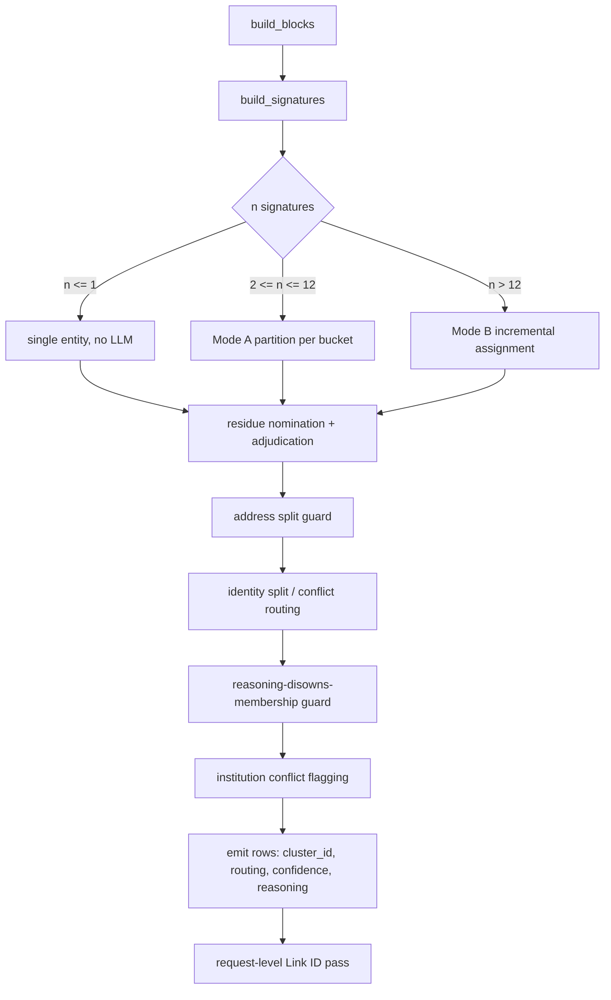

Generated: 2026-09-08 · Commit: 86d173b8a4d715a619b0a2656986c145da7fa81e · Branch: feature/llm-fixes · Pass: 13

# Pass 13 — Clustering dossier

## 0. Scope, tree state and provenance

### 0.1 What this pass covers

Pass 13 regenerates the clustering dossier at this commit: the v2 algorithm, the Name 2
token classes, `Link ID` semantics, and the known failure classes with exemplar rows drawn
from the stress set. Scoring is Pass 14; issue codes are Pass 15; whole-corpus evaluation
numbers are Pass 18. Numbers appear here only where they are properties of clustering, and
every one of them is reproduced by a command whose invocation and verbatim output are in
Appendix B.

### 0.2 Header date

Passes 00–12 in this set carry `Generated: 2026-09-07`; this file carries `2026-09-08`. The
commit, branch and tree state are identical — only the calendar advanced between the passes.
The MANIFEST's identical-header check will show this one field differing.

### 0.3 Tree state

`git status --porcelain` is **not** empty at the time of writing. Every entry is an output of
Passes 00–12 of this same documentation set:

| Entry | Pass |
|---|---|
| `M docs/thesis/00_INVENTORY.md` … `M docs/thesis/09_DECISIONS.md` (12 files) | 00–09 |
| `M docs/thesis/figures/INDEX.md`, 8 `D` + 20 `??` under `docs/thesis/figures/` | 10 |
| `M docs/thesis/11_DELTA.md` | 11 |
| `M docs/thesis/12_RATIONALE.md` | 12 |

No tracked source file, SQL file, ADF JSON, fixture or workbook is modified. The clustering
code this pass documents is exactly the committed code at
`86d173b8a4d715a619b0a2656986c145da7fa81e`.

### 0.4 Files read

| Path | LOC | Role in clustering |
|---|---|---|
| `dedup/signatures.py` | 380 | Blocking (v1 and v2), signature collapsing |
| `dedup/address.py` | 338 | Delivery-point parsing, block keys, pairwise compatibility |
| `dedup/name_slots.py` | 475 | Slot classification — what the text below Name 1 is |
| `dedup/candidates.py` | 400 | Residue nomination rules, deterministic pair evidence |
| `dedup/adjudicator.py` | 1549 | Mode A/B, residue pass, guards, linking, emission |
| `dedup/cluster_key.py` | 36 | `cluster_hash`, `link_hash` |
| `dedup/flags.py` | 63 | The three v2 feature flags |
| `dedup/models.py` | 137 | `DedupRow`, `DedupResultRow`, `DedupSummary` |
| `dedup/prompts.py` | 234 | System and user prompts, prompt versions |
| `dedup/llm.py` | 292 | Azure OpenAI client, sampling parameters |
| `api/routes.py:1100-1327` | — | XLSX ↔ `DedupRow` binding, output columns, `Run` sheet |
| `config.py:603-613` | — | Residue-nomination knobs |

### 0.5 The two recorded stress runs

Two clustering runs over the stress set are recorded as workbooks in `data/eval/`. They are
the only recorded stress-set clustering runs in the repository.

| | v1 run | v2 run |
|---|---|---|
| Workbook | `data/eval/dedup_STRESS_200_v1_enriched_dedup.xlsx` | `data/eval/stress_200_scored.xlsx` |
| Rows | 200 | 183 |
| `Run` sheet | absent | present |
| `Link ID` column | absent | present |
| `Dedup Debug` columns | 4 | 5 |
| Prompt version | ⚠ not recorded in the workbook | `p2-dedup-v8` |
| Flags | ⚠ **inferred** off | `DEDUP_V2_BLOCKING=true`, `DEDUP_V2_NAME2=true`, `DEDUP_V2_ID_CONFLICT=true` |
| Model | ⚠ not recorded | `MDM-Apoorva-gpt-5.4` |
| `fixture_cache` | ⚠ not recorded | `off` |

The v1 workbook's flag state is **inferred**, not recorded: it predates the `Run` sheet
(`api/routes.py:1220-1256`, added at commit `21f0a4f`, 2026-09-05). The inference rests on
two facts that the code makes exact — the `Link ID` column is written if and only if some v2
flag is on (`api/routes.py:1281-1283`, `dedup/flags.py:55-63`), and the debug sheet carries
five columns rather than four under the same condition (`api/routes.py:1215-1217`). Both say
off. `⚠ UNVERIFIED —` the prompt version, model and cache mode behind the v1 run are not
recoverable from the repository.

The v2 run's ground truth is not in its own workbook; it is joined from
`data/eval/dedup_STRESS_200_v1-verified.xlsx` (sheet `Data`) on the `Customer` column. The
183 `Customer` values in `stress_200_scored.xlsx` are exactly the 183 in the verified
workbook, and a strict subset of the 200 in the v1 workbook (Appendix B.4).

### 0.6 The ground-truth vocabulary

The stress set carries its own three-level ground truth, defined on its `Method` sheet and
quoted here because every measurement below is stated against it:

> `gt_dup_group`: records that should collapse into ONE golden record (same entity, same
> delivery point). This is the primary scoring target. `gt_entity_id` / `gt_parent_entity`:
> the real-world organisation; same entity_id across different dup_groups means SAME
> organisation at different sites or buildings - the algorithm should link them but NOT
> collapse them … `gt_trap_group`: look-alike families across DIFFERENT organisations - any
> merge across a trap group is a false positive.
> — `data/eval/dedup_STRESS_200_v1-verified.xlsx`, sheet `Method`, row "Ground truth - three levels"

The same sheet states its own limits, and they bound every claim in §5:

> (4) This file was authored by one reviewer; treat `gt_*` as a reference, not an oracle.
> — sheet `Method`, row "Honesty notes"

### 0.7 How the numbers here were produced

Three read-only scripts, listed in full in Appendix A and run from the repository root. They
open workbooks read-only, import the shipped clustering modules, and write nothing.

| Script | Produces |
|---|---|
| `pass13_stress.py` | v2 run: routing, cluster/link agreement, over- and under-merges, trap crossings, every `manual_review` row |
| `pass13_slots.py` | Replay of blocking and slot classification over the same 183 rows |
| `pass13_v1.py` | v1 run scored against the same ground truth, restricted to the same 183 rows |

`pass13_slots.py` rebuilds `DedupRow` objects from the v2 workbook through the shipped header
alias table (`api/routes.py:1108-1149`) and re-runs `build_blocks`. It reproduces the `Run`
sheet's `rows_in` (183) and `blocks` (111) exactly (Appendix B.2 against B.1), which is the
evidence that the replay sees the same inputs the recorded run saw.

---

## 1. The v2 algorithm

### 1.1 The three flags

v2 is three independent switches, all default-false, read from the environment on every call
rather than captured at import (`dedup/flags.py:36-37`, and the reason at `:16-20`).

| Flag | Constant | Gate function | What it turns on |
|---|---|---|---|
| `DEDUP_V2_BLOCKING` | `dedup/flags.py:31` | `v2_blocking()` `:40-42` | Delivery-point blocking in place of the raw address hash |
| `DEDUP_V2_NAME2` | `:32` | `v2_name2()` `:45-47` | Slot classification of the text below Name 1; the v2 prompts and payload |
| `DEDUP_V2_ID_CONFLICT` | `:33` | `v2_id_conflict()` `:50-52` | Routing an ROR/LEI conflict to review instead of exploding the entity |
| — | — | `v2_any()` `:55-63` | The `Link ID` column and the request-level linking pass |

Truthiness is exact: `_TRUTHY = frozenset({"1", "true", "yes", "on"})` (`dedup/flags.py:29`),
lowercased and stripped; anything else, including `"0"`, `"no"`, `"off"`, the empty string and
an unset variable, is off, "so a typo fails safe to v1" (`:27-29`).

With all three off the output is required to be byte-identical to v1, asserted against a
recorded run by `tests/test_dedup_v2_flags_off.py` (`dedup/flags.py:13-15`).

### 1.2 Pipeline



Legend, by node id — **A** `dedup/signatures.py:260-264`; **B** `dedup/signatures.py:302-380`;
**C** `dedup/adjudicator.py:1343-1352`; **D** `dedup/adjudicator.py:1346`;
**E** `dedup/adjudicator.py:444-579`; **F** `dedup/adjudicator.py:586-720`;
**G** `dedup/adjudicator.py:1357-1362`; **H** `dedup/adjudicator.py:1367-1370`;
**I** `dedup/adjudicator.py:1375`; **J** `dedup/adjudicator.py:1379-1386`;
**K** `dedup/adjudicator.py:1391-1393`; **L** `dedup/adjudicator.py:1395-1398`;
**M** `dedup/adjudicator.py:1513-1525`.

### 1.3 Change B — delivery-point blocking

v1 blocks on `sha1(country | postal_code | street | house_no)` with each part only case- and
punctuation-folded (`dedup/signatures.py:51-62`, `:180-190`). The v2 module states the cost
of that key in its own header:

> Two records at one door therefore fall into different blocks whenever the address was typed
> differently … That is the single largest source of missed duplicates in the stress batch.
> — `dedup/address.py:1-9`

**Parsing.** `parse_address` (`dedup/address.py:160-198`) reduces a row to a `ParsedAddress`
(`:97-115`) of `country`, `zip5`, `house`, `street_core`, `city_norm`, `house_hint`.

| Step | Rule | Citation |
|---|---|---|
| `country` | Stripped, upper-cased | `:162` |
| `zip5` | First five digits when `country.upper() in ("US", "USA")` and ≥5 digits are present; otherwise `normalize_key` of the raw value | `:123-136` |
| `house` | `house_no` with everything but `[0-9a-z]` removed (`45A`→`45a`, `47-111`→`47111`) | `:118-120` |
| `house` recovery | When `house_no` is empty, the first or last street token matching `^\d+[a-z]?$` — **only if** a street core remains beside it | `:170-189` |
| `house_hint` | The recovered number when no street remains ("a street line of `38`"); shown, never used as a house | `:108-110`, `:186-189` |
| `street_core` | Tokens canonicalised through `STREET_SUFFIXES`, stopping at the first `STREET_TYPES` word and dropping what follows | `:139-157` |

`STREET_TYPES` maps 12 street-type spellings onto 12 canonical forms (`:54-66`);
`DIRECTIONALS` maps 9 compass spellings but deliberately never terminates the core, "or
terminating on the leading `E` of `E 11 Mile Rd` would leave nothing at all" (`:68-76`).

**Keys.** `block_keys` (`dedup/address.py:205-222`) emits, per row:

| Condition | Keys emitted |
|---|---|
| `house_less` (no usable house) | `f:{country}|{zip5}` — the fallback key, only |
| house present | `z:{country}|{zip5}|{house}` |
| house present **and** `zip5` **and** `city_norm` | additionally `c:{country}|{city_norm}|{house}` |

A caller-supplied `block_id` overrides all of it and becomes the single key `g:{block_id}`
(`dedup/signatures.py:224-228`).

**Components.** `_v2_blocks` (`dedup/signatures.py:193-257`) unions the keys of each row with
iterative union-find and path compression, takes each connected component as a block, and
names it `blk-` + first 12 hex of sha1 over the component's root key (`:248-250`). Two
determinism guarantees are load-bearing: the union is driven off `keys[0]` per row and roots
are chosen by string order (`:217-221`), and each block's rows are sorted by `row_id`
(`:252-254`) "so signature ids, bucket order and every LLM call sequence below are independent
of the input's row order".

**Unverified blocks.** A component whose root key starts with `f:` holds only house-less rows
and is marked `unverified` (`dedup/signatures.py:242-245`). The key spaces cannot mix, so this
is a property of the component rather than a vote among its members (`:242-244`). Such rows
"block only with each other" and any cluster they form is demoted to `manual_review`
(`dedup/address.py:25-33`, enforced at `dedup/adjudicator.py:1225-1228`).

On the stress set: 111 blocks, 9 of them unverified; block sizes 1×59, 2×38, 3×9, 4×4, 5×1
(Appendix B.2).

**Pairwise compatibility.** `address_compatible` (`dedup/address.py:276-304`) returns one of
`exact` / `fuzzy` / `partial` / `incompatible`; only `incompatible` is load-bearing, and it
means "do not even ask the model about this pair" (`:278-281`). It fires when:

| Test | Threshold | Citation |
|---|---|---|
| Both houses present and different | — | `:283-284` |
| Both zips present, different, and Damerau-Levenshtein distance > 1 | `ZIP_EDIT_TOLERANCE = 1` | `:285-291`, `:89-91` |
| Both street cores present and `streets_compatible` is false | — | `:292-293` |

`streets_compatible` (`:233-273`) is a numeric veto plus two positive tests: identical numeric
token sets are required first, because "`11 mile road` against `13 mile road` is one
character, which Jaro-Winkler reads at 0.94" (`:245-250`); then Jaro-Winkler ≥
`STREET_NAME_THRESHOLD = 0.85` (`:87`), or a token rule requiring
`1 if len(shorter) == 1 else max(2, ceil(len(shorter)/2))` matches (`:264-273`).

`street_match` (`:307-321`) is a deliberately different vocabulary shown to the model —
`exact` / `fuzzy` / `differs` / `unknown` — because "telling a model `incompatible` about a
pair it is being asked to judge invites it to reject on an address question that has already
been decided" (`:310-316`).

### 1.4 STEP A — signatures

A signature is a distinct `(norm_name1, norm_name2)` within a block
(`dedup/signatures.py:79-85`, key built at `:322-326`). It is the blow-up guard: "100
byte-identical rows collapse to one signature; the LLM only ever works on distinct
signatures, never on raw rows" (`:3-5`).

`normalize_key` (`:35-48`) folds NFKD accents, lower-cases, replaces every non-word character
with a space, and collapses whitespace. It deliberately does **not** strip legal forms or
expand abbreviations — "that is the LLM's job. The key is a conservative collapse only"
(`:28-30`). The normalized key is internal; the model always sees the un-normalized names
(`:12-13`).

Under v1, `department_text` (`:65-76`) joins every populated slot below Name 1 with `" / "`.
Under v2, `_resolve_slots` (`:275-299`) routes to `classify_slots` instead (§2), and the
signature's `name1` / `name2` hold the *classified* institution and department (`:90-94`).

Signature ids are `s1`, `s2`, … assigned after order is known (`:377-379`) and are **block-local**
— they restart in every block, which is why the linker keys on position rather than on
signature id (`dedup/adjudicator.py:1066-1069`).

Under v2 a signature accumulates aliases, hints and the five Phase 1 columns across every row
behind it (`dedup/signatures.py:357-375`), "because two records that collapsed to the same
institution may each carry a different other-name for it".

On the stress set: 183 rows → 111 blocks → 154 signatures; 109 signatures with no department
and 45 with one (Appendix B.2).

### 1.5 STEP B — mode selection

| n signatures in block | Mode | LLM calls | Citation |
|---|---|---|---|
| `n <= 1` | A (degenerate) | 0 — identical rows still cluster | `dedup/adjudicator.py:1343-1346` |
| `2 <= n <= threshold` | A — one partition call per non-singleton `has_name2` bucket | ≤ 2 | `:1347-1349`, `:444-579` |
| `n > threshold` | B — incremental canonical assignment | O(n) | `:1350-1352`, `:586-720` |

`threshold` is `SIG_PARTITION_THRESHOLD`, default `DEFAULT_SIG_PARTITION_THRESHOLD = 12`
(`:39`, resolved at `:1465-1466`).

**Mode A** splits the block's signatures by `has_name2` into two buckets *before* any call, so
"the empty-vs-populated decision is never sent to the LLM (it is deterministic)" (`:451-456`,
buckets at `:460-463`). A singleton bucket becomes an entity with no call (`:468-472`). Every
signature id must appear exactly once across `entities[].signature_ids` or
`uncertain_signature_ids` (`dedup/prompts.py:186-189`); a signature the model drops is forced
to `uncertain` "so it surfaces for review rather than vanishing"
(`dedup/adjudicator.py:563-572`). An unparseable response marks the whole bucket uncertain and
never fails the block (`:492-508`).

**Mode B** presents only canonicals whose `has_name2` matches the candidate; an incompatible
candidate starts a new entity with no LLM call at all (`:608-614`). `match` to an unknown or
incompatible `entity_id` is treated as new, with a warning (`:682-693`). Anything other than
`match` / `new` — including `uncertain` — becomes its own flagged entity (`:704-718`).

Mode B's calls are bounded at `max_tokens=1000` (`:642`); Mode A uses the client default of
4000 (`dedup/llm.py:195`).

### 1.6 The residue pass

Mode A and Mode B adjudicate every pair *within* a `has_name2` bucket. What they never compare
are the pairs the asymmetry rule keeps apart, and a signature alone in its bucket; those "bypass
the LLM entirely and default to `unique` with no reasoning" (`dedup/candidates.py:1-13`). The
residue pass nominates such pairs and adjudicates each with one pairwise call
(`dedup/adjudicator.py:814-991`).

**Eligibility** (`dedup/candidates.py:346-369`): a pair is skipped when the v2 address gate says
its delivery points are incompatible (`:365-366`, gate built at `dedup/adjudicator.py:746-760`
over `any_compatible`), and when both units share a `has_name2` value *and* both already went
through the LLM (`:367-368`).

**Nomination rules**, in priority order (`dedup/candidates.py:216-258`). Nomination never
merges; the LLM verdict decides (`:10-12`).

| Rank | Rule | Predicate | Threshold | Citation |
|---|---|---|---|---|
| 0 | `id` | Equal non-empty `lei_id`, or equal non-empty `ror_id` | — | `:138-142`, `:238-239` |
| 1 | `name` | Jaro-Winkler over suffix-stripped institution names | `name_threshold`, default **0.85** | `:241-244` |
| 2 | `acronym` | Either side's initials (stopwords dropped) vs the other, short, name | `ACRONYM_THRESHOLD = 0.8`, short side length 3–6 | `:147-189`, `:246-249` |
| 3 | `cross_slot` | Best Jaro-Winkler of one side's aliases / `operating_name` / `suggested_name` against the other's institution | `CROSS_SLOT_THRESHOLD = 0.85` | `:192-213`, `:250-252` |
| 4 | `token` | Jaccard over suffix-stripped token sets | `token_threshold`, default **0.6** | `:82-87`, `:254-256` |

Ranks 2 and 3 are `extra_rules`, enabled only when `v2_name2()` **and** the block was large
enough for Mode B (`dedup/adjudicator.py:1359-1361`). The reason is cost, stated at
`dedup/candidates.py:230-234`: a small block's signatures are already compared in one Mode A
partition call, so nominating them again "would buy a second opinion on a question already
asked, at one LLM call each".

`ACRONYM_MIN_LEN = 3` exists for one trap in this batch: "two characters is not an initialism
at all, it is a coincidence: `HP` matches the initials of every two-word name beginning H, P —
including `Hewlett Packard Enterprise`, which is a DIFFERENT company at the same address"
(`dedup/candidates.py:153-158`).

**Cap.** `generate_candidate_pairs` sorts by `Candidate.sort_key` — rule rank, then descending
score, then `(a, b)` (`:126-135`) — and the caller applies the cap against that ordered list, so
id-convergence pairs survive it (`:382-385`). Exceeding
`max_candidates` (default **50**, `dedup/adjudicator.py:43`) routes the **whole block** to
`manual_review` with the marker `candidate_cap_exceeded: …`
(`dedup/adjudicator.py:847-863`).

**Verdict application** (`:939-958`): `match` unions the two entities under union-find whose
lowest index stays root (`:865-878`); `new` / `distinct` records a rationale on *both* sides and
increments `rejected_with_reasoning` (`:946-950`); anything else marks both sides uncertain. A
pair already merged transitively is not re-asked (`:886-887`). The nominating rule is written
into the reasoning "so a reviewer can tell an id convergence from a guess at an acronym — the
two deserve very different amounts of trust" (`:918-920`).

**Deterministic evidence.** `pair_evidence` (`dedup/candidates.py:308-343`) is computed for every
pair in a prompt, ungated by block size, and rendered as an `evidence:` block
(`dedup/prompts.py:144-163`). It emits `id`, `acronym`, `suffix_only`, `name_variant`,
`cross_slot`. Its existence is documented as a response to observed model behaviour:

> It exists because the model kept declining to apply rules the prompt already stated: told
> that acronyms are the same institution, it still answered "'Ges Inc' could be an
> abbreviation of 'Global Equipment Services Inc' … there is no explicit alias support", and
> refused four merges on the same reasoning. The rules were never the problem; the model
> wanted a field to point at. This is that field.
> — `dedup/candidates.py:310-317`

`suffix_only` strips trailing `CORPORATE_STRUCTURE_WORDS` (19 words, `:268-271`) and fires when
the remainders are equal but the raw names are not (`:331-335`). `name_variant` accepts
Jaro-Winkler ≥ 0.85 or token containment with at most
`NAME_VARIANT_MAX_EXTRA_TOKENS = 1` extra token (`:279`, `:294-305`) — one extra word is a
variant, "four is a different organisation (`EMD Serono` / `EMD Serono Research and Development
Institute`), and calling that one the same institution would merge a company with its own
research arm" (`:274-279`).

Pairs with no rules are not printed, because "an absent line means the deterministic rules had
nothing to say, not that the two records differ" (`dedup/prompts.py:148-152`).

### 1.7 The deterministic guards, in order

`_process_block` applies them in a fixed order and the order is documented as load-bearing
(`dedup/adjudicator.py:1354-1393`).

| # | Guard | Condition | Outcome | Citation |
|---|---|---|---|---|
| 0 | Name 2 asymmetry | An entity holds both populated- and empty-`has_name2` signatures | Split; the empty ones form an institution-level entity | `:139-171`, applied `:578` |
| 1 | Address split | An entity's non-first signature is `incompatible` with **every** row of the first | Split off, `uncertain`, `manual_review` | `:367-423`, applied `:1367-1370` |
| 2 | Identity split / conflict | Two different non-empty ROR ids, or two different non-empty LEI ids, in one entity | v1: split to singletons; v2: keep the cluster, route to review | `:188-247`, `:309-349`, applied `:1375` |
| 3 | Reasoning disowns membership | A merged entity's reasoning contains a non-merge marker | The **whole block** to `manual_review` | `:426-437`, `:356-364`, applied `:1379-1386` |
| 4 | Institution conflict | Deterministic evidence or a shared registry id vs a model verdict of "different" | The disagreeing signature to `manual_review`; the link stands | `:1172-1182`, applied `:1391-1393` |

Guard 1 splits "the members incompatible with the entity's FIRST signature, so the outcome does
not depend on which member the LLM happened to name first" (`:379-381`). Guard 3 is stated as
an invariant: "a record's stored reasoning may never assert non-merge of a signature it
belongs to" (`:428-430`); the seven markers are listed verbatim at `:356-364` and are read
"ONLY to demote toward manual_review — never to merge".

### 1.8 Change D — id-conflict routing

Under `DEDUP_V2_ID_CONFLICT`, `_enforce_identity_split` delegates to `_route_identity_conflict`
before any splitting (`:208-209`). The reasoning is recorded in full:

> v1 split such an entity into singletons. That is the one outcome that cannot be right:
> either the records are the same and the split is wrong, or they are different and the ids
> are doing their job — and in both cases the thing a steward needs is the PAIR, with both
> ids named.
> — `dedup/adjudicator.py:311-316`

The cluster id stands, every signature is marked `uncertain`, and the reasoning reads
`id conflict: ROR <a> vs <b>` with the ids in signature order (`:333-347`). Ordering is
defended twice: `_ordered_distinct` preserves first-appearance order rather than iterating a
set (`:250-262`), and `_signature_order` re-sorts by numeric signature id because an entity's
signature list is "in the order the MODEL happened to write the ids, which is not a property
of the data" (`:265-274`).

`_inferred_from_short_name` (`:282-306`) appends a cause when the provenance says the id was
not registry-verified **and** the name it came from is one or two tokens: "a one- or two-token
Name 1 — `Scripps`, `Takeda` — is a brand, not an organisation" (`:285-289`). It is silent when
provenance says verified and silent when provenance says nothing, because "an absent
provenance is not evidence of inference" (`:292-293`).

### 1.9 STEP C — emission

`_emit_rows` (`dedup/adjudicator.py:1187-1283`) writes one output row per input row.

| Field | Rule | Citation |
|---|---|---|
| `cluster_id` | `c_` + first 12 hex of sha256 over the sorted member `row_id`s, when the entity holds ≥2 rows; else null | `dedup/cluster_key.py:17-24`, `:1211-1217` |
| `link_id` | Set by the request-level pass (§3); null when linked to nothing | `:1273`, `:1513-1525` |
| `routing` | `manual_review` if the signature is uncertain; else `manual_review` if clustered in an unverified block; else `cluster` if clustered; else `unique` | `:1221-1234` |
| `llm_flag` | `entity.llm_merged` — membership came from ≥2 distinct signatures | `:1275`, `:92-96` |
| `confidence` | Only for a genuine merge (≥2 signatures) or an uncertain row; null for a pure identical-collapse and for a distinct verdict | `:1249-1260` |
| `reasoning` | Surfaced for any entity the LLM decided — merged, rejected or uncertain | `:1236-1248` |

Two emission contracts are stated explicitly and both are testable claims about the workbook:

> An empty Reasoning therefore means exactly "never nominated" (a deterministic collapse / lone
> bucket that never reached the LLM).
> — `dedup/adjudicator.py:1239-1241`

> CONFIDENCE is a MERGE signal: surface it only for a genuine merge (>=2 signatures) or an
> uncertain row — never for a pure identical-collapse or a distinct verdict, where a spurious
> confidence would wrongly trip the election confidence gate.
> — `:1249-1252`

The demotion of an unverified-block cluster prefixes the reasoning with
`UNVERIFIED_DELIVERY_POINT = "unverified delivery point"` (`:999`, applied `:1262-1267`). A
singleton in an unverified block is left alone: "there is no claim in it to qualify"
(`:1205-1206`).

### 1.10 Parameters

| Name | Value | Set by | file:line |
|---|---|---|---|
| `SIG_PARTITION_THRESHOLD` | `12` | env | `dedup/adjudicator.py:39`, `:1465-1466` |
| `DEDUP_MAX_CONCURRENCY` | `5` | env | `:40`, `:1467-1469` |
| `NAME_CANDIDATE_THRESHOLD` | `0.85` | settings > env > default | `:41`, `config.py:605-607` |
| `TOKEN_CANDIDATE_THRESHOLD` | `0.6` | settings > env > default | `:42`, `config.py:608-610` |
| `MAX_CANDIDATES_PER_BLOCK` | `50` | settings > env > default | `:43`, `config.py:611-613` |
| `ACRONYM_THRESHOLD` | `0.8` | constant | `dedup/candidates.py:159` |
| `ACRONYM_MIN_LEN` / `ACRONYM_MAX_LEN` | `3` / `6` | constant | `:158`, `:151` |
| `CROSS_SLOT_THRESHOLD` | `0.85` | constant | `:160` |
| `NAME_VARIANT_MAX_EXTRA_TOKENS` | `1` | constant | `:279` |
| `OVERFLOW_THRESHOLD` | `0.92` | constant | `dedup/name_slots.py:109` |
| `INSTITUTION_THRESHOLD` | `0.85` | constant | `:112` |
| `INSTITUTION_SPLIT_THRESHOLD` | `0.92` | constant | `:118` |
| `STREET_NAME_THRESHOLD` | `0.85` | constant | `dedup/address.py:87` |
| `ZIP_EDIT_TOLERANCE` | `1` | constant | `:91` |
| `DEDUP_REASONING_EFFORT` | `"low"` | env | `dedup/llm.py:148` |
| `DEDUP_MAX_RETRIES` | `3` | env | `:149` |
| `TEMPERATURE` | `0.0` | constant, deliberately not an env knob | `:134-138` |
| `LLM_TOP_P` | `1.0` | constant | `llm/openai_client.py:103` |
| `LLM_SEED` | `42` | constant | `llm/openai_client.py:108` |
| `CONFIDENCE_MERGE_THRESHOLD` | `0.95` | env — consumed by scoring, not clustering | `config.py:599-601` |

`_resolve_candidate_config` resolves the three residue knobs as settings attribute > env var >
module default, warning and falling back on an unparseable env value
(`dedup/adjudicator.py:1420-1443`).

### 1.11 The LLM calls

| | v1 | v2 |
|---|---|---|
| Prompt version | `p2-dedup-v3` | `p2-dedup-v8` |
| Constant | `dedup/prompts.py:14` | `:22` |
| System prompt | `:27-49` | `:66-108` |
| Mode A builder | `:125-141` | `:166-192` |
| Mode B / residue builder | `:195-213` | `:216-234` |
| Fields per record | 5 | 12 |
| Selector | `system_prompt()` `:111-115`, `prompt_version()` `:118-122` — both keyed on `v2_name2()` |

The version bump is deliberate and documented as an experimental boundary: "Any output produced
under one of these is not comparable with output produced under the other, and the version
column is how a reader tells which they are holding" (`dedup/prompts.py:16-21`).

Two rewrites separate v2's system prompt from v1's, both stated at `dedup/prompts.py:52-65`.
The identity model speaks of an *institution* and a *department* rather than of "Name 1" and
"Name 2", because under v2 those cells no longer map to those roles. And the core rule became a
biconditional:

> v3 said "same institution AND same department → SAME", which is silent on the case this batch
> is full of: one record with a department and one without, at one door. That silence was being
> resolved toward merging.
> — `dedup/prompts.py:62-65`

The v2 payload per record is `signature_id`, `institution`, `department`, `aliases`,
`operating_name`, `suggested_name`, `record_type`, `ror_id`, `lei_id`, `street_match`, `hints`
(`dedup/adjudicator.py:791-803`). `street_match` is stated relative to the block's first
signature "so every record in one prompt is described against the same reference rather than
against whichever neighbour came before it" (`:771-774`).

Sampling: `response_format={"type": "json_object"}` and `top_p` are sent on every path;
`seed` and `temperature` each drop out at runtime if the deployment rejects them
(`dedup/llm.py:214-237`, `:262-267`). `temperature=0.0` is sent only when `reasoning_effort` is
not in play — the two are mutually exclusive on gpt-5.4 (`dedup/llm.py:9-15`).

### 1.12 Determinism

| Property | Mechanism | Citation |
|---|---|---|
| Block ids independent of row order | Union-find over sorted keys; roots by string order | `dedup/signatures.py:196-199`, `:217-221` |
| Signature ids independent of row order | Block rows sorted by `row_id` before signatures are built | `:252-254` |
| Cluster ids stable across runs and machines | sha256 over **sorted** member `row_id`s | `dedup/cluster_key.py:17-24` |
| Link ids likewise | Same construction, `l_` prefix | `:27-36` |
| Candidate order stable | Sort by `(rank, -score, a, b)` | `dedup/candidates.py:126-135`, `:399` |
| Residue groups stable | Union-find, lowest index root, groups emitted in sorted root order | `dedup/adjudicator.py:865-878`, `:961-966` |
| Conflict text stable | `_ordered_distinct` + `_signature_order` | `:250-274` |
| Replay of real calls | `DEDUP_FIXTURE_CACHE_DIR` / `DEDUP_FIXTURE_CACHE_MODE`; off unless set | `dedup/cache.py:16`, `:49-50` |

The cache mode in force is written to the workbook's `Run` sheet as `fixture_cache`
(`api/routes.py:1249`); the recorded v2 stress run has it `off` (Appendix B.1).

⚠ `MEASUREMENT REQUIRED` — no rerun-identity check for the clustering path is recorded in the
repository at this commit. `tools/run_diff.py` is the determinism harness named by the pass
set; Pass 18 is where its verdict on a stratum belongs.

---

## 2. Name 2 token classes

### 2.1 The problem the classifier answers

v1 treats every populated slot below Name 1 as a department (`dedup/signatures.py:65-76`) and
`has_name2` is true whenever the join is non-empty (`:141-155`). The asymmetry rule then says a
record with a department can never be the same entity as one without — "which is right, and is
exactly why the classification has to be right too" (`dedup/name_slots.py:5-7`).

The module states the five things that slot actually holds in this data, with the example and
the v1 misreading for each (`dedup/name_slots.py:11-24`):

| What the slot holds | Example from the stress batch | v1 reads it as |
|---|---|---|
| a delivery desk | `Central Receiving` | a department |
| a trading name | `DBA Lee Health` | a department |
| Name 1's own tail | `Institute, Inc` | a department |
| the institution itself | `Case Western Reserve` under Name 1 `GHW23` | a department |
| a person | `Emanuela Zacco - LCA Core` | a department |

> Every row in that table is one half of a duplicate pair the batch contains, and in each case
> v1 put the two halves in different buckets and never compared them. None of them names a
> sub-unit of anything.
> — `dedup/name_slots.py:22-24`

The Phase 1 detectors are imported rather than re-implemented, because "two answers to any of
those questions is one answer too many" (`dedup/name_slots.py:30-35`, imports at `:50-55`):

| Detector | Owns | Actual location at this commit | Location the docstring gives |
|---|---|---|---|
| `has_no_canonical_form` | "is this a back-office desk or a phrase that names nothing" | `enrichment/search_terms.py:678` | `:678` — correct |
| `_normalise_dba` / `_DBA_PATTERNS` | trading names | `enrichment/preprocess.py:642` / `:626-639` | `:613` — ⚠ stale, points at address-pattern extraction |
| `_CO_ATTN_PREFIX_RE` | c/o and ATTN | `enrichment/preprocess.py:1171` | not given |
| `_person_candidate` | person shapes | `enrichment/preprocess.py:1680` | not given |

### 2.2 The requested triad against the implemented vocabulary

The pass set asks for the classes *child-unit / ancestor / continuation*. The code declares
eight, as the `SlotKind` literal at `dedup/name_slots.py:57-60`:

```python
SlotKind = Literal[
    "none", "logistics", "alias", "overflow", "institution", "institution_split",
    "contact", "department",
]
```

They map onto the requested triad as follows.

| Requested class | Implemented kind(s) | Effect on the key | Citation |
|---|---|---|---|
| **child-unit** | `department` | Becomes the department half; `has_name2` true | `:443-448` |
| **ancestor** | `alias` (the `A <X> Company` form), `institution` (Name 1 was an opaque code, the real institution is below it) | Never keyed on; `alias` is shown and matched by `cross_slot`, `institution` **replaces** Name 1 | `:333-342`, `:325-330`, `:382-389` |
| **continuation** | `overflow`, `institution_split` | Appended to / replaced by the institution; department left empty | `:231-247`, `:254-322` |
| *(no requested class)* | `logistics`, `contact`, `none` | Department emptied; text kept as a hint | `:184-198`, `:154-181` |

⚠ **DISCREPANCY (Pass 08).** The code has no class named *ancestor* and no rule that says
"this names a parent organisation". The `A <something> Company` form is filed as an **alias**
— `_A_COMPANY_RE` at `:81`, routed at `:334` — with the comment "trading as, and the
`A <something> Company` form a subsidiary uses to state its parent. Neither is a sub-unit of
the record's institution" (`:78-80`). An alias is defined as "other names for the SAME
institution" and **is** matched on by the `cross_slot` nomination and evidence rules
(`dedup/name_slots.py:126-129`, `dedup/candidates.py:192-213`). So a parent's name stated in
Name 2 is available as a bridge from a subsidiary to its parent. On the stress set this is
inert — both `Global Equipment Services` rows carry the identical alias
`A Kimball Electronics Company`, so it bridges only within the family (Appendix B.2) — but the
mechanism is present and unguarded.

### 2.3 The rules, as reader-verifiable predicates

Every rule below is stated so a reader can evaluate it against a row without running the code.

| Kind | Predicate | Threshold / data | file:line |
|---|---|---|---|
| `institution` | Name 1 matches `^[A-Z0-9]{3,6}(?: LLC| Inc\.?)?$` **and** best Jaro-Winkler of Name 2 against another Name 1 in the block ≥ 0.85 | `_OPAQUE_NAME1_RE` `:85`, `INSTITUTION_THRESHOLD` `:112` | `:325-330` |
| `institution_split` | A rebuild (`name1 name2` or `name2 name1`, suffixes stripped) is JW ≥ 0.92 to another Name 1 in the block, **or** neither slot introduces a token that other name lacks | `INSTITUTION_SPLIT_THRESHOLD` `:118` | `:254-322` |
| `overflow` | Name 1 does **not** end in a legal suffix, **and** (`name1 name2` is JW ≥ 0.92 to another Name 1 in the block, **or** Name 2 is only continuation nouns, **or** Name 1's last token is in `_DANGLING_CONNECTORS`) | `OVERFLOW_THRESHOLD` `:109`; `_CONTINUATION_NOUNS` (26 words) `:93-100`; `_DANGLING_CONNECTORS` = `{for, of, and, the, &, at, in, de}` `:104` | `:231-247` |
| `alias` | A DBA marker fires (`_normalise_dba` reports a change), **or** `\btrading\s+as\b`, **or** `^an?\s+.+\s+company$`, **or** Name 2 minus a trailing site is JW ≥ 0.85 to Name 1 | `_TRADING_AS_RE` `:80`, `_A_COMPANY_RE` `:81`, `_TRAILING_SITE_RE` `:88` | `:333-342` |
| `logistics` | A `LOGISTICS_TERMS` word is present as a whole token, **or** `has_no_canonical_form(value)` | 14 terms, `:67-71` | `:184-185` |
| `contact` | A c/o or ATTN prefix, **or** a two-word head before a separator that `_person_candidate` accepts **and** that shares no token with Name 1 | — | `:154-181` |
| `department` | None of the above | — | `:452-459` |
| `none` | No populated slot below Name 1, or every slot was consumed by a rule above | — | `:375-376`, `:443-448` |

Two of these carry an explicit asymmetric-error argument worth quoting, because they are the
places the classifier deliberately refuses to be clever.

> A bare two-word value is deliberately NOT read as a person … "Fairchild Science" has the
> shape of a first and last name and is a Stanford building's department; reading it as a
> contact would empty the department and merge that record into the bare "Stanford
> University" rows … The error is asymmetric: mistaking a department for a person destroys a
> real distinction, while mistaking a person for a department only fails to merge. So the
> separator is required as evidence.
> — `dedup/name_slots.py:161-168`

> The returned name is SELECTED from the block, never composed. The two slots are only
> evidence that this record means the name another record already spells properly;
> concatenating them would invent a third spelling … that no record states and no registry
> holds.
> — `:284-289`

`_logistics_leftover` (`:188-198`) keeps what is left beside the desk words as a **hint** and
never appends it to the institution, for the same reason.

### 2.4 Rule order, and why it is load-bearing

`classify_slots` asks the rules in a fixed order, documented at `dedup/name_slots.py:355-369`
and implemented at `:382-419`:

| Order | Rule | Why it sits there |
|---|---|---|
| 1 | `institution` (opaque Name 1) | "when Name 1 is a customer code nothing below it can be a sub-unit of anything" |
| 2 | `institution_split` | "a Name 1 that already carries part of the name is not a truncated one" |
| 3 | `overflow` | before logistics, "or PAVIR's `Research` is read as a facility function and its institution is never rebuilt" |
| 4 | per-slot `alias` → `logistics` → `contact` → `department` | alias before department, "so `A Kimball Electronics Company` states a parent rather than inventing a unit" |

Slots below the first are classified on their own terms, "so a delivery desk in Name 3 is
dropped from the department just as one in Name 2 is" (`:368-369`, loop at `:424-439`).

The reported `kind` describes the **outcome**, not the first slot: "any surviving department
text makes this a departmental record, whatever the first slot happened to be" (`:441-448`).

An `institution_split` files both original slot values as **hints**, not aliases, and the
comment records the merge that forced the distinction:

> Filed as an alias it said "this institute is also called EMD Serono, Inc.", the cross_slot
> rule matched it against that company's institution, and the two merged — the company
> swallowed by its own research arm. Hints are shown and never matched on.
> — `dedup/name_slots.py:400-404`

### 2.5 Measured distribution over the stress set

Replaying blocking and classification over the 183 rows of the recorded v2 run
(Appendix A.2, output Appendix B.2):

| Kind | Signatures | Share of 154 |
|---|---|---|
| `none` | 94 | 61.0 % |
| `department` | 45 | 29.2 % |
| `logistics` | 6 | 3.9 % |
| `alias` | 3 | 1.9 % |
| `institution` | 2 | 1.3 % |
| `institution_split` | 2 | 1.3 % |
| `overflow` | 1 | 0.6 % |
| `contact` | 1 | 0.6 % |

15 of 154 signatures (9.7 %) are ones v1 would have keyed as departments and v2 does not:
`logistics`, `alias`, `institution`, `institution_split`, `overflow`, `contact`. `has_name2` is
false for 109 signatures and true for 45.

### 2.6 Exemplars, one per class, from the stress set

Every value below is read out of `data/eval/stress_200_scored.xlsx` (sheet `Sheet`) or produced
by the replay in Appendix B.2.

| Kind | Customer | Name 1 | Name 2 | → institution | → department | aliases / hints |
|---|---|---|---|---|---|---|
| `department` | 13011572 | `Massachusetts Institute of Technology` | `Department of Chemistry` | unchanged | `Department of Chemistry` | — |
| `alias` | 13216611 | `Lee Memorial Health System` | `DBA Lee Health` | unchanged | *(empty)* | alias `DBA Lee Health` |
| `alias` | 13223469 | `Global Equipment Services Corp` | `A Kimball Electronics Company` | unchanged | *(empty)* | alias `A Kimball Electronics Company` |
| `institution` | 13130623 | `GHW23` | `Case Western Reserve University` | `Case Western Reserve University` | *(empty)* | alias `GHW23` |
| `institution` | 13210816 | `KMB3 LLC` | `Case Western Reserve University` | `Case Western Reserve University` | *(empty)* | alias `KMB3 LLC` |
| `institution_split` | 13345935 | `Palo Alto Veterans Institute for` | `Research` | `Palo Alto Veterans Institute for Research` | *(empty)* | hints: both slots |
| `institution_split` | 13348403 | `LabCorp` | `Drug Development` | `Labcorp Drug Development Inc.` | *(empty)* | hints: both slots |
| `overflow` | 13046330 | `Shell International Exploration and` | `Production Inc` | `Shell International Exploration and Production Inc` | *(empty)* | — |
| `logistics` | 13185655 | `The University of Texas Southwestern Medical Center` | `Medical Center Distribution` | unchanged | *(empty)* | hint `Medical Center` |
| `logistics` | 13036034 | `University of Southern California` | `Accounts Payable` | unchanged | *(empty)* | — |
| `contact` | 13342545 | `UCSF` | `Emanuela Zacco - LCA Core` | unchanged | *(empty)* | hint `Emanuela Zacco - LCA Core` |
| `none` | 13115460 | `University of Massachusetts Amherst` | *(blank)* | unchanged | *(empty)* | — |

The `overflow` exemplar is the `_DANGLING_CONNECTORS` arm: `Shell International Exploration
and` ends on `and`, and "a Name 1 that ends on `and`, `for`, `of` or `at` is not a name that
ended — it is one that was cut off at the field width" (`dedup/name_slots.py:240-247`).

The `institution_split` exemplar for LabCorp is the token-containment arm (test (b) at
`:277-280`): neither `LabCorp` nor `Drug Development` introduces a token that
`Labcorp Drug Development Inc.` lacks, and that record spells the name in full in the same
block.

### 2.7 `has_name2` and the asymmetry rule

Under v2, `has_name2` is a statement about the department the classifier found, not about
whether a cell below Name 1 was populated:

> a record whose Name 2 reads "Central Receiving" names no department, and putting it on the
> far side of this rule from its own institution is how the pair stopped being compared.
> — `dedup/signatures.py:149-153`

The rule itself is unchanged and enforced in three places: Mode A buckets before any call
(`dedup/adjudicator.py:460-463`), Mode B presents only matching canonicals (`:608-614`), and
`_enforce_name2_split` is the post-LLM safety net (`:139-171`). §4 measures what it costs.

---

## 3. `Link ID` semantics

### 3.1 What the two ids answer

| Column | Question | Construction | Emitted when |
|---|---|---|---|
| `Cluster ID` | Same **record**? | `c_` + 12 hex of sha256 over sorted member `row_id`s | Entity holds ≥2 rows |
| `Link ID` | Same **organisation**? | `l_` + 12 hex of sha256 over sorted member `row_id`s | Family holds ≥2 rows, and some v2 flag is on |

Same shape, different prefix, deliberately: "a reader glancing at a cell must be able to tell a
`these are the same record` id from a `these are the same organisation` id without consulting a
legend" (`dedup/cluster_key.py:31-34`).

The two are computed **independently**, and the reason is the point of the column:

> Deriving the link from the merge outcome would make it say nothing the Cluster ID does not
> already say — and the cases worth linking are exactly the ones that did NOT merge: a company
> and its research institute, a parent and its subsidiary, a university and the LLC that runs
> its warehouse.
> — `dedup/adjudicator.py:1033-1036`

The model contract states the outcome the file previously could not express: "Two rows sharing
a Link ID and no Cluster ID are related and not duplicates — the outcome the file had no way to
express, so every such finding was previously either overstated as a merge or lost as
`unique`" (`dedup/models.py:97-101`).

### 3.2 The within-block rule

`_institution_links(entities)` (`dedup/adjudicator.py:1026-1117`) runs union-find over
signature **positions**, never over signature ids — those restart at `s1` in every block, "so
across blocks they collide and every block's first signature is unioned with every other
block's — which produced one Link ID for the entire file" (`:1066-1069`).

A pair is unioned when either of two things holds (`:1086-1098`):

| Arm | Condition | Citation |
|---|---|---|
| registry | Equal non-empty LEI, or equal non-empty ROR | `_ids_converge_pair` `:1165-1169` |
| evidence | `pair_evidence(left, right)` is non-empty | `:1091` |

and the model's `institution_relation` for the pair is then read **only to decide routing, not
whether to link**:

| `institution_relation` on either side | Link | Routing |
|---|---|---|
| `"same"` | yes | unchanged |
| `"uncertain"` | yes | unchanged |
| `"different"` | yes | the disagreeing signature → `manual_review` |
| `None` (never asked) | yes | unchanged |

> Every case that reached here links: agreement, uncertainty, and disagreement alike. What the
> disagreement changes is the routing, not whether the pair is connected.
> — `:1095-1097`

The fourth case is treated as a finding rather than an error, and the flag deliberately keeps
the connection: "A flag with no connection is useless to whoever opens the workbook: two rows
marked for review and nothing saying they are about each other" (`:1049-1050`).
`_flag_institution_conflicts` (`:1172-1182`) changes routing only — "Not a merge and not a
split: the entity structure is left exactly as the model decided it."

`_record_institution_relation` (`:1005-1023`) is tolerant by construction: an absent or
malformed value leaves the relation `None`, which the linker reads as "never asked" rather than
"different", because "a field the model forgot must not become a silent assertion that two
organisations are unrelated" (`:1009-1011`). Accepted values are exactly
`("same", "different", "uncertain")` (`:1002`).

### 3.3 The cross-block rule

An institution family is not a property of one delivery point, so linking is deliberately not
block-local (`:1388-1390`). `_institution_links(all_entities, cross_block=True)` restricts the
pair test to the **registry arm alone** (`:1087-1090`):

> The model, however, only ever compares within a block, so across blocks the shared ROR or LEI
> is the only evidence there is; the within-block links then join those families transitively.
> — `:1055-1058`

`_merge_link_maps` (`:1120-1162`) then unions the within-block map with the across-block map —
neither overrides the other — and re-hashes each resulting family. Its worked example is HGST,
and the stress set confirms it exactly (§3.5).

Conflicts, by contrast, **are** block-local: they are "a disagreement about a comparison the
model actually made, and it only compares within a block" (`:1388-1389`).

### 3.4 Column contract

| Route | v1 columns | v2 columns |
|---|---|---|
| Main sheet | `Cluster ID, Routing, LLM Flag, Confidence, Reasoning` (`api/routes.py:1204`) | `Cluster ID, Link ID, Routing, LLM Flag, Confidence, Reasoning` (`:1212-1214`) |
| `Dedup Debug` | `row_id, Cluster ID, Block ID, Signature ID` (`:1206`) | `row_id, Cluster ID, Link ID, Block ID, Signature ID` (`:1215-1217`) |

`Link ID` sits immediately beside `Cluster ID` "because a reader comparing the two is asking the
question the pair exists to answer — same record, or merely same organisation?" (`:1209-1211`),
and is written if and only if `v2_any()` (`:1281-1283`, `:1310`, `:1318`). Internal keys stay on
the debug sheet so "an approver sees a single cluster column and can never confuse which one is
authoritative" (`:1200-1203`).

### 3.5 Measured behaviour on the stress set

The recorded v2 run produces 41 link families over 135 of 183 rows; 48 rows carry no `Link ID`.
Family sizes: 12 of size 2, 13 of size 3, 12 of size 4, 2 of size 5, one of 6, one of 8
(Appendix B.1).

**A link that spans two delivery points via a registry id.** `l_d6c1c4fc6c1d` holds four rows in
two blocks:

| Customer | Name 1 | Address | ROR | Cluster ID |
|---|---|---|---|---|
| 13057667 | `HGST, Inc.` | 5601 Great Oaks Pkwy, 95119 | *(none)* | `c_88e8e1d4a7a8` |
| 13118081 | `Hitachi Global Storage Technologies` | 5601 Great Oaks Pkwy, 95119 | `02q0s1x22` | `c_88e8e1d4a7a8` |
| 13038460 | `HGST, Inc.` | 3403 Yerba Buena Rd, 95135 | *(none)* | `c_cb265fde5898` |
| 13192407 | `Hitachi Global Storage Technologies` | 3403 Yerba Buena Rd, 95135 | `02q0s1x22` | `c_cb265fde5898` |

Two clusters, one link — exactly the path the docstring describes: "HGST's two `HGST Inc` rows
reach each other only through their local links to a `Hitachi Global Storage Technologies` row,
and those two reach each other only through a shared ROR" (`:1125-1128`).

**A link that spans three delivery points.** `l_7ea37a4bd0bd` holds six rows across three
blocks and three clusters (`c_2759839874b4`, `c_e2cd3db4ef48`, `c_98075d235fb4`) at 2109
Adelbert Rd, 2080 Adelbert Rd and 2210 Circle Dr. The bridge is the ROR `051fd9666` carried by
the four plain `Case Western Reserve University` rows; the two opaque-Name-1 rows (`GHW23`,
`KMB3 LLC`, §2.6) carry no id of their own and join through their local links.

**A link where nothing merged.** `l_86b05b9e38cb` holds five MIT rows at 77 Massachusetts Ave,
all routed `unique`, no `Cluster ID` on any of them — three plain records, one with
`Department of Chemistry`, one with `Accounts Payable`, one spelled `MIT`. This is precisely the
finding the column exists to carry.

**A link that survives an id conflict.** `l_f3ef5274ec69` holds four Scripps rows in two
clusters. `13335883` (`Scripps`, ROR `04v7hvq31`) and `13336451` (`Scripps Research Institute`,
ROR `02dxx6824`) share `c_5e2c3b8de632` at confidence 0.94, both routed `manual_review` with
`Reasoning` = `id conflict: ROR 04v7hvq31 vs 02dxx6824` — Change D keeping the pair intact
(§1.8).

### 3.6 What a `Link ID` does not assert

| Not asserted | Because |
|---|---|
| That the rows are duplicates | That is the `Cluster ID`; `link_id` is computed independently (`:1033-1036`) |
| That the rows share a delivery point | Cross-block families are the intended case (`:1053-1056`) |
| That the model agreed | A `"different"` verdict links **and** routes to review (`:1099-1103`) |
| That an unlinked row is unrelated to everything | Two rows can be one organisation with no registry id and no evidence line — see F-1 |

---

## 4. Known failure classes

Each class states the mechanism, the code that produces it, exemplar rows from the stress set,
and whether the outcome is a rule working as written or a defect. Exemplars are quoted from
`data/eval/stress_200_scored.xlsx` joined to `data/eval/dedup_STRESS_200_v1-verified.xlsx`
(Appendix B.1) unless noted.

### F-1 — A cross-block link needs a registry id

**Mechanism.** Across blocks the pair test is the registry arm alone
(`dedup/adjudicator.py:1087-1090`). Two rows of one organisation at two delivery points, with
no shared ROR or LEI, produce two families and no connection.

**Exemplar.** Ground-truth entity `E044`, both rows `MERGE`-labelled into different dup groups:

| Customer | Name 1 | Name 2 | Address | ROR / LEI | Cluster ID | Link ID |
|---|---|---|---|---|---|---|
| 13223469 | `Global Equipment Services Corp` | `A Kimball Electronics Company` | 2372 E Qume Dr, 95131 San Jose | none / none | `c_7da90d1a2bbd` | `l_7da90d1a2bbd` |
| 13226604 | `Global Equipment Services Inc` | `A Kimball Electronics Company` | 5215 Hellyer Ave, 95138 San Jose | none / none | `c_f408b3b7fd85` | `l_f408b3b7fd85` |

Two link families for one organisation. Within its own block each row is linked (to a third
`Global Equipment Services` row and to its own cluster respectively); across blocks nothing
connects them, because `name`, `acronym`, `cross_slot` and `token` evidence is never consulted
cross-block. Both rows carry the identical alias `A Kimball Electronics Company`, which the
`cross_slot` arm would have matched had it been in scope.

**Verdict.** Working as written; a deliberate scope limit (`:1055-1058`), and the largest single
contributor to the 51 unmatched same-`gt_entity_id` pairs in §5.3.

### F-2 — Blocking bounds recall: two delivery points are never compared

**Mechanism.** The unit of adjudication is the block. Rows in different blocks are never
presented to the model, in any mode, and the residue pass is per-block
(`dedup/adjudicator.py:1474-1482`, `:814-823`).

**Exemplars.** Both pairs are `gt_dup_group` `MERGE` labels the run never had the opportunity to
make:

| gt group | Customers | Name 1 | Addresses | Outcome |
|---|---|---|---|---|
| `D001` | 13368532, 13369241 | `University of Texas` | 17217 Waterview Pkwy 75252 / 800 W Campbell Rd 75080 | both `unique`, no link |
| `D064` | 13038452, 13226380 | `Erc Inc` | 302 N Mercury Blvd / 10 E Saturn Blvd, both 93524 | both `unique`, no link |

**Verdict.** Working as written. The ground truth's own note records that the `D001` label
"rest[s] on institutional knowledge (… 800 W Campbell Rd being the UT Dallas campus)" (sheet
`Method`, "Honesty notes"), which is not information any column carries.

### F-3 — The Name 2 asymmetry rule refuses same-address department-vs-none merges

**Mechanism.** A signature with no department can never share an entity with one that has any.
Enforced three times: Mode A buckets before the call (`dedup/adjudicator.py:460-463`), Mode B
filters canonicals (`:608-614`), `_enforce_name2_split` cleans up after (`:139-171`).

**Exemplars.** All four are `gt_dup_group` `MERGE` labels at a single delivery point:

| gt group | Customers | Name 1 | Name 2 | Block | Outcome |
|---|---|---|---|---|---|
| `D013` | 13341685 / 13342488 | `University of California, Los Angeles` | `Center for Systems Biomedicine` / *(blank)* | `blk-22dc0eb85bf8`, both rows | `unique` / `unique`, linked `l_24c979985c2b` |
| `D021` | 13011572 / 13088325 | `Massachusetts Institute of Technology` | `Department of Chemistry` / *(blank)* | 77 Massachusetts Ave | `unique` / `unique`, linked `l_86b05b9e38cb` |
| `D083` | 13162837 / 13361617 | `California Institute of Technology` | `Division of Biology and Biological Engineering` / *(blank)* | 391 Holliston Ave | `unique` / `unique`, linked `l_85cb254e3a64` |
| `D104` | 13127964 / 13147440 | `Nalco Company` / `Nalco Co LLC` | *(blank)* / `Energy Services Division` | 7705 Hwy 90A | `unique` / `unique`, linked `l_15e86669a4b0` |

The replay confirms the mechanism for `D013`: block `blk-22dc0eb85bf8` holds exactly these two
rows as two signatures, `s1` with `has_name2=True` and `s2` with `has_name2=False`
(Appendix B.3). The residue pass nominates the pair — it is cross-boundary residue, so eligible
(`dedup/candidates.py:367-368`) — and the model returned a verdict that did not merge them.

**Verdict.** The rule is working as written, and the prompt reinforces it as a biconditional
("DIFFERENT ENTITY when: one has a department and the other has none",
`dedup/prompts.py:85-86`). Whether the rule is *right* is a design question, not a defect: it
is the deliberate trade documented at `dedup/name_slots.py:5-7`. In this batch it is the
dominant source of the 25 unmerged `gt` MERGE pairs. Each such pair does carry a `Link ID`, so
the relationship is recorded rather than lost.

### F-4 — The address guard never sees a pair that collapsed into one signature

**Mechanism.** `_enforce_address_split` iterates an entity's **signatures** and returns
immediately when there are fewer than two (`dedup/adjudicator.py:389-391`). Two rows with
identical classified names collapse into a single signature at STEP A
(`dedup/signatures.py:322-326`), so the entity holds one signature and the guard is skipped —
even when the two rows' delivery points are `incompatible`. `_emit_rows` then clusters on
`ent.row_ids`, which is ≥2 (`:1211-1214`).

**Exemplar.** Ground-truth `LINK - same organisation, different site: do not collapse`:

| Customer | Name 1 | Street | House | Zip | Parsed street core |
|---|---|---|---|---|---|
| 13115460 | `University of Massachusetts Amherst` | `Holdsworth Way` | 100 | 01003 | `holdsworth way` |
| 13129200 | `University of Massachusetts Amherst` | `Natural Resources Rd` | 100 | 01003 | `natural resources road` |

Both emit the key `z:US|01003|100`, so they share block `blk-33370cbd95a4`. Both classify to
`institution='University of Massachusetts Amherst'`, `department=''`, so they collapse into
**one signature** with two `row_id`s. `address_compatible` on the pair returns `incompatible`
and `street_match` returns `differs` (Appendix B.3) — and neither is consulted, because the
guard requires two signatures. Both rows emit `Cluster ID` `c_4a88cee05959`, `Routing` =
`cluster`.

**Verdict.** ⚠ **DEFECT (Pass 08).** Two different streets at one house number and zip are
asserted as one record with no model call and no guard. The narrower reading — that identical
names at one zip and house number are one delivery point — is defensible, but it is not what
the guard's docstring claims: "an entity may not span incompatible delivery points"
(`:370`). The condition that makes it true is "an entity whose members are distinguishable by
name".

### F-5 — The building differentiator is invisible to clustering

**Mechanism.** `Building` is bound as a hint and kept out of blocking and the signature key by
design: "a building is not an entity … Two records in one building are not thereby one entity,
and two in different buildings at one street address are not thereby two — the delivery point
is the address" (`dedup/models.py:66-71`, `api/routes.py:1139-1142`).

**Exemplar.** Ground truth `DO NOT MERGE - P2-6 building differentiator`:

| Customer | Name 1 | Address | Building | Cluster ID | gt group |
|---|---|---|---|---|---|
| 13132835 | `California State University Los Angeles` | 5151 State University Dr, 90032 | *(blank)* | `c_3fb3cc09c8d0` | `D015` |
| 13225308 | `California State University Los Angeles` | 5151 State University Dr, 90032-8521 | *(blank)* | `c_3fb3cc09c8d0` | `D016` |

Same street, same house, `zip5` `90032` on both sides after the US truncation
(`dedup/address.py:130-135`), no `Building` value on either row. Nothing in the record states
the differentiator the ground truth is asserting. This pair is also an instance of F-4 —
identical names, one signature, guard skipped.

**Verdict.** Working as written, on data that does not carry the distinguishing field. Contrast
`13367825` (Stanford, building `D150`, Name 2 `Structural Biology`), which is correctly kept
out of the Edwards-building cluster `c_7b0f5107ff65` — but by the *department* rule, not by the
building.

### F-6 — Two departments merged into one entity

**Mechanism.** Once two signatures are in the same `has_name2` bucket, the department
comparison is the model's, guided by arm (b) of the same-entity rule: "both have a department
and one is a variant, abbreviation, or sub-unit of the other"
(`dedup/prompts.py:82-84`). Nothing deterministic vetoes a merge of two *different* departments.

**Exemplar.**

| Customer | Name 1 | Name 2 | Cluster ID | gt group |
|---|---|---|---|---|
| 13348301 | `Merck & Co., Inc.` | `Merck Research Laboratories` | `c_bfecb3d6ea82` | `D106` (`MERGE`) |
| 13364371 | `Merck Research Labs` | `Cambridge Exploratory Science Center` | `c_bfecb3d6ea82` | `D107` (`LINK`) |

Both at 320 Bent St, 02141 Cambridge. `Merck Research Laboratories` and `Cambridge Exploratory
Science Center` are not variants of one another.

**Verdict.** ⚠ A model error the deterministic layer does not catch. It is one of the nine
over-merged pairs in §5.2. The same block also splits `13348301` from `13118369`/`13359185`
(both bare `Merck & Co., Inc.`, gt `D106`) by the asymmetry rule — so the run both over-merges
and under-merges inside one ground-truth group.

### F-7 — An unverified block demotes every cluster it produces

**Mechanism.** A block built from house-less rows is marked `unverified`
(`dedup/signatures.py:242-245`); any cluster in it is routed `manual_review` with the reasoning
prefixed `unverified delivery point` (`dedup/adjudicator.py:1225-1228`, `:1262-1267`).

**Exemplars.** 9 of the 17 `manual_review` rows in the recorded run carry the prefix:

| Customers | Name 1 | Why house-less |
|---|---|---|
| 13216611, 13340941 | `Lee Memorial Health System` | `Street 1` and `House Number` both empty |
| 13104512, 13158570 | `United States Gypsum Company` / `USG Corporation, Inc.` | both empty |
| 13345790, 13345937 | `Palo Alto Veterans Institute for Research` | `Street 1` = `38` — a number with no street, kept as `house_hint` and refused as a house (`dedup/address.py:180-189`) |
| 13057138, 13120409, 13128613 | `National Aeronautics and Space Administration` | ⚠ see §5.4 |

The USG pair is the acronym rule working end to end: `LLM Flag` true, confidence 0.95,
reasoning `"USG" is a standard acronym for "United States Gypsum," and the evidence explicitly
flags an acronym match…` — the merge is made and then demoted because the delivery point behind
it was never established.

**Verdict.** Working as written, and deliberately conservative (`dedup/address.py:25-33`).

### F-8 — An id conflict caused by a short-name inference

**Mechanism.** §1.8. Change D keeps the cluster and routes it to review.

**Exemplar.** Both at 9060 Activity Rd, 92126 San Diego, sharing `c_5e2c3b8de632` and
`l_f3ef5274ec69`, both `manual_review`, confidence 0.94:

| Customer | Name 1 | ROR | Provenance |
|---|---|---|---|
| 13335883 | `Scripps` | `https://ror.org/04v7hvq31` | `ror:verified` |
| 13336451 | `Scripps Research Institute` | `https://ror.org/02dxx6824` | `ror:verified` |

Reasoning: `id conflict: ROR 04v7hvq31 vs 02dxx6824`, with **no** short-name note appended —
`_inferred_from_short_name` is silent because both provenances contain `:verified`
(`dedup/adjudicator.py:295-297`), even though `Scripps` is exactly the one-token brand name the
function's docstring names as its motivating case (`:285-289`).

**Verdict.** ⚠ The routing is right; the explanation the reviewer needs is suppressed by the
provenance test. The conflict is upstream — two verified but different ROR ids resolved from
`Scripps` and `Scripps Research Institute`.

### F-9 — A split institution name fragments one company across four routings

**Mechanism.** `_institution_split` (§2.3) rebuilds an institution when two slots hold pieces of
one name and another record in the block spells it in full. Where the rebuild does not fire, the
record keeps its own Name 1 and the pieces stay in the department.

**Exemplar.** Five rows at 45A Middlesex Turnpike, 01821 Billerica, one ground-truth group
`D066`, one link family `l_98c476241085`, four different outcomes:

| Customer | Name 1 | Name 2 | Slot kind | Cluster ID | Routing |
|---|---|---|---|---|---|
| 13033988 | `EMD Serono, Inc.` | *(blank)* | `none` | *(none)* | `manual_review` |
| 13135468 | `EMD Serono Research & Development Institute, Inc.` | `Institute, Inc` | `logistics` | `c_04029e90502f` | `manual_review` |
| 13138597 | `EMD Serono Research Institute, Inc.` | `Research and Development Institute` | `department` | *(none)* | `unique` |
| 13353599 | `EMD Serono, Inc.` | `EMD Serono Research & Development` | `institution_split` | `c_04029e90502f` | `manual_review` |
| 13364185 | `EMD Serono Research & Development Institute, Inc.` | *(blank)* | `none` | `c_04029e90502f` | `manual_review` |

`13138597` is the row `_institution_split`'s docstring is written around (`:263-266`) and it is
the one the rebuild misses here: its Name 1 already repeats `Research` and `Institute`, and it
classifies as `department`, which puts it on the far side of the asymmetry rule from the other
four. The link family holds all five, so the relationship survives.

**Verdict.** Working as written, with one member stranded. The link is what carries the finding.

### F-10 — The documented continuation example is not reached by the continuation rule

**Mechanism.** `_is_overflow` returns `False` immediately when Name 1 ends in a legal suffix
(`dedup/name_slots.py:233`), before either the rebuild test or `_is_continuation` is consulted.

**Exemplar.** The module's own headline example, `Institute, Inc` under
`EMD Serono Research & Development Institute, Inc.` (`dedup/name_slots.py:16`, row 13135468).
Evaluated at this commit (Appendix B.5):

```
ends_in_legal_suffix: True
is_continuation('Institute, Inc'): True
is_overflow: False
has_no_canonical_form('Institute, Inc'): True
is_logistics('Institute, Inc'): True
leftover: 'Institute Inc'
```

`_is_continuation` would accept the slot — both tokens are in `_CONTINUATION_NOUNS` — but is
never asked. The department is emptied anyway, by the **logistics** arm via
`has_no_canonical_form`, and the slot text is kept as the hint `Institute Inc`. The outcome
matches the docstring's intent; the path does not match the docstring's account of it, and the
reported `slot_kind` is `logistics` rather than `overflow`.

**Verdict.** ⚠ **DOCSTRING vs CODE (Pass 08).** No behavioural difference on this row, but the
`slot_kind` telemetry misattributes the rule, and a Name 1 ending in a legal suffix cannot reach
the continuation rule at all.

### F-11 — A parent's name is filed as an alias and is matched on

**Mechanism.** §2.2. `_A_COMPANY_RE` routes `A <X> Company` to `aliases`
(`dedup/name_slots.py:81`, `:334`); aliases are read by `_cross_slot_score`
(`dedup/candidates.py:192-213`), which both nominates pairs and fires the `cross_slot` evidence
line shown to the model.

**Exemplar.** `A Kimball Electronics Company` on both `Global Equipment Services` rows
(13223469, 13226604) — an ancestor, filed as an alias for the subsidiary.

**Verdict.** ⚠ Latent. Inert here because both rows carry the same alias, and because
`extra_rules` is off for blocks small enough for Mode A (`dedup/adjudicator.py:1359-1361`). No
guard distinguishes "another name for this organisation" from "the name of the organisation
above it".

### F-12 — Candidate cap routes an entire block to manual review

**Mechanism.** More than `MAX_CANDIDATES_PER_BLOCK` (default 50) nominated pairs marks every
signature in the block uncertain with the marker `candidate_cap_exceeded: …`
(`dedup/adjudicator.py:847-863`). Telemetry: `candidate_cap_exceeded_blocks`
(`dedup/models.py:130`).

**Exemplar.** None in the recorded run — the largest block holds 5 rows (Appendix B.2). ⚠ This
path is unexercised by the stress set.

### F-13 — Link agreement is measured against a ground truth that splits by building

**Mechanism.** Not a code behaviour. `gt_entity_id` is defined as "the real-world organisation"
(sheet `Method`), but the trap families assign separate entity ids to buildings of one
organisation — `E006`/`E007` for Stanford Edwards and Fairchild, `E008`/`E009` for UCLA MRL and
Gonda (sheet `Traps`).

**Consequence.** All 24 link pairs that disagree with `gt_entity_id` (§5.3) fall in five
families, and 23 of them are pairs within one organisation that the ground truth splits by
building, site or command:

| Link ID | Disagreeing pairs | gt entity ids | What they are |
|---|---|---|---|
| `l_fa56b257f84f` | 16 | `E061` / `E064` | Merck, two sites |
| `l_cd20ceab0f2f` | 3 | `E023` / `E068` | US Army, two commands |
| `l_4763e206087d` | 2 | `E006` / `E007` | Stanford, Edwards vs Fairchild building |
| `l_24c979985c2b` | 2 | `E008` / `E009` | UCLA, MRL vs Gonda building |
| `l_988821f5ab30` | 1 | `E027` / `E028` | Contra Costa County lab vs Regional Medical Center |

The first four families are the `Link ID` doing exactly what §3.1 describes — same
organisation, not the same record, no `Cluster ID` asserted across the boundary. The last is a
genuine link error: the
county's public-health laboratory and the county hospital are different organisations
co-located at 2500 Alhambra Ave, and it is one of the traps this batch exists to catch (sheet
`Traps`, `T-CONTRACOSTA`).

**Verdict.** One real defect (`l_988821f5ab30`) inside a metric that otherwise penalises correct
behaviour. §5.3 reports the raw number and this decomposition together; neither alone is
honest.

---

## 5. Measured outcomes on the stress set

### 5.1 The comparison is indicative, not controlled

The v1 and v2 workbooks (§0.5) do **not** hold identical inputs. Comparing the 183 rows common
to both (Appendix B.4):

| Column | Rows differing (of 183) |
|---|---|
| `Street 1`, `House Number`, `Postal Code`, `City`, `LEI ID` | 0 |
| `Record Type` | 2 |
| `ROR ID` | 5 |
| `Name 3`, `Operating Name`, `Suggested Name` | 7 each |
| `Name 1` | 20 |
| `Name 2` | 22 |

Examples: `13350355` is `Utwmc LLC` in the v1 workbook and
`The University of Texas Southwestern Medical Center` in the v2 one; `13334236` is
`JOHN F Kennedy Memorial Hospital` against `John F. Kennedy Memorial Foundation`.

Phase 1 enrichment therefore differs between the two runs, and the address columns do not. The
difference in clustering outcome below is the joint effect of the three v2 flags **and** of
better upstream names. It cannot be attributed to the clustering change alone from these two
workbooks. ⚠ `MEASUREMENT REQUIRED` — a controlled A/B needs one enriched input file run twice,
flags off and flags on; `dedup/cache.py`'s record/replay mode (`:49-50`) is the mechanism that
would make the second run comparable.

The row sets are otherwise clean: the 183 v2 rows are exactly the 183 ground-truth rows and a
strict subset of the v1 workbook's 200, with no duplicate `Customer` values in either
(Appendix B.4).

### 5.2 Cluster agreement against `gt_dup_group`

Pairwise, over all 183 × 182 / 2 = 16 653 pairs. Truth is MERGE when two rows share a
non-empty `gt_dup_group`. The v1 figures are computed over the same 183 rows and are unchanged
by the restriction (Appendix B.6).

| | v1 (flags inferred off) | v2 (all three flags on) |
|---|---|---|
| Rows routed `cluster` | 35 | 78 |
| Rows routed `unique` | 143 | 88 |
| Rows routed `manual_review` | 5 | 17 |
| Rows carrying a `Cluster ID` | 36 | 92 |
| Distinct clusters | 17 | 42 |
| True-positive pairs | 21 | 50 |
| False-positive pairs | 0 | 9 |
| False-negative pairs | 54 | 25 |
| Precision | 1.000 | 0.847 |
| Recall | 0.280 | 0.667 |

Recall rises by 0.387 and precision falls by 0.153, subject to §5.1.

**All nine false-positive pairs**, with the ground truth's own label for each:

| Customers | Name 1 (both sides) | gt groups | gt entity | gt action | Routing | Class |
|---|---|---|---|---|---|---|
| 13132835 / 13225308 | `California State University Los Angeles` | D015 / D016 | E010 | DO NOT MERGE (building) | `cluster` | F-5, F-4 |
| 13115460 / 13129200 | `University of Massachusetts Amherst` | D076 / D077 | E051 | LINK | `cluster` | F-4 |
| 13144897 / 13223387 | `The University of Texas Rio Grande Valley` | D096 / D097 | E057 | LINK | `cluster` | overflow rebuild |
| 13113215 / 13128534 | `Covia Corp` / `Covia Holdings LLC` | D111 / D112 | E063 | LINK | `cluster` | `suffix_only` evidence |
| 13348301 / 13364371 | `Merck & Co., Inc.` / `Merck Research Labs` | D106 / D107 | E061 | MERGE / LINK | `cluster` | F-6 |
| 13345790 / 13345937 | `Palo Alto Veterans Institute for …` | D071 / D072 | E049 | — | `manual_review` | F-7 |
| 13057138 / 13120409, 13057138 / 13128613, 13120409 / 13128613 | `National Aeronautics and Space Administration` | D121 / D122 / D123 | E067 | — | `manual_review` | F-7 |

Four of the nine are already routed `manual_review` and are therefore not asserted merges. Of
the remaining five, three (`D096/D097`, `D111/D112`, `D076/D077`) are pairs the ground truth
labels `LINK - same organisation, different site: do not collapse` where the two rows share one
house number and one `zip5`; `13144897`/`13223387` are both at `1201 W University Dr` /
`1201 W Universtiy`, 78539 Edinburg, which is one delivery point spelled two ways.

**Trap groups.** No cluster spans two `gt_entity_id`s inside any of the nine trap families —
zero false merges on the adversarial set, including `T-HP` (HP Inc vs Hewlett Packard
Enterprise at 1501 Page Mill Rd, both `unique`, no link) and `T-TAKEDA` (6 rows, 4 entities).
Three trap families are crossed by a `Link ID` rather than a `Cluster ID`; see F-13.

### 5.3 Link agreement against `gt_entity_id`

| Metric | v2 |
|---|---|
| Rows carrying a `Link ID` | 135 of 183 |
| Link families | 41 |
| True-positive pairs | 162 |
| False-positive pairs | 24 |
| False-negative pairs | 51 |

The v1 run emits no `Link ID` at all, so there is no comparison. Both error figures need the
decomposition in F-13 and F-1 to be read: 23 of the 24 false positives are same-organisation
pairs the ground truth splits by building, site or command, and the misses are dominated by
organisations at two delivery points with no shared registry id.

### 5.4 The seventeen `manual_review` rows

| Reason | Rows | Customers |
|---|---|---|
| `unverified delivery point` | 9 | 13216611, 13340941, 13104512, 13158570, 13345790, 13345937, 13057138, 13120409, 13128613 |
| `id conflict: ROR …` | 2 | 13335883, 13336451 |
| Model verdict (`uncertain`, or a distinct verdict on a nominated pair) | 6 | 13213081, 13334236, 13033988, 13135468, 13353599, 13364185 |

Every one of the 17 carries a non-empty `Reasoning`, which is the emission contract at
`dedup/adjudicator.py:1236-1241`.

⚠ The three NASA rows (13057138, 13120409, 13128613) are demoted as `unverified delivery point`
while the `Reasoning` beneath the prefix reads `Both records name the same institution … The
departments are in a parent/s[ub]…` — an LLM merge that was made and then demoted. A fourth
NASA row, 13036862, is `unique` in a different block. The three rows' addresses are not shown in
this pass; ⚠ `MEASUREMENT REQUIRED` — establishing why the block is house-less needs the raw
`Street 1` / `House Number` values, which Pass 18 reads as part of the completeness KPI.

---

## 6. Tests that pin this behaviour

| File | Pins |
|---|---|
| `tests/test_dedup.py` | v1 clustering behaviour |
| `tests/test_dedup_v2_flags_off.py` | Byte-identical v1 output with all three flags off, against a recorded run (`dedup/flags.py:13-15`) |
| `tests/test_dedup_v2.py` | `Link ID` presence and sharing; one organisation across several delivery points is one `Link ID` (`:274-284`) |
| `tests/test_dedup_v2_blocking.py` | Delivery-point blocking; two organisations must not share a `Link ID` (`:439-459`); link stability under a re-sort of the input (`:465-488`) |
| `tests/test_dedup_v2_name2.py` | Slot classification; `Link ID` absent from a v1 workbook (`:645`), and positioned immediately after `Cluster ID` in a v2 one (`:667-668`) |
| `tests/test_dedup_v2_id_conflict.py` | Change D routing |
| `tests/dedup_v2_support.py` | Shared fixtures and the site-partitioning helper (`:109-112`) |
| `tests/test_acronym_dedupe.py`, `tests/test_canonical_dedup.py`, `tests/test_street_fragment_dedup.py`, `tests/test_dedup_eval.py` | Acronym, canonical-form, street-fragment and evaluation paths |

`pytest -q` is not run in this pass; its verbatim tail belongs to Pass 00.

---

## 7. ⚠ items raised by this pass, for Pass 08

| # | Item | Severity | Evidence |
|---|---|---|---|
| 13-1 | `_enforce_address_split` cannot fire on an entity whose rows collapsed into one signature; two incompatible delivery points cluster unchecked | high | F-4; `dedup/adjudicator.py:389-391` vs the docstring at `:370` |
| 13-2 | Two different departments merged into one entity, with no deterministic veto | medium | F-6; 13348301 / 13364371 |
| 13-3 | `_inferred_from_short_name` is silent on `ror:verified`, suppressing the explanation on the one conflict in the batch | medium | F-8; `dedup/adjudicator.py:295-297` |
| 13-4 | `_is_overflow` cannot reach `_is_continuation` when Name 1 ends in a legal suffix; the module's headline example is classified `logistics` | low | F-10; `dedup/name_slots.py:233` vs `:11-20` |
| 13-5 | An ancestor (`A <X> Company`) is filed as an alias and is matched on by `cross_slot` | low, latent | F-11; `dedup/name_slots.py:81`, `dedup/candidates.py:192-213` |
| 13-6 | The v1 stress workbook records no prompt version, model, flag state or cache mode | medium | §0.5; predates `api/routes.py:1220-1256` |
| 13-7 | v1 and v2 stress runs saw different Phase 1 outputs (20 `Name 1`, 22 `Name 2`, 5 `ROR ID` differences), so the A/B is confounded | high | §5.1 |
| 13-8 | The candidate-cap path (`F-12`) is unexercised by any recorded run | low | §4 F-12 |
| 13-9 | The code has no `ancestor` slot class, which the pass set's vocabulary assumes | low | §2.2 |
| 13-10 | No rerun-identity check for the clustering path is recorded at this commit | medium | §1.12 |
| 13-11 | Two stale line citations inside `dedup/name_slots.py`'s own docstring: `enrichment/preprocess.py:613` for the DBA regexes (actually `:626-639` / `:642`), and `dedup/signatures.py:109-117` for `has_name2` (actually `:141-155`) | low | §2.1; `dedup/name_slots.py:5-6`, `:32-33` |

---

## Appendix A — the scripts

Six read-only scripts, run from the repository root at commit `86d173b8a4d715a619b0a2656986c145da7fa81e`. They open workbooks with `read_only=True`, import the shipped clustering modules, and write nothing. They are reproduced in full because the thesis author cannot see this repository; each is self-contained.

### A.1 — `pass13_stress.py`

*The recorded v2 stress run, scored against the verified ground truth.*

```python
"""Pass 13 / Appendix A.1 — the recorded v2 stress run, scored against the
verified ground truth. Read-only: opens two workbooks, writes nothing."""
import itertools, collections
from openpyxl import load_workbook

SCORED = "data/eval/stress_200_scored.xlsx"
VERIFIED = "data/eval/dedup_STRESS_200_v1-verified.xlsx"

def sheet(path, name):
    wb = load_workbook(path, read_only=True, data_only=True)
    ws = wb[name]
    rows = list(ws.iter_rows(values_only=True))
    hdr = [str(h) if h is not None else "" for h in rows[0]]
    out = [dict(zip(hdr, r)) for r in rows[1:]]
    wb.close()
    return hdr, out

print("=== Run sheet ===")
for _k, r in [(0, r) for r in sheet(SCORED, "Run")[1]]:
    print(f"  {r['setting']} = {r['value']}")

hdr_s, run = sheet(SCORED, "Sheet")
hdr_v, gt = sheet(VERIFIED, "Data")
print()
print(f"run rows = {len(run)}  ({SCORED})")
print(f"gt  rows = {len(gt)}  ({VERIFIED})")
key = lambda r: str(r.get("Customer") or "").strip()
gt_by = {key(r): r for r in gt}
joined = [r for r in run if key(r) in gt_by]
print(f"joined on Customer = {len(joined)}")
print()

print("=== routing and ids ===")
print("routing:", dict(collections.Counter(r.get("Routing") for r in run)))
print("rows with Cluster ID:", sum(1 for r in run if r.get("Cluster ID")))
print("rows with Link ID   :", sum(1 for r in run if r.get("Link ID")))
print("clusters            :", len({r["Cluster ID"] for r in run if r.get("Cluster ID")}))
fam = collections.defaultdict(list)
for r in run:
    if r.get("Link ID"):
        fam[r["Link ID"]].append(r)
print("link families       :", len(fam))
print("family sizes        :", dict(sorted(collections.Counter(len(v) for v in fam.values()).items())))
print()

def val(r, c):
    v = gt_by[key(r)].get(c)
    return str(v).strip() if v not in (None, "") else ""

print("=== pairwise cluster agreement vs gt_dup_group ===")
tp = fp = fn = 0
over, under = [], []
for a, b in itertools.combinations(joined, 2):
    same_pred = bool(a.get("Cluster ID")) and a.get("Cluster ID") == b.get("Cluster ID")
    ga, gb = val(a, "gt_dup_group"), val(b, "gt_dup_group")
    same_gt = bool(ga) and ga == gb
    if same_pred and same_gt: tp += 1
    elif same_pred:
        fp += 1
        over.append((key(a), key(b), a.get("Name 1"), b.get("Name 1"), ga, gb,
                     val(a, "gt_entity_id"), val(a, "gt_expected_action"), a.get("Routing")))
    elif same_gt:
        fn += 1
        under.append((ga, key(a), key(b), a.get("Name 1"), b.get("Name 1"),
                      a.get("Routing"), b.get("Routing")))
print(f"pairs compared = {len(joined)*(len(joined)-1)//2}")
print(f"tp={tp} fp={fp} fn={fn}")
print(f"precision={tp/(tp+fp):.3f}  recall={tp/(tp+fn):.3f}")
print()
print("--- the false-positive (over-merged) pairs ---")
for row in over: print("  ", row)
print()
print(f"--- the false-negative (under-merged) pairs: {len(under)} ---")
for row in sorted(under): print("  ", row)
print()

print("=== pairwise link agreement vs gt_entity_id ===")
ltp = lfp = lfn = 0
lfp_rows = []
for a, b in itertools.combinations(joined, 2):
    same_pred = bool(a.get("Link ID")) and a.get("Link ID") == b.get("Link ID")
    ea, eb = val(a, "gt_entity_id"), val(b, "gt_entity_id")
    same_gt = bool(ea) and ea == eb
    if same_pred and same_gt: ltp += 1
    elif same_pred:
        lfp += 1
        lfp_rows.append((a.get("Link ID"), key(a), key(b), a.get("Name 1"), ea, eb))
    elif same_gt: lfn += 1
print(f"tp={ltp} fp={lfp} fn={lfn}")
print("--- link false positives, by family ---")
for lid in sorted({r[0] for r in lfp_rows}):
    rows = [r for r in lfp_rows if r[0] == lid]
    print(f"  {lid}: {len(rows)} pair(s), entities {sorted({r[4] for r in rows} | {r[5] for r in rows})}")
print()

print("=== trap groups ===")
_, clusters_sheet = sheet(VERIFIED, "Clusters")
ent_trap = {r["gt_entity_id"]: r.get("trap_group") for r in clusters_sheet}
traps = collections.defaultdict(list)
for r in joined:
    t = ent_trap.get(val(r, "gt_entity_id"))
    if t: traps[t].append(r)
for t in sorted(traps):
    members = traps[t]
    cl, lk = collections.defaultdict(set), collections.defaultdict(set)
    for r in members:
        if r.get("Cluster ID"): cl[r["Cluster ID"]].add(val(r, "gt_entity_id"))
        if r.get("Link ID"): lk[r["Link ID"]].add(val(r, "gt_entity_id"))
    bad = {c: sorted(e) for c, e in cl.items() if len(e) > 1}
    badlink = {c: sorted(e) for c, e in lk.items() if len(e) > 1}
    print(f"  {t}: {len(members)} rows, cluster-crossings={bad or 'none'}, link-crossings={badlink or 'none'}")
print()

print("=== the manual_review rows ===")
for r in run:
    if r.get("Routing") == "manual_review":
        print("  ", key(r), "|", r.get("Name 1"), "|", r.get("Name 2"), "|",
              r.get("Cluster ID"), "|", r.get("Link ID"), "|", str(r.get("Reasoning"))[:120])
```

### A.2 — `pass13_slots.py`

*Replay of v2 blocking and slot classification over the same 183 rows.*

```python
"""Pass 13 / Appendix A.2 — replay v2 blocking and slot classification over the
183 rows of the recorded v2 stress run. Read-only; imports the shipped modules."""
import os, sys, collections
os.environ["DEDUP_V2_BLOCKING"] = "1"
os.environ["DEDUP_V2_NAME2"] = "1"
os.environ["DEDUP_V2_ID_CONFLICT"] = "1"
sys.path.insert(0, os.getcwd())
from openpyxl import load_workbook
from api.routes import _DEDUP_HEADER_ALIASES, _norm_header
from dedup.models import DedupRow
from dedup.signatures import build_blocks, build_signatures

SRC = "data/eval/stress_200_scored.xlsx"
wb = load_workbook(SRC, read_only=True, data_only=True)
ws = wb["Sheet"]
rows = list(ws.iter_rows(values_only=True))
hdr = [str(h) if h is not None else "" for h in rows[0]]
raw = [dict(zip(hdr, r)) for r in rows[1:]]
wb.close()

dedup_rows = []
for rec in raw:
    norm = {}
    for h, v in rec.items():
        f = _DEDUP_HEADER_ALIASES.get(_norm_header(h))
        if f is None or f in norm:
            continue
        norm[f] = "" if v is None else str(v)
    dedup_rows.append(DedupRow.model_validate(norm))
print(f"rows rebuilt from {SRC}: {len(dedup_rows)}")

blocks = build_blocks(dedup_rows)
print(f"v2 blocks: {len(blocks)}  (unverified: {sum(1 for b in blocks.values() if b.unverified)})")
print("block size histogram:", dict(sorted(collections.Counter(len(b.rows) for b in blocks.values()).items())))

kinds = collections.Counter()
has_name2 = collections.Counter()
examples = collections.defaultdict(list)
total = 0
for block in blocks.values():
    sigs = build_signatures(block.rows)
    total += len(sigs)
    src = {r.row_id: r for r in block.rows}
    for s in sigs:
        kinds[s.slot_kind] += 1
        has_name2[s.has_name2] += 1
        if len(examples[s.slot_kind]) < 6:
            r = src[s.row_ids[0]]
            examples[s.slot_kind].append(
                f"{s.row_ids[0]}  name1={r.name1!r} name2={r.name2!r}"
                f"  ->  institution={s.institution!r} department={s.department!r}"
                f" aliases={s.aliases} hints={s.hints}")
print(f"signatures: {total}")
print("slot_kind distribution:", dict(sorted(kinds.items())))
print("has_name2:", dict(has_name2))
print()
for kind in sorted(examples):
    print(f"--- {kind} ---")
    for line in examples[kind]:
        print("   ", line)
```

### A.3 — `pass13_blocks.py`

*Block membership and pairwise address verdicts for the rows cited in F-3 and F-4.*

```python
"""Pass 13 / Appendix A.3 — block membership and pairwise address verdicts for
the rows cited in F-3 and F-4. Read-only."""
import os, sys
os.environ["DEDUP_V2_BLOCKING"] = "1"
os.environ["DEDUP_V2_NAME2"] = "1"
os.environ["DEDUP_V2_ID_CONFLICT"] = "1"
sys.path.insert(0, os.getcwd())
from openpyxl import load_workbook
from api.routes import _DEDUP_HEADER_ALIASES, _norm_header
from dedup.models import DedupRow
from dedup.signatures import build_blocks, build_signatures
from dedup.address import parse_address, address_compatible, street_match, block_keys

wb = load_workbook("data/eval/stress_200_scored.xlsx", read_only=True, data_only=True)
ws = wb["Sheet"]
rows = list(ws.iter_rows(values_only=True))
hdr = [str(h) if h is not None else "" for h in rows[0]]
recs = [dict(zip(hdr, r)) for r in rows[1:]]
wb.close()
drs = []
for rec in recs:
    n = {}
    for h, v in rec.items():
        f = _DEDUP_HEADER_ALIASES.get(_norm_header(h))
        if f is None or f in n:
            continue
        n[f] = "" if v is None else str(v)
    drs.append(DedupRow.model_validate(n))
by = {r.row_id: r for r in drs}
blocks = build_blocks(drs)

for target in ["13115460", "13341685", "13056457", "13368532", "13223469"]:
    for bid, b in blocks.items():
        if target in [r.row_id for r in b.rows]:
            print(f"block {bid}  unverified={b.unverified}  rows={[r.row_id for r in b.rows]}")
            for s in build_signatures(b.rows):
                print(f"    {s.signature_id} institution={s.institution!r} department={s.department!r}"
                      f" kind={s.slot_kind} has_name2={s.has_name2} rows={s.row_ids}")
            break
print()
for left, right, label in [("13115460", "13129200", "UMass (F-4)"),
                           ("13056457", "13134277", "USC (F-3)")]:
    a, b = parse_address(by[left]), parse_address(by[right])
    print(f"{label}: {left} vs {right}")
    print(f"    {a}")
    print(f"    {b}")
    print(f"    block_keys: {block_keys(a)} / {block_keys(b)}")
    print(f"    address_compatible={address_compatible(a, b)}  street_match={street_match(a, b)}")
```

### A.4 — `pass13_inputs.py`

*Row sets and input drift between the v1 and v2 stress workbooks.*

```python
"""Pass 13 / Appendix A.4 — row sets and input drift between the v1 and v2
stress workbooks. Read-only."""
from openpyxl import load_workbook

def load(path, sheet):
    wb = load_workbook(path, read_only=True, data_only=True)
    ws = wb[sheet]
    rows = list(ws.iter_rows(values_only=True))
    hdr = [str(h) if h is not None else "" for h in rows[0]]
    ix = {h: i for i, h in enumerate(hdr)}       # last occurrence wins
    order = [str(r[ix["Customer"]]).strip() for r in rows[1:]]
    wb.close()
    return ix, {str(r[ix["Customer"]]).strip(): r for r in rows[1:]}, order

i1, d1, o1 = load("data/eval/dedup_STRESS_200_v1_enriched_dedup.xlsx", "Sheet")
i2, d2, o2 = load("data/eval/stress_200_scored.xlsx", "Sheet")
ig, dg, og = load("data/eval/dedup_STRESS_200_v1-verified.xlsx", "Data")
print(f"v1 workbook rows       = {len(o1)}   distinct Customer = {len(set(o1))}")
print(f"v2 workbook rows       = {len(o2)}   distinct Customer = {len(set(o2))}")
print(f"verified workbook rows = {len(og)}   distinct Customer = {len(set(og))}")
print(f"v2 set == verified set : {set(o2) == set(og)}")
print(f"v2 set subset of v1 set: {set(o2) <= set(o1)}")
print(f"in v1 but not v2       : {len(set(o1) - set(o2))}")
print()
print("column drift over the 183 shared rows (v1 workbook value -> v2 workbook value):")
for c in ["Name 1", "Name 2", "Name 3", "Street 1", "House Number", "Postal Code",
          "City", "ROR ID", "LEI ID", "Record Type", "Operating Name", "Suggested Name"]:
    n, shown = 0, []
    for k in o2:
        a = d1[k][i1[c]] if c in i1 else None
        b = d2[k][i2[c]] if c in i2 else None
        a = "" if a is None else str(a).strip()
        b = "" if b is None else str(b).strip()
        if a != b:
            n += 1
            if len(shown) < 3:
                shown.append(f"{k}: {a!r} -> {b!r}")
    print(f"  {c}: {n} of {len(o2)} differ")
    for line in shown:
        print(f"      {line}")
```

### A.5 — `pass13_continuation.py`

*Which rule empties the department for the module's headline continuation example.*

```python
"""Pass 13 / Appendix A.5 — which rule empties the department for the module's
own headline continuation example. Read-only, no workbook."""
import os, sys
os.environ["DEDUP_V2_NAME2"] = "1"
sys.path.insert(0, os.getcwd())
from dedup.name_slots import (
    _ends_in_legal_suffix, _is_continuation, _is_overflow, _is_logistics,
    _logistics_leftover, classify_slots,
)
from enrichment.search_terms import has_no_canonical_form

n1 = "EMD Serono Research & Development Institute, Inc."
n2 = "Institute, Inc"
print(f"name1 = {n1!r}")
print(f"name2 = {n2!r}")
print("ends_in_legal_suffix(name1):", _ends_in_legal_suffix(n1))
print("is_continuation(name2)     :", _is_continuation(n2))
print("is_overflow(name1, name2)  :", _is_overflow(n1, n2, []))
print("has_no_canonical_form(name2):", has_no_canonical_form(n2))
print("is_logistics(name2)        :", _is_logistics(n2))
print("logistics_leftover(name2)  :", repr(_logistics_leftover(n2)))
print("classify_slots(name1, name2):", classify_slots(n1, n2, block_name1s=[n1]))
```

### A.6 — `pass13_v1.py`

*The v1 stress run, scored against the same ground truth and restricted to the same rows.*

```python
"""Pass 13 — the v1 (flags-off) stress run, scored against its own gt_ columns."""
import itertools, collections
from openpyxl import load_workbook
P = "data/eval/dedup_STRESS_200_v1_enriched_dedup.xlsx"
wb = load_workbook(P, read_only=True, data_only=True)
ws = wb["Sheet"]
rows = list(ws.iter_rows(values_only=True))
hdr = [str(h) if h is not None else "" for h in rows[0]]
ix = {}
for i, h in enumerate(hdr):
    ix[h] = i              # last occurrence wins — the appended result columns
data = rows[1:]
get = lambda r, c: r[ix[c]]
print(f"{P}: {len(data)} rows, {len(hdr)} columns")
print("result Cluster ID column index:", ix["Cluster ID"], " Routing:", ix["Routing"])
print("routing:", dict(collections.Counter(get(r, "Routing") for r in data)))
print("rows with Cluster ID:", sum(1 for r in data if get(r, "Cluster ID")))
print("clusters:", len({get(r, "Cluster ID") for r in data if get(r, "Cluster ID")}))
print("Link ID column present:", "Link ID" in hdr)
tp = fp = fn = 0
over = []
for a, b in itertools.combinations(data, 2):
    ca, cb = get(a, "Cluster ID"), get(b, "Cluster ID")
    same_pred = bool(ca) and ca == cb
    ga, gb = get(a, "gt_dup_group"), get(b, "gt_dup_group")
    same_gt = bool(ga) and ga == gb
    if same_pred and same_gt: tp += 1
    elif same_pred:
        fp += 1
        over.append((get(a, "Customer"), get(b, "Customer"), get(a, "Name 1"), get(b, "Name 1"),
                     ga, gb, get(a, "gt_entity_id"), get(b, "gt_entity_id")))
    elif same_gt: fn += 1
print(f"pairwise MERGE  tp={tp} fp={fp} fn={fn}")
print(f"  precision={tp/(tp+fp) if tp+fp else float('nan'):.3f}  recall={tp/(tp+fn) if tp+fn else float('nan'):.3f}")
print("over-merged pairs:")
for o in over: print("  ", o)

# --- restricted to the 183 rows the v2 run covers -------------------------
wb2 = load_workbook("data/eval/stress_200_scored.xlsx", read_only=True, data_only=True)
ws2 = wb2["Sheet"]; r2 = list(ws2.iter_rows(values_only=True))
h2 = [str(h) if h is not None else "" for h in r2[0]]
keep = {str(r[h2.index("Customer")]).strip() for r in r2[1:]}
sub = [r for r in data if str(get(r, "Customer")).strip() in keep]
print()
print(f"restricted to the {len(sub)} rows also present in stress_200_scored.xlsx")
print("routing:", dict(collections.Counter(get(r, "Routing") for r in sub)))
tp = fp = fn = 0
for a, b in itertools.combinations(sub, 2):
    ca, cb = get(a, "Cluster ID"), get(b, "Cluster ID")
    same_pred = bool(ca) and ca == cb
    ga, gb = get(a, "gt_dup_group"), get(b, "gt_dup_group")
    same_gt = bool(ga) and ga == gb
    if same_pred and same_gt: tp += 1
    elif same_pred: fp += 1
    elif same_gt: fn += 1
print(f"pairwise MERGE  tp={tp} fp={fp} fn={fn}")
print(f"  precision={tp/(tp+fp) if tp+fp else float('nan'):.3f}  recall={tp/(tp+fn) if tp+fn else float('nan'):.3f}")
```


---

## Appendix B — verbatim output

Each block is the complete, unedited stdout of the command shown above it. The `grep -v` filters remove only a `urllib3` OpenSSL build warning emitted by the interpreter before any script code runs.

### B.1 — output of `pass13_stress.py`

*The recorded v2 stress run, scored against the verified ground truth.*

```
$ python3 pass13_stress.py
=== Run sheet ===
  prompt_version = p2-dedup-v8
  model = MDM-Apoorva-gpt-5.4
  model_version = MDM-Apoorva-gpt-5.4
  DEDUP_V2_BLOCKING = true
  DEDUP_V2_NAME2 = true
  DEDUP_V2_ID_CONFLICT = true
  dedup_v2_active = true
  fixture_cache = off
  rows_in = 183
  blocks = 111
  llm_calls = 39
  rows_clustered = 78
  rows_unique = 88
  rows_manual_review = 17

run rows = 183  (data/eval/stress_200_scored.xlsx)
gt  rows = 183  (data/eval/dedup_STRESS_200_v1-verified.xlsx)
joined on Customer = 183

=== routing and ids ===
routing: {'unique': 88, 'manual_review': 17, 'cluster': 78}
rows with Cluster ID: 92
rows with Link ID   : 135
clusters            : 42
link families       : 41
family sizes        : {2: 12, 3: 13, 4: 12, 5: 2, 6: 1, 8: 1}

=== pairwise cluster agreement vs gt_dup_group ===
pairs compared = 16653
tp=50 fp=9 fn=25
precision=0.847  recall=0.667

--- the false-positive (over-merged) pairs ---
   ('13132835', '13225308', 'California State University Los Angeles', 'California State University Los Angeles', 'D015', 'D016', 'E010', 'DO NOT MERGE - P2-6 building differentiator', 'cluster')
   ('13345790', '13345937', 'Palo Alto Veterans Institute for Research', 'Palo Alto Veterans Institute for', 'D071', 'D072', 'E049', 'LINK - same organisation, different site: do not collapse', 'manual_review')
   ('13115460', '13129200', 'University of Massachusetts Amherst', 'University of Massachusetts Amherst', 'D076', 'D077', 'E051', 'LINK - same organisation, different site: do not collapse', 'cluster')
   ('13144897', '13223387', 'The University of Texas Rio Grande Valley', 'The University of Texas Rio Grande', 'D096', 'D097', 'E057', 'LINK - same organisation, different site: do not collapse', 'cluster')
   ('13348301', '13364371', 'Merck & Co., Inc.', 'Merck Research Labs', 'D106', 'D107', 'E061', 'MERGE - collapse into one golden record', 'cluster')
   ('13113215', '13128534', 'Covia Corp', 'Covia Holdings LLC', 'D111', 'D112', 'E063', 'LINK - same organisation, different site: do not collapse', 'cluster')
   ('13057138', '13120409', 'National Aeronautics and Space Administration', 'National Aeronautics and Space Administration', 'D121', 'D122', 'E067', 'LINK - same organisation, different site: do not collapse', 'manual_review')
   ('13057138', '13128613', 'National Aeronautics and Space Administration', 'National Aeronautics and Space Administration', 'D121', 'D123', 'E067', 'LINK - same organisation, different site: do not collapse', 'manual_review')
   ('13120409', '13128613', 'National Aeronautics and Space Administration', 'National Aeronautics and Space Administration', 'D122', 'D123', 'E067', 'LINK - same organisation, different site: do not collapse', 'manual_review')

--- the false-negative (under-merged) pairs: 25 ---
   ('D001', '13368532', '13369241', 'University of Texas', 'University of Texas', 'unique', 'unique')
   ('D005', '13033017', '13116126', 'University of North Texas', 'University of North Texas at Dallas', 'unique', 'unique')
   ('D013', '13341685', '13342488', 'University of California, Los Angeles', 'University of California, Los Angeles', 'unique', 'unique')
   ('D021', '13011572', '13088325', 'Massachusetts Institute of Technology', 'Massachusetts Institute of Technology', 'unique', 'unique')
   ('D028', '13056457', '13134277', 'University of Southern California', 'University of Southern California', 'unique', 'cluster')
   ('D028', '13056457', '13213881', 'University of Southern California', 'University of Southern California', 'unique', 'cluster')
   ('D035', '13057338', '13341783', 'Takeda Pharmaceutical U.S.A., Inc.', 'Takeda Pharmaceuticals', 'unique', 'unique')
   ('D048', '13334236', '13335826', 'John F. Kennedy Memorial Foundation', 'John F. Kennedy Memorial Hospital', 'manual_review', 'cluster')
   ('D048', '13334236', '13344636', 'John F. Kennedy Memorial Foundation', 'John F. Kennedy Hospital', 'manual_review', 'cluster')
   ('D053', '13334046', '13336374', 'Hoag Memorial Hospital Presbyterian', 'Hoag Memorial Hospital', 'cluster', 'unique')
   ('D053', '13335012', '13336374', 'Hoag Memorial Hospital', 'Hoag Memorial Hospital', 'cluster', 'unique')
   ('D064', '13038452', '13226380', 'Erc Inc', 'Erc Inc', 'unique', 'unique')
   ('D066', '13033988', '13135468', 'EMD Serono, Inc.', 'EMD Serono Research & Development Institute, Inc.', 'manual_review', 'manual_review')
   ('D066', '13033988', '13138597', 'EMD Serono, Inc.', 'EMD Serono Research Institute, Inc.', 'manual_review', 'unique')
   ('D066', '13033988', '13353599', 'EMD Serono, Inc.', 'EMD Serono, Inc.', 'manual_review', 'manual_review')
   ('D066', '13033988', '13364185', 'EMD Serono, Inc.', 'EMD Serono Research & Development Institute, Inc.', 'manual_review', 'manual_review')
   ('D066', '13135468', '13138597', 'EMD Serono Research & Development Institute, Inc.', 'EMD Serono Research Institute, Inc.', 'manual_review', 'unique')
   ('D066', '13138597', '13353599', 'EMD Serono Research Institute, Inc.', 'EMD Serono, Inc.', 'unique', 'manual_review')
   ('D066', '13138597', '13364185', 'EMD Serono Research Institute, Inc.', 'EMD Serono Research & Development Institute, Inc.', 'unique', 'manual_review')
   ('D083', '13162837', '13361617', 'California Institute of Technology', 'California Institute of Technology', 'unique', 'unique')
   ('D087', '13033121', '13352017', 'University of California, Irvine', 'UC Irvine', 'unique', 'unique')
   ('D088', '13225238', '13353752', 'University of California, Riverside', 'UC Riverside', 'unique', 'unique')
   ('D104', '13127964', '13147440', 'Nalco Company', 'Nalco Co LLC', 'unique', 'unique')
   ('D106', '13118369', '13348301', 'Merck & Co., Inc.', 'Merck & Co., Inc.', 'cluster', 'cluster')
   ('D106', '13348301', '13359185', 'Merck & Co., Inc.', 'Merck & Co., Inc.', 'cluster', 'cluster')

=== pairwise link agreement vs gt_entity_id ===
tp=162 fp=24 fn=51
--- link false positives, by family ---
  l_24c979985c2b: 2 pair(s), entities ['E008', 'E009']
  l_4763e206087d: 2 pair(s), entities ['E006', 'E007']
  l_988821f5ab30: 1 pair(s), entities ['E027', 'E028']
  l_cd20ceab0f2f: 3 pair(s), entities ['E023', 'E068']
  l_fa56b257f84f: 16 pair(s), entities ['E061', 'E064']

=== trap groups ===
  T-CONTRACOSTA: 4 rows, cluster-crossings=none, link-crossings={'l_988821f5ab30': ['E027', 'E028']}
  T-HP: 2 rows, cluster-crossings=none, link-crossings=none
  T-LEE: 5 rows, cluster-crossings=none, link-crossings=none
  T-LICKING: 2 rows, cluster-crossings=none, link-crossings=none
  T-ORLANDO: 4 rows, cluster-crossings=none, link-crossings=none
  T-STANFORD: 3 rows, cluster-crossings=none, link-crossings={'l_4763e206087d': ['E006', 'E007']}
  T-TAKEDA: 6 rows, cluster-crossings=none, link-crossings=none
  T-UCLA: 3 rows, cluster-crossings=none, link-crossings={'l_24c979985c2b': ['E008', 'E009']}
  T-UTDALLAS: 9 rows, cluster-crossings=none, link-crossings=none

=== the manual_review rows ===
   13216611 | Lee Memorial Health System | DBA Lee Health | c_708fd64a8a5f | None | unverified delivery point
   13340941 | Lee Memorial Health System | None | c_708fd64a8a5f | None | unverified delivery point
   13213081 | U.S. Army Ground Vehicle Systems Center | U.S. Army Combat Capabilities Development Command | None | None | The naming is internally inconsistent because the institution is Ground Vehicle Systems Center while the department name
   13334236 | John F. Kennedy Memorial Foundation | None | None | l_a03cf0b4cb4f | This record names a foundation, not a hospital. Despite overlapping commemorative naming, the distinctive institution to
   13104512 | United States Gypsum Company | None | c_12859a74751b | l_12859a74751b | unverified delivery point: "USG" is a standard acronym for "United States Gypsum," and the evidence explicitly flags an 
   13158570 | USG Corporation, Inc. | None | c_12859a74751b | l_12859a74751b | unverified delivery point: "USG" is a standard acronym for "United States Gypsum," and the evidence explicitly flags an 
   13033988 | EMD Serono, Inc. | None | None | l_98c476241085 | This record names EMD Serono, Inc. with no department. It is not the same institution as s2 because s2 adds the distinct
   13135468 | EMD Serono Research & Development Institute, Inc. | Institute, Inc | c_04029e90502f | l_98c476241085 | This record names EMD Serono Research & Development Institute, Inc. with no department. Despite the shared ROR and addre
   13353599 | EMD Serono, Inc. | EMD Serono Research & Development | c_04029e90502f | l_98c476241085 | This record names EMD Serono Research & Development Institute, Inc. with no department. Despite the shared ROR and addre
   13364185 | EMD Serono Research & Development Institute, Inc. | None | c_04029e90502f | l_98c476241085 | This record names EMD Serono Research & Development Institute, Inc. with no department. Despite the shared ROR and addre
   13345790 | Palo Alto Veterans Institute for Research | None | c_ff4f654c7356 | l_a69d68484449 | unverified delivery point
   13345937 | Palo Alto Veterans Institute for | Research | c_ff4f654c7356 | l_a69d68484449 | unverified delivery point
   13335883 | Scripps | None | c_5e2c3b8de632 | l_f3ef5274ec69 | id conflict: ROR 04v7hvq31 vs 02dxx6824
   13336451 | Scripps Research Institute | None | c_5e2c3b8de632 | l_f3ef5274ec69 | id conflict: ROR 04v7hvq31 vs 02dxx6824
   13057138 | National Aeronautics and Space Administration | Ames Research Center | c_4b36bea42391 | l_267419dbea0f | unverified delivery point: Both records name the same institution, supported by the shared ROR and identical institution
   13120409 | National Aeronautics and Space Administration | Ames Research Center | c_4b36bea42391 | l_267419dbea0f | unverified delivery point: Both records name the same institution, supported by the shared ROR and identical institution
   13128613 | National Aeronautics and Space Administration | Ames Research Center | c_4b36bea42391 | l_267419dbea0f | unverified delivery point: Both records name the same institution, supported by the shared ROR and identical institution
```

### B.2 — output of `pass13_slots.py`

*Replay of v2 blocking and slot classification over the same 183 rows.*

```
$ python3 pass13_slots.py 2>&1 | grep -v 'NotOpenSSLWarning\|warnings.warn'
rows rebuilt from data/eval/stress_200_scored.xlsx: 183
v2 blocks: 111  (unverified: 9)
block size histogram: {1: 59, 2: 38, 3: 9, 4: 4, 5: 1}
signatures: 154
slot_kind distribution: {'alias': 3, 'contact': 1, 'department': 45, 'institution': 2, 'institution_split': 2, 'logistics': 6, 'none': 94, 'overflow': 1}
has_name2: {False: 109, True: 45}

--- alias ---
    13223469  name1='Global Equipment Services Corp' name2='A Kimball Electronics Company'  ->  institution='Global Equipment Services Corp' department='' aliases=['A Kimball Electronics Company'] hints=[]
    13226604  name1='Global Equipment Services Inc' name2='A Kimball Electronics Company'  ->  institution='Global Equipment Services Inc' department='' aliases=['A Kimball Electronics Company'] hints=[]
    13216611  name1='Lee Memorial Health System' name2='DBA Lee Health'  ->  institution='Lee Memorial Health System' department='' aliases=['DBA Lee Health'] hints=[]
--- contact ---
    13342545  name1='UCSF' name2='Emanuela Zacco - LCA Core'  ->  institution='UCSF' department='' aliases=[] hints=['Emanuela Zacco - LCA Core']
--- department ---
    13335073  name1='UMASS' name2='Hasbrouch Laboratory'  ->  institution='UMASS' department='Hasbrouch Laboratory' aliases=[] hints=[]
    13138597  name1='EMD Serono Research Institute, Inc.' name2='Research and Development Institute'  ->  institution='EMD Serono Research Institute, Inc.' department='Research and Development Institute' aliases=[] hints=[]
    13348301  name1='Merck & Co., Inc.' name2='Merck Research Laboratories'  ->  institution='Merck & Co., Inc.' department='Merck Research Laboratories' aliases=[] hints=[]
    13364371  name1='Merck Research Labs' name2='Cambridge Exploratory Science Center'  ->  institution='Merck Research Labs' department='Cambridge Exploratory Science Center' aliases=[] hints=[]
    13057338  name1='Takeda Pharmaceutical U.S.A., Inc.' name2='TDC Americas'  ->  institution='Takeda Pharmaceutical U.S.A., Inc.' department='TDC Americas' aliases=[] hints=[]
    13011572  name1='Massachusetts Institute of Technology' name2='Department of Chemistry'  ->  institution='Massachusetts Institute of Technology' department='Department of Chemistry' aliases=[] hints=[]
--- institution ---
    13130623  name1='GHW23' name2='Case Western Reserve University'  ->  institution='Case Western Reserve University' department='' aliases=['GHW23'] hints=[]
    13210816  name1='KMB3 LLC' name2='Case Western Reserve University'  ->  institution='Case Western Reserve University' department='' aliases=['KMB3 LLC'] hints=[]
--- institution_split ---
    13348403  name1='LabCorp' name2='Drug Development'  ->  institution='Labcorp Drug Development Inc.' department='' aliases=[] hints=['LabCorp', 'Drug Development']
    13345935  name1='Palo Alto Veterans Institute for' name2='Research'  ->  institution='Palo Alto Veterans Institute for Research' department='' aliases=[] hints=['Palo Alto Veterans Institute for', 'Research']
--- logistics ---
    13135468  name1='EMD Serono Research & Development Institute, Inc.' name2='Institute, Inc'  ->  institution='EMD Serono Research & Development Institute, Inc.' department='' aliases=[] hints=['Institute Inc', 'EMD Serono, Inc.', 'EMD Serono Research & Development']
    13185655  name1='The University of Texas Southwestern Medical Center' name2='Medical Center Distribution'  ->  institution='The University of Texas Southwestern Medical Center' department='' aliases=[] hints=['Medical Center', '-']
    13036034  name1='University of Southern California' name2='Accounts Payable'  ->  institution='University of Southern California' department='' aliases=[] hints=[]
    13359862  name1='University of Florida' name2='Office 467'  ->  institution='University of Florida' department='' aliases=[] hints=[]
    13161437  name1='University of California, San Francisco' name2='Accounts Payable'  ->  institution='University of California, San Francisco' department='' aliases=[] hints=[]
    13340969  name1='Massachusetts Institute of Technology' name2='Accounts Payable'  ->  institution='Massachusetts Institute of Technology' department='' aliases=[] hints=[]
--- none ---
    13115460  name1='University of Massachusetts Amherst' name2=''  ->  institution='University of Massachusetts Amherst' department='' aliases=[] hints=[]
    13336724  name1='University of Massachuset' name2=''  ->  institution='University of Massachuset' department='' aliases=[] hints=[]
    13364841  name1='LabCorp' name2=''  ->  institution='LabCorp' department='' aliases=[] hints=[]
    13346510  name1='LabCorp' name2=''  ->  institution='LabCorp' department='' aliases=[] hints=[]
    13044674  name1='The University of Texas at Arlington' name2=''  ->  institution='The University of Texas at Arlington' department='' aliases=[] hints=[]
    13353899  name1='The University of Texas at Arlington' name2=''  ->  institution='The University of Texas at Arlington' department='' aliases=[] hints=[]
--- overflow ---
    13046330  name1='Shell International Exploration and' name2='Production Inc'  ->  institution='Shell International Exploration and Production Inc' department='' aliases=[] hints=[]
```

### B.3 — output of `pass13_blocks.py`

*Block membership and pairwise address verdicts for the rows cited in F-3 and F-4.*

```
$ python3 pass13_blocks.py 2>&1 | grep -v 'NotOpenSSLWarning\|warnings.warn'
block blk-33370cbd95a4  unverified=False  rows=['13115460', '13129200']
    s1 institution='University of Massachusetts Amherst' department='' kind=none has_name2=False rows=['13115460', '13129200']
block blk-22dc0eb85bf8  unverified=False  rows=['13341685', '13342488']
    s1 institution='University of California, Los Angeles' department='Center for Systems Biomedicine' kind=department has_name2=True rows=['13341685']
    s2 institution='University of California, Los Angeles' department='' kind=none has_name2=False rows=['13342488']
block blk-12bf312613f5  unverified=False  rows=['13056457', '13134277', '13213881']
    s1 institution='University of Southern California' department='' kind=none has_name2=False rows=['13056457']
    s2 institution='University of Southern California' department='Norris Comprehensive Cancer Cente' kind=department has_name2=True rows=['13134277']
    s3 institution='University of Southern California' department='Norris Cancer Center / Department of Cancer Biology' kind=department has_name2=True rows=['13213881']
block blk-74272af97ca3  unverified=False  rows=['13368532']
    s1 institution='University of Texas' department='' kind=none has_name2=False rows=['13368532']
block blk-38b3038936c6  unverified=False  rows=['13223469', '13234427']
    s1 institution='Global Equipment Services Corp' department='' kind=alias has_name2=False rows=['13223469']
    s2 institution='Global Equipment Services' department='' kind=none has_name2=False rows=['13234427']

UMass (F-4): 13115460 vs 13129200
    ParsedAddress(country='US', zip5='01003', house='100', street_core='holdsworth way', city_norm='amherst', house_hint='')
    ParsedAddress(country='US', zip5='01003', house='100', street_core='natural resources road', city_norm='amherst', house_hint='')
    block_keys: ['z:US|01003|100', 'c:US|amherst|100'] / ['z:US|01003|100', 'c:US|amherst|100']
    address_compatible=incompatible  street_match=differs
USC (F-3): 13056457 vs 13134277
    ParsedAddress(country='US', zip5='90089', house='1441', street_core='east lake avenue', city_norm='los angeles', house_hint='')
    ParsedAddress(country='US', zip5='90033', house='1441', street_core='eastlake avenue', city_norm='los angeles', house_hint='')
    block_keys: ['z:US|90089|1441', 'c:US|los angeles|1441'] / ['z:US|90033|1441', 'c:US|los angeles|1441']
    address_compatible=incompatible  street_match=fuzzy
```

### B.4 — output of `pass13_inputs.py`

*Row sets and input drift between the v1 and v2 stress workbooks.*

```
$ python3 pass13_inputs.py 2>&1 | grep -v 'NotOpenSSLWarning\|warnings.warn'
v1 workbook rows       = 200   distinct Customer = 200
v2 workbook rows       = 183   distinct Customer = 183
verified workbook rows = 183   distinct Customer = 183
v2 set == verified set : True
v2 set subset of v1 set: True
in v1 but not v2       : 17

column drift over the 183 shared rows (v1 workbook value -> v2 workbook value):
  Name 1: 20 of 183 differ
      13185655: 'University of Texas Southwestern Medical' -> 'The University of Texas Southwestern Medical Center'
      13350355: 'Utwmc LLC' -> 'The University of Texas Southwestern Medical Center'
      13044882: 'University of Texas' -> 'The University of Texas at San Antonio'
  Name 2: 22 of 183 differ
      13359862: '' -> 'Office 467'
      13367825: 'Fairchild Science' -> 'Structural Biology'
      13185655: 'Center Distribution' -> 'Medical Center Distribution'
  Name 3: 7 of 183 differ
      13044976: '' -> 'Central Receiving'
      13131049: '' -> 'South Texas Research Facility'
      13213081: 'Alion Science and Technology' -> 'Alion Science'
  Street 1: 0 of 183 differ
  House Number: 0 of 183 differ
  Postal Code: 0 of 183 differ
  City: 0 of 183 differ
  ROR ID: 5 of 183 differ
      13185655: '' -> 'https://ror.org/05byvp690'
      13334236: '' -> 'https://ror.org/01r0ge295'
      13336374: 'https://ror.org/05nmfef18' -> ''
  LEI ID: 0 of 183 differ
  Record Type: 2 of 183 differ
      13350355: 'company' -> 'research_institution'
      13348403: 'unknown' -> 'company'
  Operating Name: 7 of 183 differ
      13185655: 'The University of Texas Southwestern Medical Center' -> ''
      13335060: 'Methodist Hospital for Surgery' -> ''
      13336374: '' -> 'Hoag Memorial Hospital Presbyterian'
  Suggested Name: 7 of 183 differ
      13044976: '' -> 'The University of Texas Health Science Center at San Antonio'
      13146786: 'United States Army' -> ''
      13348400: '' -> 'Dallas VA Medical Center'
```

### B.5 — output of `pass13_continuation.py`

*Which rule empties the department for the module's headline continuation example.*

```
$ python3 pass13_continuation.py 2>&1 | grep -v 'NotOpenSSLWarning\|warnings.warn'
name1 = 'EMD Serono Research & Development Institute, Inc.'
name2 = 'Institute, Inc'
ends_in_legal_suffix(name1): True
is_continuation(name2)     : True
is_overflow(name1, name2)  : False
has_no_canonical_form(name2): True
is_logistics(name2)        : True
logistics_leftover(name2)  : 'Institute Inc'
classify_slots(name1, name2): SlotResult(institution='EMD Serono Research & Development Institute, Inc.', department='', aliases=[], kind='logistics', hints=['Institute Inc'])
```

### B.6 — output of `pass13_v1.py`

*The v1 stress run, scored against the same ground truth and restricted to the same rows.*

```
$ python3 pass13_v1.py 2>&1 | grep -v 'NotOpenSSLWarning\|warnings.warn'
data/eval/dedup_STRESS_200_v1_enriched_dedup.xlsx: 200 rows, 87 columns
result Cluster ID column index: 82  Routing: 83
routing: {'unique': 160, 'cluster': 35, 'manual_review': 5}
rows with Cluster ID: 36
clusters: 17
Link ID column present: False
pairwise MERGE  tp=21 fp=0 fn=54
  precision=1.000  recall=0.280
over-merged pairs:

restricted to the 183 rows also present in stress_200_scored.xlsx
routing: {'unique': 143, 'cluster': 35, 'manual_review': 5}
pairwise MERGE  tp=21 fp=0 fn=54
  precision=1.000  recall=0.280
```


---

Pass 13 complete at `86d173b8a4d715a619b0a2656986c145da7fa81e`.
