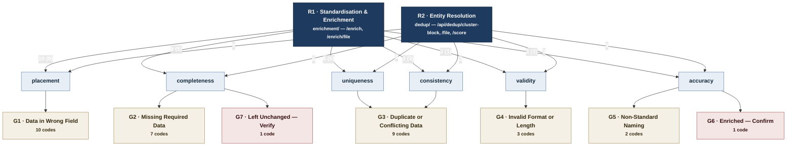

Generated: 2026-09-08 · Commit: 86d173b8a4d715a619b0a2656986c145da7fa81e · Branch: feature/llm-fixes · Pass: 17

# Pass 17 — Taxonomy map

The graph the thesis draws over the 33 live Issue-Catalogue codes: two roots, six DQ dimensions,
seven issue groups, 33 codes. The vocabulary is `ISSUE_CATALOGUE` alone
(`enrichment/issue_detection.py:260–423`); `DedupIssue` is a second, disjoint vocabulary with no
mapping onto this one and is not in the graph (`docs/thesis/15_ISSUES_DOSSIER.md` §15.9).

Working-tree note (Rule 1): `git status --porcelain` is non-empty at this commit and every entry
is a file under `docs/thesis/` produced by this documentation run. No source file, SQL file, ADF
export, fixture or workbook is modified.

---

## 17.0 What the graph is

Four edge classes, three of them layers of one DAG and one cutting across it:

| Class | Edge | Multiplicity | Basis |
|---|---|---|---|
| **A** | root → dimension | a dimension may sit under both roots | the union of its codes' class-D edges |
| **B** | dimension → group | a group may sit under two dimensions | the per-code dimension assignment of `docs/thesis/16_RULESETS.md` §16.2 |
| **C** | group → code | one parent per code | `IssueDefinition.group`, the declared attribute — never the code prefix (`enrichment/issue_detection.py:229`, read through `issue_group()` `:455–461`) |
| **D** | code → root | 0, 1 or 2 roots per code | §17.1 |

Nodes are not duplicated. `G3` has two parents (uniqueness and consistency) and 22 of the 33 codes
carry two class-D edges; each is recorded as a second edge on the one node.

The layering is stated in the order roots → dimensions → groups → codes, but the *information* is
in class D. Class A is derived from class D and, as §17.2.1 shows, every one of the six dimensions
ends up under both roots — the dimension layer does not separate the two phases. What separates
them is which fields each phase reads, and that is a per-code fact.

**Group names** (`enrichment/issue_detection.py:33–35`): G1 Data in Wrong Field · G2 Missing
Required Data · G3 Duplicate or Conflicting Data · G4 Invalid Format or Length · G5 Non-Standard
Naming · G6 Enriched — Confirm · G7 Left Unchanged — Verify. `QUALITY_GROUPS = ("G1","G2","G3",
"G4","G5")` (`:432`); `VERIFICATION_GROUPS = ("G6","G7")` (`:446`).

---

## 17.1 The two roots, and the rule that attaches a code to one

The roots are the two phases as the code ships them, not two categories of defect:

| Root | Stage | Entry points |
|---|---|---|
| **R1 Standardisation & Enrichment** | `enrichment/`, Phase 1 | `POST /enrich`, `POST /enrich/file` |
| **R2 Entity Resolution** | `dedup/`, Phase 2 | `POST /api/dedup/cluster-block`, `POST /api/dedup/file`, `POST /api/dedup/score` |

A code attaches to a root when that root's stage **acts on the field its predicate tests**. The two
attachment tests are different because the two stages stand in different relations to the record —
Phase 1 rewrites it, Phase 2 only reads it.

**R1 test — four basis values, in decreasing strength:**

| Basis | Meaning |
|---|---|
| `writes` | Phase 1 has a write path to the field the predicate tests; the defect is remediable in-phase |
| `raises` | Phase 1's own flag vocabulary raises the code through `FLAG_CODE_ISSUES` (`enrichment/issue_detection.py:1515–1559`) |
| `reads-only` | Phase 1 reads the field as evidence and has **no** write path to it; it can neither repair nor worsen it |
| `none` | neither |

`writes` and `raises` are the *remediation* edges; `reads-only` is an edge to the root but not a
route to a fix.

**R2 test — one basis value, mechanically decidable:** a field reaches Phase 2 only if its SAP
column binds through `_DEDUP_HEADER_ALIASES` (`api/routes.py:1108–1149`) onto a `DedupRow` field
that blocking (`parse_address` `dedup/address.py:160–198`, `block_keys` `:205–222`) or the
signature key (`_resolve_slots` `dedup/signatures.py:275–299`, `normalize_key` `:35–48`, key built
at `:322–326`) reads. A column the alias table does not know binds to nothing and is discarded —
named once at WARNING level and never again (`api/routes.py:1165–1189`).

### 17.1.1 Which SAP columns reach Phase 2 — derived

Full derivation and verbatim output in §17.6.A. The result over the 70 output columns of
`api/output_columns.py`:

| Read by | Columns |
|---|---|
| **signature key** | Name 1, Name 2, Name 3, Name 4, Name 5 |
| **blocking key** | Street 1, House Number, Country/Region Key, Postal Code, City |
| carried as hint or identifier only | Customer, Operating Name, Suggested Name, Building, Record Type, ROR ID, LEI ID, ROR ID Provenance, LEI ID Provenance |
| **binds to nothing** | the remaining 51 columns, including **Street 2–5**, **PO Box**, **Region**, **Email**, **Contact**, **Care Of**, **Search Term 1/2**, **Domain**, **Flag Codes** and every extracted sub-location (Suite, Floor, Room, Unit, Mail Stop, Mail Code, Unloading Point) |

Two consequences the code tables below turn on. **Street 2–5 do not exist for Phase 2**: a defect
confined to them cannot affect a block, a signature or a cluster. **Region does not exist for
Phase 2** either, while Country, Postal Code and City do.

### 17.1.2 Which fields Phase 1 never writes — derived

Five columns are copied verbatim from the record into the result dict and never re-valued:

| Field | Sole write | Read as evidence at |
|---|---|---|
| Country/Region Key | `enrichment/orchestrator.py:727` | `:1106`, `:3596`, `:3955`, `:4900`, `:5394`, `:6924` (country guards, locality, department probe) |
| Postal Code | `:728` | `enrichment/locality.py:396–399`, `enrichment/page_corroborator.py:373–418` |
| City | `:729` | as above |
| Region | `:730` | `enrichment/search_terms.py:553`, `enrichment/locality.py:396–399` |
| House Number | `:767` | `enrichment/orchestrator.py:7848` (input to `preprocess_record`) |

`merge_into_result` (`enrichment/address_processing.py:1317–1336`) — the only path by which the
address stage reaches the result — copies fifteen street and sub-location fields plus the name
overrides. **House Number is not among them, and `AddressResult` has no `house_number` field at
all** (`:91–124`). `normalise_output_fields` re-cases City (`enrichment/orchestrator.py:1995–2000`,
applied `:2034–2037`) and states that Country/Region Key, Region and Postal Code are "never touched
— they are codes, and their case is meaningful" (`:2019–2021`); the casing pass adds and removes no
character, and `normalize_key` lower-cases before the block key is built, so it is inert for R2.

⚠ `AddressResult.city_inferred`, `.state_inferred` and `.zip_inferred` are assigned when a full
address is found jammed into Street 1 (`enrichment/address_processing.py:1102–1110`) and their
docstring says "the orchestrator only populates the record's empty slots" (`:111–115`). No consumer
exists: `merge_into_result` does not copy them and the three names appear nowhere else in
`enrichment/` or `api/` (§17.6.D). A city, state and postal code recovered from a crammed street
line are computed and discarded.

---

## 17.2 (a) The edge table

### 17.2.1 Class A — root → dimension

The label is the count of codes beneath the dimension that carry a class-D edge to that root; the
parenthesis is the count whose R1 basis is `writes` or `raises` — the codes Phase 1 can actually
act on.

| Parent | Child | Codes | Basis |
|---|---|---|---|
| R1 Standardisation & Enrichment | placement | 10 (9 remediable) | union of §17.2.4 |
| R1 Standardisation & Enrichment | completeness | 8 (5) | union of §17.2.4 |
| R1 Standardisation & Enrichment | uniqueness | 6 (6) | union of §17.2.4 |
| R1 Standardisation & Enrichment | consistency | 3 (3) | union of §17.2.4 |
| R1 Standardisation & Enrichment | validity | 3 (1) | union of §17.2.4 |
| R1 Standardisation & Enrichment | accuracy | 3 (3) | union of §17.2.4 |
| R2 Entity Resolution | placement | 9 | union of §17.2.4 |
| R2 Entity Resolution | completeness | 6 | union of §17.2.4 |
| R2 Entity Resolution | uniqueness | 3 | union of §17.2.4 |
| R2 Entity Resolution | consistency | 3 | union of §17.2.4 |
| R2 Entity Resolution | validity | 3 | union of §17.2.4 |
| R2 Entity Resolution | accuracy | 3 | union of §17.2.4 |

All twelve edges exist. **The DQ-dimension layer does not partition the two roots** — stated here
because a reader given only the diagram of §17.3 would otherwise infer that it does.

### 17.2.2 Class B — dimension → group

| Parent | Child | Codes carried | Basis |
|---|---|---|---|
| placement | G1 | 10 | `docs/thesis/16_RULESETS.md` §16.2, dimension totals |
| completeness | G2 | 7 | §16.2 |
| completeness | G7 | 1 | §16.2 — `G7-UNCHANGED-001`, dimension `completeness · judgement` |
| uniqueness | G3 | 6 | §16.2 |
| consistency | G3 | 3 | §16.2 |
| validity | G4 | 3 | §16.2 |
| accuracy | G5 | 2 | §16.2 |
| accuracy | G6 | 1 | §16.2 — `G6-CONFIRM-001`, dimension `accuracy · judgement` |

Eight edges over seven group nodes: **G3 has two parents**. Group and dimension answer different
questions and neither refines the other — G3 splits across two dimensions, and completeness spans a
quality group and a verification group.

### 17.2.3 Class C — group → code

One edge per live code, parent read from the declared `group` attribute
(`enrichment/issue_detection.py:229`).

| Parent | Child | Basis |
|---|---|---|
| G1 | `G1-CROSS-001` | `enrichment/issue_detection.py:262`, factory `_d` `:249–257` |
| G1 | `G1-CROSS-002` | `enrichment/issue_detection.py:263` |
| G1 | `G1-CROSS-003` | `enrichment/issue_detection.py:264` |
| G1 | `G1-ADDR-001` | `enrichment/issue_detection.py:265` |
| G1 | `G1-ADDR-003` | `enrichment/issue_detection.py:266` |
| G1 | `G1-ADDR-004` | `enrichment/issue_detection.py:267` |
| G1 | `G1-ADDR-006` | `enrichment/issue_detection.py:268` |
| G1 | `G1-ADDR-011` | `enrichment/issue_detection.py:269` |
| G1 | `G1-NAME-004` | `enrichment/issue_detection.py:279` |
| G1 | `G1-NAME-013` | `enrichment/issue_detection.py:282` |
| G2 | `G2-VAL-001` | `enrichment/issue_detection.py:293` |
| G2 | `G2-VAL-002` | `enrichment/issue_detection.py:294` |
| G2 | `G2-VAL-004` | `enrichment/issue_detection.py:295` |
| G2 | `G2-VAL-007` | `enrichment/issue_detection.py:296` |
| G2 | `G2-VAL-008` | `enrichment/issue_detection.py:297` |
| G2 | `G2-NAME-009` | `enrichment/issue_detection.py:298` |
| G2 | `G2-NAME-012` | `enrichment/issue_detection.py:300` |
| G3 | `G3-NAME-003` | `enrichment/issue_detection.py:324` |
| G3 | `G3-NAME-005` | `enrichment/issue_detection.py:325` |
| G3 | `G3-NAME-006` | `enrichment/issue_detection.py:330` |
| G3 | `G3-ADDR-005` | `enrichment/issue_detection.py:333` |
| G3 | `G3-ADDR-012` | `enrichment/issue_detection.py:335` |
| G3 | `G3-ADDR-013` | `enrichment/issue_detection.py:339` |
| G3 | `G3-ADDR-014` | `enrichment/issue_detection.py:342` |
| G3 | `G3-CONTACT-007` | `enrichment/issue_detection.py:343` |
| G3 | `G3-CONTACT-010` | `enrichment/issue_detection.py:345` |
| G4 | `G4-NAME-015` | `enrichment/issue_detection.py:352` |
| G4 | `G4-ADDR-026` | `enrichment/issue_detection.py:367` |
| G4 | `G4-ADDR-027` | `enrichment/issue_detection.py:368` |
| G5 | `G5-NAME-001` | `enrichment/issue_detection.py:371` |
| G5 | `G5-NAME-002` | `enrichment/issue_detection.py:374` |
| G6 | `G6-CONFIRM-001` | `enrichment/issue_detection.py:403` |
| G7 | `G7-UNCHANGED-001` | `enrichment/issue_detection.py:420` |

Line numbers are the `_d(...)` entry positions inside the `ISSUE_CATALOGUE` literal
(`enrichment/issue_detection.py:260–423`), derived in §17.6.E. The authority for the parent is the
second positional argument of `_d` — the declared `group` — and **not** the code prefix.
`G2-VAL-003` (`:381`) and `G2-VAL-006` (`:386`) are declared `group="G6"`; both are withdrawn, which
is why the prefix cannot be used as the parent (`docs/thesis/15_ISSUES_DOSSIER.md` §15.1).

### 17.2.4 Class D — code → root

`field(s) tested` is what the predicate scans, not the reported `field` attribute — the two differ
for eight codes and the root attachment follows the predicate. **⚠** marks an edge that is not
mechanically derivable from the detection predicate; §17.4 collects them.

| Code | Field(s) tested | → R1 | R1 basis | → R2 | R2 basis |
|---|---|---|---|---|---|
| `G1-CROSS-001` | Name 1–5 | ✔ | `writes` — UC 9 address extraction, `enrichment/preprocess.py:2347–2372` | ✔ | Name 1–5 → signature institution and department halves |
| `G1-CROSS-002` | Street 1–5 | ✔ | `writes` — `street_*_cleaned`, `enrichment/address_processing.py:1327–1336` | ✔ | Street 1 only; Streets 2–5 bind to nothing |
| `G1-CROSS-003` | Name 1–5, Street 1–5 | ✔ | `writes` — UC 7/UC 8 extraction to `Contact`/`Email`, `enrichment/preprocess.py:2253–2300`, `:2472–2520` | ✔ | Name 1–5 and Street 1 |
| `G1-ADDR-001` | House Number, Street 1–5 | ✔ | **`reads-only`** — House Number is carried verbatim (`enrichment/orchestrator.py:767`, read `:7848`); `AddressResult` has no such field (§17.1.2) | ✔ | v1 blocking splits the pair; v2 recovers the house from the street line (§17.6.B) |
| `G1-ADDR-003` | Street 1–5 | ✔ | `writes` — Suite/Building/Floor/Room/Unit/Mail Stop, `enrichment/address_processing.py:1327–1333` | ✔ ⚠ | conditional: only via Street 1, and only when the sub-location **precedes** the street type — `_street_core` stops at the first street type and drops the rest (`dedup/address.py:139–157`; §17.6.B) |
| `G1-ADDR-004` | Street 1–5, PO Box | ✔ | `writes` — `po_box_extracted`, `:1331` | ✔ | a PO-box number in Street 1 is read as a house number and blocks against the real door of that number (§17.6.B) |
| `G1-ADDR-006` | Street 1–5 (bare form Street 2–5 only) | ✔ | `writes` — `mail_code`, `:1331` | ✔ ⚠ | conditional: the bare form fires only on Street 2–5, which bind to nothing; only the explicit form on Street 1 reaches R2 |
| `G1-ADDR-011` | Street 1–5 | ✔ | `writes` — `department_addendum` placed into a name slot, `enrichment/address_processing.py:1364–1379` | ✔ | Street 1 core, and the misplaced department is missing from the signature's department half |
| `G1-NAME-004` | Name 1–5 | ✔ | `writes` — dept-block pack, `enrichment/dept_block.py:246–340` | ✘ | **inert**: `department_text` joins only the populated slots, so a gap yields an identical signature key (`dedup/signatures.py:65–76`; §17.6.B) |
| `G1-NAME-013` | Name 1–5 | ✔ | `writes` — UC 10, **department slots only**; Name 1 is excluded (`enrichment/preprocess.py:2463–2470`) | ✔ | an opaque code in a name slot is the institution half of the signature (`docs/thesis/03b_EXEMPLARS.md` §3b.2.6) |
| `G2-VAL-001` | Name 1 | ✔ ⚠ | `writes` — `name1_enriched`; but with Name 1 blank Phase 1 enters the `no_names` degraded mode (`enrichment/grounded_resolver.py:551–558`) and `remedy="steward"` | ✔ | the signature's institution half is empty |
| `G2-VAL-002` | Postal Code | ✔ | **`reads-only`** (§17.1.2) | ✔ | `zip5` is half of both key spaces (`dedup/address.py:123–136`, `:205–222`) |
| `G2-VAL-004` | Region | ✔ | **`reads-only`** (§17.1.2) | ✘ | Region binds to nothing (§17.1.1) |
| `G2-VAL-007` | Search Term 1 | ✔ | `writes` — `derive_search_terms`, `enrichment/orchestrator.py:3215` | ✘ | Search Term 1 binds to nothing |
| `G2-VAL-008` | Country/Region Key | ✔ | **`reads-only`** (§17.1.2) | ✔ | `country` is the first component of every block key |
| `G2-NAME-009` | Name 2–5 | ✔ | `writes` — Tier 2 canonicalisation, `enrichment/tier2_canonical.py:179–265` | ✔ | the department half of the signature |
| `G2-NAME-012` | Name 1, Name 2 | ✔ | `writes`; `remedy="steward"` — both contact-based routes are withdrawn (`enrichment/issue_detection.py:311–323`) | ✔ | an empty department half collapses distinct units onto one signature |
| `G3-NAME-003` | Name 1–5 | ✔ | `writes` — UC 11, `enrichment/preprocess.py:2435–2446` | ✔ | the marker is inside the signature's institution half |
| `G3-NAME-005` | adjacent name pairs | ✔ | `writes` — UC 12 duplicate-slot clearing, `enrichment/preprocess.py:2635–2680` | ✔ | the repeat becomes the department half (§17.6.B) |
| `G3-NAME-006` | Flag Codes | ✔ | `raises` — `FLAG_CODE_ISSUES` `enrichment/issue_detection.py:1530` | ✔ ⚠ | the predicate tests Flag Codes, which binds to nothing; the **defect** is in Name 1, which the signature reads |
| `G3-ADDR-005` | Street 1–5, PO Box | ✔ | `writes` — `po_box_extracted` | ✔ ⚠ | conditional: only when one of the boxes is in Street 1; the PO Box column binds to nothing |
| `G3-ADDR-012` | Street 1–5 | ✔ | `writes` | ✘ | the repeat is between Street 1 and a slot Phase 2 never reads; Street 1's own value is unchanged |
| `G3-ADDR-013` | Street 1–5 | ✔ | `writes` | ✔ | Phase 2 reads exactly one of the two addresses and blocks the record at one delivery point |
| `G3-ADDR-014` | Street 1–5, PO Box | ✔ | `writes` | ✔ ⚠ | conditional as `G3-ADDR-005`: the PO Box column is invisible to Phase 2, so only a box in Street 1 reaches it |
| `G3-CONTACT-007` | Contact | ✔ | `writes` — `contact_enriched` | ✘ | Contact binds to nothing |
| `G3-CONTACT-010` | Email, Name 1–5, Street 1–5 | ✔ | `writes` — `email_enriched` | ✘ ⚠ | the pooled set spans name and street slots, but the code fires on multiplicity across a pool Phase 2 never reconstructs; the Email column binds to nothing |
| `G4-NAME-015` | Name 1–5 | ✔ | `writes` | ✔ | all five slots feed the signature |
| `G4-ADDR-026` | Postal Code, Country | ✔ | **`reads-only`** (§17.1.2) | ✔ | `_zip5` truncates to five digits for US/USA and otherwise `normalize_key`s the raw value; a malformed code yields a distinct key space |
| `G4-ADDR-027` | Country | ✔ | **`reads-only`** (§17.1.2) | ✔ | `parse_address` upper-cases the **raw** country and never normalises to ISO: `US`, `USA` and `United States` are three key spaces at one delivery point (§17.6.C) |
| `G5-NAME-001` | Name 1 | ✔ | `writes` — registry and grounded name writes | ✔ | the institution half; the `NSU` / `Nova Southeastern University` pair is the worked case (`docs/thesis/03b_EXEMPLARS.md` §3b.7) |
| `G5-NAME-002` | Name 2–5 | ✔ | `writes` — Tier 2 canonicalisation | ✔ | the department half |
| `G6-CONFIRM-001` | Flag Codes | ✔ | `raises` — `enrichment/issue_detection.py:1535–1539` | ✔ ⚠ | the predicate tests Flag Codes; of the five flags it collapses, `unverified-inference` and `dept-via-*` question values that are the signature's own halves, while `domain-unverified` questions a column Phase 2 never reads |
| `G7-UNCHANGED-001` | Flag Codes | ✔ | `raises` — `:1556–1558` | ✔ ⚠ | as above: the unestablished value is Name 1 or Name 2, which Phase 2 reads, but the predicate tests only Flag Codes |

**Totals.** 22 codes carry both roots; 5 are R1-only (`G1-NAME-004`, `G2-VAL-007`, `G3-ADDR-012`,
`G3-CONTACT-007`, `G3-CONTACT-010`); 5 are R2-only in the sense that R1 can read but not write
(`G1-ADDR-001`, `G2-VAL-002`, `G2-VAL-008`, `G4-ADDR-026`, `G4-ADDR-027`); 1 code — `G2-VAL-004` —
has a `reads-only` R1 edge and no R2 edge, and is therefore the one code in the catalogue that no
stage of the documented system can either repair or be affected by.

### 17.2.5 ⚠ Three reduction-set codes require writing a field Phase 1 never writes

The reduction set is the 18 codes with `remedy ∈ ("rule","enrichment")`, and the headline reduction
percentage is computed over those alone (`api/routes.py:540–561`;
`docs/thesis/15_ISSUES_DOSSIER.md` §15.5–15.6). For three of the 18, the field a repair would have
to write has no Phase 1 write path — its only write is the initial copy from the record (§17.1.2).

| Code | Remedy | Declared `field` | Field a repair must write | Phase 1 write path to it | Observed |
|---|---|---|---|---|---|
| `G1-ADDR-001` | `rule` | `Street` (`:265`) | House Number — the number has to land somewhere | none: `AddressResult` has no `house_number` field (`enrichment/address_processing.py:91–124`) and `merge_into_result` copies no such key (`:1327–1336`) | persists pre→post on S2 and S5 (`docs/thesis/03b_EXEMPLARS.md` §3b.3.5, §3b.6.5) |
| `G2-VAL-008` | `rule` | `Country` (`:297`) | Country/Region Key | none: `enrichment/orchestrator.py:727` only | ⚠ MEASUREMENT REQUIRED — no exemplar in `data/eval/` carries a blank Country; `tools/eval_report.py` (Pass 18) produces the pre/post count |
| `G4-ADDR-027` | `rule` | `Country` (`:368`) | Country/Region Key | none: as above | ⚠ MEASUREMENT REQUIRED — same source |

The `rule` remedy value is defensible on its own terms: it says *a deterministic rule could fix
this*, not *this pipeline does*. But the segmentation reads `remedy` alone (`api/routes.py:549–552`)
and places all three in "Reduced", so a reduction figure computed at this commit carries three codes
that Phase 1 has no mechanism to reduce. This is a new finding at Pass 17; the gap register runs to
`G-102` (`docs/thesis/08_GAPS.md` §8.4) and does not contain it.

---

## 17.3 (b) The Mermaid graph — roots → dimensions → groups

Codes stay in §17.2.3 and §17.2.4. Edge labels on the root layer are `codes attached (remediable)`
for R1 and `codes attached` for R2, from §17.2.1.



Two structural facts the diagram is drawn to show: **G3 is reached from two dimensions**, and
**every dimension is reached from both roots**. The second is not a modelling choice — it is what
§17.2.4 sums to, and it is the reason the thesis cannot use the dimension layer to say which phase
owns a defect.

---

## 17.4 Edges not mechanically derivable from the detection predicate

Eleven edges. Six are `judgement` dimension assignments carried in from
`docs/thesis/16_RULESETS.md` §16.2 and restated here; five are class-D root edges this pass adds.

| Edge | Class | Why it is not mechanical |
|---|---|---|
| uniqueness → G3 → `G3-NAME-003` | B | the predicate tests a DBA marker; the named defect is a legal name and a trading name in one field |
| consistency → G3 → `G3-NAME-006` | B | the predicate tests a flag string, not a name/address conflict |
| consistency → G3 → `G3-ADDR-014` | B | co-presence of a PO Box and a street is legal in SAP; the catalogue reads it as a conflicting delivery instruction |
| accuracy → G5 → `G5-NAME-001`, `G5-NAME-002` | B | the predicate tests abbreviation marks, a proxy for "not the official spelling" |
| accuracy → G6 → `G6-CONFIRM-001` | B | five flags about evidence strength collapse onto one queue |
| completeness → G7 → `G7-UNCHANGED-001` | B | the predicate tests a flag, not an absent value |
| `G1-ADDR-003` → R2 | D | conditional on where the sub-location sits relative to the street type, which the predicate does not test |
| `G1-ADDR-006` → R2 | D | the bare-form arm fires only on slots Phase 2 cannot see; the explicit arm can reach it |
| `G3-ADDR-005` → R2, `G3-ADDR-014` → R2 | D | the PO Box column is invisible to Phase 2; the edge holds only for the street-slot arm of the predicate |
| `G3-NAME-006` → R2, `G6-CONFIRM-001` → R2, `G7-UNCHANGED-001` → R2 | D | the predicate tests `Flag Codes`, which binds to nothing in Phase 2; the edge is to the field the flag is *about*, which the predicate never names |
| `G3-CONTACT-010` → R2 **absent** | D | the pooled predicate spans name and street slots that Phase 2 does read, but multiplicity across a pool is not a property Phase 2 reconstructs; the absent edge is a reading, not a derivation |
| `G2-VAL-001` → R1 | D | a write path to `name1_enriched` exists, but a blank Name 1 puts the record in the `no_names` degraded mode, so the path is unreachable for exactly the records this code fires on |

---

## 17.5 (c) The taxonomy applied to the Pass 03b exemplars

Codes as recorded in `docs/thesis/03b_EXEMPLARS.md` §3b.2–§3b.7; roots from §17.2.4. Withdrawn
codes appearing in the `Issues` column of the eval workbooks (`G4-ADDR-008`, `G4-ADDR-025`,
`G1-NAME-001`) are outside the graph and marked as such. **R1** is written `w` for a `writes`/
`raises` edge and `r` for `reads-only`.

### 17.5.1 S1 — `academic_research`, Customer `13337284` (Case Western Reserve University)

| Code | Group | Dimension | R1 | R2 | Pre | Post |
|---|---|---|---|---|---|---|
| `G1-ADDR-003` | G1 | placement | w | ⚠ cond. | ✓ | — |
| `G1-ADDR-006` | G1 | placement | w | ⚠ cond. | ✓ | — |
| `G2-NAME-012` | G2 | completeness | w | ✔ | ✓ | ✓ |
| `G4-ADDR-008` | — | — | — | — | ✓ | — |

Both R1-remediable placement codes clear; the surviving code is the one whose `remedy` is
`steward`. Neither cleared code was ever an R2 defect on this record: `BXT181` and `9th Floor,
RM 947B` sat in Street 2, which Phase 2 does not read (§17.1.1). The record's Phase 2 outcome turns
instead on `G1-NAME-013` on its *cluster partner* `13210816` (`KMB3 LLC` in Name 1), which is a
placement code carrying both roots and which the deterministic slot classifier resolves without an
LLM call (§3b.2.6).

### 17.5.2 S2 — `large_corporate`, Customer `13342215` (Merck Sharp & Dohme Corp.)

| Code | Group | Dimension | R1 | R2 | Pre | Post |
|---|---|---|---|---|---|---|
| `G1-ADDR-001` | G1 | placement | **r** | ✔ | ✓ | ✓ |
| `G1-ADDR-003` | G1 | placement | w | ⚠ cond. | ✓ | — |
| `G3-NAME-005` | G3 | uniqueness | w | ✔ | ✓ | — |
| `G5-NAME-001` | G5 | accuracy ⚠ | w | ✔ | ✓ | ✓ |
| `G5-NAME-002` | G5 | accuracy ⚠ | w | ✔ | ✓ | — |
| `G6-CONFIRM-001` | G6 | accuracy ⚠ | w (`raises`) | ⚠ | — | ✓ |

The exemplar of §17.2.5. `G1-ADDR-001` is the only code here whose R1 edge is `reads-only`, and it
is the only one of the five pre-codes with a `rule` remedy that survives: 03b records the reason as
"the number was not split out" (§3b.3.5), which is §17.1.2 observed. `G5-NAME-001` survives for a
different reason — GLEIF returned name-equal text — and is an R1 `writes` edge whose write was
declined, not absent.

### 17.5.3 S3 — `government_labs`, Customer `13128613` (NASA)

| Code | Group | Dimension | R1 | R2 | Pre | Post |
|---|---|---|---|---|---|---|
| `G1-ADDR-003` | G1 | placement | w | ⚠ cond. | ✓ | — |
| `G2-NAME-009` | G2 | completeness | w | ✔ | ✓ | ✓ |

`BLDG N239 ROOM` sits in **Street 1** here, not Street 2, so this is the one exemplar where
`G1-ADDR-003` carries a live R2 edge — and the conditional resolves against it: `_street_core`
stops at `AVE` and drops the sub-location before the key is built (`_street_core('MARK AVE, BLDG
N239 ROOM')` → `'mark avenue'`, §17.6.B). The block key is unaffected either way.

### 17.5.4 S4 — `hospital_health`, Customer `13341941` (Brigham and Women's Hospital Inc)

| Code | Group | Dimension | R1 | R2 | Pre | Post |
|---|---|---|---|---|---|---|
| `G1-ADDR-003` | G1 | placement | w | ⚠ cond. | ✓ | — |
| `G1-ADDR-006` | G1 | placement | w | ⚠ cond. | ✓ | — |
| `G5-NAME-001` | G5 | accuracy ⚠ | w | ✔ | ✓ | — |
| `G6-CONFIRM-001` | G6 | accuracy ⚠ | w (`raises`) | ⚠ | — | ✓ |
| `G1-NAME-001` | — | — | — | — | ✓ | — |

⚠ 03b records that the four-to-one reduction here is measured over a name block that lost its
department, and that no catalogue code reports that loss (§3b.5.5). In taxonomy terms the loss is
an **R2 defect with no node**: `Div Rheumatology, Inflammation, and` / `Immunity MSK-Rheumatology`
are Name 2 and Name 3, both of which the signature's department half reads, so their disappearance
changes the signature. The graph has no code to attach it to, and the completeness dimension —
which is where such a code would sit — contains nothing that tests a slot populated on input and
empty on output.

### 17.5.5 S5 — `smb_residual`, Customer `13342545` (UCSF)

| Code | Group | Dimension | R1 | R2 | Pre | Post |
|---|---|---|---|---|---|---|
| `G1-ADDR-001` | G1 | placement | **r** | ✔ | ✓ | ✓ |
| `G1-ADDR-003` | G1 | placement | w | ⚠ cond. | ✓ | — |
| `G2-NAME-009` | G2 | completeness | w | ✔ | — | ✓ |
| `G7-UNCHANGED-001` | G7 | completeness ⚠ | w (`raises`) | ⚠ | — | ✓ |

The same `reads-only` survival as S2, and the one case in the five where the code count rises. Both
new codes are consequences of Phase 1 having acted: `G2-NAME-009` is a completeness code made
legible by a placement repair (UC 12 dropped the truncated parenthetical, turning the value from
`unit` into `granular`), and `G7-UNCHANGED-001` is a `raises` edge — Phase 1 reporting its own
abstention. Neither is a new defect in the record, and neither enters a reduction figure
(`api/routes.py:540–561`).

### 17.5.6 The coupling exemplar — `13130303` / `13351065` (Nova Southeastern University)

The pair that carries both roots on one defect. Codes are not tabulated in 03b for this pair; the
two values that move are Name 1 (`NSU` → `Nova Southeastern University`) and the Street 1 type
(`SW 33RD STREET` → `SW 33RD St`), and both are `G5-NAME-001`-shaped — accuracy, R1 `writes`, R2
via the signature's institution half.

| Layer | Raw | Enriched | Which root the repair serves |
|---|---|---|---|
| v1 block id | `blk-b2c932577e07` vs `blk-7ada6a4c4171` — two blocks | one block | **R2 only**: the street-type spelling is an R1 `writes` edge whose value R2 reads |
| v2 block keys | already one block (`z:US\|33314\|7595`) | unchanged | neither — v2 blocking is tolerant of the defect |
| signature institution half | `'nsu'` vs `'nova southeastern university'` — no shared token | identical | **both**: an R1 accuracy repair that is simultaneously the R2 join key |

This is the case the taxonomy exists to name. One code, one dimension, one group — and two edges to
two roots, where the same repair discharges an accuracy defect in Phase 1 and supplies Phase 2 with
the only signal that would have joined the pair. It is also the case that shows the two edges are
not redundant: under v2 blocking the *address* half of the coupling has already been absorbed by
`_street_core`, so the R2 edge that still matters is the name one, and the taxonomy has to be able
to say which of the two.

---

## 17.6 Appendix — commands and verbatim output

### A. Which SAP output columns reach Phase 2

```
$ PYTHONPATH=. python3 -c "
from api.output_columns import RESPONSE_COLUMNS
from api.routes import _DEDUP_HEADER_ALIASES, _norm_header
BLOCK = {'country','postal_code','city','street','house_no'}
SIG   = {'name1','name2','name3','name4','name5'}
for k, hdr in RESPONSE_COLUMNS.items():
    f = _DEDUP_HEADER_ALIASES.get(_norm_header(hdr))
    if f is None:
        who = '-- BINDS TO NOTHING --'
    else:
        who = ' + '.join([w for w,s in (('blocking',BLOCK),('signature',SIG)) if f in s]) or 'carried (hint/id only)'
    print('%-28s %-18s %s' % (hdr, f or '', who))
"
Name 1                       name1              signature
Name 2                       name2              signature
Name 3                       name3              signature
Name 4                       name4              signature
Name 5                       name5              signature
Domain                                          -- BINDS TO NOTHING --
Department Domain                               -- BINDS TO NOTHING --
Care Of                                         -- BINDS TO NOTHING --
Contact                                         -- BINDS TO NOTHING --
Email                                           -- BINDS TO NOTHING --
Street 1                     street             blocking
House Number                 house_no           blocking
Street 2                                        -- BINDS TO NOTHING --
Street 3                                        -- BINDS TO NOTHING --
Street 4                                        -- BINDS TO NOTHING --
Street 5                                        -- BINDS TO NOTHING --
PO Box                                          -- BINDS TO NOTHING --
Suite                                           -- BINDS TO NOTHING --
Building                     building           carried (hint/id only)
Floor                                           -- BINDS TO NOTHING --
Room                                            -- BINDS TO NOTHING --
Unit                                            -- BINDS TO NOTHING --
Mail Stop                                       -- BINDS TO NOTHING --
Unloading Point                                 -- BINDS TO NOTHING --
Mail Code                                       -- BINDS TO NOTHING --
Country/Region Key           country            blocking
Postal Code                  postal_code        blocking
City                         city               blocking
Region                                          -- BINDS TO NOTHING --
Search Term 1                                   -- BINDS TO NOTHING --
Search Term 2                                   -- BINDS TO NOTHING --
Flag Codes                                      -- BINDS TO NOTHING --
Record Type                  record_type        carried (hint/id only)
ROR ID                       ror_id             carried (hint/id only)
LEI ID                       lei_id             carried (hint/id only)
```

(Excerpt: the 35 rows the class-D table turns on, in file order. The full 70-row listing carries
the same verdict for every column not shown — `-- BINDS TO NOTHING --` for all administrative,
provenance and review-metadata columns, and `carried (hint/id only)` for `Customer`,
`Operating Name`, `Suggested Name`, `ROR ID Provenance` and `LEI ID Provenance`.)

### B. R2 effect of four placement codes, evaluated

```
$ PYTHONPATH=. python3 -c "
from dedup.models import DedupRow
from dedup.signatures import department_text, normalize_key, derive_block_id
from dedup.address import parse_address, block_keys, _street_core, address_compatible
... "

-- G1-NAME-004: a gap in the name block --
 contiguous  department_text = 'Dept of Physics / Lab 4'
 with a gap  department_text = 'Dept of Physics / Lab 4'
 signature keys equal: True

-- G1-ADDR-003: a sub-location trailing the street type in Street 1 --
  'ADELBERT RD'                core='adelbert road'
  'ADELBERT RD STE 400'        core='adelbert road'
  'MARK AVE, BLDG N239 ROOM'   core='mark avenue'
  'BLDG N239 MARK'             core='bldg n239 mark'

-- G1-ADDR-001 / G1-ADDR-004: house number and PO Box in Street 1 --
  street='ADELBERT RD'        house_no='2109' -> house='2109' hint=''     core='adelbert road'    house_less=False keys=['z:US|44106|2109', 'c:US|cleveland|2109']
  street='2109 ADELBERT RD'   house_no=''     -> house='2109' hint=''     core='adelbert road'    house_less=False keys=['z:US|44106|2109', 'c:US|cleveland|2109']
  street='901 CALIFORNIA AVE' house_no=''     -> house='901'  hint=''     core='california avenue' house_less=False keys=['z:US|44106|901', 'c:US|cleveland|901']
  street='PO BOX 1234'        house_no=''     -> house='1234' hint=''     core='po box'           house_less=False keys=['z:US|44106|1234', 'c:US|cleveland|1234']
  street='38'                 house_no=''     -> house=''     hint='38'   core='38'               house_less=True  keys=['f:US|44106']

-- G1-ADDR-001 under v1 blocking (derive_block_id) --
  house_no populated : blk-209d044dacdd
  house_no embedded  : blk-ba9a11761a42
  same v1 block: False
  same v2 keys : True

-- G1-ADDR-004: PO Box in Street 1 collides with a real door --
  PO Box row keys : ['z:US|44106|1234', 'c:US|cleveland|1234']
  real door keys  : ['z:US|44106|1234', 'c:US|cleveland|1234']
  share a key     : True
  address_compatible: incompatible

-- G3-NAME-005 / G1-CROSS-001 / G5-NAME-001: signature halves --
  G3-NAME-005 clean    ('merck sharp dohme corp', 'research')
  G3-NAME-005 duped    ('merck sharp dohme corp', 'merck sharp dohme corp')
  G1-CROSS-001 clean   ('case western reserve university', 'dept of physics')
  G1-CROSS-001 polluted ('case western reserve university', '2109 adelbert rd cleveland oh')
  G5-NAME-001 abbrev   ('merck sharp dohme corp', '')
  G5-NAME-001 official ('merck sharp and dohme corporation', '')
```

Readings. `G1-NAME-004` produces an identical signature key and is therefore R2-inert. A
sub-location **after** the street type is dropped by `_street_core` and is R2-inert; one **before**
it survives into the key. A house number embedded in Street 1 splits a v1 block and is recovered by
v2. A PO Box in Street 1 is read as a house number and shares a block key with the real door of
that number — the pair is then vetoed pairwise by `address_compatible`, so the cost is a wasted
block membership rather than a false merge. The three name codes each move a signature half, which
is what makes them R2 defects.

### C. `G4-ADDR-027` — country spellings and the block key

```
$ PYTHONPATH=. python3 -c "
from dedup.models import DedupRow
from dedup.address import parse_address, block_keys
from utils.text_utils import country_to_iso_code
for c in ['US','USA','us','United States']:
    r = DedupRow(row_id='r', street='ADELBERT RD', house_no='2109', postal_code='44106', city='Cleveland', country=c)
    print('  country=%-15r iso=%-6r keys=%s' % (c, country_to_iso_code(c), block_keys(parse_address(r))))
"
  country='US'            iso='US'   keys=['z:US|44106|2109', 'c:US|cleveland|2109']
  country='USA'           iso='US'   keys=['z:USA|44106|2109', 'c:USA|cleveland|2109']
  country='us'            iso='US'   keys=['z:US|44106|2109', 'c:US|cleveland|2109']
  country='United States' iso='US'   keys=['z:UNITED STATES|44106|2109', 'c:UNITED STATES|cleveland|2109']
```

`country_to_iso_code` folds all four spellings to `US`, and the detector that raises
`G4-ADDR-027` uses exactly that function (`enrichment/issue_detection.py:1400–1404`). `parse_address`
does not: it takes `(row.country or "").strip().upper()` verbatim (`dedup/address.py:162`), so one
delivery point occupies three key spaces. `G4-ADDR-027` is therefore an R2 defect with a `rule`
remedy and no Phase 1 write path — §17.2.5.

### D. The five carry-through fields, and the discarded inferred geography

```
$ grep -rn '"\(house_number\|postal_code\|city\|region\|country_region_key\)"' enrichment/orchestrator.py
enrichment/orchestrator.py:727:        "country_region_key": record.country_region_key,
enrichment/orchestrator.py:728:        "postal_code": record.postal_code,
enrichment/orchestrator.py:729:        "city": record.city,
enrichment/orchestrator.py:730:        "region": record.region,
enrichment/orchestrator.py:767:        "house_number": record.house_number,
enrichment/orchestrator.py:1106:        country=result.get("country_region_key") or result.get("country"),
enrichment/orchestrator.py:1999:    "city", "po_box_extracted",
enrichment/orchestrator.py:2941:    _city, _region = result.get("city"), result.get("region")
enrichment/orchestrator.py:3596:        country=result.get("country_region_key"),
enrichment/orchestrator.py:3955:                country=result.get("country_region_key") or result.get("country"),
enrichment/orchestrator.py:4900:        probe_country = result.get("country_region_key") or result.get("country")
enrichment/orchestrator.py:5394:                country=result.get("country_region_key") or result.get("country"),
enrichment/orchestrator.py:6924:                country=result.get("country_region_key") or result.get("country"),

$ grep -rn 'result\["house_number"\]\|result\["postal_code"\]\|result\["region"\]\|result\["country_region_key"\]' enrichment/ api/
(no output; exit status 1)

$ grep -rn "city_inferred\|state_inferred\|zip_inferred" enrichment/ api/
enrichment/address_processing.py:113:    city_inferred: str | None = None
enrichment/address_processing.py:114:    state_inferred: str | None = None
enrichment/address_processing.py:115:    zip_inferred: str | None = None
enrichment/address_processing.py:1106:                res.city_inferred = city_inf
enrichment/address_processing.py:1108:                res.state_inferred = state_inf
enrichment/address_processing.py:1110:                res.zip_inferred = zip_inf
```

Every occurrence after the five write lines is a read. `:1999` is the `_CASE_TEXT_FIELDS` tuple —
City is re-cased at output (`:2034–2037`), which adds and removes no character and is folded away
by `normalize_key` before the block key is built; Country/Region Key, Region and Postal Code are
excluded from casing by the same function's stated policy (`:2019–2021`). The three `*_inferred`
fields are assigned and never read.

### E. Class-C parents and their entry lines, derived

```
$ PYTHONPATH=. python3 -c "
from enrichment.issue_detection import ISSUE_CATALOGUE
src = open('enrichment/issue_detection.py').read().splitlines()
for code, d in ISSUE_CATALOGUE.items():
    if d.status != 'live': continue
    hits = [i+1 for i,l in enumerate(src) if '\"%s\"' % code in l and 260 <= i+1 <= 423]
    print('%-4s %-18s %s' % (d.group, code, hits))
"
G1   G1-CROSS-001       [262]
G1   G1-CROSS-002       [263]
G1   G1-CROSS-003       [264]
G1   G1-ADDR-001        [265]
G1   G1-ADDR-003        [266]
G1   G1-ADDR-004        [267]
G1   G1-ADDR-006        [268]
G1   G1-ADDR-011        [269]
G1   G1-NAME-004        [279]
G1   G1-NAME-013        [282]
G2   G2-VAL-001         [293]
G2   G2-VAL-002         [294]
G2   G2-VAL-004         [295]
G2   G2-VAL-007         [296]
G2   G2-VAL-008         [297]
G2   G2-NAME-009        [298]
G2   G2-NAME-012        [300]
G3   G3-NAME-003        [324]
G3   G3-NAME-005        [325]
G3   G3-NAME-006        [330]
G3   G3-ADDR-005        [333]
G3   G3-ADDR-012        [335]
G3   G3-ADDR-013        [339]
G3   G3-ADDR-014        [342]
G3   G3-CONTACT-007     [343]
G3   G3-CONTACT-010     [345]
G4   G4-NAME-015        [352]
G4   G4-ADDR-026        [367]
G4   G4-ADDR-027        [368]
G5   G5-NAME-001        [371]
G5   G5-NAME-002        [374]
G6   G6-CONFIRM-001     [403]
G7   G7-UNCHANGED-001   [420]
```

The first column is `IssueDefinition.group` read off the constructed object, not parsed from the
code string; it is the class-C parent of §17.2.3. Thirty-three rows, one line each, no code
appearing twice inside the literal.

---

## 17.7 Open items carried forward

| # | Item |
|---|---|
| 1 | ⚠ Three of the 18 reduction-set codes — `G1-ADDR-001`, `G2-VAL-008`, `G4-ADDR-027` — require writing a field Phase 1 never writes (§17.2.5). Not in the gap register, which runs to `G-102`. |
| 2 | ⚠ `AddressResult.city_inferred`, `.state_inferred`, `.zip_inferred` are computed and discarded (§17.1.2, §17.6.D). |
| 3 | ⚠ `parse_address` blocks on the raw country string while the issue detector normalises to ISO through the same repository's `country_to_iso_code` (§17.6.C). |
| 4 | ⚠ `G2-VAL-004` (Region Missing) is the one live code with neither a Phase 1 write path nor a Phase 2 consumer (§17.2.4). |
| 5 | ⚠ The S4 exemplar loses Name 2 and Name 3 between pre and post, which changes the signature's department half, and no catalogue code names the loss (§17.5.4; `docs/thesis/03b_EXEMPLARS.md` §3b.5.5, §3b.8.6). |
| 6 | ⚠ MEASUREMENT REQUIRED — pre/post counts for `G2-VAL-008` and `G4-ADDR-027` across `data/eval/`; the producing script is `tools/eval_report.py` (Pass 18). |
| 7 | ⚠ Two comments state that `G2-NAME-012` "now sits in G6 rather than G2" (`enrichment/issue_detection.py:318–320`, `:1274–1275`), while the entry itself is declared `_d("G2-NAME-012", "G2", …)` (`:300`). Code wins (Rule 3); §17.2.3 places it under G2, and the class-B edge is completeness → G2. |
